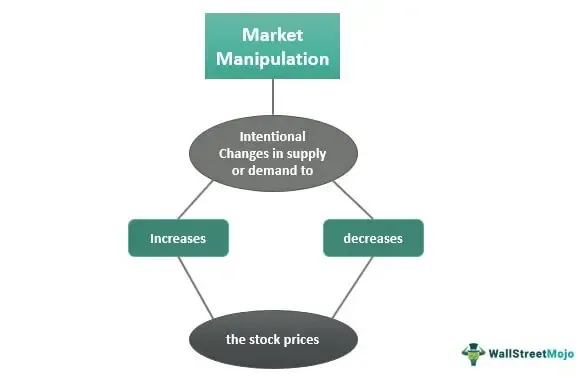

Algorithmic trading has become a pivotal component in modern financial markets, transforming the way trading is executed by leveraging sophisticated computer algorithms. These algorithms are designed to automate trading processes, significantly enhancing trading precision, speed, and efficiency. Unlike traditional trading methods reliant on human intervention, algorithmic trading allows the processing and execution of large volumes of orders in fractions of a second, a feat unattainable by human traders.

Despite the significant advantages that algorithmic trading offers, it is not without risks. One of the major concerns is its susceptibility to manipulative practices, which can undermine the integrity of financial markets. These manipulative techniques involve the use of algorithms to influence asset prices artificially, potentially leading to distorted market scenarios and unfair advantages.



The susceptibility to manipulation underscores the importance of understanding various methods and techniques used to exploit algorithmic trading systems. For traders, regulators, and financial institutions, recognizing these manipulation tactics is crucial in maintaining fair and transparent market practices. Ensuring the integrity of algorithmic trading involves not only deploying advanced technology but also establishing robust regulatory frameworks to monitor and mitigate manipulative activities effectively. By doing so, the financial industry can harness the full potential of algorithmic trading while safeguarding against its pitfalls.

## Table of Contents

## What is Algorithmic Trading?

Algorithmic trading, often referred to as automated trading, involves the use of computer programs following predefined sets of rules and mathematical models to execute trading orders automatically. These algorithms are designed to process substantial volumes of data and to conduct trades at speeds that human traders cannot match. 

A fundamental characteristic of algorithmic trading is its reliance on quantitative models and high-frequency data processing. Algorithms can analyze market data across multiple exchanges and indices, recognizing trends or price patterns at an accelerated rate. This rapid data analysis allows traders to make informed decisions quickly, taking advantage of even the slightest market movements.

Several common strategies exist within algorithmic trading to generate profits. One of these is trend-following, which involves creating algorithms that identify and exploit market trends. For instance, a simple moving average (SMA) or exponential moving average (EMA) might be used within an algorithm to spot upward or downward trends in stock prices. By automatically buying or selling based on these trends, traders aim to capitalize on ongoing market movements.

Another predominant strategy is [arbitrage](/wiki/arbitrage), where discrepancies in the price of an asset between different markets or forms (such as stock and its derivative) can be exploited. Algorithms can execute trades instantaneously in multiple markets to benefit from these price differences. This might involve spotting the price of a stock in New York and London that displays a minor differential due to currency exchange or other factors and buying in the lower-priced market while selling in the higher-priced one simultaneously.

Statistical arbitrage represents a more advanced level of trading, involving mathematical and econometric techniques to identify profitability in statistical mispricing of one or more assets. Here, algorithms might use [machine learning](/wiki/machine-learning) models or regression analysis to forecast short-term price movements based on historical relationships between asset prices. 

The essence of [algorithmic trading](/wiki/algorithmic-trading) lies in its ability to handle rapid trading decisions and execute complex trades via sophisticated programming languages. In a simple Python example for trend-following, one might write:

```python
def simple_moving_average(data, window):
    return data.rolling(window=window).mean()

# Example usage
prices = pd.Series([100, 102, 101, 105, 107])
sma = simple_moving_average(prices, window=3)
print(sma)
```

This code calculates a simple moving average over a specified window of days, which could then serve as a signal in an algorithm to trade either long or short depending on the position relative to the current price.

Ultimately, the precision and speed afforded by algorithmic trading algorithms signal a major shift in how financial markets operate, allowing traders to compete on an entirely new level through enhanced accuracy and effectiveness.

## Manipulation in Algo Trading

Algorithmic trading, while facilitating rapid and efficient transactions in financial markets, also presents opportunities for market manipulation. This manipulation can distort asset prices and undermine market integrity, primarily through techniques like spoofing and layering.

Spoofing involves placing a large number of orders with no intention of executing them. These orders create an illusion of supply or demand, leading other market participants to alter their trading strategies. For example, a trader might place a substantial buy order to signal increased demand and induce others to purchase the asset, only to cancel the spoofed order once the price begins to rise. This artificial movement can yield significant profits for the manipulator while misleading genuine investors.

Layering operates similarly but employs a more complex sequence of orders. By placing multiple orders at various price levels, a manipulator can create tiered impressions of pressure in the market. This strategy can be dynamically adjusted, providing enhanced control over the asset's price movement. Both spoofing and layering exploit the bid-ask spread and market depth to manipulate asset prices.

The opacity and complexity of algorithmic systems facilitate these manipulative tactics. Algorithms operate at speeds beyond human capability, making it difficult for regulators and market participants to discern genuine orders from manipulative ones. Furthermore, detecting such manipulation requires sophisticated monitoring tools and algorithms capable of real-time analysis across vast datasets. Efforts to regulate and mitigate these manipulative practices continue to evolve, aiming to protect market integrity and ensure fair trading conditions for all market participants.

The inherent challenge lies in balancing the efficiency advantages provided by algorithmic trading with stringent oversight to deter and detect potential abuses effectively.

## Types of Manipulative Practices

Spoofing is a manipulative practice where traders place large orders at various price points with no genuine intention of executing these orders. The goal is to deceive other market participants about the supply and demand dynamics, leading them to alter their trading strategies. Once the market reacts to the spoofed orders, the manipulator cancels these orders and profits from the resulting price changes. This practice exploits the speed and efficiency of algorithmic trading systems, which can rapidly react to [order book](/wiki/order-book-trading-strategies) changes.

Layering is a tactic closely related to spoofing. It involves placing multiple orders at different price levels to create the illusion of market depth. By setting up a "layered" order book, the manipulator generates artificial price movements in their favor. This strategy can mislead competitors into thinking there is more buying or selling interest than actually exists. The perpetrator can then execute trades based on these false signals, canceling the layered orders once the desired price movement has been achieved.

Quote Stuffing is another sophisticated form of algorithmic manipulation, where a trader enters a multitude of orders at such a speed that it overwhelms the processing capacity of other traders' systems. By flooding the market with excessive orders and then quickly canceling them, the manipulator seeks to slow down competitors' trading algorithms. This delay can create arbitrage opportunities or prevent competitors from reacting to market movements promptly, giving the manipulative trader a competitive edge.

These practices not only distort market prices but also undermine the credibility and efficiency of financial markets. As markets increasingly rely on algorithms to facilitate trading, understanding and mitigating these manipulative tactics becomes crucial for maintaining market integrity and fairness.

## Impact of Manipulation

Market manipulation in algorithmic trading distorts the natural dynamics of financial markets, leading to skewed trading outcomes. Such manipulation grants unfair advantages to those who employ deceptive strategies, while placing other traders at a significant disadvantage. The deceptive practices create artificial market conditions that mislead genuine investors, resulting in poor decision-making and unintended financial losses.

One of the primary consequences of market manipulation is the erosion of investor confidence. Investors rely on the integrity of market conditions to make informed decisions about buying or selling assets. When manipulative tactics create false price levels, [liquidity](/wiki/liquidity-risk-premium), or market trends, they erode trust, causing investors to be wary and potentially withdraw from the markets. This lack of confidence can contribute to lower market participation and liquidity, further exacerbating market inefficiencies.

The financial repercussions for genuine investors can be severe. An investor relying on authentic signals to make trading decisions might buy at inflated prices or sell at deflated ones, based on manipulative cues rather than actual market conditions. This misalignment often results in financial losses and missed opportunities. 

To address these challenges, regulatory bodies such as the U.S. Securities and Exchange Commission (SEC) and the Commodity Futures Trading Commission (CFTC) are continually developing and refining measures to detect and mitigate manipulative practices. Regulators employ sophisticated algorithms and machine learning techniques to analyze trading patterns and identify anomalies indicative of manipulation. These techniques may include anomaly detection algorithms or supervised learning models like support vector machines (SVM) to flag suspicious activities.

```python
from sklearn import svm

# Sample Python code for a simple SVM model to detect anomalies
# Assume `features` is a dataset with trading pattern features
features, labels = load_dataset()  # hypothetical function to load data

# Create and fit the SVM model
model = svm.OneClassSVM(nu=0.1, kernel="rbf", gamma='auto')
model.fit(features)

# Predict anomalies (1 for normal, -1 for anomaly)
predictions = model.predict(features)

# Identify anomalous data points
anomalies = features[predictions == -1]
```

While regulatory measures are actively evolving, financial institutions are also encouraged to implement robust systems that can detect and prevent manipulation. This includes adopting surveillance systems and promoting ethical trading practices among traders.  By enhancing both external and internal oversight, the financial markets can work towards preserving their integrity, maintaining fair trading conditions for all participants.

## Regulatory Framework

Regulations against market manipulation through algorithmic trading are undergoing significant evolution to effectively tackle the new challenges presented by these advanced trading systems. Regulatory bodies such as the U.S. Securities and Exchange Commission (SEC) and the Commodity Futures Trading Commission (CFTC) are at the forefront of these efforts. They have implemented various measures and imposed penalties to curb manipulative practices, aiming to safeguard market integrity and protect investors.

One of the primary approaches adopted by these authorities is the establishment of stringent reporting requirements and surveillance systems. These measures are designed to enhance transparency and facilitate the monitoring of trading activities. For instance, the SEC has introduced the Consolidated Audit Trail (CAT), which aims to create a comprehensive database of all market activity in the U.S. equities and options markets. The CAT will aid in the detection of manipulative trading patterns by providing regulators with detailed, real-time data on orders and trades.

In addition to surveillance, the CFTC has strengthened its enforcement capabilities through the use of advanced analytical tools and techniques. These tools are capable of sifting through vast amounts of trading data to identify potentially disruptive or manipulative activities. Furthermore, the CFTC has leveraged its authority to impose substantial penalties on entities found guilty of engaging in deceptive practices, thereby acting as a deterrent against manipulation.

Financial firms also play a crucial role in preventing market manipulation. They are encouraged to develop and implement robust systems and procedures designed to detect and preclude suspicious trading activities. This includes the use of sophisticated algorithmic surveillance systems that can analyze trading patterns and flag anomalies indicative of potential manipulation. Firms are also advised to regularly audit their trading strategies and algorithms to ensure compliance with regulatory standards.

Moreover, firms are urged to foster a culture of compliance within their organizations. This involves continuous training and education of employees on market rules and regulations, as well as the ethical implications of non-compliance. By fostering a culture of integrity and transparency, financial institutions can significantly mitigate the risk of manipulative practices within their trading operations.

Overall, the evolving regulatory framework aims to create a balanced environment where the efficiency and speed of algorithmic trading can be harnessed while minimizing the risks associated with market manipulation. By continually adapting regulatory measures and promoting industry-wide best practices, regulators and financial firms can work together to uphold the fairness and transparency of financial markets.

## Conclusion

Algorithmic trading offers substantial advantages in terms of efficiency and execution speed, revolutionizing the way trades are executed by financial institutions and individual investors alike. The rapid advancement of technology has enabled traders to leverage sophisticated algorithms that can process vast volumes of data and make split-second trading decisions, providing a significant edge over traditional trading methods. However, the very features that make algorithmic trading appealing also expose it to potential manipulative practices that threaten market integrity.

The susceptibility of algorithmic trading to manipulation underscores the need for vigilant oversight. As market manipulators devise new techniques, both traders and regulatory bodies are tasked with the continuous challenge of staying informed about emerging trends. Education and awareness are crucial components in the fight against market manipulation, as they equip market participants with the knowledge needed to recognize and address potentially unethical trading activities.

Regulatory bodies are pivotal in maintaining fair and transparent markets. Organizations such as the U.S. Securities and Exchange Commission (SEC) and the Commodity Futures Trading Commission (CFTC) play a crucial role in implementing stringent regulations and penalties to deter manipulative behaviors. In addition to regulatory efforts, financial institutions must invest in robust systems and procedures capable of detecting and preventing manipulation to safeguard the integrity of their trading operations.

Through continued innovation in detection and regulation, the integrity of financial markets can be preserved. The implementation of advanced monitoring tools, machine learning algorithms, and real-time data analytics are examples of technological advancements that can aid in the identification of suspicious trading patterns and reduce the risk of manipulation. By fostering a culture of transparency and accountability, the financial industry can ensure that the benefits of algorithmic trading are realized while minimizing its vulnerabilities to manipulative practices.

## References & Further Reading

[1]: Cartea, Á., Jaimungal, S., & Penalva, J. (2015). ["Algorithmic and High-Frequency Trading."](https://assets.cambridge.org/97811070/91146/frontmatter/9781107091146_frontmatter.pdf) Cambridge University Press.

[2]: Medvedev, A., & Schneider, P. (2018). ["Empirical Evidence on Algorithmic Trading: Market Impact and Endogenous Liquidity Provision."](https://www.researchgate.net/publication/385331865_Efficacy_of_psychotherapy_for_depressive_disorders_from_the_perspective_of_evidence-based_medicine_literature_review) Quantitative Finance, 18(4), 625-643.

[3]: Gai, J., Yao, C., & Ye, M. (2013). ["The Externalities of High Frequency Trading."](https://papers.ssrn.com/sol3/papers.cfm?abstract_id=2066839) The Review of Financial Studies, 26(11), 2635–2663.

[4]: U.S. Commodity Futures Trading Commission. (2015). ["Concept Release on Risk Controls and System Safeguards for Automated Trading Environments."](https://www.cftc.gov/PressRoom/PressReleases/6683-13) Federal Register, 80(231), 78824-78845.

[5]: Biais, B., Foucault, T., & Moinas, S. (2013). ["Equilibrium High-Frequency Trading"](https://papers.ssrn.com/sol3/papers.cfm?abstract_id=2024360) Econometrica, 81(4), 1173-1210.