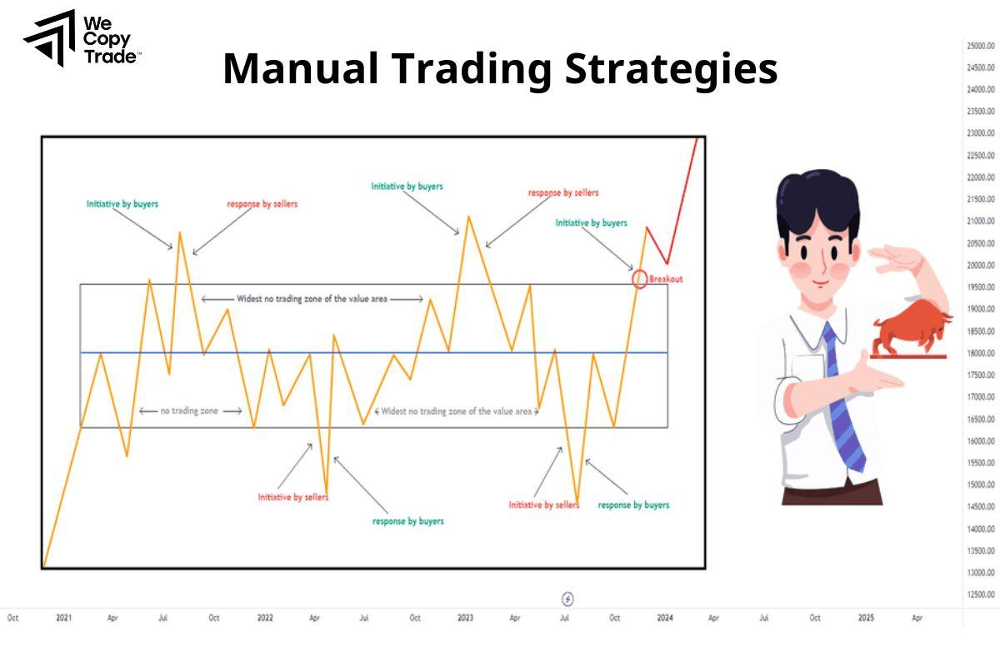

## Table of Contents

## What is manual trading?

Manual trading is when a person makes decisions to buy or sell things like stocks, currencies, or other financial items by themselves. They use their own knowledge and research to decide when and what to trade. This is different from automatic trading, where a computer program makes the decisions. People who do manual trading often watch the market closely and use tools like charts and news to help them make choices.

Manual trading can be good because it lets people use their own judgment and experience. They can react to changes in the market quickly and make decisions based on what they see happening. However, it can also be hard because it takes a lot of time and attention. If someone is not careful, they might make mistakes or miss important information. That's why it's important for people who do manual trading to keep learning and stay updated on what's happening in the market.

## How does manual trading differ from automated trading?

Manual trading and automated trading are two different ways people can trade financial items like stocks or currencies. In manual trading, a person makes all the decisions about when to buy or sell. They use their own knowledge, watch the market, and might use tools like charts and news to help them decide. This means they have to spend a lot of time watching the market and making choices based on what they see and know.

On the other hand, automated trading uses a computer program to make trading decisions. Once someone sets up the program with rules or strategies, the computer does the rest. It can trade much faster than a human and can work all the time without getting tired. This can be good because it takes away the need for a person to watch the market all the time, but it also means the person has less control over each trade.

The main difference between the two is who or what is making the decisions. Manual trading gives people more control and the ability to use their own judgment, but it requires a lot of attention and time. Automated trading can handle more trades quickly and without breaks, but it follows set rules and might miss out on opportunities a human might see. Both methods have their own benefits and challenges, so it depends on what someone is looking for in their trading strategy.

## What are the basic steps involved in manual trading?

Manual trading starts with doing research. You need to learn about the things you want to trade, like stocks or currencies. Look at charts, read news, and understand what might make the prices go up or down. Once you feel ready, you pick what you want to trade and decide how much money you want to spend. This is called choosing your asset and setting your position size.

After that, you watch the market closely. You need to keep an eye on the prices and be ready to make a move. When you think it's a good time, you decide to buy or sell. If you buy something, you hope the price will go up so you can sell it later for more money. If you sell something, you hope the price will go down so you can buy it back cheaper. Once you've made your trade, you keep watching to see if you should do anything else, like selling if the price goes up enough or buying back if it goes down enough.

Manual trading takes a lot of time and attention. You have to be ready to make quick decisions and be okay with the risks. It's important to keep learning and stay updated on what's happening in the market. If you make a mistake or the market moves in a way you didn't expect, you might lose money. But if you do it well, you could make money too. It's all about using your judgment and being ready to act when the time is right.

## What types of markets can you manually trade in?

You can manually trade in many different markets. The most common ones are the stock market, where you buy and sell shares of companies. Another big one is the [forex](/wiki/forex-system) market, where you trade different currencies. There's also the commodity market, where you can trade things like gold, oil, or wheat. Each of these markets has its own way of working and things you need to know before you start trading.

Besides these, you can also trade in the futures market, where you agree to buy or sell something at a future date. The options market is another place, where you buy the right to trade something at a set price. And there are also [cryptocurrency](/wiki/cryptocurrency) markets, where you trade digital money like Bitcoin. Each market has its own rules and strategies, so it's important to learn about them before you start trading.

Manual trading in any of these markets means you have to watch the prices and news, and make decisions about when to buy or sell. It takes time and attention, but it also gives you the chance to use your own judgment and maybe make money if you do it well.

## What tools and resources are essential for a manual trader?

To be a good manual trader, you need some important tools and resources. First, you need a good trading platform. This is a computer program or website where you can see prices and make trades. It should be easy to use and have all the information you need. You also need charts and graphs to help you see how prices are moving. These can show you patterns and trends that can help you decide when to buy or sell. Another important tool is a news feed, so you can stay updated on what's happening in the world that might affect the markets.

Besides these, you should have some other resources too. A good trading journal is helpful. This is where you write down all your trades and what you were thinking when you made them. It can help you learn from your mistakes and get better over time. You also need to keep learning, so [books](/wiki/algo-trading-books), online courses, and trading communities can be very useful. Talking to other traders can give you new ideas and help you understand the markets better. All these tools and resources together can make you a better manual trader.

## How do you develop a trading strategy for manual trading?

To develop a trading strategy for manual trading, you first need to decide what you want to achieve. Are you looking to make quick profits, or are you more interested in long-term growth? Once you know your goal, you can start to figure out which markets you want to trade in, like stocks, forex, or commodities. Then, you need to learn about the different ways to trade, like buying low and selling high, or using technical analysis to spot trends. It's important to pick a strategy that fits your goals and the amount of time you can spend trading.

After you have a basic idea of your strategy, you should test it out. You can do this by using a demo account where you trade with fake money. This lets you see how your strategy works without risking real money. Pay attention to how well your strategy does and what mistakes you make. Keep a trading journal to write down what you learn. Over time, you can change your strategy to make it better based on what you find out. Remember, a good trading strategy is one that you can stick to and that helps you reach your goals.

## What are common mistakes beginners make in manual trading?

Beginners in manual trading often make the mistake of not having a clear plan. They might jump into trading without knowing what they want to achieve or how they will do it. This can lead to making quick decisions based on emotions, like fear or excitement, instead of using a thought-out strategy. Another common mistake is not managing risk properly. Beginners might put too much money into one trade, which can be risky if the trade goes wrong. They might also not use stop-loss orders, which can help limit losses if the market moves against them.

Another mistake beginners often make is not doing enough research. They might not understand the market they are trading in or the assets they are trading. This can lead to bad decisions because they don't know all the important information. Also, beginners might not keep learning and improving their skills. Trading is something that takes time to get good at, and if someone doesn't keep learning, they might keep making the same mistakes over and over. It's important for beginners to take their time, learn as much as they can, and be patient as they build their trading skills.

## How can one manage risk effectively in manual trading?

Managing risk in manual trading is all about making smart choices to protect your money. One way to do this is by using stop-loss orders. A stop-loss order is like a safety net that automatically sells your trade if the price drops to a certain level. This can help you limit how much money you lose on a bad trade. Another important thing is not to put all your money into one trade. Instead, spread it out over different trades. This way, if one trade goes wrong, you won't lose everything.

It's also good to know how much you can afford to lose before you start trading. Set a limit for how much money you're willing to risk, and stick to it. This is called setting your risk tolerance. Another helpful thing is to keep learning about the market and the things you're trading. The more you know, the better you can guess what might happen next, and that can help you make safer trades. By using these ways to manage risk, you can trade more safely and have a better chance of making money over time.

## What psychological factors affect manual trading performance?

When you do manual trading, your feelings can really affect how well you do. If you get too excited when prices go up, you might make quick choices without thinking them through. This can lead to bad trades. On the other hand, if you get scared when prices start to fall, you might sell too soon and miss out on making more money. Fear and greed are big feelings that can make you do things you wouldn't normally do. It's important to stay calm and stick to your plan, even when the market is moving a lot.

Another thing that can mess up your trading is overconfidence. If you have a few good trades, you might start to think you can't lose. This can make you take bigger risks than you should. Also, if you've lost money before, you might feel down and not want to trade anymore. This is called fear of missing out (FOMO) or fear of losing more. To be a good trader, you need to keep your feelings in check. One way to do this is by keeping a trading journal. Writing down your thoughts and feelings can help you see when your emotions are affecting your trades, and you can work on getting better at managing them.

## How do you analyze market trends and patterns for manual trading?

To analyze market trends and patterns for manual trading, you need to look at charts and use something called technical analysis. Technical analysis is when you study past prices and trading volumes to guess where the prices might go next. You look for patterns, like when prices go up and down in a certain way, or when they make shapes on the chart that might mean something. You also use tools called indicators, which are math formulas that help you see trends and predict what might happen. For example, moving averages can show you if a price is going up or down over time, and the Relative Strength Index (RSI) can tell you if a price might be about to change direction.

Another important part of analyzing market trends is looking at the news and what's happening in the world. This is called [fundamental analysis](/wiki/fundamental-analysis). You need to know about things like company earnings, economic reports, and big events that can affect the markets. For example, if a company does better than expected, its stock price might go up. If there's a big change in the economy, like a rise in interest rates, it can affect prices too. By combining technical analysis with fundamental analysis, you can get a better picture of what's going on in the market. This helps you make smarter decisions about when to buy or sell.

## What advanced techniques can enhance manual trading outcomes?

To enhance manual trading outcomes, one advanced technique is using multiple time frame analysis. This means looking at the same asset on different time frames, like daily, hourly, and 15-minute charts. By doing this, you can see both the big picture and the smaller details. It helps you make better decisions because you can see if a short-term move fits with the long-term trend. Another technique is [backtesting](/wiki/backtesting), where you test your trading strategy on past data to see how it would have done. This can help you find and fix problems in your strategy before you use real money.

Another advanced technique is using advanced chart patterns and indicators. For example, you can use Fibonacci retracement levels to find where prices might stop or turn around. You can also use more complex indicators like the Ichimoku Cloud, which gives you a lot of information about trends, support, and resistance all at once. These tools can help you spot good trading opportunities that you might miss with simpler methods. By combining these advanced techniques with good risk management and keeping your emotions in check, you can improve your chances of doing well in manual trading.

## How do experienced traders adapt their manual trading strategies over time?

Experienced traders know that markets change all the time, so they need to change their trading strategies too. They keep learning about new things that can affect the markets, like new technology or changes in the economy. They also look at their old trades to see what worked and what didn't. By doing this, they can find ways to make their strategies better. For example, if they see that a certain pattern doesn't work as well as it used to, they might stop using it or find a new way to use it. They also might try out new tools and indicators to see if they can help them make better trades.

Another way experienced traders adapt their strategies is by paying attention to how they feel when they trade. They know that feelings like fear or excitement can make them do things they wouldn't normally do. So, they work on staying calm and sticking to their plan, even when the market is moving a lot. They might use a trading journal to write down their thoughts and feelings, which helps them see when their emotions are affecting their trades. By keeping their emotions in check and always learning and trying new things, experienced traders can keep their strategies working well, even as the markets change.

## What are some examples of manual trading?

An example of a manual trading strategy is trend trading based on moving averages. In this strategy, traders utilize moving averages to identify and follow market trends. For instance, Jim trades Netflix stocks by employing the 100-day moving average as a determinant for his entry and [exit](/wiki/exit-strategy) points. This moving average provides a smoothed line, representing the average closing price over the past 100 days, which helps Jim ascertain the broader trend. 

To process the moving averages, Jim may utilize a simple moving average (SMA) formula, which can be calculated using:

$$
\text{SMA} = \frac{P_1 + P_2 + \ldots + P_n}{n}
$$

where $P$ represents the price (typically closing price) at a given time period, and $n$ is the number of periods considered, which in this case is 100.

Jim's manual discretion plays a crucial role in deciding when the trends are strong enough to enter trades. He monitors these averages closely and uses his market knowledge to refrain from trading during periods of market whipsaws—situations characterized by volatile and rapid price movements that may lead to false signals from the moving average. This adaptability is a hallmark of manual trading, but also highlights the dependence on human judgment, which can sometimes be vulnerable to biases or emotional influences.

Another practical manual trading approach is swing trading. In swing trading, traders strive to capture price movements over several days or weeks. This strategy relies on short- to medium-term price patterns and can involve various forms of technical analysis to identify potential market entries and exits. Swing traders aim to profit from the price "swings" within a longer trend, making decisions based on pattern recognition, price [volume](/wiki/volume-trading-strategy), and [momentum](/wiki/momentum) indicators, among other tools.

Overall, these examples underscore how manual trading strategies benefit from flexibility and human insight, while also requiring a high level of discipline and market understanding to manage risks effectively.

## References & Further Reading

[1]: Bergstra, J., Bardenet, R., Bengio, Y., & Kégl, B. (2011). ["Algorithms for Hyper-Parameter Optimization."](https://dl.acm.org/doi/10.5555/2986459.2986743) Advances in Neural Information Processing Systems 24.

[2]: ["Advances in Financial Machine Learning"](https://www.amazon.com/Advances-Financial-Machine-Learning-Marcos/dp/1119482089) by Marcos Lopez de Prado

[3]: ["Evidence-Based Technical Analysis: Applying the Scientific Method and Statistical Inference to Trading Signals"](https://www.amazon.com/Evidence-Based-Technical-Analysis-Scientific-Statistical/dp/0470008741) by David Aronson

[4]: ["Machine Learning for Algorithmic Trading"](https://github.com/stefan-jansen/machine-learning-for-trading) by Stefan Jansen

[5]: ["Quantitative Trading: How to Build Your Own Algorithmic Trading Business"](https://www.amazon.com/Quantitative-Trading-Build-Algorithmic-Business/dp/1119800064) by Ernest P. Chan