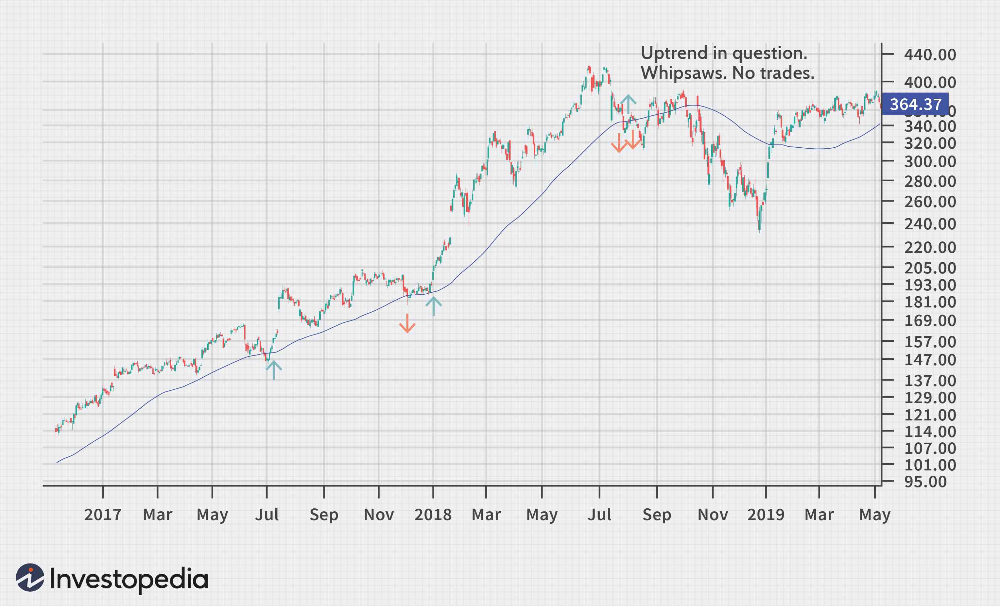

The financial markets present a wide array of trading opportunities that can be accessed through both manual and algorithmic trading methods. These trading approaches cater to different trader profiles, each with its own advantages and limitations. Manual trading is characterized by the involvement of human discretion in decision-making, allowing traders to use their intuition and experience to analyze market conditions and execute trades. This method can be advantageous in reacting to real-time news events and signals that do not fit into a programmable format, offering a personalized touch in unpredictable markets.

On the other hand, algorithmic trading, or algo trading, employs computer programs to execute trades under pre-set conditions, such as specific price points or market volumes. The speed and precision of these automated systems allow for efficient handling of large-scale data, enabling traders to conduct thorough backtesting of their strategies using historical data. This approach minimizes human error and emotional bias, making it particularly appealing for those who require high-frequency and high-volume trading capabilities.



Understanding the subtleties of both manual and algo trading is crucial for traders who aim to optimize their strategies in financial markets. This involves recognizing the potential benefits and drawbacks of each method and considering how they can be integrated to create a more comprehensive trading approach. As technology continues to advance and evolve, traders have an opportunity to harness the strengths of both manual insights and algorithmic accuracy to navigate and succeed in the complex landscape of financial markets.

## Table of Contents

## What is Manual Trading?

Manual trading is a trading method where traders make buy and sell decisions manually, relying on their own analysis, intuition, and experience rather than automated systems. This approach requires traders to engage directly with a trading platform to execute trades, allowing them to respond promptly to market news and signals not accounted for by pre-programmed algorithms. Such flexibility enables traders to adapt to unforeseen market conditions, which might not be possible with rigid algorithmic setups.

The process typically involves a thorough analysis of various market factors, including technical indicators, fundamental data, and overall market sentiment. Manual traders often leverage chart patterns, economic reports, and news events to guide their trading decisions, aiming to capitalize on short-term trends or long-term market shifts.

One significant advantage of manual trading is the personal touch it brings to the trading process. Traders can tailor their strategies to reflect their individual risk tolerance, trading style, and market outlook. This personalized approach can be particularly advantageous when sudden market movements occur, which might confuse or misdirect an algorithm that lacks nuanced judgment.

However, manual trading is not without its challenges. Emotional biases are a common pitfall, where traders may make decisions based on fear, greed, or other subjective influences rather than objective analysis. This susceptibility to psychological factors can lead to irrational trades and suboptimal performance over time. Moreover, manual trading typically involves slower decision-making and execution speeds compared to [algorithmic trading](/wiki/algorithmic-trading), which can be a disadvantage in fast-paced markets where milliseconds can make a significant difference.

In conclusion, while manual trading offers the benefits of flexibility and personalized decision-making, it also demands a high level of discipline and emotional control to manage inherent biases and maintain objective trading habits.

## Understanding Algorithmic Trading

Algorithmic trading, commonly known as algo trading, employs computer programs to automate the execution of trades based on a set of predefined criteria, such as price, timing, and [volume](/wiki/volume-trading-strategy). This method has gained prominence due to its ability to execute orders with speed and precision that surpasses human capabilities.

A key feature of algorithmic trading is its ability to quickly analyze vast datasets, enabling traders to backtest strategies using historical data. Backtesting helps in evaluating the effectiveness of a strategy and fine-tuning it for improved performance in live trading environments. For instance, a simple moving average crossover strategy can be backtested to determine its profitability over past market data.

```python
import pandas as pd

# Sample backtesting of a simple moving average crossover strategy
def moving_average_strategy(data, short_window=40, long_window=100):
    signals = pd.DataFrame(index=data.index)
    signals['price'] = data['price']
    signals['short_mavg'] = data['price'].rolling(window=short_window, min_periods=1).mean()
    signals['long_mavg'] = data['price'].rolling(window=long_window, min_periods=1).mean()
    signals['signal'] = 0.0
    signals['signal'][short_window:] = np.where(signals['short_mavg'][short_window:] > signals['long_mavg'][short_window:], 1.0, 0.0)
    signals['positions'] = signals['signal'].diff()
    return signals

# Example data
data = pd.DataFrame({
    'price': [100, 102, 104, 103, 108, 110, 115, 120, 118, 117]
})

signals = moving_average_strategy(data)
print(signals)
```

Various algorithmic trading strategies are employed to optimize performance. These include:

1. **Trend-Following Strategies**: Traders utilize these strategies to capture gains through market momentum. Algorithms identify and ride trends by analyzing technical indicators like moving averages or the Relative Strength Index (RSI).

2. **Statistical Arbitrage**: This involves exploiting pricing inefficiencies between correlated securities. Traders use statistical models to identify divergences and execute mean-reversion trades.

3. **Market-Making**: Algo traders deploy these strategies to provide liquidity to markets by placing bids and offers. They aim to capitalize on the bid-ask spread and manage inventory risk effectively.

With algo trading, the speed of execution is crucial, often measured in microseconds, allowing traders to capitalistically position their orders in rapidly moving markets. Unlike manual trading, algorithmic systems mitigate emotional biases, executing predefined strategies consistently without human intervention.

While the advantages of algo trading are clear, the complexity of these systems requires significant infrastructure and coding skills, necessitating a robust understanding of both financial markets and technology to develop and maintain successful trading algorithms.

## Manual Trading vs. Algo Trading: Key Differences

Manual trading and algorithmic trading present distinct methodologies that cater to different trading preferences and styles, each with its own set of strengths and weaknesses. In manual trading, the trader's personal analysis and experience form the backbone of decision-making processes. This approach allows traders to directly interpret market signals and apply their intuitive judgment to execute buy and sell orders. While this personal touch offers notable flexibility, allowing traders to adapt to unforeseen market conditions or news-driven events, it is also inherently slower and susceptible to human errors and emotional biases. These biases can lead to irrational decision-making, especially in volatile markets.

On the contrary, algorithmic (algo) trading relies on automated systems and pre-defined criteria to facilitate trading activities. This method capitalizes on the superior speed and precision that computer algorithms provide, enabling the execution of trades at a pace far beyond human capability. Algorithms can process vast amounts of data and operate with minimal human interference, thereby significantly reducing the potential for human error and emotional influence.

The primary distinction in speed and accuracy between these two methods is largely due to the inherent nature of computational processes versus human cognition. Algorithms can be designed to backtest strategies on historical data, allowing traders to optimize their approaches before deploying them in live market conditions. This efficiency, however, comes with the prerequisite of technical expertise and the necessity of maintaining a robust trading infrastructure capable of handling complex computational tasks.

While manual trading offers adaptability and the nuance of human discretion, algo trading stands out for its objectivity and operational scale. The trade-off between human intuition and algorithmic precision defines the key differences in these approaches—one that traders must weigh based on their individual capabilities and market objectives.

## Advantages and Limitations of Manual Trading

Manual trading relies heavily on the human ability to interpret complex market signals that algorithms may not detect. One significant advantage is the ability to incorporate qualitative data, such as economic news releases, political events, or sudden market shifts, which require subjective assessment. This capacity for nuance allows manual traders to adapt and make decisions based on a broader context than purely quantitative data.

However, manual trading comes with notable limitations. The speed at which markets operate can outpace the ability of a human to analyze and execute trades efficiently. This latency means manual traders are often at a disadvantage compared to automated systems that can act in milliseconds.

Furthermore, manual trading is susceptible to emotional and cognitive biases. Emotions such as fear and greed can drive decisions, potentially leading to irrational trading behavior. Cognitive biases like overconfidence, confirmation bias, and loss aversion may cause traders to deviate from their strategies, resulting in inconsistent performance.

Additionally, manual trading is resource-intensive. The requirement for constant monitoring and analysis can lead to fatigue, which can further impair decision-making abilities. While manual trading offers the benefit of human judgment, it also exposes traders to the challenges of maintaining discipline and objectivity in dynamic and often unpredictable markets.

## Advantages and Limitations of Algorithmic Trading

Algorithmic trading, commonly referred to as algo trading, is a method that employs computer programs to execute trades at optimal speeds, precision, and frequency. One of the primary advantages of algorithmic trading is its ability to process vast amounts of market data and execute orders far faster than human traders. This allows traders to exploit minute price differences before they vanish, a task nearly impossible for manual trading. The speed and precision inherent in algorithmic trading ensure that trades are executed at the most favorable market conditions, helping traders capitalize on fleeting market inefficiencies.

Another significant benefit of algo trading is the elimination of emotional biases. Human traders are often susceptible to decision-making influenced by emotions such as fear or greed, which can interfere with rational trading strategies. In contrast, algorithms operate strictly according to predefined rules, allowing for consistent and objective trading decisions.

Moreover, algorithmic trading provides an efficient means of [backtesting](/wiki/backtesting) strategies using historical data. By testing strategies against past market conditions, traders can gauge the potential effectiveness of their models and make necessary adjustments before deploying them in live markets.

Despite these advantages, algorithmic trading is not without its challenges. Technical failures can occur, arising from coding errors, hardware malfunctions, or connectivity issues, leading to financial losses. Furthermore, designing effective trading algorithms requires advanced coding skills and a thorough understanding of both markets and quantitative methods. This need for technical expertise can be a barrier for traders without a strong programming background.

Another complexity of algorithmic trading involves the risk of overfitting strategies to historical data. Overfitting occurs when a model is too closely tailored to past data, capturing noise instead of the actual market patterns, which can result in poor performance under new market conditions. To combat overfitting, traders must employ robust out-of-sample testing and validation techniques.

Additionally, deploying algorithmic strategies demands robust infrastructure, including high-performance computing and low-latency networking, to ensure timely data processing and order execution. This infrastructure can be costly to develop and maintain, especially for individual traders or smaller firms.

In conclusion, while algorithmic trading offers substantial advantages in terms of speed, precision, and the reduction of emotional biases, it also presents significant challenges related to technical failures, strategy overfitting, and the need for sophisticated infrastructure and programming skills. Leveraging the benefits while mitigating the limitations requires careful planning, continual strategy evaluation, and advanced technological resources.

## Combining Manual and Algo Trading: Best Practices

Traders often seek to enhance their decision-making processes and optimize performance by blending both manual and algorithmic trading techniques. This combination allows traders to harness the benefits of automation while retaining the nuanced insights provided by human intervention.

A common practice is to employ algorithms for routine and non-discretionary tasks, such as order execution, trade routing, and managing complex calculations. Algorithms excel in these areas due to their speed, efficiency, and ability to handle repetitive processes without fatigue or error. By automating these tasks, traders can focus their attention on strategic decision-making, which often requires human intuition and judgment, particularly in conditions of market uncertainty or when unexpected news impacts the financial markets.

For instance, while an algorithm can handle technical aspects based on pre-defined rules, manual intervention may be necessary when dealing with unanticipated market events. A trader might use an algorithm to monitor the market and enter positions based on statistical models or trend-following strategies, but opt for a manual approach when a geopolitical event occurs that affects market sentiment unpredictably.

Balancing both approaches necessitates a comprehensive risk management strategy. Risk management is vital as it encompasses the identification, assessment, and mitigation of potential losses. One effective method is to set predetermined stop-loss and take-profit levels that are monitored by algorithms, ensuring that trades adhere to risk thresholds even when manually executed. Furthermore, continuous monitoring and evaluation of both manual and algorithmic strategies are crucial. This involves regularly updating algorithms to reflect changing market conditions and learning from past trading performance to improve manual decision-making.

To practically implement this combined approach, traders can leverage Python, a popular programming language for developing trading algorithms. The code snippet below demonstrates how traders might use Python to backtest a simple moving average crossover strategy and integrate manual intervention rules:

```python
import pandas as pd
import numpy as np

# Sample data loading function
def load_data(symbol):
    return pd.read_csv(f'{symbol}_data.csv', parse_dates=['Date'], index_col='Date')

# Simple Moving Average Crossover Strategy
def sma_crossover_strategy(data, short_window=40, long_window=100):
    signals = pd.DataFrame(index=data.index)
    signals['price'] = data['Close']
    signals['short_mavg'] = data['Close'].rolling(window=short_window, min_periods=1).mean()
    signals['long_mavg'] = data['Close'].rolling(window=long_window, min_periods=1).mean()
    signals['signal'] = 0.0
    signals['signal'][short_window:] = np.where(signals['short_mavg'][short_window:] > signals['long_mavg'][short_window:], 1.0, 0.0)

    # Implementing manual override by assessing external events (pseudo-code)
    external_events = check_external_events()
    if external_events:
        signals['signal'] = apply_manual_rules(signals, external_events)

    signals['positions'] = signals['signal'].diff()
    return signals

# Example use
data = load_data('AAPL')
signals = sma_crossover_strategy(data)

def check_external_events():
    # Placeholder function for external event assessment
    return None

def apply_manual_rules(signals, events):
    # Placeholder function for applying manual rules based on events
    return signals['signal']
```

Such a hybrid approach requires diligent oversight and a dynamic strategy that adapts to the market’s fluid nature, thereby helping traders to mitigate risks and capitalize on the strengths of both manual and algorithmic trading.

## Conclusion

The future of trading lies in understanding and employing both manual and algorithmic methods strategically. Each approach offers distinct advantages and limitations that traders can leverage to enhance their performance in financial markets. Manual trading utilizes human intuition, experience, and the ability to interpret market nuances and unforeseen events, aspects that algorithms may overlook. This human element can be especially advantageous in volatile or complex market situations where intuition and discretion are critical.

Conversely, algorithmic trading offers unmatched speed, precision, and the capacity to process vast amounts of data fast. This allows traders to execute trades with minimal delay, capitalize on fleeting opportunities, and mitigate human error and emotional biases. The power of algorithms lies in their ability to execute pre-defined trading strategies consistently and backtest these strategies on historical data for optimal performance.

To thrive in today's fast-paced financial markets, traders must continuously refine their skills and adapt to technological advances. Developing a robust understanding of both manual and algorithmic trading techniques is essential. By juxtaposing the human touch of manual trading with the computational prowess of algorithms, traders can construct versatile strategies that adapt to diverse market conditions. This dual approach not only mitigates risks associated with either method but also capitalizes on the opportunities each presents, ultimately paving the way for a comprehensive and effective trading strategy.

## References & Further Reading

[1]: Bergstra, J., Bardenet, R., Bengio, Y., & Kégl, B. (2011). ["Algorithms for Hyper-Parameter Optimization."](https://dl.acm.org/doi/10.5555/2986459.2986743) Advances in Neural Information Processing Systems 24.

[2]: ["Advances in Financial Machine Learning"](https://www.amazon.com/Advances-Financial-Machine-Learning-Marcos/dp/1119482089) by Marcos Lopez de Prado

[3]: ["Evidence-Based Technical Analysis: Applying the Scientific Method and Statistical Inference to Trading Signals"](https://www.amazon.com/Evidence-Based-Technical-Analysis-Scientific-Statistical/dp/0470008741) by David Aronson

[4]: ["Machine Learning for Algorithmic Trading"](https://github.com/stefan-jansen/machine-learning-for-trading) by Stefan Jansen

[5]: ["Quantitative Trading: How to Build Your Own Algorithmic Trading Business"](https://www.amazon.com/Quantitative-Trading-Build-Algorithmic-Business/dp/1119800064) by Ernest P. Chan