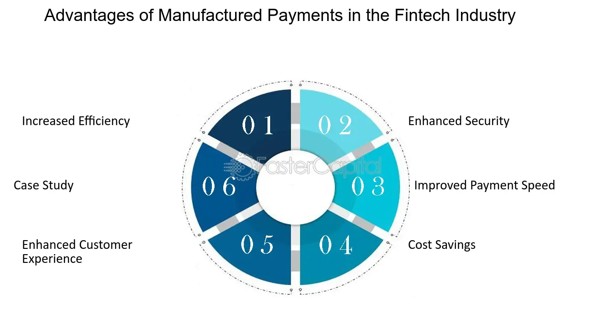

## Table of Contents

## What is a manufactured payment?

A manufactured payment is a type of payment that is created or arranged by someone other than the original issuer of the payment. This often happens in financial markets where one party agrees to make a payment to another party based on certain conditions or agreements. For example, if you own a stock that pays dividends, you might lend that stock to someone else. That person would then receive the dividend, but they might agree to pay you an equivalent amount as a manufactured payment.

Manufactured payments are important in financial transactions because they help keep things fair and balanced. When stocks or bonds are lent or borrowed, manufactured payments make sure that the original owner doesn't lose out on the income they would normally get. This system helps keep the financial markets running smoothly by making sure everyone gets what they are supposed to, even when assets are temporarily transferred to someone else.

## How does a manufactured payment differ from a regular payment?

A manufactured payment is different from a regular payment because it is made by someone other than the original issuer. In a regular payment, like a dividend from a company, the company itself pays you directly. But with a manufactured payment, another person or entity steps in to make the payment instead. This usually happens when you lend out an asset, like a stock, and the person borrowing it agrees to pay you what you would have received if you still owned it.

For example, if you own a stock that pays a $1 dividend each quarter, and you lend that stock to someone else, the company will pay the dividend to the borrower. But the borrower might agree to give you $1 as a manufactured payment to make up for the dividend you missed out on. This keeps things fair and balanced in financial markets, making sure you don't lose money just because you lent out your stock. Regular payments are straightforward and come directly from the source, while manufactured payments are a way to maintain fairness when assets are temporarily transferred.

## What are the common scenarios where manufactured payments are used?

Manufactured payments are often used when people lend out their stocks or bonds. Imagine you own a stock that pays a dividend every quarter. If you lend that stock to someone else, the company will pay the dividend to the borrower. But to make sure you don't lose out, the borrower agrees to give you a manufactured payment equal to the dividend. This way, you still get the money you would have received if you hadn't lent out your stock.

Another common scenario is in securities lending. Big investors or institutions might lend out their securities to other traders who need them for short selling or other trading strategies. The borrower uses the securities and gets any payments that come with them, like dividends or interest. But they agree to pay the lender a manufactured payment to cover those amounts. This helps keep the financial markets fair and ensures that lenders don't miss out on income just because they lent out their assets.

## Who are the typical parties involved in a manufactured payment?

The typical parties involved in a manufactured payment are the lender and the borrower. The lender is the person or institution that owns the asset, like a stock or bond, and agrees to lend it out. The borrower is the person or institution that borrows the asset and uses it for their own purposes, like trading or short selling.

In this arrangement, the original issuer of the asset, such as a company paying dividends, is also indirectly involved. The company pays the dividend to the borrower, who then agrees to make a manufactured payment to the lender. This ensures that the lender still gets the income they would have received if they hadn't lent out their asset.

## What are the legal and regulatory considerations for manufactured payments?

When it comes to manufactured payments, there are some legal and regulatory things to think about. Different countries have their own rules about how these payments should be handled. For example, in the United States, the Securities and Exchange Commission (SEC) and the Internal Revenue Service (IRS) have rules about how manufactured payments should be reported and taxed. These rules are there to make sure that everything is fair and that people pay the right amount of taxes.

Another important thing is that financial institutions that deal with manufactured payments need to follow certain guidelines. These guidelines are meant to prevent fraud and make sure that everyone follows the rules. For example, if a bank is involved in lending securities and handling manufactured payments, they need to keep good records and report everything correctly. This helps keep the financial system honest and makes sure that manufactured payments are used the right way.

## How are manufactured payments reported for tax purposes?

When it comes to taxes, manufactured payments need to be reported correctly. In the United States, the Internal Revenue Service (IRS) has rules about how these payments should be handled. If you receive a manufactured payment, you need to include it in your income on your tax return. This is because the IRS sees manufactured payments as a type of income, just like regular dividends or interest. The financial institution or the person who made the payment usually sends you a form, like a 1099, to help you report it correctly.

The reporting process can be a bit tricky, but it's important to get it right. If you lend out securities and receive manufactured payments, you need to keep good records of these transactions. This helps you report everything accurately on your tax return. If you're not sure how to report manufactured payments, it's a good idea to talk to a tax professional. They can help you understand the rules and make sure you're following them correctly.

## What are the benefits of using manufactured payments in financial transactions?

Manufactured payments help keep things fair in the financial world. When someone lends out their stocks or bonds, they might miss out on dividends or interest payments. But with manufactured payments, the person borrowing the asset agrees to pay the lender the same amount they would have received. This way, lenders don't lose money just because they lent out their assets. It makes people more willing to lend their securities, which helps the financial markets run smoothly.

Another benefit of manufactured payments is that they help with short selling. Short sellers borrow stocks to sell them, hoping to buy them back later at a lower price. When they borrow the stocks, they get any dividends paid on them. But they also agree to make manufactured payments to the lenders. This keeps everything balanced and fair, making it easier for short sellers to do their trades. Overall, manufactured payments make the financial system more flexible and efficient.

## What are the potential risks or drawbacks associated with manufactured payments?

Manufactured payments can sometimes be tricky to handle. One big risk is that they can make things more complicated when it comes to taxes. You have to report these payments correctly on your tax return, and if you get it wrong, you might end up paying more taxes than you should or even getting in trouble with the tax authorities. It's important to keep good records and maybe even talk to a tax professional to make sure you're doing everything right.

Another potential drawback is that manufactured payments can add extra costs and risks for the people involved. For example, if you're the one borrowing the securities and making the manufactured payment, you have to make sure you have enough money to cover those payments. If the stock price goes up a lot or if there are unexpected dividends, it could end up costing you more than you expected. This can make the whole process riskier and more expensive, which might make some people hesitant to get involved in securities lending and borrowing.

## How do manufactured payments impact cash flow management?

Manufactured payments can affect how people manage their cash flow. When someone lends out their stocks or bonds, they expect to get the same income they would have received if they hadn't lent them out. So, when they get a manufactured payment, it helps them keep their cash flow steady. This is important because it means they can still pay their bills and keep their finances in order, even though they lent out their assets.

But manufactured payments can also make cash flow management a bit trickier. If you're the one borrowing the securities and making the manufactured payment, you need to make sure you have enough money to cover those payments. This can be hard to plan for, especially if the stock price goes up or if there are unexpected dividends. So, you have to be careful and keep a close eye on your cash flow to make sure you can handle these payments without running into money problems.

## What role do manufactured payments play in complex financial instruments like derivatives?

Manufactured payments are important in complex financial instruments like derivatives because they help keep things fair when people lend out their assets. Imagine you own a stock that's part of a derivative contract, like an option or a futures contract. If you lend that stock to someone else, they might get any dividends or interest payments that come with it. But with manufactured payments, the borrower agrees to pay you the same amount, so you don't lose out on any money you were expecting. This makes people more willing to lend their assets, which helps the derivatives market work smoothly.

In derivatives, manufactured payments can also make things more complicated. For example, if you're using derivatives to bet on the price of a stock going down, you might borrow that stock to sell it. While you have it, you get any dividends, but you have to pay the lender a manufactured payment. This can be tricky to manage, especially if the stock's price or dividends change unexpectedly. Still, manufactured payments are a key part of making sure everyone gets a fair deal in the world of derivatives, even when things get complex.

## How can technology be leveraged to streamline the process of manufactured payments?

Technology can make handling manufactured payments a lot easier. By using special computer programs and systems, people can keep track of all their manufactured payments without getting confused. These programs can automatically record when a payment is made or received, and they can even calculate the right amount to pay based on the rules of the financial markets. This means less work for everyone and fewer chances of making mistakes. Plus, with technology, you can send and receive payments faster and more securely, which is great for keeping your cash flow steady.

Another way technology helps is by making it easier to report manufactured payments for taxes. Special software can help you fill out all the right forms and make sure you're following the tax rules correctly. This can save you time and help you avoid any trouble with the tax authorities. Overall, using technology to manage manufactured payments makes the whole process smoother and more efficient, so you can focus on other important things in your financial life.

## What are the future trends and innovations expected in the field of manufactured payments?

In the future, we can expect technology to play an even bigger role in making manufactured payments easier and more efficient. One big trend is the use of blockchain and smart contracts. These technologies can automatically handle and record manufactured payments, making sure everything is done correctly and on time. This could make the whole process faster and more secure, reducing the chance of mistakes or fraud. Another trend is the use of [artificial intelligence](/wiki/ai-artificial-intelligence) (AI) to predict and manage manufactured payments better. AI can look at lots of data to figure out the best times to make payments and even suggest ways to save money or reduce risks.

Another innovation we might see is the integration of manufactured payments into more financial products and services. As financial markets get more complex, manufactured payments could become a standard part of many different types of transactions, not just securities lending. This could make the financial system more flexible and efficient, helping people and businesses manage their money better. Overall, these future trends and innovations could make manufactured payments a smoother and more reliable part of the financial world, helping everyone involved.

## References & Further Reading

[1]: ["Securities Lending and Repurchase Agreements"](https://www.amazon.com/Securities-Finance-Lending-Repurchase-Agreements/dp/0471678910) by Frank J. Fabozzi (Financial Institutions and Markets)

[2]: Lopez de Prado, Marcos. ["Advances in Financial Machine Learning"](https://www.amazon.com/Advances-Financial-Machine-Learning-Marcos/dp/1119482089). Wiley, 2018.

[3]: Chan, Ernest P. ["Quantitative Trading: How to Build Your Own Algorithmic Trading Business"](https://github.com/ftvision/quant_trading_echan_book). Wiley, 2008.

[4]: Jansen, Stefan. ["Machine Learning for Algorithmic Trading"](https://github.com/stefan-jansen/machine-learning-for-trading). 2020.

[5]: Aronson, David. ["Evidence-Based Technical Analysis: Applying the Scientific Method and Statistical Inference to Trading Signals"](https://www.amazon.com/Evidence-Based-Technical-Analysis-Scientific-Statistical/dp/0470008741). Wiley, 2007.

[6]: [Biais, Bruno, and David Martimort. "Theoretical Foundations of Algorithmic Trading."](https://en.wikipedia.org/wiki/David_Martimort) Journal of Financial and Quantitative Analysis, 2019.

[7]: Engle, Robert F., and Jeffrey R. Russell. ["Analysis of High Frequency Financial Data with Myriad Applications."](https://www.sciencedirect.com/science/article/pii/B9780444508973500109) Journal of Financial Econometrics, 2006.