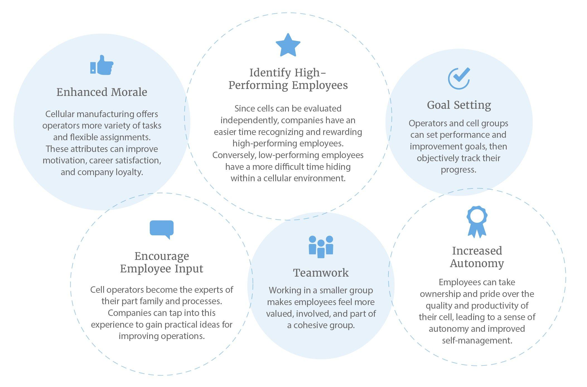

## Table of Contents

## What is a manufacturing cell?

A manufacturing cell is a group of machines or workstations arranged to work together to make a product. It is like a small factory within a bigger factory. The machines in a cell are set up in a way that helps them to pass the product from one machine to the next easily. This setup makes the work faster and more efficient.

In a manufacturing cell, workers and machines focus on making one type of product or a small group of similar products. This focus helps to reduce the time and effort needed to switch between different products. By organizing the work this way, companies can make things quicker and with fewer mistakes. It also helps workers to learn their jobs better and work together more effectively.

## How does a manufacturing cell differ from traditional production lines?

A manufacturing cell and a traditional production line are two different ways to set up a factory. In a traditional production line, machines are lined up in a long row, and the product moves from one machine to the next until it's finished. Each machine does just one job, and the product might travel a long way to get from the start to the end of the line. This setup can work well for making a lot of the same thing, but it can be hard to change if you want to make something different.

On the other hand, a manufacturing cell is set up in a smaller group of machines that work together to make a product. Instead of a long line, the machines are often arranged in a U-shape or another pattern that makes it easy to pass the product around. This setup is more flexible because it's easier to change what you're making. Workers in a cell can also do different jobs and help each other out, which can make the work go faster and be more fun.

In summary, the main difference is that a manufacturing cell is more flexible and focused on smaller batches of products, while a traditional production line is better for making large amounts of the same thing. A cell can adapt to changes more easily, and it encourages teamwork among workers, whereas a production line is more rigid and can be less adaptable to changes in what needs to be made.

## What are the key components of a manufacturing cell?

A manufacturing cell has several important parts that work together to make things. First, there are the machines or workstations. These are set up close to each other in a way that makes it easy to move the product from one machine to the next. Each machine does a specific job, like cutting, drilling, or assembling parts. The machines are chosen based on what needs to be done to make the product.

Next, there are the workers. In a manufacturing cell, workers often do more than one job. They might operate machines, check the quality of the product, or move things around. Workers in a cell work as a team and can help each other out. This teamwork makes the work go faster and helps everyone learn more about the whole process.

Finally, there are the materials and tools. The cell needs to have all the parts and supplies it needs to make the product. This includes raw materials, like metal or plastic, and any special tools that the workers need. Having everything close by means less time is wasted looking for things, and the work can keep moving smoothly.

## How are manufacturing cells designed and implemented?

Designing and implementing a manufacturing cell starts with understanding what product or products need to be made. The first step is to figure out all the steps needed to make the product, from start to finish. This includes deciding which machines are needed for each step, like cutting, shaping, or assembling. Once the steps are clear, the machines are arranged in a way that makes it easy to move the product from one machine to the next. Often, this means setting up the machines in a U-shape or another pattern that keeps everything close together. The goal is to make the flow of work as smooth and efficient as possible.

After the design is ready, the next step is to set up the cell in the factory. This involves moving machines into place and making sure they are working correctly. Workers need to be trained on how to use the machines and understand their roles in the cell. They also need to learn how to work together as a team. It's important to make sure that all the materials and tools needed are easily available within the cell. Once everything is set up and the workers are ready, the cell can start making products. Over time, the cell might need to be adjusted or improved based on how well it's working and any changes in what needs to be made.

## What types of industries benefit most from using manufacturing cells?

Manufacturing cells are really helpful for industries that make lots of different products but not too many of each one. This includes companies that make things like cars, machines, or electronics. These industries often need to change what they are making pretty often, and manufacturing cells make it easy to switch from one product to another. For example, a car factory might use cells to make different parts of the car, like engines or doors. This way, they can quickly start making a new part if they need to.

Another type of industry that benefits from manufacturing cells is the one that makes custom or specialized products. This could be companies that make things like medical equipment or aerospace parts. These products often need to be made just right, and manufacturing cells help workers focus on making each part carefully. By working in small teams, these workers can make sure everything is done correctly and fix any problems quickly. This setup helps these industries make high-quality products without wasting time or materials.

## What are the operational steps involved in running a manufacturing cell?

Running a manufacturing cell involves several steps that help keep the work flowing smoothly. First, the team needs to start the day by checking that all the machines are working properly and that they have all the materials they need. They might do a quick test run to make sure everything is ready. Then, they begin making the product, moving it from one machine to the next in the cell. Each worker has a specific job, but they also help each other out to keep things moving. They need to keep an eye on the quality of the product as they work, making sure everything is done correctly.

Throughout the day, the team needs to keep the cell running efficiently. This means fixing any problems with the machines quickly and making sure there are enough materials to keep going. If something goes wrong, like a machine breaking down, the team works together to solve it without stopping the whole cell. At the end of the day, they clean up the cell and get ready for the next day. They might also talk about what went well and what could be better, so they can keep improving how the cell works.

## How do manufacturing cells improve efficiency and productivity?

Manufacturing cells make work faster and better by keeping everything close together. Instead of a long line where the product has to travel far, a cell has machines set up in a way that makes it easy to move the product from one machine to the next. This means less time is wasted moving things around, and workers can help each other out more easily. When workers are close together, they can also talk and solve problems quickly, which keeps the work moving smoothly.

Another way manufacturing cells help is by letting workers do different jobs. In a cell, workers might switch between operating machines, checking the product, or moving things around. This keeps the work interesting and helps workers learn more about the whole process. When workers know more, they can make better decisions and fix problems faster. This teamwork and flexibility make the whole cell more efficient and able to make more products in less time.

## What are the common challenges faced when setting up manufacturing cells?

Setting up manufacturing cells can be tricky. One big challenge is figuring out the best way to arrange the machines. You need to make sure they are close enough to pass the product easily but also set up so that workers can move around without bumping into each other. It takes a lot of planning and sometimes trying different layouts to get it right. Another challenge is making sure you have the right machines for the job. If you don't have the right tools, the cell won't work well, and you might need to buy new machines or change what you're making.

Training workers is another common challenge. In a manufacturing cell, workers need to know how to do different jobs and work well together. This means spending time teaching them about the machines, the product, and how to solve problems as a team. It can take a while for everyone to get used to the new way of working. Also, keeping the cell running smoothly can be hard. Machines can break down, and you need to make sure you always have enough materials. If something goes wrong, the whole cell can slow down, so you need to be ready to fix problems quickly.

## How can manufacturing cells be optimized for different products?

Manufacturing cells can be optimized for different products by changing the setup of the machines and the jobs that workers do. If you want to make a new product, you might need to move the machines around so they are in the right order for the new steps. You might also need to add or take away machines if the new product needs different tools. Workers need to learn the new steps and how to work together to make the new product. By making these changes, the cell can switch to making something different without losing much time.

Another way to optimize manufacturing cells is by using flexible machines and training workers to do different jobs. Some machines can be set up to do different things, which makes it easier to make different products without needing a lot of new equipment. Workers who can do many jobs can switch between different tasks as needed, which helps the cell keep running smoothly even when making new products. By being flexible, the cell can make different things without having to start from scratch each time.

## What role does technology play in enhancing manufacturing cell performance?

Technology helps make manufacturing cells work better by using smart machines and computers. These machines can do things faster and more accurately than people can. For example, robots can move parts around quickly and never get tired. Computers can also keep track of how the cell is doing, so if something goes wrong, it can be fixed right away. This means less time is wasted, and more products can be made.

Another way technology helps is by letting machines talk to each other. This is called automation, and it means machines can work together without people having to tell them what to do all the time. For example, if one machine finishes a part, it can tell the next machine to start working on it. This makes the whole process smoother and faster. By using technology, manufacturing cells can make more things, make them better, and do it all more quickly.

## How do manufacturing cells contribute to lean manufacturing principles?

Manufacturing cells help with lean manufacturing by making things simpler and faster. In lean manufacturing, the goal is to cut out waste and make the work flow smoothly. Manufacturing cells do this by grouping machines together to make a product without moving it too far. This setup means less time is wasted moving things around, and workers can see problems and fix them quickly. By working in small teams, everyone can help each other out, which makes the work go faster and keeps the cell running smoothly.

Another way manufacturing cells support lean manufacturing is by being flexible. Lean manufacturing is all about being able to change what you're making quickly. In a manufacturing cell, it's easier to switch from one product to another because the machines are set up to work together in a small space. Workers can learn different jobs and help each other, which means the cell can keep making things even when something changes. This flexibility helps companies make just what customers need without wasting time or materials.

## What are the future trends and developments expected in manufacturing cell technology?

In the future, manufacturing cells are expected to become even smarter and more connected. One big trend is the use of more robots and automation. Robots can do jobs that are hard or boring for people, and they can work all the time without getting tired. They can also be set up to work with other machines in the cell, so everything can keep moving smoothly. Another trend is the use of smart systems that can keep track of how the cell is doing. These systems can tell workers if something is going wrong, so they can fix it quickly. This means less time is wasted, and more products can be made.

Another development we might see is the use of 3D printing in manufacturing cells. 3D printers can make parts quickly and easily, and they can be changed to make different things without needing a lot of new equipment. This makes it easier for manufacturing cells to switch from one product to another. Also, more companies might start using what's called "Industry 4.0" technology. This includes things like the Internet of Things (IoT), where machines can talk to each other and share information. This helps make the work in the cell even more efficient and flexible, so companies can make exactly what customers need without wasting time or materials.

## References & Further Reading

[1]: Burbidge, I., Harris, C., & Rehaag, S. (2017). ["Manufacturing Cells: Implementing Lean Production"](https://pmc.ncbi.nlm.nih.gov/articles/PMC8800363/) - Simulation

[2]: Deeg, R. & Meyer, M. (2014). ["The Political Economy of Algorithmic Trading"](https://www.tandfonline.com/doi/full/10.1080/03085147.2018.1528076) - Review of International Political Economy

[3]: "Introduction to Manufacturing Processes" by Mikell P. Groover (2011) - McGraw-Hill Education

[4]: "The Lean Six Sigma Pocket Toolbook" by Michael L. George, David Rowlands, et al. (2004) - McGraw-Hill Education

[5]: "Automated Trading with R: Quantitative Research and Platform Development" by Chris Conlan (2016) - Apress