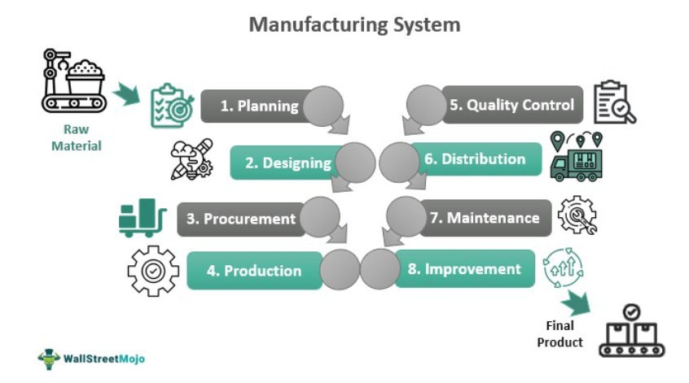

The convergence of manufacturing efficiency and financial technologies has brought about significant transformations across global industries. As businesses strive to optimize their operations in an increasingly competitive landscape, the integration of advanced manufacturing and financial systems has emerged as a game-changing solution. This article examines how industrial efficiency, through the use of manufacturing cells and algorithmic trading, is reshaping the way companies operate.

Manufacturing efficiency has long been a cornerstone of economic activity, with industries continuously seeking methods to refine production processes and improve output quality. Recent technological advances, particularly the adoption of manufacturing cells, represent a paradigm shift in how production lines are organized. These cells optimize the production process by arranging machinery and equipment to follow the flow of production rather than traditional layouts based on functional groupings. This reorganization aims to minimize waste, enhance communication, and streamline operations, thereby increasing overall productivity.



Simultaneously, the financial sector is experiencing a revolution with the rise of algorithmic trading. This innovative approach employs sophisticated algorithms and high-speed data analysis to execute trades with precision and speed unattainable by human efforts alone. Algorithmic trading enhances market responsiveness, enabling traders to capitalize rapidly on fleeting financial opportunities and reducing the incidence of human error.

The intersection of manufacturing efficiency and algorithmic trading highlights the universal applicability of technological innovation across diverse fields. Understanding these systems is essential for businesses intending to harness their potential fully. By leveraging these advancements, companies can achieve new heights of efficiency and effectiveness, driving economic growth and fostering innovation.

As we explore the synergies between manufacturing cells and algorithmic trading, we find that these methodologies are not only reshaping their respective industries but are also laying the groundwork for future interdisciplinary advancements. The ongoing evolution of technology suggests that industries stand to benefit immensely from embracing these strategies, which offer the potential for sustained competitive advantages and economic prosperity.

## Table of Contents

## Understanding Manufacturing Cells

Manufacturing cells are an integral component of modern production systems, structured to enhance efficiency and productivity. Unlike traditional manufacturing systems that group similar machines together, manufacturing cells are organized based on the flow of production. This innovative layout focuses on the sequential arrangement of machinery and processes involved in producing specific parts or products. By prioritizing the production flow, manufacturing cells are designed to minimize waste and enhance the efficiency of material movement within a factory.

The organization of manufacturing cells is carefully planned to foster improved communication and streamlined processes. The layout supports better material handling and reduced transit time between different stages of production. This is achieved by placing machinery and workstations in proximity based on the sequence of operations required rather than by machine type, which is a hallmark of traditional batch production systems. As a result, manufacturing cells facilitate a more seamless workflow, allowing for quicker identification and resolution of bottlenecks and inefficiencies.

Strategic arrangement of tools, people, and supplies contributes significantly to the effectiveness of manufacturing cells. This includes organizing tools and materials in a manner that reduces unnecessary motion and waiting times, thus promoting a more efficient work environment. By aligning operational sequences, manufacturing cells ensure that each operation is performed in the optimal order, reducing miscommunication and errors.

The efficiency of a manufacturing cell can be further enhanced by implementing Lean Manufacturing principles, which aim to maximize value by eliminating waste. In this context, waste is defined as any activity that consumes resources but does not add value to the final product. Lean techniques, such as Just-In-Time (JIT) inventory management and continuous improvement (Kaizen), are often employed within manufacturing cells to further refine and optimize operations.

In summary, manufacturing cells represent a paradigm shift from traditional production approaches, emphasizing the importance of production flow over machine grouping. By structuring operations to facilitate a smoother and more efficient production line, manufacturing cells contribute to reducing waste, improving communication, and ultimately enhancing the overall productivity of manufacturing facilities.

## Benefits of Implementing Manufacturing Cells

Manufacturing cells present a distinctive approach to optimizing production processes by aligning manufacturing activities more closely with demand. This alignment effectively mitigates overproduction, a prevalent issue in traditional manufacturing systems. By employing manufacturing cells, companies can enhance the synchronization of their output with consumer demand, thus reducing unnecessary production and associated costs.

Excess inventory poses significant financial burdens for manufacturers, as it ties up capital and storage resources. Manufacturing cells address this challenge by streamlining production flow and minimizing the buildup of surplus inventory. Through meticulous organization and targeted production, the manufacturing cells model significantly alleviates the costs tied to holding excess stock.

Furthermore, the implementation of manufacturing cells fosters improved workflow balance. By locating related operations in close proximity to each other, these cells facilitate smoother transitions between various stages of production, diminishing bottlenecks and overprocessing. This optimized layout not only ensures efficient resource utilization but also lessens idle times and increases throughput.

The strategic organization of manufacturing cells enables easier identification of value-adding processes. By compartmentalizing production into designated cells focused on specific tasks, businesses can more readily pinpoint and enhance processes that contribute directly to product value. This clear delineation simplifies management efforts aimed at maximizing efficiency and eliminating non-value-adding activities.

Overall, adopting manufacturing cells leads to a reduction in operational costs, an enhancement in product quality, and a shortening of lead times. These benefits collectively contribute to a more agile manufacturing process capable of rapidly adjusting to market fluctuations and consumer demands. By fostering a streamlined production environment, manufacturing cells empower manufacturers to achieve competitive advantages in increasingly dynamic markets.

## Algorithmic Trading: A New Frontier in Efficiency

Algorithmic trading employs sophisticated computerized algorithms to execute trades with remarkable efficiency. By harnessing high-speed data analysis, these algorithms can swiftly interpret market fluctuations and act upon them with precision. This approach allows traders to exploit short-lived opportunities that arise in the market, which might be imperceptible to human traders. The efficiency of [algorithmic trading](/wiki/algorithmic-trading) is a testament to how technology can enhance performance in the financial sector, mirroring the impact of manufacturing cells on production systems.

The core advantage of algorithmic trading lies in its ability to minimize human errors in trading decisions. Algorithms are designed to adhere to defined rules and criteria, ensuring consistency and discipline in execution. As a result, errors stemming from emotional or irrational decision-making are significantly reduced. Furthermore, algorithmic trading systems are capable of executing complex strategies that include [arbitrage](/wiki/arbitrage), [market making](/wiki/market-making), and [statistical arbitrage](/wiki/statistical-arbitrage), often involving multiple securities and markets.

In the constantly changing landscape of financial markets, algorithmic trading offers a critical advantage by responding to market conditions with unparalleled speed. For instance, high-frequency trading ([HFT](/wiki/high-frequency-trading-strategies)), a subset of algorithmic trading, relies on algorithms to make thousands of trades within microseconds. The rapid execution of these trades can improve market efficiency, [liquidity](/wiki/liquidity-risk-premium), and price discovery mechanisms.

The parallels between algorithmic trading and manufacturing cells are notable, as both frameworks promote adaptability and operational efficiency. Just as manufacturing cells optimize production processes by structuring operations to enhance material flow and communication, algorithmic trading restructures transaction processes to maximize speed and accuracy. This comparison underscores a shared commitment across industries to leverage technological advancements for improved outcomes.

In summary, the adoption of algorithmic trading marks a new era of efficiency in financial markets. By automating and optimizing trading processes, these algorithms enhance the ability of traders to navigate complex and volatile environments. As technology continues to advance, the methodologies utilized in algorithmic trading will likely evolve, further refining the capabilities of these systems to ensure optimal performance in the financial sector.

## Synergies Between Manufacturing Efficiency and Algo Trading

The intersection of manufacturing efficiency and algorithmic trading presents a fascinating study of how different sectors can leverage strategic infrastructure and technology to optimize performance. Both disciplines focus on refining their respective systems to achieve the highest level of efficiency, albeit in distinct contexts.

In manufacturing, efficiency is often achieved through the organization of production processes such as manufacturing cells. These cells are strategically designed to minimize movement and material handling, thereby streamlining the flow of goods and reducing waste. The key lies in restructuring production layouts to ensure that operations proceed with minimal interruptions, resulting in a more efficient workflow. Similarly, algorithmic trading seeks to optimize the process of executing trades through the automation of transaction operations. By utilizing algorithms, financial institutions can restructure their trading processes to maximize speed and accuracy, effectively reducing the latency that can occur with human intervention.

The concepts of minimizing waste and maximizing resource use are central to both manufacturing efficiency and algorithmic trading. In manufacturing cells, resource optimization is evident in the way machines and personnel are allocated to ensure that production is as streamlined as possible. This can be likened to algorithmic trading, where computational resources are utilized to execute trades at optimal times to avoid waste through price slippage and market impact.

An integrated approach in both manufacturing and trading systems can produce superior outcomes. The shared goal across these sectors is the enhancement of productivity and the achievement of better results through technological advancements and innovation. In manufacturing, this might involve adopting lean practices to eliminate unnecessary steps in the production process. In algorithmic trading, it could mean deploying [machine learning](/wiki/machine-learning) algorithms to predict market trends more accurately.

To illustrate this integration, consider the example of predictive maintenance in manufacturing. By employing machine learning techniques, manufacturers can detect potential equipment malfunctions before they occur, similar to how algorithmic trading leverages historical data to predict stock price movements. Both approaches rely on data-driven insights to preemptively address potential inefficiencies.

Mathematically, both manufacturing efficiency and algorithmic trading can be modeled to optimize specific criteria, such as minimizing cost or maximizing throughput. For instance, the optimization of a manufacturing cell layout can be approached with linear programming, while algorithmic trading strategies might utilize quantitative models such as the Black-Scholes formula for option pricing or the use of Python libraries like NumPy and pandas for data handling and real-time decision-making.

```python
import numpy as np
import pandas as pd

# Example of a simple moving average crossover strategy in algorithmic trading
def crossover_strategy(prices, short_window=40, long_window=100):
    signals = pd.DataFrame(index=prices.index)
    signals['price'] = prices
    signals['short_mavg'] = prices.rolling(window=short_window, min_periods=1, center=False).mean()
    signals['long_mavg'] = prices.rolling(window=long_window, min_periods=1, center=False).mean()
    signals['signal'] = 0
    signals['signal'][short_window:] = np.where(signals['short_mavg'][short_window:] 
                                                > signals['long_mavg'][short_window:], 1, 0)   
    return signals

# Dummy price data
prices = pd.Series(np.random.randn(1000), index=pd.date_range(start='1/1/2020', periods=1000))
signals = crossover_strategy(prices)
```

The resulting optimization from these integrated approaches can substantially elevate an organization's competitive position in today's economy. By understanding and applying the principles of minimizing waste, maximizing resource use, and leveraging technology for optimization, companies across these diverse fields can enhance efficiency and drive economic growth.

## Conclusion

The exploration of manufacturing cells and algorithmic trading reveals the transformative power of technology in enhancing efficiency and productivity. Manufacturing cells, with their strategic organization, have demonstrated how targeted production systems can reduce waste and improve material flow. Similarly, algorithmic trading has shown how the application of computerized algorithms can exploit market opportunities with precision and speed. These methodologies offer valuable lessons for industries aiming to optimize their operations.

Embracing such technological advancements can lead to significant competitive advantages and sustainable growth. Companies that adopt efficient manufacturing processes or implement sophisticated trading algorithms are better positioned to minimize costs, enhance quality, and respond swiftly to market demands. This proactive engagement with technology not only boosts productivity but also enables businesses to anticipate and adapt to changes in the economic landscape.

As technology continues to evolve, the convergence between different sectors becomes more pronounced, offering profound opportunities for synergy. Manufacturing processes can benefit from financial technologies that optimize resource allocation, just as financial markets can learn from the streamlined workflows of manufacturing cells. This cross-pollination of ideas and techniques across industries will likely drive innovation and create new business models.

Businesses that are poised to leverage these advancements stand to gain immensely in the modern economy. By integrating cutting-edge technologies into their operational frameworks, companies can achieve a level of agility and efficiency that sets them apart from competitors. Those who can effectively align their strategies with technological innovations will be well-equipped to thrive in an increasingly interconnected and fast-paced market environment.

## References & Further Reading

[1]: Burbidge, I., Harris, C., & Rehaag, S. (2017). ["Manufacturing Cells: Implementing Lean Production"](https://pmc.ncbi.nlm.nih.gov/articles/PMC8800363/) - Simulation

[2]: Deeg, R. & Meyer, M. (2014). ["The Political Economy of Algorithmic Trading"](https://www.tandfonline.com/doi/full/10.1080/03085147.2018.1528076) - Review of International Political Economy

[3]: "Introduction to Manufacturing Processes" by Mikell P. Groover (2011) - McGraw-Hill Education

[4]: "The Lean Six Sigma Pocket Toolbook" by Michael L. George, David Rowlands, et al. (2004) - McGraw-Hill Education

[5]: "Automated Trading with R: Quantitative Research and Platform Development" by Chris Conlan (2016) - Apress