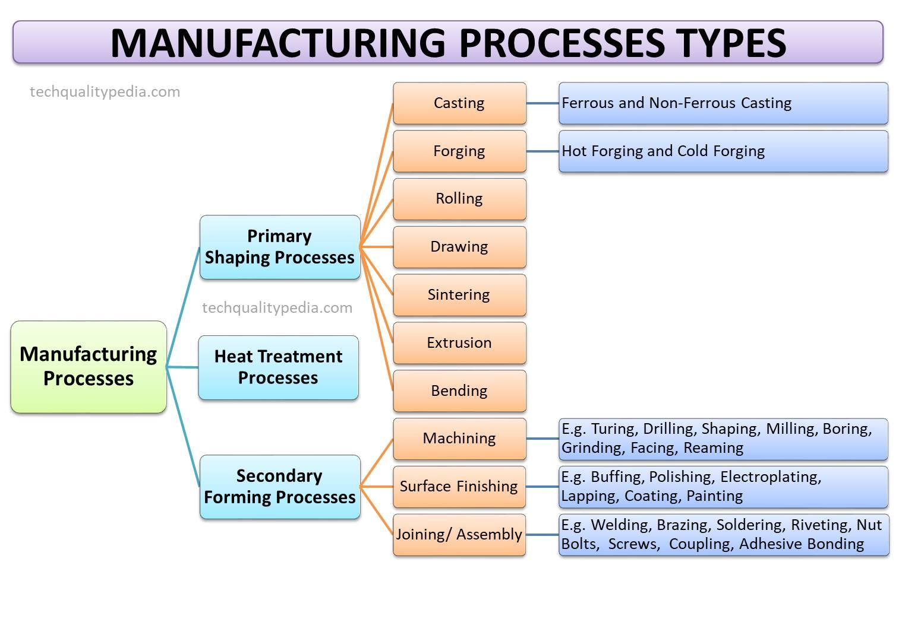

## Table of Contents

## What is manufacturing production?

Manufacturing production is the process of making products from raw materials or parts. It involves using machines, tools, and labor to create items that people can use. This can happen in factories or workshops, where workers follow specific steps to turn materials into finished goods. The goal is to make products efficiently and in large quantities to meet the demand of customers.

There are different types of manufacturing, like making cars, clothes, or electronics. Each type has its own set of steps and machines. For example, making a car involves assembling many parts like the engine, wheels, and body. On the other hand, making clothes might involve cutting fabric and sewing it together. No matter the product, the key is to have a smooth process that keeps the quality high and the costs low.

## What are the main types of manufacturing processes?

Manufacturing processes can be divided into three main types: job shop, batch, and continuous. Job shop manufacturing is used when you need to make a small number of custom products. Each product might be different, so workers have to change the machines and tools often. This type of manufacturing is good for making things like custom furniture or special machines. It's flexible but can take more time and be more expensive.

Batch manufacturing is used when you need to make a medium number of the same product. You make the products in groups or batches. This is good for things like baking cookies or making a certain type of car. You set up the machines for one batch, make all the products in that batch, and then set up the machines again for the next batch. It's more efficient than job shop manufacturing but still allows for some changes between batches.

Continuous manufacturing is used when you need to make a large number of the same product all the time. This is good for things like making paper or chemicals. The machines run all the time, and the process doesn't stop. It's very efficient and can make products at a low cost, but it's hard to change the product once the process is set up.

## How does batch production differ from continuous production?

Batch production and continuous production are two ways to make products, but they work differently. In batch production, you make a group of the same product at one time. After finishing one group, you might change the machines to make a different group of products. This is good for making things like cookies or cars where you need to make a medium number of the same thing. It's more flexible than continuous production because you can change what you're making between batches.

Continuous production, on the other hand, is used when you need to make a lot of the same product all the time. The machines keep running without stopping, like a never-ending conveyor belt. This is good for things like making paper or chemicals. It's very efficient and can make products at a low cost, but it's hard to change the product once the process is set up. So, if you need to make a lot of the same thing without stopping, continuous production is the way to go.

## What are the advantages of mass production?

Mass production means making a lot of the same thing quickly. It's good because it can make things cheaper. When you make a lot of something, you can buy materials in big amounts, which often costs less. Also, the workers get really good at their jobs because they do the same thing over and over. This means they can work faster and make fewer mistakes. Machines can also be set up to work all the time, which saves time and money.

Another advantage is that mass production can make more products in less time. This is good for businesses because they can sell more things and make more money. It also means that people can buy things they need at a lower price. For example, if a company makes a lot of phones, they can sell them for less money than if they made just a few. This helps everyone because more people can afford the products.

## What role does automation play in modern manufacturing?

Automation is a big deal in modern manufacturing. It means using machines and computers to do work that people used to do. This can make things faster and cheaper. For example, a robot can put parts together much quicker than a person can. Also, machines don't get tired or make as many mistakes as people do. This helps make sure the products are good quality and the same every time.

Automation also helps with safety. Some jobs in manufacturing can be dangerous, like working with heavy machines or chemicals. Robots can do these jobs instead, so people don't get hurt. Plus, automation can help factories run all the time, even when people are not there. This means they can make more products without stopping. Overall, automation makes manufacturing better, safer, and more efficient.

## How do lean manufacturing principles improve production efficiency?

Lean manufacturing is all about making things better by getting rid of waste. Waste can be anything that doesn't help make the product, like waiting time, extra steps, or making too much of something. By finding and removing waste, lean manufacturing helps factories make things faster and cheaper. For example, if workers have to wait for parts, that's a waste of time. Lean manufacturing would fix this by making sure parts are always ready when needed.

Another way lean manufacturing helps is by making the work smoother. Instead of having big piles of parts or finished products, lean manufacturing tries to keep just enough of everything moving through the factory. This means less space is needed for storage, and it's easier to see if something goes wrong. When things flow smoothly, the factory can make more products in less time, and the workers can focus on making good quality items without being slowed down by problems.

## What are the key differences between job shop and flow shop production?

Job shop production is used when you need to make a small number of custom products. Each product can be different, so workers have to change the machines and tools often. This type of production is good for making things like custom furniture or special machines. It's flexible because you can make different things, but it can take more time and be more expensive. The focus in a job shop is on meeting the specific needs of each customer, even if it means the process is slower.

Flow shop production, on the other hand, is used when you need to make a lot of the same product. The machines are set up in a line, and the product moves from one machine to the next until it's finished. This is good for things like making cars or electronics. It's very efficient because the machines are set up to do the same thing over and over. The focus in a flow shop is on making a lot of products quickly and at a low cost, but it's not as flexible as a job shop because changing the product can be hard.

## How can just-in-time (JIT) manufacturing impact production schedules?

Just-in-time (JIT) manufacturing means making things only when they are needed. This can change production schedules a lot. Instead of making a lot of products and storing them, factories make products just before they are sent to customers. This means the production schedule has to be very exact. If a customer orders something, the factory has to start making it right away so it's ready on time. This can make the schedule tighter and more stressful because there's no room for mistakes or delays.

JIT can also make production schedules more flexible. Because factories don't make products until they are needed, they can change what they are making more easily. If a customer wants something different, the factory can switch to making that new product without having a lot of old products sitting around. This means the production schedule can be changed quickly to meet new demands. But, it also means that everyone has to be ready to change what they are doing at a moment's notice.

## What are the environmental considerations in manufacturing production?

Manufacturing production can have a big impact on the environment. Factories use a lot of energy and materials to make things. This can lead to pollution, like dirty air and water. Also, making things creates waste, like leftover materials and packaging. If this waste isn't taken care of properly, it can hurt the environment. For example, chemicals from factories can get into rivers and harm fish and plants. So, it's important for factories to think about how they can make things in a way that doesn't harm the environment as much.

To be more eco-friendly, factories can do things like use less energy, recycle materials, and find ways to make less waste. For example, they can use renewable energy like solar power instead of burning coal. They can also reuse materials instead of throwing them away. Some factories even try to make products that are easier to recycle at the end of their life. By thinking about the environment, factories can help make the world a better place while still making the things people need.

## How do advanced technologies like 3D printing influence manufacturing types?

Advanced technologies like 3D printing are changing the way things are made. 3D printing lets you make things by building them up layer by layer, instead of cutting or shaping them from a big piece of material. This means you can make things that are very detailed and custom-made. It's good for making small numbers of special products, like parts for machines or even things like jewelry. Because of this, 3D printing fits well with job shop manufacturing, where you make different things for different customers.

But 3D printing can also be used for making a lot of the same thing, like in mass production. It's getting better and faster, so some factories are using it to make big numbers of products. This can be good because it can make things cheaper and faster than traditional ways. It also lets you make things right where they are needed, without having to ship them from far away. So, 3D printing is changing both job shop and mass production, making them more flexible and efficient.

## What strategies can be used to optimize supply chain management in manufacturing?

Optimizing supply chain management in manufacturing means making sure everything runs smoothly from getting materials to sending out finished products. One good strategy is to use something called just-in-time (JIT) delivery. This means getting materials right when you need them, so you don't have to store a lot of stuff. This can save money and space, but you have to be really good at planning and talking with your suppliers. Another strategy is to use technology like computer systems to keep track of everything. These systems can help you see where things are and make sure you have what you need when you need it. They can also help you find problems quickly and fix them before they get worse.

Another way to optimize supply chain management is by building strong relationships with your suppliers. When you work well with them, they can help you get materials faster and at a better price. It's also good to have more than one supplier for important materials, so if one can't give you what you need, you have another option. Lastly, it's important to always be looking for ways to improve. This means checking your supply chain often to see where you can do things better. Maybe you can find a shorter way to get materials, or maybe you can use less packaging to save money and help the environment. By always trying to improve, you can keep your supply chain running smoothly and efficiently.

## How do global economic factors affect manufacturing production decisions?

Global economic factors can really change how companies make things. For example, if the price of materials goes up because of what's happening in other countries, companies might have to pay more to make their products. This can make them think about using different materials or moving their factories to places where things are cheaper. Also, if there are big changes in money values, like the dollar getting stronger or weaker, it can affect how much it costs to buy things from other countries. Companies might decide to make more things at home if it's cheaper, or they might buy more from other countries if it's a better deal.

Another big thing is how well the economy is doing around the world. If a lot of people are buying things, companies might want to make more products to meet the demand. But if the economy is slow and people aren't buying as much, companies might make less or even stop making some things. They also have to think about trade rules and taxes between countries. If there are high taxes on things coming into a country, it might be better to make those things there instead of bringing them in from somewhere else. All these global economic factors can make companies change their plans and decide where and how to make their products.

## References & Further Reading

[1]: Bergstra, J., Bardenet, R., Bengio, Y., & Kégl, B. (2011). ["Algorithms for Hyper-Parameter Optimization."](https://dl.acm.org/doi/10.5555/2986459.2986743) Advances in Neural Information Processing Systems 24.

[2]: ["Advances in Financial Machine Learning"](https://www.amazon.com/Advances-Financial-Machine-Learning-Marcos/dp/1119482089) by Marcos Lopez de Prado

[3]: ["Evidence-Based Technical Analysis: Applying the Scientific Method and Statistical Inference to Trading Signals"](https://www.amazon.com/Evidence-Based-Technical-Analysis-Scientific-Statistical/dp/0470008741) by David Aronson

[4]: ["Machine Learning for Algorithmic Trading"](https://github.com/stefan-jansen/machine-learning-for-trading) by Stefan Jansen

[5]: ["Quantitative Trading: How to Build Your Own Algorithmic Trading Business"](https://www.amazon.com/Quantitative-Trading-Build-Algorithmic-Business/dp/1119800064) by Ernest P. Chan