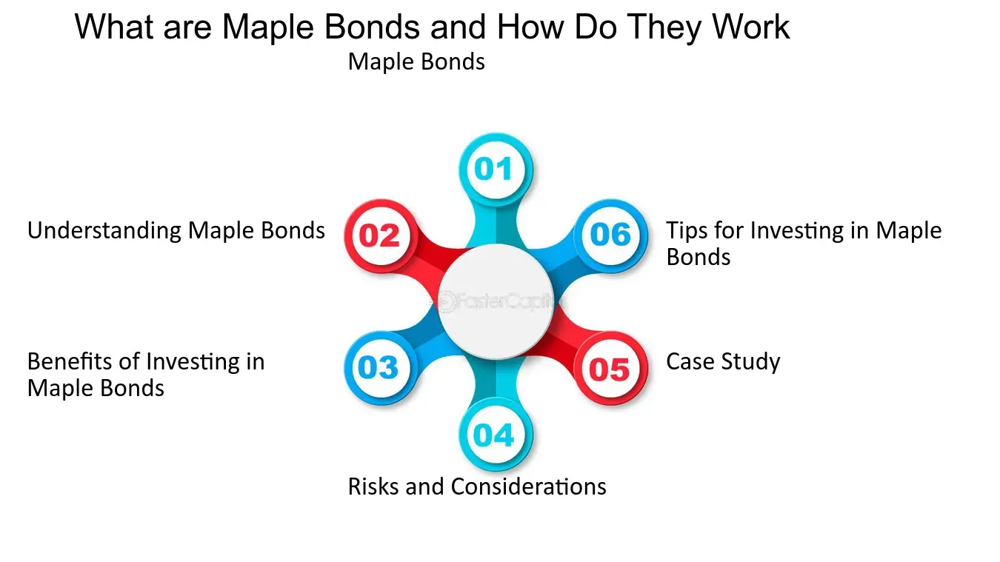

## Table of Contents

## What is a Maple Bond?

A Maple Bond is a type of bond that is issued in the Canadian market by a foreign company or government. It is denominated in Canadian dollars, which means the bond's value and interest payments are in Canadian currency. This allows foreign entities to tap into the Canadian investment market and raise funds in Canada.

Investors in Canada find Maple Bonds attractive because they offer a way to diversify their portfolios. Since these bonds are issued by foreign entities, they can provide exposure to different economic conditions and potentially higher returns than domestic bonds. Additionally, Maple Bonds are subject to Canadian regulations, which can provide a level of security and familiarity for Canadian investors.

## How does a Maple Bond differ from other types of bonds?

A Maple Bond is different from other types of bonds because it is issued in Canada by a company or government from another country. It is special because it is paid in Canadian dollars, not the currency of the country where the issuer is from. This means that people in Canada can buy these bonds and get paid back in their own money. Other bonds, like U.S. Treasury Bonds or corporate bonds from American companies, are usually paid in U.S. dollars. So, if you live in Canada and buy a U.S. bond, you have to deal with changing your money from Canadian to U.S. dollars and back.

Another way Maple Bonds are different is that they help foreign companies or governments get money from Canadian investors. This is good for the issuers because they can reach more people who want to invest. For Canadian investors, Maple Bonds are a way to invest in foreign companies or governments without leaving the Canadian market. This can be safer and easier because these bonds follow Canadian rules, which investors might know better than rules from other countries.

## Who typically issues Maple Bonds?

Foreign companies and governments usually issue Maple Bonds. These are organizations from outside Canada that want to borrow money from Canadian investors. By issuing Maple Bonds, they can get funds in Canadian dollars, which helps them reach a new group of people who might want to invest.

These bonds are popular with big companies and governments from countries like the United States, Europe, and Asia. They use Maple Bonds to raise money for different projects or to manage their finances. Canadian investors like these bonds because they can invest in foreign opportunities while still using their own currency.

## What are the benefits of investing in Maple Bonds?

Investing in Maple Bonds can be good for people in Canada because these bonds let them put money into foreign companies or governments without leaving the Canadian market. This means they can try to earn money from other countries while still using Canadian dollars. This can be safer and easier because Maple Bonds follow Canadian rules, which investors might understand better than rules from other places.

Also, Maple Bonds can help Canadian investors spread their money around in different ways. Instead of just investing in Canadian companies, they can also invest in big companies or governments from countries like the United States, Europe, or Asia. This can make their investments more varied and possibly help them earn more money. Plus, if the Canadian dollar gets stronger compared to other currencies, investors might get even more value from their Maple Bonds.

## What are the risks associated with Maple Bonds?

One risk of investing in Maple Bonds is that they are issued by foreign companies or governments. This means that if something bad happens in the country where the issuer is from, like a financial crisis or political problems, it could affect the bond's value. For example, if the foreign government has trouble paying its debts, the bond might lose value or even default, which means the investor might not get their money back.

Another risk is related to currency changes. Even though Maple Bonds are paid in Canadian dollars, the issuer still has to convert their own currency into Canadian dollars to make payments. If the Canadian dollar gets stronger compared to the issuer's currency, it might be harder for them to make payments, which could affect the bond's value. Also, if the Canadian dollar gets weaker, the bond's value in Canadian dollars might go down, even if the bond itself is doing well.

Lastly, there's the interest rate risk. If interest rates in Canada go up, newer bonds might offer higher returns, making existing Maple Bonds less attractive. This could cause the value of the Maple Bonds to drop because investors might want to sell them to buy the newer bonds with better rates. So, even though Maple Bonds can be a good way to invest in foreign opportunities, they come with risks that investors need to think about carefully.

## How is the interest rate determined for Maple Bonds?

The interest rate for Maple Bonds is set by looking at different things, like how much risk there is and what's happening in the market. When a foreign company or government wants to issue a Maple Bond, they think about how safe their bond is compared to other bonds. If their bond is seen as riskier, they might have to offer a higher interest rate to make it more attractive to investors. They also look at what interest rates other bonds in Canada are offering, so their Maple Bond can be competitive.

Another thing that affects the interest rate is what's happening with the economy and interest rates in Canada. If interest rates in Canada are going up, the issuer might have to offer a higher rate to make their Maple Bond appealing. On the other hand, if interest rates are low, they might be able to offer a lower rate. The issuer works with banks and other financial experts to figure out the best interest rate that will attract Canadian investors while still making sense for them to borrow the money.

## What role do Maple Bonds play in the Canadian financial market?

Maple Bonds are important in the Canadian financial market because they help bring in money from foreign companies and governments. When these foreign groups issue Maple Bonds, they can borrow money from Canadian investors. This is good for the Canadian market because it means more money is flowing in, which can help grow the economy. It also gives Canadian investors more choices for where to put their money, letting them invest in big companies or governments from other countries without leaving the Canadian market.

Maple Bonds also help make the Canadian financial market more interesting and varied. They let Canadian investors spread their money around in different ways, which can make their investments safer and possibly more profitable. By following Canadian rules, Maple Bonds give investors a sense of security and familiarity. This can make the Canadian market more attractive to both foreign issuers and local investors, helping to keep the market strong and active.

## Can foreign investors purchase Maple Bonds, and what are the implications?

Yes, foreign investors can buy Maple Bonds. These bonds are issued in Canada by companies or governments from other countries, but they are paid in Canadian dollars. So, if a foreign investor wants to buy a Maple Bond, they need to change their money into Canadian dollars first. This can be good for them because it lets them invest in the Canadian market and possibly earn money from Canadian interest rates.

However, there are some things foreign investors need to think about. One big thing is the risk of changing money. If the Canadian dollar gets weaker compared to their own currency, they might lose money when they change it back. Also, they need to understand Canadian rules and how the Canadian market works, which might be different from what they are used to. But if they are okay with these risks, Maple Bonds can be a way for them to spread their investments and try to earn money from a different country.

## What are the tax implications of investing in Maple Bonds?

When you invest in Maple Bonds, you need to think about taxes. If you live in Canada and earn money from Maple Bonds, you have to pay taxes on the interest you get. This is just like any other kind of interest income you might have. The tax rate depends on your total income and how much you earn from the bonds. Sometimes, the issuer of the bond might have to take out some money for taxes before they pay you the interest, but this depends on the rules between Canada and the country where the issuer is from.

If you are a foreign investor, the tax rules can be different. You might have to pay taxes in Canada on the interest you earn from Maple Bonds. But, there might be a tax treaty between Canada and your country that can change how much tax you have to pay. It's a good idea to check the tax rules in both Canada and your home country to understand how much tax you will have to pay and if you can get any money back. Talking to a tax expert can help you figure out all of this.

## How do Maple Bonds contribute to the diversification of an investment portfolio?

Maple Bonds help investors spread their money around by letting them invest in foreign companies or governments while still using Canadian dollars. This means that if something bad happens to the Canadian economy, the investor's money might still be safe because it's also invested in other countries. By adding Maple Bonds to their portfolio, investors can try to earn money from different places, which can make their investments safer and possibly more profitable.

Another way Maple Bonds help with diversification is by offering a different kind of investment within the Canadian market. Instead of just investing in Canadian companies or government bonds, investors can choose Maple Bonds to get exposure to international opportunities. This variety can help balance out the risks in their portfolio, making it less likely that all their investments will go down at the same time.

## What historical events have significantly impacted the Maple Bond market?

The Maple Bond market has been affected by big events like the 2008 financial crisis. During this time, many people were scared to invest in anything risky, so the demand for Maple Bonds went down. Foreign companies and governments found it harder to borrow money in Canada because investors were worried about losing their money. This made the Maple Bond market smaller and less active for a while.

Another event that changed the Maple Bond market was the change in interest rates by the Bank of Canada. When interest rates go up or down, it can make Maple Bonds more or less attractive to investors. For example, if interest rates in Canada go up, new bonds might offer better returns, so people might sell their old Maple Bonds to buy the new ones. This can affect how much people want to invest in Maple Bonds and how much money foreign issuers can borrow.

## What are the regulatory requirements for issuing Maple Bonds in Canada?

When a foreign company or government wants to issue a Maple Bond in Canada, they need to follow some rules set by the Canadian government. They have to register the bond with the Canadian Securities Administrators (CSA), which is like getting permission to sell the bond in Canada. They also need to give a lot of information about the bond, like how much money they want to borrow, the interest rate, and when the bond will be paid back. This information helps Canadian investors understand the bond and decide if they want to buy it.

Another important rule is that the issuer has to follow Canadian laws about telling the truth and being honest. This means they can't lie about the bond or hide important information that might affect investors' decisions. The issuer might also need to work with a Canadian bank or financial company to help them follow all the rules and make sure everything is done correctly. By following these rules, the issuer can make sure their Maple Bond is sold in a fair and safe way for Canadian investors.

## What is the current landscape of Canadian foreign bonds?

The Canadian bond market encompasses various types of foreign bonds, among which Maple Bonds represent a significant and growing segment. These bonds are exclusively issued by non-Canadian entities but denominated in Canadian dollars, making them particularly attractive to Canadian investors by eliminating the [forex](/wiki/forex-system) risk associated with investing in foreign currency-denominated securities. Their prominence reflects Canada's stable financial environment and its appeal to international issuers.

Understanding the trends and demand for Maple Bonds provides insight into Canada's economic standing and its attractiveness to foreign investors. The appetite for these securities is influenced by several factors:

### Trends Influencing Maple Bonds

1. **Interest Rates:**
   Interest rates significantly impact the bond market. Canadian interest rates, set by the Bank of Canada, influence the yield on Maple Bonds compared to other bonds. A lower [interest rate](/wiki/interest-rate-trading-strategies) environment typically increases the attractiveness of bonds as an investment vehicle, driving up demand. Conversely, rising interest rates might reduce bond prices as investors seek higher yields elsewhere.

   The relationship between bond prices and interest rates can be mathematically expressed by the bond duration, which measures the bond's sensitivity to interest rate changes:
$$
   \text{Duration} = \frac{\sum^{n}_{t=1} \left( \frac{t \cdot C}{(1 + y)^t} \right) + \frac{n \cdot M}{(1 + y)^n}}{P}

$$

   Where:
   - $t$ is the time period.
   - $C$ is the coupon payment.
   - $y$ is the yield to maturity.
   - $n$ is the number of periods.
   - $M$ is the maturity value.
   - $P$ is the current price of the bond.

2. **Credit Ratings:**
   Credit ratings, assigned by agencies such as Moody's, Fitch, and Standard & Poor's, assess the creditworthiness of bond issuers. For foreign issuers in Canada, a high credit rating can result in lower borrowing costs, making it more attractive to issue Maple Bonds. Canadian investors, in turn, are likely to demand higher yields for bonds with lower ratings to compensate for the additional credit risk.

3. **Market Conditions:**
   Global economic conditions, along with local developments in the Canadian economy, influence the bond market. Canada's economic stability, regulatory environment, and growth prospects play a crucial role in increasing the attractiveness of its bond market to foreign issuers. During periods of market volatility, Maple Bonds offer a stable alternative due to Canada's solid economic fundamentals.

The demand for Canadian foreign bonds and Maple Bonds is also boosted by Canada's consistent AAA credit rating, indicating a healthy economic outlook and low political risk. The steady flow of foreign entities opting to list in Canadian markets showcases the confidence in Canada's economic regime.

Foreign issuers are attracted by the opportunity to diversify their investor base while accessing competitive financing rates. As a reflection of this interest, the diversity of foreign bond issuers in the Canadian market continues to grow, ranging from multinational corporations to sovereign entities. Consequently, Maple Bonds have reinforced Canada's position as a vital node in cross-border financing networks, contributing to the country's financial growth and integration into the global economy.

## References & Further Reading

[1]: ["Maple Bonds: What Foreign Issuers and Canadian Investors Should Know"](https://fastercapital.com/content/Foreign-Issuers--Investing-Beyond-Borders--Maple-Bonds-and-Foreign-Issuers.html) by Investopedia.

[2]: ["Canadian Bond Market Development, 1998-2005"](https://www.bankofcanada.ca/wp-content/uploads/2010/06/r994a-e.pdf) by Bank of Canada Review.

[3]: ["Foreign Investment Restrictions in Canada: A Survey"](https://www.bennettjones.com/-/media/Files/BennettJones/Shared/Foreign_Direct_Investment_Restrictions_in_Canada.pdf) by Government of Canada, policy papers on foreign investment.

[4]: ["Globalization of Capital Markets and Emerging Trends of Securities Regulation"](https://www.sciencedirect.com/science/article/pii/S1075425316301417) by Janis Sarra.

[5]: ["Algorithmic Trading and DMA: An Introduction to Direct Access Trading Strategies"](https://www.amazon.com/Algorithmic-Trading-DMA-introduction-strategies/dp/0956399207) by Barry Johnson.