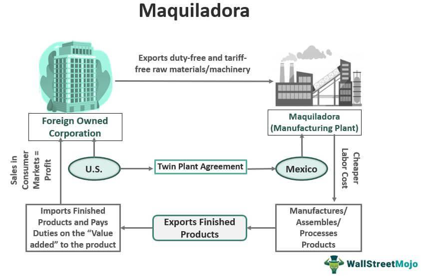

## Table of Contents

## What is a maquiladora?

A maquiladora is a factory in Mexico that is usually owned by a foreign company. These factories are set up to take advantage of lower labor costs in Mexico. Companies from the United States, Japan, and other countries often use maquiladoras to make products like electronics, cars, and clothes. The products are then sent back to the company's home country or sold in other markets.

Maquiladoras started in the 1960s as part of a program to boost the Mexican economy. They have helped create many jobs in Mexico, especially in cities near the U.S. border. However, they also have some downsides. Workers in maquiladoras often earn low wages and work in tough conditions. There are also concerns about the impact on the environment because of the factories' waste.

## Where are maquiladoras typically located?

Maquiladoras are usually found in cities near the border between Mexico and the United States. Some of the biggest maquiladora cities are Tijuana, Ciudad Juárez, and Reynosa. These places are close to the U.S., which makes it easier and cheaper to send products back to American companies.

The reason maquiladoras are located near the border is because it helps save money on shipping. Being close to the U.S. means that parts can be sent to the factories quickly, and finished products can be sent back just as fast. This location also helps companies manage their factories more easily since they are not too far from their home offices.

## How did the maquiladora industry start?

The maquiladora industry started in the 1960s when the Mexican government created a program to help the economy. They wanted to bring in foreign companies to set up factories in Mexico. These factories would hire Mexican workers to make products that could be sold in other countries. The program was called the Border Industrialization Program, and it let foreign companies bring in materials without paying taxes, as long as the finished products were exported.

The idea was to create jobs and bring money into Mexico. It worked because many American companies liked the idea of lower labor costs. They started building factories near the U.S.-Mexico border. Over time, the maquiladora industry grew a lot, and it became a big part of the Mexican economy. Today, there are thousands of maquiladoras in Mexico, and they make all kinds of products, from cars to clothes.

## What are the economic benefits of maquiladoras for host countries?

Maquiladoras bring a lot of economic benefits to the countries where they are located, like Mexico. They create jobs for people who might not have work otherwise. This means more people can earn money and support their families. The money they earn helps the local economy because they spend it on things like food, housing, and other goods. This can make the whole area better off.

Another big benefit is that maquiladoras bring in foreign money. When foreign companies set up factories, they invest money in the country. This can help build up the local area with new roads, buildings, and other improvements. Also, when the factories make products and sell them to other countries, it helps the country earn money from exports. This can make the country's economy stronger and help it grow.

## How do maquiladoras benefit multinational corporations?

Maquiladoras help big companies save money. They can make their products in Mexico where it costs less to pay workers. This means the companies can make more profit because their expenses are lower. Also, being close to the U.S. makes it easy and cheap to send parts to the factories and bring finished products back home.

These factories also help companies grow their business. They can make more products without spending a lot of money on new factories in their own country. This lets them sell more things and reach more customers. Plus, having factories in different places can help the companies be more flexible and react quickly to changes in the market.

## What types of products are commonly manufactured in maquiladoras?

Maquiladoras make all sorts of things. Some of the most common products are electronics, like TVs and computers. They also make car parts, which are important for the car industry. Clothes are another big thing that maquiladoras make, including shirts, pants, and other garments.

These factories also produce things like toys, furniture, and appliances. Because they can make many different products, maquiladoras help a lot of different industries. This variety means that companies from all over the world can use maquiladoras to make their goods more cheaply.

## What are the working conditions like in maquiladoras?

Working conditions in maquiladoras can be tough. Many workers have to work long hours, sometimes up to 12 hours a day. The pay is often low, and it can be hard to make enough money to live well. The factories can be hot and noisy, and workers might not get enough breaks. Some people also say that the factories are not always safe, and accidents can happen.

But not all maquiladoras are the same. Some factories try to make things better for their workers. They might offer better pay, safer working conditions, and even some benefits like health care. Still, many workers feel that the conditions need to improve a lot. Groups and the government are working to make sure that maquiladoras treat their workers fairly and safely.

## How are workers' rights addressed in maquiladoras?

Workers' rights in maquiladoras are an important issue. There are laws in Mexico that are supposed to protect workers, like the right to a safe workplace, fair pay, and the ability to join unions. However, these rights are not always followed. Many workers find it hard to stand up for themselves because they are afraid of losing their jobs. Some factories do not let workers form unions or they punish workers who try to organize.

Groups like labor unions and non-profits work hard to help maquiladora workers. They try to make sure that the factories follow the law and treat workers fairly. These groups can help workers learn about their rights and how to fight for better conditions. The Mexican government also tries to check on factories to make sure they are following the rules, but it can be hard to keep up with all the factories. Overall, there is still a lot of work to do to make sure that maquiladora workers' rights are respected.

## What are the environmental impacts of maquiladoras?

Maquiladoras can have a big impact on the environment. They often make a lot of waste and pollution. The factories use chemicals and other materials to make their products, and sometimes this waste is not handled the right way. It can end up in rivers, the air, and the soil. This can hurt the environment and make it hard for people and animals to live healthy lives.

The government and some companies are trying to make things better. They are working on rules to make sure factories handle their waste safely. Some factories are also trying to use less harmful materials and find better ways to get rid of their waste. But it's still a big problem, and more needs to be done to protect the environment around maquiladoras.

## How has the maquiladora industry evolved over time?

The maquiladora industry started in the 1960s when the Mexican government wanted to help the economy. They made a program called the Border Industrialization Program. This let foreign companies set up factories in Mexico without paying taxes on the materials they brought in, as long as the finished products were exported. American companies liked this because they could pay workers less in Mexico. So, they started building factories near the U.S.-Mexico border. Over time, the industry grew a lot, and now there are thousands of maquiladoras making all kinds of things.

As the industry grew, it changed in many ways. At first, maquiladoras mostly made simple things like clothes and toys. But as time went on, they started making more complex products like electronics and car parts. The factories also got better at using technology to make things faster and cheaper. However, there were still problems. People started to worry more about the working conditions and the impact on the environment. The government and some companies tried to make things better by making new rules and using safer materials. But there is still a lot of work to do to make sure maquiladoras are good for workers and the environment.

## What are the criticisms of the maquiladora system related to worker exploitation?

People often say that maquiladoras take advantage of workers. They say that the factories pay very low wages, so workers have a hard time making enough money to live well. The hours can be long, sometimes up to 12 hours a day, and the work can be tiring and stressful. Some factories are also not safe, and workers can get hurt. It's hard for workers to speak up about these problems because they might lose their jobs if they do. This makes it tough for them to fight for better pay and safer conditions.

Another big criticism is that it's hard for workers to join unions. Unions can help workers get better pay and working conditions, but some factories don't let workers form unions or they punish workers who try. This means workers don't have a strong voice to stand up for their rights. Groups and the government are trying to help, but it's still a big problem. Many people think that the maquiladora system needs to change to make sure workers are treated fairly.

## What measures have been proposed or implemented to improve conditions in maquiladoras?

People have come up with different ways to make things better for workers in maquiladoras. One idea is to make sure workers can join unions without getting in trouble. Unions can help workers talk to the bosses about better pay and safer places to work. The government and some groups also want to check factories more often to make sure they follow the rules. They want to make sure workers get fair pay and don't have to work too many hours. Another idea is to teach workers about their rights so they know what they can do if they are treated badly.

Some companies are also trying to make things better on their own. They are trying to pay workers more and make the factories safer. They are using less harmful materials and finding better ways to handle waste. The government has made new rules to help too. They want factories to be safer and cleaner. But even with all these ideas, there is still a lot of work to do. Many people think we need to keep trying to make sure workers in maquiladoras are treated fairly and the environment is protected.

## References & Further Reading

[1]: Carrillo, J. (1990). ["The Global Restructuring Process and Mexico: A Study of Maquiladoras."](https://www.academia.edu/7481289/Fourth_generation_of_Maquiladoras) Environment and Planning C: Government and Policy, 8(4), 413-428.

[2]: Kopinak, K. (1996). ["Desire and Distress: Investigating the Contradictions of Trade Union Culture in Maquiladoras."](https://read.dukeupress.edu/hahr/article/77/3/546/144845/Desert-Capitalism-Maquiladoras-in-North-America-s) Gender & Society, 10(6), 701-717.

[3]: ["The Maquiladora Reader: Cross-Border Organizing Since NAFTA"](https://www.amazon.com/Maquiladora-Reader-Cross-Border-Organizing-Since/dp/0910082359) by Timothy J. P. McGetrick, edited by Enrique Dussel Peters

[4]: Sargent, J. & Mathews, L. (1999). ["Exploitation or Choice? Exploring the Relative Attractiveness of Employment in the Maquiladoras."](https://link.springer.com/article/10.1023/A:1005742629319) Journal of Business Ethics, 18, 213-227.

[5]: ["Borders and Bridges: A History of U.S.-Mexico Relations"](https://www.amazon.com/Borders-Bridges-U-S-Latin-Relations-International/dp/0275982041) by Andrew Grant Wood

[6]: Wilson, P. (1992). ["Exposing the Myth of the Maquiladora Boom: A Critique of HRD Policy Trends in Mexico."](https://newspaperarchive.com/wilson-daily-times-jun-06-1992-p-7/) Economic and Industrial Democracy, 13(2), 295-312.