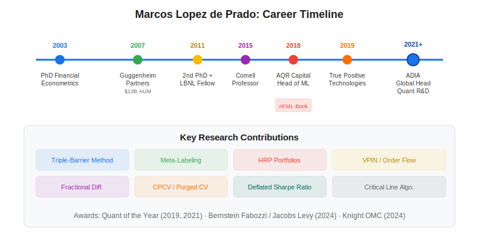
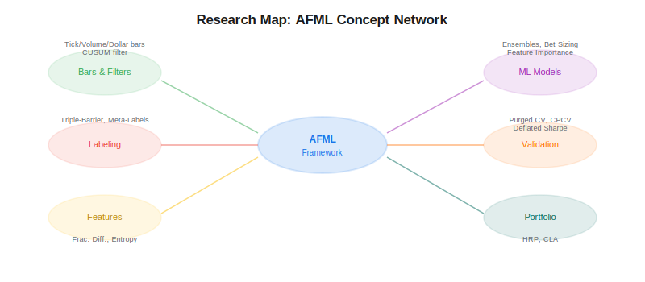

Marcos Lopez de Prado is a hedge fund manager, inventor, and professor who has pioneered the application of machine learning to quantitative finance over the past 25 years. He currently serves as Global Head of Quantitative R&D at the Abu Dhabi Investment Authority (ADIA), one of the world's largest sovereign wealth funds, and holds a visiting professorship at Cornell University's College of Engineering. SSRN ranks him among the 10 most-read authors in Economics, and his book *Advances in Financial Machine Learning* (Wiley, 2018) has become the standard graduate-level reference for applying ML to trading.

## Career Overview

Lopez de Prado's career spans academic research, hedge fund management, patent licensing, and government advisory roles. He earned two PhDs from Universidad Complutense de Madrid — one in financial econometrics (2003) and a second in mathematical finance (2011) — and completed post-doctoral research at Harvard University and Cornell University.

### Guggenheim Partners

As a Senior Managing Director at Guggenheim Partners, Lopez de Prado founded and led the Quantitative Investment Strategies business, where he managed approximately $13 billion in assets. During this period, his team delivered an audited information ratio of 2.3 — a remarkable risk-adjusted performance metric indicating consistent alpha generation relative to portfolio risk.

### AQR Capital Management

He joined AQR Capital Management as a Partner and became the firm's first Head of Machine Learning. At AQR, he advanced the integration of ML methods into one of the world's largest quantitative investment firms.

### True Positive Technologies

After AQR, Lopez de Prado founded True Positive Technologies (TPT), a firm that researches and develops investment intellectual property. TPT advised clients with a combined AUM exceeding $1 trillion and licensed several patents to major investment funds in eight-figure dollar transactions.

### Abu Dhabi Investment Authority (ADIA)

He currently serves as Global Head of Quantitative R&D at ADIA and is a founding board member of ADIA Lab, Abu Dhabi's center for research in data and computational sciences. Concurrently, he has been a research fellow at Lawrence Berkeley National Laboratory (U.S. Department of Energy) since 2011.

## Key Research Contributions

Lopez de Prado's research spans data structuring, labeling, feature engineering, ML modeling, backtesting validation, and portfolio optimization. His AFML framework has become a comprehensive pipeline for building ML-driven trading systems.

### Data Structuring: Alternative Bars

Traditional financial data is sampled at fixed time intervals (1-minute, daily), which introduces statistical problems like heteroscedasticity and serial correlation. Lopez de Prado introduced information-driven bar types — [tick imbalance bars](https://paperswithbacktest.com/wiki/tick-imbalance-bars-tibs), volume bars, and dollar bars — that sample data when a certain amount of market activity has occurred, producing more statistically well-behaved time series.

### Labeling: Triple-Barrier Method and Meta-Labeling

The [triple-barrier method](https://paperswithbacktest.com/wiki/triple-barrier-method) labels trades using profit-taking, stop-loss, and time-expiry barriers rather than fixed-horizon returns. This produces training labels that reflect real trading outcomes. [Meta-labeling](https://paperswithbacktest.com/wiki/meta-labeling) extends this by separating the question of *which direction to trade* from *whether to act on a signal*, using a secondary ML model to filter and size positions.

### Feature Engineering: Fractional Differentiation and Entropy

[Fractional differentiation](https://paperswithbacktest.com/wiki/fractional-differentiation) preserves memory in time series while achieving stationarity — a requirement for most ML models. Unlike integer differencing (which destroys long-range dependencies), fractional differencing with parameter $d \in (0, 1)$ retains predictive information. Lopez de Prado also introduced [entropy-based features](https://paperswithbacktest.com/wiki/entropy-features) for capturing the information content of financial series.

### Backtesting: Purged Cross-Validation and the Deflated Sharpe Ratio

Standard k-fold cross-validation leaks information when applied to financial time series because of overlapping labels. [Purged k-fold cross-validation](https://paperswithbacktest.com/wiki/purged-k-fold-cross-validation) removes training samples that are temporally close to test samples. [Combinatorial Purged Cross-Validation (CPCV)](https://paperswithbacktest.com/wiki/combinatorial-purged-cross-validation-cpcv) generalizes this to produce multiple backtest paths, enabling the estimation of backtest overfitting probability. The [Probabilistic Sharpe Ratio](https://paperswithbacktest.com/wiki/probabilistic-sharpe-ratio-psr) accounts for the non-normality of returns when evaluating strategy performance.

### Portfolio Optimization: HRP and CLA

[Hierarchical Risk Parity (HRP)](https://paperswithbacktest.com/wiki/hierarchical-risk-parity-hrp) uses hierarchical clustering to build portfolios that are more diversified and stable than mean-variance optimization. The [Critical Line Algorithm](https://paperswithbacktest.com/wiki/critical-line-algorithm-cla) is an exact method for tracing the entire efficient frontier, implemented in popular Python libraries like PyPortfolioOpt.

### Market Microstructure: VPIN

Together with Easley and O'Hara, Lopez de Prado developed [VPIN](https://paperswithbacktest.com/wiki/vpin-volume-synchronized-probability-informed-trading), a real-time metric for measuring order flow toxicity. VPIN famously signaled the 2010 Flash Crash hours before it occurred and is now widely used by market makers and regulators.

## Publications and Books

Lopez de Prado has published over 100 scientific articles in leading academic journals and is a founding co-editor of *The Journal of Financial Data Science*. His major books include:

| Book | Publisher | Year | Focus |
|---|---|---|---|
| *Advances in Financial Machine Learning* | Wiley | 2018 | Full ML pipeline for trading: data, features, models, backtesting |
| *Machine Learning for Asset Managers* | Cambridge University Press | 2020 | Clustering, feature importance, and portfolio construction for asset management |
| *Causal Factor Investing* | Cambridge University Press | 2023 | Causal inference methods for factor investing |

*Advances in Financial Machine Learning* is particularly influential — it introduced concepts like the triple-barrier method, meta-labeling, fractional differentiation, purged cross-validation, and HRP to a broad audience, and spawned open-source libraries like `mlfinlab` and integrations into `PyPortfolioOpt`.

## Awards and Recognition

Lopez de Prado has received numerous awards across academia and industry:

- **National Award for Academic Excellence** (1999) — Kingdom of Spain
- **Quant Researcher of the Year** (2019) — Portfolio Management Research
- **Buy-Side Quant of the Year** (2021) — Risk.net (jointly with Alex Lipton)
- **Bernstein Fabozzi / Jacobs Levy Award** (2024) — The Journal of Portfolio Management
- **Knight Officer of the Royal Order of Civil Merit (OMC)** (2024) — Kingdom of Spain, for distinguished services to science and the global investment industry

He holds an Erdős number of 2 (via Neil Calkin) and an Einstein number of 4 according to the American Mathematical Society. The U.S. Congress has invited him to testify on AI policy, and he is the named inventor on multiple patents related to algorithmic trading and Monte Carlo backtesting.

## Impact on Algorithmic Trading

Lopez de Prado's work has reshaped how quantitative practitioners approach ML in finance. Before AFML, most quant teams applied off-the-shelf ML models to financial data with little regard for the unique statistical properties of markets — overlapping labels, non-stationarity, multiple testing, and regime changes. His framework provides a disciplined pipeline that addresses each of these challenges systematically.

The concepts he introduced are now implemented in widely used open-source libraries and adopted at some of the largest investment firms globally. For practitioners looking to build robust, ML-driven [systematic trading strategies](https://paperswithbacktest.com/wiki/systematic-trading-strategies), his research provides both the theoretical foundation and practical tools.

## Conclusion

Marcos Lopez de Prado stands at the intersection of academic rigor and practical hedge fund management. His contributions — from data structuring with alternative bars to portfolio construction with HRP — form a coherent, end-to-end framework for applying machine learning to finance. Whether you are a student entering quant finance or a professional upgrading your ML pipeline, his research and books are essential reading.

---

**Explore further on PapersWithBacktest:**
- Browse [backtested ML-driven strategies](https://paperswithbacktest.com/strategies) with Python code and performance metrics
- Access [clean historical market data](https://paperswithbacktest.com/datasets) for equities, crypto, and futures
- Take the [algo trading course](https://paperswithbacktest.com/course) — 60+ video lessons and notebooks
- Related wiki pages: [Triple-Barrier Method](https://paperswithbacktest.com/wiki/triple-barrier-method) · [Hierarchical Risk Parity (HRP)](https://paperswithbacktest.com/wiki/hierarchical-risk-parity-hrp) · [Jim Simons Trading Strategy](https://paperswithbacktest.com/wiki/jim-simons-trading-strategy)
