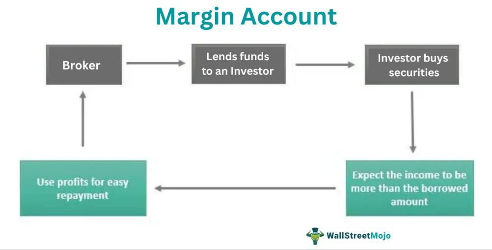

Investment finance encompasses a wide array of tools and strategies, serving both novice investors and experienced traders. Key components within this field are margin accounts and algorithmic trading. This article examines how these two elements intersect to create opportunities and challenges for investors.

Margin accounts and algorithmic trading have become fundamental in the pursuit of enhanced leverage and optimized trading strategies. Margin accounts allow investors to borrow funds from brokers to purchase securities, effectively providing leverage. This capability can significantly amplify purchasing power, enabling investors to seize larger opportunities than would be possible with only their equity.

On the other hand, algorithmic trading employs complex algorithms to automate trading decisions and execution based on predefined criteria. It offers several advantages, including reduced human error and improved transaction efficiency, allowing traders to capitalize on patterns and trends across financial markets at high speeds. 

When combined, margin accounts and algorithmic trading form a potent synergy, offering substantial profit potential while introducing significant risks. Investors leveraging these tools must navigate both the mechanics and challenges intrinsic to them. This article intends to explore the fundamentals, advantages, and pitfalls associated with integrating margin accounts and algorithmic trading, aiming to equip investors with the knowledge to harness these powerful financial instruments responsibly and effectively.

## Table of Contents

## Understanding Margin Accounts

A margin account is a brokerage account through which investors can borrow funds from a broker to purchase financial securities. This borrowing mechanism leverages the capital available to the investor, allowing them to buy more securities than they could with their available cash alone. The fundamental principle behind margin accounts is the use of borrowed money to amplify potential investment returns. However, this strategy involves paying interest on the borrowed funds and thus incurs additional costs.

To understand how margin accounts function, consider the following example: suppose an investor has $5,000 in a brokerage account but wishes to purchase $10,000 worth of stocks. By using a margin account, the investor can borrow the remaining $5,000 from their broker to facilitate this transaction. The securities purchased on margin typically serve as collateral for the loan. As a result, the investor's total purchasing power increases, enhancing the potential for larger profits.

Margin accounts come with distinct usage scenarios. They are particularly advantageous in bullish markets where the likelihood of securities appreciating in value is high. In such cases, the increased purchasing power offered by margin can significantly increase profit margins. For instance, if the stock purchased doubles in value, the investor not only recuperates their initial investment but also realizes additional profits from the leveraged portion facilitated by the margin loan.

However, opting for margin accounts introduces substantial risks. One primary concern is the margin call—a demand from the broker for the investor to deposit additional funds or securities to maintain the minimum required margin. This situation arises when the value of the securities purchased with borrowed funds drops significantly, potentially leading to losses that exceed the initial investment. For example, if the value of the securities plummets, the investor may need to pay back the borrowed funds even if the collateral's value is insufficient to cover the loan.

Investors must understand the cost structure associated with margin accounts, which typically includes interest rates on borrowed funds. These costs can accumulate over time, affecting the overall profitability of the investment. Additionally, brokers may require a certain percentage of equity in the margin account, known as the maintenance margin, to safeguard against potential losses. 

In summary, margin accounts offer a powerful means for investors to expand their investment positions through leverage, enabling potentially higher returns in favorable market conditions. Still, they also require prudent risk management and understanding of borrowing costs to mitigate significant financial losses.

 to Algorithmic Trading

Algorithmic trading, a cornerstone of modern financial markets, employs sophisticated computer algorithms to execute trades automatically based on pre-defined criteria. This method leverages technology to identify market patterns and make trading decisions, potentially reducing the time and effort required by human traders.

Traders utilize a variety of algorithms to automate the trading process. These algorithms can be designed to detect trends, [arbitrage](/wiki/arbitrage) opportunities, and execute trades at optimal prices and times. Among the primary strategies in [algorithmic trading](/wiki/algorithmic-trading) are high-frequency trading ([HFT](/wiki/high-frequency-trading-strategies)) and [statistical arbitrage](/wiki/statistical-arbitrage).

High-frequency trading involves executing a large number of trades at extremely fast speeds. HFT firms often set benchmarks based on milliseconds or even microseconds. These trades are executed rapidly to capitalize on short-lived market inefficiencies or slight discrepancies in the pricing of assets. The speed and efficiency of HFT can provide substantial profit opportunities but require significant technological investment.

Statistical arbitrage, another key strategy, relies on quantitative analysis to identify mispricings in securities. It uses model-driven approaches to predict and exploit market inefficiencies. Traders using statistical arbitrage might conduct pairs trading, where they simultaneously buy and sell two related securities expected to return to a historical price pattern, profiting from the correction.

The advantages of algorithmic trading include increased efficiency and reduced human error. Automated execution minimizes the impact of emotional and psychological biases that often affect human traders. Additionally, algorithms can process complex mathematical models and large datasets far quicker than a human, enabling the exploitation of fleeting trading opportunities.

Despite these benefits, there are challenges associated with algorithmic trading. The complexity of developing and maintaining sophisticated algorithms requires specialized skills and resources. Additionally, the reliance on technology poses risks related to system failures or unforeseen disruptions in trading infrastructure. Market conditions can change rapidly, and algorithms, lacking the nuance of human intuition, may react unfavorably in volatile environments.

Overall, algorithmic trading has transformed financial markets by enhancing efficiency and execution accuracy. However, its complexity and reliance on robust technology necessitate careful consideration and continuous adaptation to remain effective.

## Integrating Margin Accounts with Algorithmic Trading

Integrating margin accounts with algorithmic trading presents an opportunity to enhance trading effectiveness and potential returns. By leveraging the computational power of algorithmic systems, traders can program strategies to optimize the use of margin accounts, thereby efficiently managing leverage and associated risk.

A margin account amplifies purchasing power, providing traders the ability to execute larger positions than their capital might otherwise allow. Incorporating this into algorithmic trading strategies can significantly enhance profit potential, provided that the risks are carefully managed. Algorithmic systems can be designed to monitor market conditions in real-time, promptly executing trades based on precise, pre-defined criteria. This eliminates emotional bias and human error, which are common in manual trading.

One strategic advantage of integrating margin accounts with algorithmic trading is the ability to take advantage of fleeting market opportunities through high-frequency trading (HFT). Algorithms are capable of executing thousands of trades per second, rapidly seizing arbitrage opportunities or responding to market movements faster than any human could act. This speed is crucial in highly competitive trading environments, where profit margins per trade can be razor-thin.

Real-world examples illustrate the potential benefits of this integration. Consider a [hedge fund](/wiki/hedge-fund-trading-strategies) deploying an algorithm that capitalizes on small price discrepancies across different exchanges, using the leverage provided by margin accounts. By trading on margin, the algorithm increases the size of its positions, thus magnifying the profits from each successful arbitrage opportunity.

However, leveraging margin accounts within algorithmic trading also presents significant risks. While the potential for high returns is attractive, the corresponding increase in potential losses cannot be ignored. Algorithms optimized for leveraged trading must incorporate robust risk management protocols. For example, automatic stop-loss orders can be integrated into trading algorithms to limit potential losses under adverse conditions. Moreover, stringent monitoring systems should be in place to detect and respond to margin calls, which occur when the equity in the margin account falls below a certain threshold due to accumulated losses.

Additionally, the complex nature of algorithmic trading presents technological challenges. Systems must be reliable and capable of handling the vast amounts of data processed in real-time trading scenarios. The risk of system failures, whether due to programming errors or hardware issues, can lead to significant financial losses if not proactively mitigated.

Regulatory considerations also play a crucial role in this integration. Traders must ensure compliance with financial regulations governing margin trading and automated trading systems, which can vary significantly across jurisdictions.

To achieve sustainable success, traders integrating margin accounts with algorithmic trading should adhere to best practices, including maintaining a robust and adaptable trading strategy, continuously evaluating risk parameters, and conducting thorough [backtesting](/wiki/backtesting) of algorithms under various market conditions. This disciplined approach will help in harnessing the benefits of such a powerful combination while effectively mitigating the inherent risks.

## Risks and Challenges

Margin trading, while offering the promise of enhanced returns, significantly increases the potential risks. The primary risk stems from the amplified effect on both profits and losses. This necessitates meticulous risk assessment, as the leverage involved can lead to situations where losses exceed the initial investment, resulting in margin calls. A margin call occurs when the value of the investor's margin account falls below the broker's required amount, compelling the investor to either deposit additional funds or sell off assets to cover the shortfall.

Algorithmic trading, on the other hand, introduces additional layers of complexity and risk. One of the most prominent challenges is susceptibility to technological failures. These can range from hardware malfunctions to software bugs that disrupt the trading process. Moreover, unforeseen market conditions, such as flash crashes or extreme [volatility](/wiki/volatility-trading-strategies), can exacerbate these risks. Algorithm-driven trades occur at high speeds, and if the algorithms are not designed to handle sudden market shifts, they could trigger significant financial losses. For instance, poorly programmed algorithms may fail to have the necessary stop-loss mechanisms in place, leading to unchecked losses during unexpected market changes.

The combination of margin accounts and algorithmic trading requires careful consideration of regulatory and ethical issues as well. The regulatory landscape surrounding such trading strategies is complex, with market authorities imposing stringent rules to ensure fair and transparent trading practices. For example, the use of high-frequency trading algorithms must comply with regulations to prevent market manipulation and unfair advantages. Ethically, traders must ensure that their use of algorithms does not lead to actions that would be considered unscrupulous or harmful to the stability of the market.

To mitigate these risks, investors and traders should adopt robust risk management strategies. These include setting stringent stop-loss and take-profit levels, conducting regular audits of the trading algorithms, and maintaining adequate capital reserves to meet any margin requirements. Additionally, employing real-time monitoring systems can help detect and rectify potential failures or inefficiencies in the trading algorithms promptly.

In summary, while the integration of margin accounts with algorithmic trading can offer substantial financial benefits, it is associated with significant risks. By understanding these risks and implementing comprehensive risk management practices, investors can better navigate the complexities of this advanced trading strategy.

## Conclusion

Margin accounts and algorithmic trading offer powerful tools for enhancing investment opportunities. By combining these strategies, investors can pursue greater returns while increasing efficiency. However, successfully leveraging these tools requires a comprehensive understanding of their mechanics and inherent risks. Margin accounts enable investors to borrow funds, providing increased purchasing power and potential profit amplification. Yet, they also introduce the risk of magnified losses and margin calls, particularly during volatile market conditions.

Algorithmic trading, which automates trade execution based on preset criteria, reduces human error and improves speed. Despite these benefits, it remains susceptible to technological glitches and unforeseen market shifts. The integration of margin accounts and algorithmic trading requires meticulous risk management and strategic planning to optimize potential gains without overextending the leverage.

Investors must carefully consider the high returns these tools can generate against their potential risks. Developing robust trading strategies, informed by continuous learning and adjustment to new market dynamics, is crucial for sustainable success. In an ever-evolving financial landscape, adaptability and a thorough grasp of trading mechanisms remain vital for maintaining a competitive edge.

## References & Further Reading

[1]: Bergstra, J., Bardenet, R., Bengio, Y., & Kégl, B. (2011). ["Algorithms for Hyper-Parameter Optimization."](https://papers.nips.cc/paper/4443-algorithms-for-hyper-parameter-optimization) Advances in Neural Information Processing Systems 24.

[2]: ["Advances in Financial Machine Learning"](https://www.amazon.com/Advances-Financial-Machine-Learning-Marcos/dp/1119482089) by Marcos Lopez de Prado

[3]: ["Evidence-Based Technical Analysis: Applying the Scientific Method and Statistical Inference to Trading Signals"](https://www.semanticscholar.org/paper/Evidence-Based-Technical-Analysis%3A-Applying-the-and-Aronson/3b33df8737f1772e9e14d66a08c9696f140a2ee1) by David Aronson

[4]: ["Machine Learning for Algorithmic Trading"](https://github.com/PacktPublishing/Machine-Learning-for-Algorithmic-Trading-Second-Edition) by Stefan Jansen

[5]: ["Quantitative Trading: How to Build Your Own Algorithmic Trading Business"](https://books.google.com/books/about/Quantitative_Trading.html?id=j70yEAAAQBAJ) by Ernest P. Chan