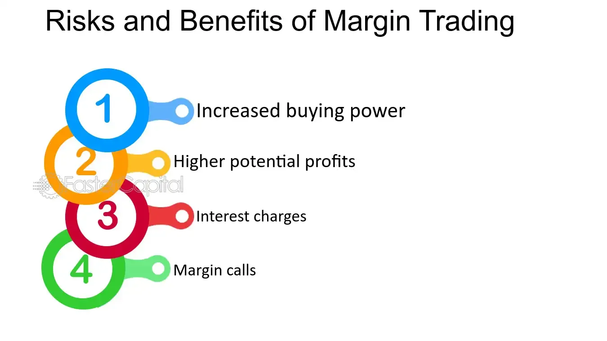

## Table of Contents

## What is margin buying?

Margin buying is when you borrow money from your broker to buy stocks or other investments. You use the money in your brokerage account as collateral for the loan. This lets you buy more stocks than you could with just your own money. It's like using a credit card to buy something you can't fully pay for right now.

When you use margin, you can make more money if your investments go up in value. But it's risky because if your investments go down, you could lose more than you started with. You also have to pay interest on the money you borrow. If your investments drop too much, your broker might ask you to add more money to your account or sell some of your investments to cover the loan.

## How does margin buying work?

Margin buying is when you borrow money from your broker to buy more stocks than you could afford with just your own money. You use the cash and stocks in your brokerage account as a kind of guarantee for the loan. This lets you buy more shares, which can lead to bigger profits if the stock price goes up. But remember, you have to pay interest on the borrowed money, just like you do with a credit card.

If the stocks you buy with borrowed money go up in value, you can make more money than if you had only used your own cash. But it's risky because if the stock prices go down, you could lose more than you started with. If your investments drop too much, your broker might make you put more money into your account or sell some of your stocks to pay back the loan. This is called a margin call, and it can happen quickly if the market moves against you.

## What are the basic requirements to start margin buying?

To start margin buying, you need to have a margin account with a brokerage firm. This is different from a regular cash account because it lets you borrow money to buy stocks. You'll need to apply for a margin account, and the brokerage will check your financial situation to see if you qualify. They'll look at things like your income, your other investments, and how much money you have in your account.

Once you have a margin account, you need to meet the minimum equity requirement. This means you need to have a certain amount of money in your account before you can start borrowing. The usual minimum is $2,000, but it can be different depending on the brokerage. After you meet this requirement, you can start using margin to buy stocks, but remember you'll have to pay interest on the money you borrow.

## What are the different methods of margin buying?

One way to use margin buying is through a standard margin account. With this method, you can borrow up to 50% of the cost of the stocks you want to buy. For example, if you want to buy $10,000 worth of stocks, you can use $5,000 of your own money and borrow the other $5,000 from your broker. You'll need to keep a certain amount of money in your account, called the maintenance margin, to make sure you can cover the loan if the stock prices drop.

Another method is using portfolio margin. This is more complicated and is usually for experienced traders. With portfolio margin, the amount you can borrow is based on the overall risk of your entire investment portfolio, not just the individual stocks. This can let you borrow more money, but it's riskier because the margin requirements can change quickly depending on how the market moves. Both methods require you to pay interest on the money you borrow, and you need to be careful because if your investments go down, you might have to add more money to your account or sell some of your stocks to cover the loan.

## What are the potential benefits of margin buying?

Margin buying can help you make more money if the stocks you buy go up in value. When you use margin, you can buy more stocks than you could with just your own money. This means if the stock price goes up, you can make a bigger profit because you own more shares. It's like using a lever to lift something heavy; you can move more with less effort. This is called leverage, and it can make your investments grow faster.

But remember, margin buying also comes with risks. If the stock prices go down, you could lose more money than you started with. You have to pay interest on the money you borrow, which can add up over time. If your investments drop too much, your broker might ask you to add more money to your account or sell some of your stocks to cover the loan. This is called a margin call, and it can happen quickly if the market moves against you. So, while margin buying can help you make more money, it's important to be careful and understand the risks.

## What are the risks associated with margin buying?

Margin buying can be risky because you're borrowing money to buy stocks. If the stock prices go down, you could lose more money than you started with. This is because you still have to pay back the loan, even if your investments lose value. If your stocks drop too much, your broker might ask you to add more money to your account or sell some of your stocks to cover the loan. This is called a margin call, and it can happen quickly if the market moves against you.

Another risk is that you have to pay interest on the money you borrow. This can add up over time and eat into your profits. If the interest rates go up, it can make margin buying even more expensive. Also, using margin can make you feel more confident and take bigger risks, which can lead to bigger losses if things don't go your way. So, while margin buying can help you make more money, it's important to be careful and understand the risks.

## How can one manage the risks of margin buying?

To manage the risks of margin buying, it's important to be careful and not borrow too much money. Only use margin for investments you really believe in and have done a lot of research on. Don't use all your money to buy stocks on margin; keep some cash in your account to cover any losses. This way, if the stock prices go down, you can still pay back the loan without selling your stocks at a loss.

Another way to manage risk is to keep an eye on your investments and the market. If the stock prices start to drop, you might need to add more money to your account or sell some stocks to avoid a margin call. It's also a good idea to set stop-loss orders, which automatically sell your stocks if they drop to a certain price. This can help limit your losses. Remember, you have to pay interest on the money you borrow, so make sure the potential profits from your investments are worth the cost of borrowing.

## What are margin calls and how do they impact margin buying?

A margin call happens when the value of your stocks bought on margin drops too much. When you use margin, you borrow money from your broker to buy stocks. If the stock prices go down, the value of your account goes down too. If it goes below a certain level, called the maintenance margin, your broker will ask you to put more money into your account or sell some of your stocks to cover the loan. This is called a margin call.

Margin calls can be a big problem for people using margin to buy stocks. If you get a margin call, you have to act fast. You might need to add more money to your account right away, which can be hard if you don't have extra cash. Or, you might have to sell your stocks at a loss to pay back the loan. This can make your losses even bigger because you're selling stocks when their prices are low. So, margin calls can make margin buying risky and can lead to big losses if the market goes against you.

## How does margin buying affect overall investment strategy?

Margin buying can change your overall investment strategy by letting you buy more stocks than you could with just your own money. This means you can make bigger profits if the stock prices go up. It's like using a lever to lift something heavy; you can move more with less effort. This is called leverage, and it can make your investments grow faster. But you have to be careful because if the stock prices go down, you could lose more money than you started with. You also have to pay interest on the money you borrow, which can add up over time.

Because of these risks, margin buying can make you think differently about your investments. You might be more careful about which stocks you buy and how much you borrow. You'll need to keep an eye on the market and be ready to add more money to your account or sell some stocks if you get a margin call. This can make your investment strategy more active and focused on managing risk. So, while margin buying can help you make more money, it's important to understand the risks and plan your strategy carefully.

## What are the tax implications of margin buying?

When you use margin buying, it can affect your taxes in a few ways. If you make money from selling stocks you bought on margin, you'll have to pay capital gains tax on your profits. The tax rate depends on how long you held the stocks. If you held them for less than a year, it's a short-term capital gain, and you'll pay your regular income tax rate. If you held them for more than a year, it's a long-term capital gain, and the tax rate is usually lower.

On the other hand, if you lose money on stocks bought with margin, you might be able to use those losses to lower your taxes. You can use these losses to offset any capital gains you made during the year. If your losses are more than your gains, you can use up to $3,000 of the extra loss to reduce your regular income. Any remaining loss can be carried over to future years. Remember, the interest you pay on the money you borrow for margin buying is not tax-deductible for most people, so it's something to think about when planning your investments.

## How do interest rates affect margin buying?

Interest rates play a big role in margin buying. When you use margin, you're borrowing money from your broker to buy stocks. The [interest rate](/wiki/interest-rate-trading-strategies) is what you pay for borrowing that money. If interest rates go up, it costs you more to borrow, which can eat into your profits. For example, if you're making money from your stocks but the interest you're paying is high, you might not make as much as you hoped.

On the other hand, if interest rates are low, borrowing money on margin becomes cheaper. This can make margin buying more attractive because you're paying less to use the broker's money. But remember, even if interest rates are low, margin buying is still risky. If the stock prices go down, you could lose more money than you started with, no matter how low the interest rate is. So, it's important to think about interest rates when deciding whether to use margin, but also to be careful and understand the risks.

## What advanced strategies can be used with margin buying to maximize returns?

One advanced strategy for margin buying is called "margin trading with options." This means you use margin to buy options, which are contracts that give you the right to buy or sell a stock at a certain price. Options can be cheaper than buying stocks outright, so you can use margin to buy more options and potentially make bigger profits if the stock moves in the right direction. But options are also riskier because they can expire worthless if the stock doesn't move as expected. So, you need to be careful and understand how options work before using this strategy.

Another strategy is "short selling with margin." Short selling is when you borrow stocks from your broker and sell them, hoping to buy them back later at a lower price to make a profit. When you use margin to short sell, you can borrow more stocks than you could with just your own money. This can lead to bigger profits if the stock price goes down. But if the stock price goes up instead, you could lose a lot of money because you have to buy back the stocks at a higher price. Short selling with margin is very risky and not for everyone, so make sure you know what you're doing before trying it.

## What are the risks and rewards of margin buying?

Margin buying, a strategy that uses borrowed funds to purchase securities, can offer lucrative returns if investments perform well. This leverage allows investors to acquire more significant positions than they could with their cash alone, essentially magnifying potential profits. For instance, an investor using $10,000 in cash, along with a $10,000 margin loan from a broker, can purchase $20,000 worth of securities. If the asset value rises by 10%, the investor gains $2,000, a 20% return on their initial $10,000 cash, effectively doubling the profit potential.

However, this amplification works both ways and introduces considerable risks. If the market shifts unfavorably, losses can exceed the initial investment, a critical aspect that investors must understand before leveraging margin buying. The inherent dangers of margin buying are especially apparent during market downturns. For example, consider the same scenario where the investment's value decreases by 10%. The investor would incur a loss of $2,000, equating to a 20% loss on their original equity, underscoring how quickly margin buying can generate losses.

Key to managing margin buying's risks is understanding margin calls. A margin call occurs when an investor's equity falls below the broker's required maintenance margin. Brokers can then demand the deposit of additional funds or securities to restore the account to the minimum requirement. Failure to meet margin calls can lead to the forced selling of assets at potentially unfavorable prices, compounding financial losses.

The formula for the maintenance margin requirement can be expressed as:

$$
\text{Maintenance Margin} = \frac{\text{Market Value} \times \text{Maintenance Requirement \%}}{1 - \text{Maintenance Requirement \%}}
$$

For instance, if the maintenance requirement is 30% and the market value of securities is $20,000, the investor's equity must be at least $6,000 to satisfy the margin call. If the equity falls below this threshold, the broker may sell securities until the account is adequately covered.

To mitigate these risks, investors should maintain a disciplined approach, utilizing stop-loss orders to limit potential losses. Additionally, continuous monitoring of market conditions and account balances is vital to anticipating margin calls and taking preventive actions. By maintaining awareness and preparing for adverse scenarios, investors can balance the rewards of margin buying with its inherent risks more effectively.

 to Algorithmic Trading

Algorithmic trading, also known as algo trading, is a method of executing trades using pre-programmed instructions or algorithms, accounting for variables such as timing, price, and [volume](/wiki/volume-trading-strategy). The essence of algo trading lies in its ability to leverage computational power and advanced algorithms to conduct complex trading strategies with precision and speed, far beyond human capability.

At its core, [algorithmic trading](/wiki/algorithmic-trading) eliminates the emotional component from trading by relying solely on pre-defined rules and criteria. Traders or institutions design algorithms to capitalize on specific market conditions and automatically execute trades once conditions are met. These algorithms are written using programming languages such as Python, R, or C++, utilizing libraries that support financial data operations and [machine learning](/wiki/machine-learning) models.

For example, consider a simple moving average crossover strategy, where a trade is executed when a shorter period moving average crosses over a longer period one. In Python, this could be implemented using the following code snippet:

```python
import pandas as pd

def moving_average_strategy(prices, short_window, long_window):
    signals = pd.DataFrame(index=prices.index)
    signals['price'] = prices
    signals['short_mavg'] = prices.rolling(window=short_window, min_periods=1).mean()
    signals['long_mavg'] = prices.rolling(window=long_window, min_periods=1).mean()
    signals['signal'] = 0.0

    # Create the buy signal
    signals['signal'][short_window:] = np.where(
        signals['short_mavg'][short_window:] > signals['long_mavg'][short_window:], 1.0, 0.0
    )

    # Generate trading orders
    signals['positions'] = signals['signal'].diff()

    return signals
```

The above code generates buy signals whenever the short-term moving average exceeds the long-term moving average, illustrating the simplicity of implementing algorithmic strategies with code.

The impact of algorithmic trading on financial markets is notable. It accounts for a significant portion of trading volumes on major exchanges, driven by its efficiency in executing large orders with minimal market impact, reducing transaction costs. It has democratized trading by making sophisticated strategies accessible to a broader range of investors, transcending traditional barriers of entry.

However, the rise of algorithmic trading has also introduced challenges, prominently, the risk of market disruptions due to algorithmic errors or system malfunctions, famously exemplified by the "flash crash" of 2010. The complexity and interconnectivity of algorithms can lead to unintended consequences when vast numbers of trades are executed in milliseconds without human oversight.

Despite these challenges, the evolution of algorithmic trading continues to drive innovation in financial markets, with advanced data analytics, machine learning, and [artificial intelligence](/wiki/ai-artificial-intelligence) shaping new frontiers. The potential to analyze vast datasets to determine predictive market signals is a promising development, further enhancing the strategic capabilities of algorithmic trading. As technology progresses, the role of human traders may increasingly pivot towards strategy development and system management, leveraging automation to achieve optimal market outcomes.

## References & Further Reading

[1]: ["Margin Trading: Opportunities and Risks"](https://www.fidelity.com/learning-center/trading-investing/trading/understanding-benefits-risks-margin) by FINRA

[2]: Aldridge, I. (2013). ["High-Frequency Trading: A Practical Guide to Algorithmic Strategies and Trading Systems"](https://www.amazon.com/High-Frequency-Trading-Practical-Algorithmic-Strategies/dp/1118343506), Wiley.

[3]: Johnson, B., Kindleberger, C., & Aliber, R. (2011). ["Manias, Panics, and Crashes: A History of Financial Crises"](https://archive.org/details/maniaspanicscras0000alib), Palgrave Macmillan.

[4]: Narang, R. K. (2013). ["Inside the Black Box: A Simple Guide to Quantitative and High-Frequency Trading"](https://onlinelibrary.wiley.com/doi/book/10.1002/9781118662717), Wiley.

[5]: ["Regulation T and Margin Accounts"](https://www.investopedia.com/terms/r/regulationt.asp) by U.S. Securities and Exchange Commission (SEC)