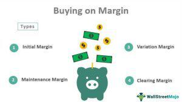

Navigating the investment landscape to achieve financial rewards often involves a multitude of strategies, each accompanied by inherent risks. Among these, margin buying and algorithmic trading, often referred to as algo trading, are particularly notable for their potential to enhance investment returns. Margin buying allows investors to leverage their existing capital by borrowing funds to purchase more securities, potentially multiplying profits. However, this strategy also magnifies losses, making it a double-edged sword.

Similarly, algorithmic trading has revolutionized the way trading is conducted, using sophisticated algorithms to execute transactions at remarkable speeds based on pre-set criteria. This approach minimizes human error and adds efficiency to trading operations. Despite their advantages, both strategies are fraught with unique challenges that can result in significant financial losses if not properly managed.



This article examines the complexities of margin buying and algorithmic trading, shedding light on the potential rewards they offer and the critical risks involved. Additionally, it discusses the best practices for effectively implementing these strategies in a dynamic market environment. Understanding the full spectrum of their risks and rewards is crucial for investors who aim to integrate these strategies into their financial toolkit.

## Table of Contents

## Understanding Margin Buying

Margin buying involves acquiring securities using funds borrowed from a brokerage firm, which allows investors to increase their purchasing power beyond their available cash. This method of investing is based on the principle of leverage, which means that the potential for both gains and losses is amplified. When an investor purchases securities on margin, they must adhere to specific financial obligations known as initial and maintenance margins.

**Initial and Maintenance Margins**

The concept of initial margin refers to the percentage of the total purchase price that an investor must pay with their own capital when initiating a margin purchase. According to regulations, such as those set by the Financial Industry Regulatory Authority (FINRA) in the United States, this figure is typically set at 50%. For example, if an investor wishes to purchase $10,000 worth of stock, they must contribute at least $5,000 from their own funds, while the other half can be financed with borrowed money.

Once the securities are purchased, investors are required to maintain a certain level of equity in their margin account, known as the maintenance margin. This is typically lower than the initial margin and serves as a buffer to protect the brokerage from potential losses should the value of the securities decline. FINRA mandates a minimum maintenance margin of 25%, meaning that at any given time, the investor's equity must constitute at least 25% of the market value of the securities.

**Financial Dynamics and Example**

To illustrate how margin buying works, consider an investor who buys 100 shares of a company at $100 per share, totaling $10,000. If they choose to use a margin account, they can pay $5,000 from their wallet and borrow the remaining $5,000 from their broker. If the stock's price rises to $120 per share, the total value of the investment increases to $12,000. After repaying the borrowed $5,000, the investor realizes a profit of $2,000 on their $5,000 initial investment, resulting in a 40% return. Without using margin, their return would have been 20%.

However, the leverage effect is a double-edged sword. If the stock price drops to $80 per share, the market value of the investment falls to $8,000. To ascertain if the investor still meets the maintenance margin requirement, they calculate their equity: $8,000 (total value) minus $5,000 (amount owed) equals $3,000, or 37.5% of the investment value. This exceeds the maintenance margin; however, if the stock price further declines to $66.67 per share, the equity percentage dips to 25%, triggering a margin call. The investor must either deposit additional funds or sell off portions of the stock to restore the margin account to the required level.

In summary, while margin buying enhances potential financial rewards, it also increases exposure to significant losses. It’s essential for investors to understand the mechanics of initial and maintenance margins to use this strategy effectively.

## The Risks and Rewards of Margin Buying

Margin buying, a strategy that uses borrowed funds to purchase securities, can offer lucrative returns if investments perform well. This leverage allows investors to acquire more significant positions than they could with their cash alone, essentially magnifying potential profits. For instance, an investor using $10,000 in cash, along with a $10,000 margin loan from a broker, can purchase $20,000 worth of securities. If the asset value rises by 10%, the investor gains $2,000, a 20% return on their initial $10,000 cash, effectively doubling the profit potential.

However, this amplification works both ways and introduces considerable risks. If the market shifts unfavorably, losses can exceed the initial investment, a critical aspect that investors must understand before leveraging margin buying. The inherent dangers of margin buying are especially apparent during market downturns. For example, consider the same scenario where the investment's value decreases by 10%. The investor would incur a loss of $2,000, equating to a 20% loss on their original equity, underscoring how quickly margin buying can generate losses.

Key to managing margin buying's risks is understanding margin calls. A margin call occurs when an investor's equity falls below the broker's required maintenance margin. Brokers can then demand the deposit of additional funds or securities to restore the account to the minimum requirement. Failure to meet margin calls can lead to the forced selling of assets at potentially unfavorable prices, compounding financial losses.

The formula for the maintenance margin requirement can be expressed as:

$$
\text{Maintenance Margin} = \frac{\text{Market Value} \times \text{Maintenance Requirement \%}}{1 - \text{Maintenance Requirement \%}}
$$

For instance, if the maintenance requirement is 30% and the market value of securities is $20,000, the investor's equity must be at least $6,000 to satisfy the margin call. If the equity falls below this threshold, the broker may sell securities until the account is adequately covered.

To mitigate these risks, investors should maintain a disciplined approach, utilizing stop-loss orders to limit potential losses. Additionally, continuous monitoring of market conditions and account balances is vital to anticipating margin calls and taking preventive actions. By maintaining awareness and preparing for adverse scenarios, investors can balance the rewards of margin buying with its inherent risks more effectively.

 to Algorithmic Trading

Algorithmic trading, also known as algo trading, is a method of executing trades using pre-programmed instructions or algorithms, accounting for variables such as timing, price, and [volume](/wiki/volume-trading-strategy). The essence of algo trading lies in its ability to leverage computational power and advanced algorithms to conduct complex trading strategies with precision and speed, far beyond human capability.

At its core, [algorithmic trading](/wiki/algorithmic-trading) eliminates the emotional component from trading by relying solely on pre-defined rules and criteria. Traders or institutions design algorithms to capitalize on specific market conditions and automatically execute trades once conditions are met. These algorithms are written using programming languages such as Python, R, or C++, utilizing libraries that support financial data operations and [machine learning](/wiki/machine-learning) models.

For example, consider a simple moving average crossover strategy, where a trade is executed when a shorter period moving average crosses over a longer period one. In Python, this could be implemented using the following code snippet:

```python
import pandas as pd

def moving_average_strategy(prices, short_window, long_window):
    signals = pd.DataFrame(index=prices.index)
    signals['price'] = prices
    signals['short_mavg'] = prices.rolling(window=short_window, min_periods=1).mean()
    signals['long_mavg'] = prices.rolling(window=long_window, min_periods=1).mean()
    signals['signal'] = 0.0

    # Create the buy signal
    signals['signal'][short_window:] = np.where(
        signals['short_mavg'][short_window:] > signals['long_mavg'][short_window:], 1.0, 0.0
    )

    # Generate trading orders
    signals['positions'] = signals['signal'].diff()

    return signals
```

The above code generates buy signals whenever the short-term moving average exceeds the long-term moving average, illustrating the simplicity of implementing algorithmic strategies with code.

The impact of algorithmic trading on financial markets is notable. It accounts for a significant portion of trading volumes on major exchanges, driven by its efficiency in executing large orders with minimal market impact, reducing transaction costs. It has democratized trading by making sophisticated strategies accessible to a broader range of investors, transcending traditional barriers of entry.

However, the rise of algorithmic trading has also introduced challenges, prominently, the risk of market disruptions due to algorithmic errors or system malfunctions, famously exemplified by the "flash crash" of 2010. The complexity and interconnectivity of algorithms can lead to unintended consequences when vast numbers of trades are executed in milliseconds without human oversight.

Despite these challenges, the evolution of algorithmic trading continues to drive innovation in financial markets, with advanced data analytics, machine learning, and [artificial intelligence](/wiki/ai-artificial-intelligence) shaping new frontiers. The potential to analyze vast datasets to determine predictive market signals is a promising development, further enhancing the strategic capabilities of algorithmic trading. As technology progresses, the role of human traders may increasingly pivot towards strategy development and system management, leveraging automation to achieve optimal market outcomes.

## Pros and Cons of Algo Trading

Algorithmic trading, or algo trading, provides several significant benefits that have transformed the financial markets. One of the primary advantages is the ability to execute trades at remarkable speeds. This rapid execution is made possible by precise algorithms that scan multiple markets and execute orders within fractions of a second, a capability far beyond human reach. Faster execution can lead to better pricing by capitalizing on fleeting opportunities not visible to slower, manual trading methods.

Additionally, algo trading significantly reduces transaction costs. Since computers handle the trading process, they minimize the need for manual oversight, reducing labor costs associated with human trading teams. Furthermore, through optimized order placement and execution strategies, algorithms can minimize market impact and slippage, which further curtails costs.

The elimination of human errors represents another advantage of algorithmic trading. Human traders can be subject to psychological biases, fatigue, and mistakes. Algorithms operate based on pre-defined criteria, ensuring consistent and emotion-free decision-making. This reliability helps maintain trading discipline and adheres precisely to the programmed strategy without deviation.

However, algorithmic trading is not without its drawbacks. Technological vulnerabilities pose significant risks. Trading platforms and algorithms rely heavily on robust technological infrastructure. Any system malfunction, connectivity issues, or software bugs can lead to unintended trading errors or service disruptions. Additionally, there is an ongoing threat of cyberattacks, which could compromise trading algorithms or sensitive financial data.

The potential for uncontrolled market impacts is another downside to algo trading. High-frequency trading, a subset of algorithmic trading, has been criticized for causing market [volatility](/wiki/volatility-trading-strategies) and contributing to incidents like the "Flash Crash" of 2010. When multiple algorithms independently initiate vast numbers of transactions simultaneously in reaction to market stimuli, it can lead to dramatic swings in market prices.

Moreover, algorithmic trading can exacerbate systemic risks as market participants increasingly rely on similar trading technologies and strategies. This uniformity could lead to synchronized responses among multiple traders, amplifying market movements and potentially leading to [liquidity](/wiki/liquidity-risk-premium) shortages.

In conclusion, while algorithmic trading offers efficiency and cost benefits, it also creates challenges in terms of technological reliability and market stability. Balancing these pros and cons is crucial for traders and market regulators aiming to exploit the advantages of algo trading while mitigating its risks.

## Combining Margin Buying with Algo Trading

Combining margin buying with algorithmic trading presents an intriguing investment strategy, as it merges the leverage potential of margin buying with the speed and precision of algorithmic trading. This combination increases the possibility of maximizing returns but also elevates the associated risks. Understanding how to effectively integrate these methods is crucial for traders seeking to enhance their investment strategy.

Margin buying allows investors to borrow funds from their brokerage to purchase more securities than they could with their available capital, thus amplifying potential returns. When incorporated with algorithmic trading, which automates trades based on pre-defined parameters, the two strategies can complement each other by leveraging borrowed capital more efficiently and executing trades rapidly, often benefiting from short-term market opportunities.

However, while this combination can enhance returns, it also inherently increases exposure to risk. To manage these effectively, traders should consider the following best practices:

1. **Algorithm Design and Testing**: Advance preparation with rigorous backtesting of algorithms is vital. This involves using historical data to simulate trading strategies, evaluating their performance, and making refinements to optimize outcomes. Traders need to ensure that the algorithms are well-designed to minimize the impact of any unpredictable market movements, especially when leverage is involved.

    ```python
    import numpy as np
    import pandas as pd

    def backtest_strategy(data, algorithm):
        results = []
        for index, row in data.iterrows():
            result = algorithm(row)
            results.append(result)
        return np.mean(results)

    # Example of a simple moving average algorithm
    def simple_moving_average(data_row):
        window = 5
        moving_avg = data_row['close'].rolling(window=window).mean()
        return moving_avg
    ```

2. **Robust Risk Assessment**: Given the heightened risk due to leverage, comprehensive risk assessment models that account for potential volatility shifts are essential. This includes scenario analyses and stress tests that prepare traders for adverse market conditions.

3. **Dynamic Margin Control**: Implementing dynamic margin control algorithms, which adjust trading positions based on real-time market data, helps in avoiding margin calls and corrective liquidations due to over-leveraging. Algorithms can be programmed to reduce exposures automatically as volatility increases.

4. **Risk Management Strategies**: Incorporating strict risk management strategies like stop-loss orders can mitigate losses. Setting thresholds on how much one is willing to lose on a particular position is crucial when trading with leverage.

5. **Leverage Limits**: To prevent excessive risk-taking, establish leverage limits within the trading algorithm. These serve to cap the amount of borrowed funds relative to the trader's equity.

As technology continues to evolve, the integration of sophisticated algorithms with leveraged strategies will shape the future of investing. Traders must maintain financial discipline and continually adapt their strategies in response to market trends and technological advancements to successfully navigate the complexities of combining margin buying with algorithmic trading.

## Risk Management Strategies

Effective risk management is crucial for investors engaging in margin buying and algorithmic trading. These strategies can magnify both potential gains and losses, necessitating a disciplined approach to safeguard investments. Below are practical techniques investors can employ:

### Stop-Loss Orders

Stop-loss orders are a vital tool for protecting investments from significant declines. By setting a predefined price level at which a security is sold, investors can limit potential losses. For instance, if an investor buys a stock at $100, they might set a stop-loss order at $90. This ensures the stock is automatically sold if its price falls to $90, capping the loss to a manageable level.

### Monitoring Market Conditions

Continuous market analysis is central to successful risk management. Investors should leverage financial news, economic indicators, and market trends to inform their decisions. Modern trading platforms offer real-time data analytics, enabling investors to adjust their strategies promptly in reaction to market movements.

### Financial Discipline

Maintaining financial discipline is imperative, particularly when using margin accounts. Investors must ensure they have sufficient capital to meet margin calls if their securities' value drops. Developing a comprehensive financial plan, including a buffer reserve, can help manage unexpected downturns.

### Leveraging Technology

Technological tools play a pivotal role in enhancing risk management. Automated systems can execute stop-loss orders without human intervention and provide real-time alerts about market changes. Algorithmic trading platforms equipped with machine learning capabilities can adapt to evolving market conditions and optimize trading strategies accordingly.

Python example for an automated trading strategy with stop-loss:

```python
import pandas as pd
from alphavantage_api import get_stock_data

def stop_loss_strategy(stock_symbol, initial_price, stop_loss_threshold):
    stock_data = get_stock_data(stock_symbol)
    for index, row in stock_data.iterrows():
        current_price = row['close']
        if current_price <= initial_price * (1 - stop_loss_threshold):
            print(f"Sell {stock_symbol} at {current_price}. Stop-loss triggered.")
            break
        else:
            print(f"Holding {stock_symbol}. Current price: {current_price}")

stop_loss_strategy('AAPL', 150, 0.1)  # Example trigger at 10% loss
```

### Continuous Evaluation

Investors should regularly assess their trading strategies and risk management practices. Reflecting on past trades, analyzing outcomes, and recalibrating strategies can help improve future performance. Using advanced data analytics tools for back-testing algorithmic strategies provides insights into potential risks and rewards under different market scenarios.

### Conclusion

Adhering to robust risk management practices allows investors to navigate the complexities of margin buying and algorithmic trading effectively. By harnessing technological advancements and maintaining financial discipline, investors can mitigate risks and capitalize on opportunities in ever-evolving financial markets.

## The Future of Investment Strategies

As technology progresses, the landscape of investment strategies is experiencing a substantial transformation, with algorithmic trading playing an increasingly pivotal role. The future of investment is characterized by an enhanced dependency on algorithmic strategies, which promise efficiency, precision, and a reduction in emotional bias that typically accompanies human decision-making.

One major trend is the integration of machine learning and artificial intelligence into trading algorithms. These technologies enable systems to learn from past data, recognize complex patterns, and adapt to changing market conditions with minimal human guidance. For example, sophisticated machine learning models are capable of analyzing vast datasets to predict stock movements, helping traders make more informed decisions. This predictive capability is likely to grow stronger as computational power increases and more historical data becomes available.

Furthermore, the rise of high-frequency trading ([HFT](/wiki/high-frequency-trading-strategies)) continues to shape the investment landscape. HFT uses complex algorithms to execute a large number of orders at extremely fast speeds. This high-speed trading method allows for the exploitation of small price discrepancies in the market, which can lead to significant cumulative profits. As communication technologies advance, traders with access to cutting-edge infrastructure will likely gain a competitive advantage by executing trades with minimal latency.

Blockchain and decentralized finance (DeFi) systems are also influencing investment strategies. These technologies are bringing transparency, security, and automation to transactions, reshaping traditional processes. Smart contracts, which execute transactions automatically when predefined conditions are met, are increasingly being utilized in trading to reduce the need for intermediaries and to streamline operations.

In preparing for these changes, traders must focus on building robust infrastructure that supports advanced algorithmic strategies. Staying informed about technological advancements and regulatory changes is crucial, as these factors will dictate the environment in which new strategies are developed and implemented. Continuous education and adaptation are key, as is the need to incorporate data science skills that are increasingly becoming a requirement in the finance sector.

Moreover, ethical considerations must be acknowledged, particularly regarding the potential for algorithmic biases and the impact of reduced human oversight. Ensuring that algorithms are transparent and accountable remains a critical challenge as investment strategies become more automated. 

Traders looking to stay ahead should invest in technology that supports agile adaptation, provides comprehensive data analytics, and ensures cybersecurity. By embracing these developments, the future of investing holds the promise of increased efficiencies and potentially higher returns, driven by innovation and strategic foresight.

## Conclusion

Margin buying and algorithmic trading offer investors significant potential for enhanced financial returns, provided they are approached with a comprehensive understanding of their inherent risks. Margin buying, by leveraging borrowed funds, enables investors to amplify their purchasing power but also magnifies potential losses. Algorithmic trading, on the other hand, utilizes advanced computational algorithms to execute trades with precision and speed, yet it is not without its vulnerabilities, such as the risk of technological failures and unanticipated market fluctuations.

Successful navigation of these investment strategies requires meticulous planning and effective risk management. Investors should develop a strong foundation in financial literacy and employ robust risk mitigation techniques. This involves setting appropriate stop-loss orders, continuously monitoring market conditions, and utilizing technology for real-time data analysis and decision-making.

Investors are encouraged to maintain financial discipline, ensuring that their exposure to high-risk investment strategies such as margin buying and algo trading is aligned with their risk tolerance and investment goals. By integrating these practices, investors can better protect their portfolios and optimize their potential returns.

As investment strategies continue to evolve with technological advancements, it is imperative for investors to stay informed about emerging trends in the financial markets. By embracing innovation while adhering to disciplined risk management principles, investors can capitalize on the benefits of margin buying and algorithmic trading, achieving balanced and sustainable investment growth.

## References & Further Reading

[1]: ["Margin Trading: Opportunities and Risks"](https://www.fidelity.com/learning-center/trading-investing/trading/understanding-benefits-risks-margin) by FINRA

[2]: Aldridge, I. (2013). ["High-Frequency Trading: A Practical Guide to Algorithmic Strategies and Trading Systems"](https://www.amazon.com/High-Frequency-Trading-Practical-Algorithmic-Strategies/dp/1118343506), Wiley.

[3]: Johnson, B., Kindleberger, C., & Aliber, R. (2011). ["Manias, Panics, and Crashes: A History of Financial Crises"](https://archive.org/details/maniaspanicscras0000alib), Palgrave Macmillan.

[4]: Narang, R. K. (2013). ["Inside the Black Box: A Simple Guide to Quantitative and High-Frequency Trading"](https://onlinelibrary.wiley.com/doi/book/10.1002/9781118662717), Wiley.

[5]: ["Regulation T and Margin Accounts"](https://www.investopedia.com/terms/r/regulationt.asp) by U.S. Securities and Exchange Commission (SEC)