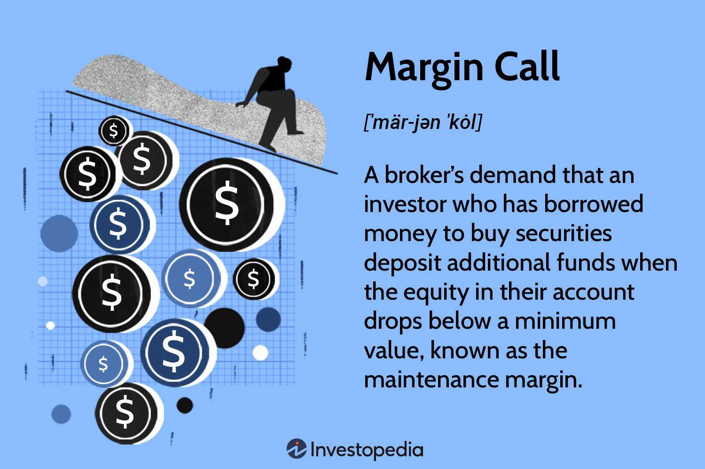

In investment finance, margin calls and algorithmic trading play a significant role, influencing trading strategies and risk management processes. A margin call occurs when a trading account's equity falls below the required maintenance level set by the brokerage, necessitating additional funds or securities to cover potential losses. This mechanism ensures that investors have enough equity to cover their positions, minimizing the risk to both broker and investor.

Algorithmic trading, on the other hand, has revolutionized the financial markets by utilizing mathematical models and computer programs to execute trades at high speeds and frequencies, far beyond human capability. This form of trading leverages vast data sets and advanced algorithms to make informed trading decisions, often incorporating real-time market conditions and pre-set risk parameters. These algorithms can also include margin considerations, dynamically adjusting strategies to prevent margin calls and optimize trade performance.



Understanding how margin calls intersect with algorithmic trading provides essential insights into modern investment practices. The ability to effectively manage margin calls through algorithmic adjustments and risk management strategies can significantly enhance trading performance, ensuring that portfolios are maintained according to both market conditions and individual risk tolerances. As financial markets continue to evolve, mastering these two critical concepts becomes indispensable for traders and investors aiming to succeed in a highly competitive environment.

## Table of Contents

## Understanding Margin Calls

A margin call occurs when the equity in a margin account falls below the broker's required maintenance margin. This situation typically arises when the value of securities bought on margin declines, triggering the broker to demand additional collateral in the form of funds or securities to bring the equity back up to the required level. The calculation of equity in a margin account can be expressed through the formula:

$$
\text{Equity} = \text{Value of securities} - \text{Amount borrowed}
$$

If this equity falls below the maintenance margin, a margin call is initiated. Brokers set their own maintenance margin requirements, but they are generally above the minimum set by regulatory bodies. In the United States, for example, the Financial Industry Regulatory Authority (FINRA) requires a minimum maintenance margin of 25% of the total market value of the securities in the margin account. However, most brokers demand a higher percentage, commonly around 30% to 40%.

Failing to meet a margin call can have severe consequences for investors. Brokers may liquidate part or all of an investor's portfolio to recover the borrowed funds, often selling the securities at current market prices, which may be unfavorable, especially during market downturns. This forced sale can lead to significant financial losses, exacerbating the negative impact of market downturns on the investor's portfolio.

To prevent margin calls, investors need to remain vigilant regarding the value of their securities and changes in market conditions. Monitoring the account's excess equity—the cushion an investor has above the maintenance margin—can help anticipate when additional funds may be required. Investors can use the formula for excess equity:

$$
\text{Excess Equity} = \text{Equity} - (\text{Maintenance Margin} \times \text{Market Value of Securities})
$$

Understanding the mechanics of margin accounts and the implications of margin calls is essential for anyone engaging in leveraged trading. This awareness helps in planning and implementing risk management strategies to protect investments from the volatile dynamics of margin trading.

## The Role of Maintenance Margin

Maintenance margin is a fundamental concept in trading that ensures the stability and integrity of margin accounts. This margin acts as a financial buffer against the fluctuations inherent in market activities, particularly when engaging in leveraged trading. Leveraged trading involves borrowing funds to increase the potential return on investment. However, this also magnifies potential losses, making it crucial to maintain a specified minimum equity level in a trading account.

The maintenance margin serves as a threshold, and when the account equity falls below this level, a margin call is triggered. Traders are then required to deposit additional funds or assets to restore the account's equity above the maintenance margin level. This requirement helps brokers and financial institutions mitigate the risk of loss due to adverse market movements.

For example, consider an investor with a margin account holding securities worth $10,000, with a maintenance margin requirement set at 25%. This means the investor must maintain at least $2,500 in equity within the account. If the value of the securities drops to $8,000, the equity becomes $1,000 (assuming the loan value remains constant at $7,000). This scenario triggers a margin call, as the equity ($1,000) is below the maintenance margin requirement ($2,500).

By adhering to maintenance margin requirements, traders can help safeguard their accounts from liquidation at disadvantageous prices. This not only protects their investments but also fosters more disciplined trading practices.

Incorporating maintenance margin considerations into trading algorithms can further optimize trading strategies. Algorithms can be programmed to monitor margin levels continuously and adjust trading activities accordingly to maintain the required equity cushion. Here is a basic Python snippet demonstrating how one might implement a check for maintenance margin within a trading algorithm:

```python
def check_margin(equity, loan_value, maintenance_margin_percentage):
    maintenance_margin = loan_value * maintenance_margin_percentage
    if equity < maintenance_margin:
        return "Margin Call Triggered"
    else:
        return "Margin Sufficient"

# Example usage:
equity = 1000
loan_value = 7000
maintenance_margin_percentage = 0.25

status = check_margin(equity, loan_value, maintenance_margin_percentage)
print(status)  # Output: Margin Call Triggered
```

Understanding and adhering to maintenance margin requirements is critical for traders aiming to manage risk effectively and maintain a robust financial standing in volatile markets.

## Algorithmic Trading and Margin Requirements

Algorithmic trading, often known as algo trading, involves the use of computer algorithms to automate and optimize trading strategies. These programs analyze market data, execute orders, and manage trading portfolios, offering efficiency and precision far beyond human capabilities. A critical aspect of [algorithmic trading](/wiki/algorithmic-trading) is the integration of maintenance margin requirements to mitigate risks of margin violations.

The maintenance margin is the minimum amount of equity that must be retained in a trading account, acting as a buffer against market [volatility](/wiki/volatility-trading-strategies). Successful algo trading systems must incorporate these requirements to avoid triggering margin calls, which can result in the forced liquidation of assets at potentially unfavorable prices. By embedding maintenance margin considerations into their algorithms, traders can ensure they remain within the stipulated financial thresholds set by their brokers.

Algorithms can adjust strategies based on real-time margin levels. This dynamic adaptability allows trading systems to alter positions by buying or selling assets to maintain the required margin level. For example, if the equity in the account approaches the maintenance margin limit, the algorithm could automatically reduce positions in high-risk assets or shift to more stable investments, optimizing performance without surpassing risk limits.

Incorporating maintenance margin requirements involves the implementation of risk management functions within algorithmic scripts. Consider a Python snippet for adjusting a trading strategy based on margin levels:

```python
def adjust_strategy(equity, maintenance_margin, positions):
    if equity < maintenance_margin:
        # Reduce exposure by selling high-risk assets
        for position in positions:
            if is_high_risk(position):
                sell(position)
                print(f"Adjusting: Sold {position} to cover margin.")
    else:
        # Maintain or increase positions based on market conditions
        for position in positions:
            if is_undervalued(position):
                buy(position)
                print(f"Adjusting: Bought more of {position} due to undervaluation.")

# Function to determine if a position is high-risk
def is_high_risk(position):
    # Implement logic to evaluate risk
    return position.risk_level > predefined_threshold

# Function to determine if a position is undervalued
def is_undervalued(position):
    # Implement logic to evaluate value
    return position.current_price < position.intrinsic_value
```

This code demonstrates a basic structure where an algorithm evaluates the account's equity against the maintenance margin. If it is nearing the threshold, the script carries out risk-reduction strategies by selling high-risk assets. Conversely, if the account maintains robust margins, the program may continue to pursue opportunities for growth, reflecting the dynamic nature of algorithmic trading integrated with margin considerations.

Overall, the integration of maintenance margin requirements in algorithmic trading frameworks is an essential practice to maintain financial stability and optimize trading performance. By ensuring that trading algorithms can dynamically respond to margin levels, traders can effectively manage risks and enhance decision-making processes in volatile markets.

## Strategies to Manage Margin Calls

Implementing effective strategies to manage margin calls is crucial for any investor seeking to protect and maintain their portfolio's value during periods of market volatility. Here are some of the most effective strategies:

1. **Diversification**: Diversifying a portfolio by allocating investments across various asset classes helps mitigate the risk of substantial losses from any single investment. By spreading risk, diversification reduces the overall portfolio's vulnerability to adverse price movements. This approach can stabilize returns and reduce the likelihood of margin calls, as downturns in particular sectors may be balanced by gains in others.

2. **Maintaining Cash Reserves**: Holding a portion of the portfolio in cash can provide immediate liquidity to meet margin calls without needing to sell off assets at potentially disadvantageous prices. This buffer acts as a financial cushion, allowing investors to cover margin requirements promptly when the equity in their margin accounts falls below the maintenance level.

3. **Setting Stop-Loss Orders**: Utilizing stop-loss orders is an effective way to proactively manage potential losses. A stop-loss order instructs the broker to sell a security when it reaches a predetermined price, thereby limiting the loss on a particular investment. This tool can preserve the account's equity and prevent the need for a liquidation sale under duress, which may occur during a margin call. For example, if a stock is purchased at $100, an investor might set a stop-loss order at $90 to limit potential losses to 10% of the initial investment.

By employing these strategies, investors can reduce the likelihood and impact of margin calls, safeguarding their portfolios against market volatility and preserving their investment capital.

## Conclusion

Margin calls and algorithmic trading are essential components of modern investment finance, working in tandem to shape trading strategies and risk management practices. A thorough understanding and diligent management of maintenance margin are critical for safeguarding investments while optimizing trading performance. Maintenance margin serves as a protective buffer against market volatility, ensuring that traders do not fall below a required equity level in their margin accounts. This understanding is crucial as failure to maintain this margin can result in forced liquidation of positions, often at unfavorable prices, leading to significant financial setbacks.

Incorporating advanced trading technologies and disciplined approaches can greatly enhance investors' ability to navigate the intricacies of margin trading. Algorithmic trading, for instance, plays a pivotal role by automating trading decisions and efficiently executing trades, often incorporating maintenance margin requirements directly into trading strategies. These algorithms can dynamically adjust positions to prevent margin violations, thereby minimizing risk while maximizing return potential.

Mastering these concepts equips investors with the necessary tools to make informed and strategic decisions in the financial markets. By rigorously applying these principles, traders can optimize their portfolios, effectively manage risks, and ultimately achieve more robust financial outcomes. The integration of algorithmic strategies with a solid grasp of margin requirements not only strengthens trading strategies but also fortifies overall investment management practices, paving the way for successful engagement in complex market landscapes.

## References & Further Reading

[1]: ["Understanding Margin: The Basics."](https://www.investopedia.com/terms/m/margin.asp) Financial Industry Regulatory Authority (FINRA)

[2]: Gomber, P., Arndt, B., Lutat, M., & Uhle, T. "High-Frequency Trading." (2011). In Banks, E., & Cumming, C. M. (Eds.), Market Microstructure in Practice.

[3]: Kissell, R. (2014). ["The Science of Algorithmic Trading and Portfolio Management."](https://www.sciencedirect.com/book/9780124016897/the-science-of-algorithmic-trading-and-portfolio-management) Academic Press.

[4]: Narang, R. K. (2013). ["Inside the Black Box: A Simple Guide to Quantitative and High-Frequency Trading."](https://onlinelibrary.wiley.com/doi/book/10.1002/9781118662717) Wiley.

[5]: Aldridge, I. (2013). ["High-Frequency Trading: A Practical Guide to Algorithmic Strategies and Trading Systems."](https://books.google.com/books/about/High_Frequency_Trading.html?id=8QpIsVUMhmEC) Wiley.