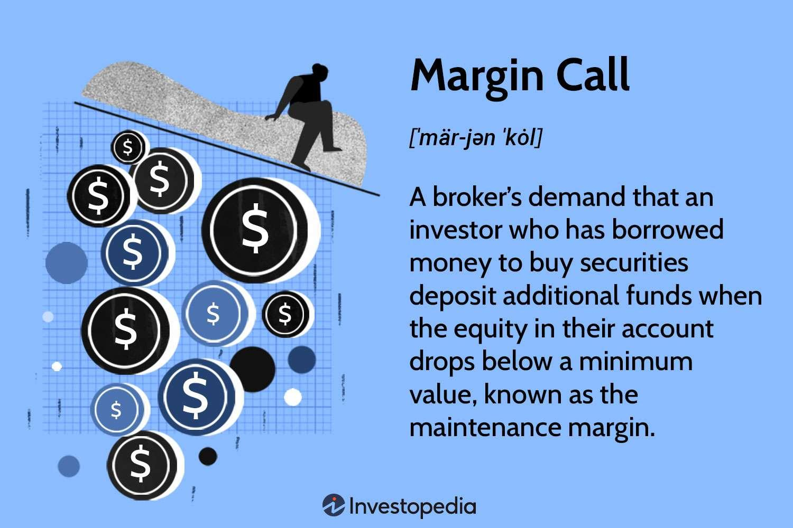

## Table of Contents

## What is a margin call in finance?

A margin call in finance happens when the value of an investor's margin account falls below the broker's required amount. When you buy stocks on margin, you're borrowing money from your broker to buy more stocks than you could with just your own money. If the stocks you bought go down in value, your account balance drops. If it drops too much, your broker will ask you to add more money or sell some of your stocks to bring the account back up to the required level. This request from the broker is called a margin call.

Margin calls can be stressful because they often happen when the market is going down. If you can't add more money to your account quickly, your broker might sell your stocks at a lower price to cover the loan. This can lead to bigger losses for you. It's important to understand the risks of trading on margin and to keep an eye on your account to avoid getting a margin call.

## How does a margin call work?

When you buy stocks on margin, you're borrowing money from your broker to buy more stocks than you could with your own money. If the value of your stocks goes down, the total value of your account also goes down. Your broker has rules about how much money or stocks you need to keep in your account. If your account value drops below this required level, your broker will ask you to add more money or sell some stocks. This request is called a margin call.

Margin calls can be tough because they usually happen when the stock market is going down. If you can't add more money to your account quickly, your broker might sell your stocks at a lower price to get back the money they lent you. This can make your losses even bigger. It's important to know the risks of trading on margin and to watch your account closely to avoid getting a margin call.

## What triggers a margin call?

A margin call happens when the value of your stocks bought on margin goes down a lot. When you buy stocks on margin, you borrow money from your broker to buy more stocks than you could with just your own money. If the value of those stocks drops, the total value of your account also drops. Your broker has rules about how much money or stocks you need to keep in your account. If your account value falls below this required level, your broker will ask you to add more money or sell some of your stocks. This request from your broker is called a margin call.

Margin calls often happen when the stock market is going down. This can be stressful because you need to act fast. If you can't add more money to your account quickly, your broker might sell your stocks at a lower price to get back the money they lent you. This can make your losses even bigger. It's important to understand the risks of trading on margin and to keep an eye on your account to avoid getting a margin call.

## What is the difference between a margin call and a margin account?

A margin account is a type of brokerage account that lets you borrow money from your broker to buy stocks. This means you can buy more stocks than you could with just your own money. You need to keep a certain amount of money or stocks in your account as a safety measure for the broker. This is called the maintenance margin.

A margin call happens when the value of the stocks in your margin account goes down a lot. If the value of your account drops below the required maintenance margin, your broker will ask you to add more money or sell some of your stocks. This request from your broker is called a margin call. If you don't act quickly, your broker might sell your stocks at a lower price to get back the money they lent you.

## How can an investor avoid a margin call?

To avoid a margin call, an investor should be careful about how much they borrow from their broker. When you buy stocks on margin, you're using borrowed money, so it's smart to not borrow too much. Keep an eye on your account and make sure the value of your stocks stays above the maintenance margin set by your broker. If you see the value of your stocks going down, you might want to add more money to your account or sell some stocks before your broker asks you to.

Another way to avoid a margin call is to understand the risks of trading on margin. The stock market can go up and down a lot, and if it goes down, you could lose money quickly. Always have a plan for what you'll do if the market goes against you. By keeping your borrowing low and being ready to act if the market changes, you can lower the chance of getting a margin call.

## What are the risks associated with margin calls?

Margin calls can be risky because they often happen when the stock market is going down. If you get a margin call, you need to add more money to your account or sell some of your stocks quickly. If you can't do this, your broker might sell your stocks at a lower price to get back the money they lent you. This can make your losses even bigger, especially if the market keeps going down after your stocks are sold.

Another risk is that margin calls can lead to a cycle of selling. When many people get margin calls at the same time, they all start selling their stocks to meet the calls. This can make the stock market go down even more, causing more margin calls and more selling. It's a tough situation that can make things worse for everyone involved. It's important to understand these risks and be careful when trading on margin.

## Can a margin call lead to a short squeeze?

A margin call can lead to a short squeeze in some situations. When people who have borrowed money to buy stocks (on margin) get a margin call, they might have to sell their stocks quickly to meet the call. If a lot of people are selling the same stock at the same time, the price of that stock can go down fast. This can be bad news for people who have bet that the stock price will go down (short sellers). They might have to buy back the stock to cover their bets, which can push the stock price up.

This sudden buying to cover short positions can start a short squeeze. In a short squeeze, the price of the stock keeps going up because more and more short sellers are buying back the stock. This can make the price go up even more, causing more short sellers to buy back, and the cycle keeps going. So, margin calls can be one of the things that start a short squeeze, especially if a lot of people are selling and buying the same stock at the same time.

## What are the regulatory requirements for margin calls?

In the United States, the rules for margin calls are set by the Federal Reserve and the Financial Industry Regulatory Authority (FINRA). The Federal Reserve says that you need to put down at least 50% of the stock's price when you buy it on margin. This is called the initial margin requirement. After you buy the stock, you need to keep at least 25% of the stock's value in your account. This is called the maintenance margin requirement. If the value of your stocks goes down and your account falls below this 25%, your broker will give you a margin call.

FINRA also has rules to make sure brokers handle margin calls fairly. They say that brokers need to give you at least 2 business days to meet a margin call. If you don't add more money or sell some stocks within those 2 days, your broker can sell your stocks to get back the money they lent you. These rules are there to protect both you and the broker, and to make sure the stock market stays stable.

## How do brokers handle margin calls?

When the value of stocks in a margin account goes down a lot, brokers send a margin call to the investor. This means the investor's account value has dropped below the required level, called the maintenance margin. The broker will tell the investor they need to add more money to their account or sell some of their stocks to bring the account back up to the required level. The investor usually has a few days to do this, but it can be stressful because it often happens when the market is going down.

If the investor doesn't add more money or sell stocks quickly enough, the broker can take action. The broker has the right to sell the investor's stocks at the current market price to get back the money they lent. This can lead to bigger losses for the investor, especially if the market keeps going down after the stocks are sold. Brokers have to follow rules set by the Federal Reserve and FINRA to make sure they handle margin calls fairly and give investors enough time to meet the call.

## What historical events have been influenced by margin calls?

One big event that was influenced by margin calls was the stock market crash of 1929, which led to the Great Depression. Back then, people could borrow a lot of money to buy stocks. When the stock market started to go down, many people got margin calls. They had to sell their stocks quickly to pay back the money they borrowed, but this made the stock market go down even more. It turned into a big cycle of selling and more margin calls, which made the crash worse and led to a long economic downturn.

Another event influenced by margin calls was the financial crisis of 2008. During this time, many people and banks were using a lot of borrowed money to buy stocks and other investments. When the housing market started to fail, the value of these investments went down. This led to a lot of margin calls, and people had to sell their investments to meet the calls. This selling made the market go down even more, causing more margin calls and more selling. It was a big part of why the financial crisis got so bad.

## How do margin calls affect market volatility?

Margin calls can make the stock market go up and down a lot, which we call market volatility. When people get margin calls, they have to sell their stocks quickly to pay back the money they borrowed from their brokers. If a lot of people are selling their stocks at the same time, it can make the stock prices go down fast. This can scare other people into selling their stocks too, making the market even more volatile. It's like a chain reaction where one person's margin call can lead to a lot of selling and big price changes.

This kind of selling can also lead to a cycle that makes the market even more unstable. When many people get margin calls at the same time, they all start selling their stocks, which can push the market down even more. This can cause more margin calls, leading to more selling, and the cycle keeps going. It can make the market very unpredictable and stressful for everyone involved. So, margin calls can play a big role in making the stock market go up and down a lot.

## What strategies can be employed to manage the risks of margin calls?

To manage the risks of margin calls, it's important to be careful about how much money you borrow from your broker. Don't borrow too much. Keep an eye on your account and make sure the value of your stocks stays above the maintenance margin set by your broker. If you see the value of your stocks going down, you might want to add more money to your account or sell some stocks before your broker asks you to. This way, you can avoid getting a margin call and the stress that comes with it.

Another good strategy is to understand the risks of trading on margin. The stock market can go up and down a lot, and if it goes down, you could lose money quickly. Always have a plan for what you'll do if the market goes against you. By keeping your borrowing low and being ready to act if the market changes, you can lower the chance of getting a margin call. It's also a good idea to diversify your investments so that you're not putting all your money into one stock or one type of investment. This can help protect you if one part of the market goes down.

## What are Financial Markets and Margin Calls?

Financial markets encompass a wide array of asset classes such as stocks, forex, and commodities, each providing unique trading opportunities and risks. Leveraging products like Contracts for Differences (CFDs) allows traders to amplify their exposure to these markets without owning the underlying assets. This ability to trade on margin creates significant opportunities for increased profits but also heightens the associated risks.

A crucial element in the world of leveraged trading is the margin call. This concept serves as a protective mechanism for brokers to mitigate the potential for substantial losses. When a trader's account equity falls below the required maintenance margin, a margin call is triggered. At this point, the trader must either deposit additional funds into their account or close some of their open positions to bring the account back to the required margin level. 

The mechanics of a margin call can be mathematically expressed. If $P$ is the price of the asset, $Q$ is the quantity of the asset purchased, $L$ is the leverage ratio, and $M$ is the maintenance margin requirement, the margin call occurs when:

$$
E = P \cdot Q - \frac{P \cdot Q}{L} < M
$$

where $E$ represents the equity in the trader’s account, which must remain above the maintenance margin $M$.

Real-world scenarios illustrate how margin calls operate under various market conditions. For instance, in periods of high [volatility](/wiki/volatility-trading-strategies), rapid price movements can trigger margin calls more frequently as asset values fluctuate significantly. A trader with a highly leveraged position in the [forex](/wiki/forex-system) market might experience a margin call if a sudden adverse price movement occurs, necessitating prompt action to either inject additional funds or reduce the position to prevent liquidation by the broker.

Understanding these situations allows traders to anticipate margin calls and manage their trading strategies effectively. By incorporating practices such as maintaining excess funds in their accounts, traders can cushion against unexpected market shifts. This helps ensure they are not forced out of potentially profitable positions due to short-term volatility, thus fostering informed and sustainable trading tactics.

## References & Further Reading

[1]: Bergstra, J., Bardenet, R., Bengio, Y., & Kégl, B. (2011). ["Algorithms for Hyper-Parameter Optimization."](https://papers.nips.cc/paper/4443-algorithms-for-hyper-parameter-optimization) Advances in Neural Information Processing Systems 24.

[2]: ["Advances in Financial Machine Learning"](https://www.amazon.com/Advances-Financial-Machine-Learning-Marcos/dp/1119482089) by Marcos Lopez de Prado

[3]: ["Evidence-Based Technical Analysis: Applying the Scientific Method and Statistical Inference to Trading Signals"](https://www.amazon.com/Evidence-Based-Technical-Analysis-Scientific-Statistical/dp/0470008741) by David Aronson

[4]: ["Machine Learning for Algorithmic Trading"](https://github.com/PacktPublishing/Machine-Learning-for-Algorithmic-Trading-Second-Edition) by Stefan Jansen

[5]: ["Quantitative Trading: How to Build Your Own Algorithmic Trading Business"](https://www.amazon.com/Quantitative-Trading-Build-Algorithmic-Business/dp/1119800064) by Ernest P. Chan