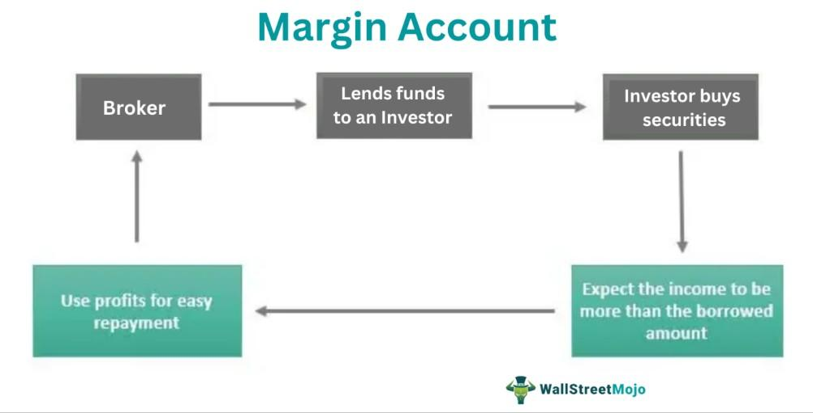

In the dynamic world of financial markets, understanding the nuances of margin deposit trading is crucial for investors. Margin deposit trading allows traders to borrow funds from a broker to purchase financial securities. This practice amplifies the potential for both gains and losses, making it a high-risk, high-reward strategy. Leveraging financial securities like stocks, bonds, and other instruments with margin deposit trading can significantly increase market exposure, thereby necessitating a solid comprehension of the involved risks and responsibilities.

Algorithmic trading plays a pivotal role in the contemporary investment landscape. By automating trades through pre-set parameters, algo trading enhances both efficiency and accuracy, reducing the impact of human error and emotional decision-making. In markets characterized by volatility, algorithmic solutions can optimize entry and exit points, offering traders a competitive advantage.



Understanding the interplay between margin deposit trading, financial securities, and algorithmic trading skills is essential for formulating effective trading strategies. This interconnectedness provides opportunities to build robust approaches that can tap into the intricacies of modern finance, benefiting both seasoned traders and beginners. Mastery of these elements can inform sound trading decisions, ensuring that traders stay abreast with ever-evolving financial regulations and market dynamics.

## Table of Contents

## Understanding Margin Deposit Trading

Margin deposit trading is a financial strategy that enables investors to borrow funds from a brokerage firm to purchase financial securities. This process provides traders with the opportunity to enhance their buying power by using a margin deposit as collateral. The margin deposit is essentially a security measure for the broker, ensuring that there are funds available to cover any potential losses that might occur through trading.

To engage in margin deposit trading, traders must initially understand the concept of leverage. Leverage in this context refers to the ability to control a larger position in the market with a relatively small amount of invested capital. For example, if an investor has $10,000 and uses leverage at a ratio of 2:1, they can control a $20,000 position. While the potential for greater returns exists, leverage also increases the risk of significant losses. Consequently, margin deposit trading is considered a high-risk, high-reward strategy, suitable primarily for those who understand the associated risks.

One of the key requirements in margin deposit trading is the initial margin requirement. This is the minimum amount of equity that an investor must provide as collateral to open a margin position. Regulatory bodies, such as the U.S. Securities and Exchange Commission (SEC), alongside brokerage firms, set these requirements. As of 2023, the Federal Reserve’s Regulation T allows investors to borrow up to 50% of the purchase price of securities. Therefore, for a security that costs $10,000, an investor is required to put up a minimum of $5,000 as initial margin.

Maintenance margin is another crucial aspect that traders need to monitor. It represents the minimum amount of equity that must be maintained in the margin account after the purchase has been made. If the equity in a trader’s account falls below this level due to declines in market value, the broker will issue a margin call, which demands the trader to deposit additional funds or securities to bring the account back to the required level. Failing to meet a margin call may force the broker to liquidate some or all of the securities in the account to cover the shortfall.

Overall, margin deposit trading offers investors the ability to amplify their investment potential but requires meticulous risk management to avoid the pitfalls of financial losses. Understanding the dynamics of initial and maintenance margins, as well as the leveraging concept, is critical for any trader looking to participate in this trading strategy.

## The Mechanics of Financial Securities

Financial securities, encompassing stocks, bonds, and other instruments, serve as vital components of investment portfolios. They represent ownership or debt and are thus fundamental to the operations of capital markets. Trading these securities on margin, which involves borrowing capital from a broker to increase potential investment returns, can significantly amplify market exposure.

When engaging in margin trading, investors can purchase securities worth more than their available capital, enhancing their overall market position. This leverage, however, introduces increased risk, as both gains and losses are magnified. The suitability of various securities for margin trading depends on their [volatility](/wiki/volatility-trading-strategies) and [liquidity](/wiki/liquidity-risk-premium). Volatility, a measure of price fluctuations over time, influences the risk level; highly volatile securities can present substantial profits but also considerable losses. Liquidity, the ease of buying or selling an asset in the market without affecting its price, is crucial because it determines how quickly an investor can enter or [exit](/wiki/exit-strategy) a position.

Investors must carefully assess these factors and the risk profile of each security type when utilizing margin. For example, stocks of established companies with high liquidity might be preferred for margin trading due to their generally lower volatility relative to smaller, less liquid stocks. Bonds, typically considered less volatile than stocks, can also be traded on margin, providing a more stable investment but usually with lower returns.

The amplified market exposure possible through margin trading demands a nuanced understanding of each security's inherent risk and potential. Mathematical models, such as the Capital Asset Pricing Model (CAPM), can be employed to estimate expected returns considering systematic risk:

$$
E(R_i) = R_f + \beta_i (E(R_m) - R_f)
$$

where $E(R_i)$ is the expected return of the security, $R_f$ is the risk-free rate, $\beta_i$ is the security's beta, and $E(R_m)$ is the expected market return. 

Such models aid in evaluating whether the potential for enhanced returns justifies the additional risk associated with margin trading. Analyzing historical price data and applying quantitative methods to manage risks are essential practices for investors aiming to capitalize effectively on the leverage opportunity provided by margin trading, especially in volatile markets.

## The Synergy of Algo Trading with Margin Trading

Algorithmic trading, or algo trading, leverages sophisticated algorithms to execute trades based on predefined criteria, allowing traders to act with speed and precision unattainable by human operators. This form of trading has become increasingly prevalent, particularly in environments where margin deposit trading is employed. Through [algorithmic trading](/wiki/algorithmic-trading), investors can achieve improved efficiency and accuracy, which are vital when navigating the complexities of margin trading.

Incorporating algorithmic strategies into margin deposit trading provides several distinct advantages. Algorithms can be designed to process large volumes of data quickly and systematically, enabling traders to capitalize on fleeting market opportunities. This capability is crucial in margin trading, where the use of borrowed capital amplifies both potential profits and risks. By automating trading decisions, algorithms can minimize delays and ensure consistent execution of trades, which is essential when market conditions are volatile and time-sensitive.

Algo trading also mitigates risks associated with human error and emotional decision-making. Human traders may succumb to biases, emotions, or fatigue, potentially leading to poor trading decisions. In contrast, algorithms operate based on a set of objective criteria, ensuring that trades are executed as intended. This objectivity is particularly beneficial in high-risk environments like margin trading, where mistakes can lead to substantial financial losses.

Furthermore, algorithmic trading systems can be utilized to determine optimal entry and exit points. Traders often implement strategies such as mean reversion or [trend following](/wiki/trend-following), which algorithms can execute with high precision. For example, an algorithm might monitor technical indicators across multiple securities to identify advantageous situations for buying or selling on margin. These strategies can be encoded in programming languages such as Python, where libraries like NumPy and Pandas facilitate complex data analysis:

```python
import numpy as np
import pandas as pd

def moving_average(data, window_size):
    return data.rolling(window=window_size).mean()

def algo_trading_strategy(prices, short_window, long_window):
    short_mavg = moving_average(prices, short_window)
    long_mavg = moving_average(prices, long_window)
    signals = np.where(short_mavg > long_mavg, 1, 0)  # 1 for buy, 0 for sell/hold
    return signals

# Example usage
price_data = pd.Series([100, 102, 101, 105, 107, 110])
signals = algo_trading_strategy(price_data, short_window=2, long_window=3)
print(signals)
```

In summary, the integration of algorithmic trading in margin deposit environments enhances the potential for successful trading. Algorithms enable traders to operate at a scale and speed that maximizes profits while controlling for risk, especially in volatile markets. The combination of algorithmic precision and the leverage provided by margin trading represents a powerful toolset for contemporary investors aiming to navigate the fast-paced financial markets.

## Strategies and Risk Management

Developing effective strategies in margin deposit trading requires a comprehensive understanding of risk management techniques and market dynamics. These strategies often involve setting precise risk parameters, utilizing stop-loss orders, and diversifying portfolios to mitigate risks associated with leveraged trading. The inherent volatility of trading on margin necessitates strict adherence to these methodologies to protect against substantial losses.

Stop-loss orders serve as a critical tool in risk management by automatically selling a security when it reaches a particular price threshold, thereby limiting potential losses. Consider the following Python snippet, which demonstrates how an algorithm could implement a basic stop-loss order:

```python
def execute_trade(order_type, price, stop_loss):
    if order_type == "buy":
        print(f"Buying at {price}")
    elif order_type == "sell":
        print(f"Selling at {price}")

def check_stop_loss(current_price, purchase_price, stop_loss_percent):
    target_price = purchase_price * (1 - stop_loss_percent / 100)
    if current_price <= target_price:
        return True
    return False

# Example usage
purchase_price = 100
current_price = 95
stop_loss_percent = 5

if check_stop_loss(current_price, purchase_price, stop_loss_percent):
    execute_trade("sell", current_price, stop_loss_percent)
```

Diversification is another strategic imperative, spreading investments across various asset classes to reduce exposure to any single entity or market risk. This practice is essential in margin trading, where magnified losses are a possibility.

Understanding market indicators, such as moving averages, RSI (Relative Strength Index), and MACD (Moving Average Convergence Divergence), can significantly enhance strategy formulation. These indicators offer insights into trends and potential reversals, guiding the timing of entry and exit points in trades. For instance, a trader might use the RSI to identify overbought or oversold conditions, which can be particularly useful in volatile margin trading environments.

Continuous learning and adaptation are fundamental for traders to maintain a competitive edge. The markets are constantly evolving, as are the tools and technologies that facilitate trading. Accessing and processing large datasets efficiently through programming languages like Python allows traders to backtest their strategies against historical data, refining their approaches to suit current market conditions.

To achieve long-term success in margin deposit trading, traders must remain vigilant to market changes, continually reassess their strategies, and embrace new technologies and methodologies to optimize performance. The dynamic nature of financial markets demands not only knowledge but also the foresight to anticipate and react to shifts in market sentiment and structure.

## Conclusion

Margin deposit trading and algorithmic trading stand as formidable tools within the financial markets. Both methods offer unique advantages that can significantly enhance an investor's or trader's potential when applied with a thorough understanding and strong risk management framework. 

A comprehensive grasp of the complexities involved in these techniques is essential. Margin deposit trading allows traders to leverage their positions by borrowing capital, which can potentially amplify returns. However, this leverage also comes with increased risks, necessitating a careful approach to avoid substantial losses. Simultaneously, algorithmic trading employs sophisticated computer algorithms to execute trades based on specific criteria, providing precision and the ability to minimize human error. Combining both strategies can create opportunities for automated, efficient, and informed trading decisions.

Staying abreast of the ever-evolving regulations and market developments is critical. Financial markets are subject to regulatory changes that can impact trading strategies and practices. Investors must remain informed about these changes to adjust their strategies accordingly and ensure compliance. Regulatory updates can affect margin requirements, algorithmic trading practices, and overall market dynamics, requiring traders to be adaptable and responsive.

Implementing these tools effectively requires not only technical knowledge but also discipline and a proactive approach to learning. Success in margin and algorithmic trading hinges on continuous market engagement and adaptation to new trends and technologies. The financial landscape is rapidly changing, and maintaining a competitive edge demands ongoing education and strategy refinement.

In conclusion, while margin deposit trading and algorithmic trading present substantial opportunities, they also pose significant risks. A disciplined approach, combined with continuous learning and vigilant risk management, can help traders and investors capitalize on their potential, ensuring sustainable success in the complex financial markets.

## References & Further Reading

[1]: ["Advances in Financial Machine Learning"](https://www.amazon.com/Advances-Financial-Machine-Learning-Marcos/dp/1119482089) by Marcos Lopez de Prado

[2]: ["Evidence-Based Technical Analysis: Applying the Scientific Method and Statistical Inference to Trading Signals"](https://www.amazon.com/Evidence-Based-Technical-Analysis-Scientific-Statistical/dp/0470008741) by David Aronson

[3]: ["Machine Learning for Algorithmic Trading"](https://github.com/PacktPublishing/Machine-Learning-for-Algorithmic-Trading-Second-Edition) by Stefan Jansen

[4]: ["Quantitative Trading: How to Build Your Own Algorithmic Trading Business"](https://books.google.com/books/about/Quantitative_Trading.html?id=j70yEAAAQBAJ) by Ernest P. Chan

[5]: Muthukrishnan, R. (2018). ["Algorithmic Trading in Practice with Python"](https://home.tpq.io/books/py4at/). Apress.

[6]: Fabozzi, F. J., & Focardi, S. M. (2005). ["The Mathematics of Financial Modeling and Investment Management"](https://www.semanticscholar.org/paper/The-Mathematics-of-Financial-Modeling-and-Focardi-Fabozzi/9ef7cbeee77cf22e2ee62cfef22f466a27aec6c8). Wiley.