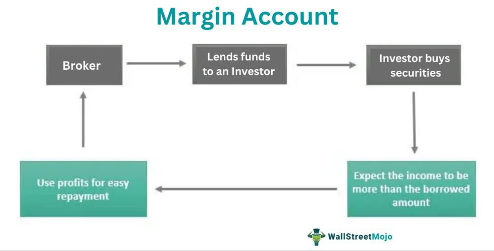

In the complex world of finance, the concept of margin plays a crucial role for traders aiming to enhance their trading capacity while managing the associated risks. Margin trading permits traders to borrow funds from brokers, thereby allowing them to trade financial assets using the borrowed funds as collateral. This mechanism enables traders to control larger positions than their initial capital would allow, potentially leading to higher returns but also carrying the inherent risk of amplified losses.

The integration of margin trading becomes particularly compelling when combined with algorithmic trading, which leverages advanced computational algorithms to execute trades with precision and speed. Algorithmic trading systems analyze market data, identify opportunities, and execute trades based on pre-defined criteria, thereby reducing human error and enhancing the efficiency of trading operations.



This article explores the interplay between margin trading and algorithmic trading, focusing on their combined significance and the impact on trading strategies. Efficient management of margin within algorithmic trading systems can lead to improved trading performance and risk mitigation. Understanding the mechanics of margin trading and its integration with algorithmic strategies is crucial for traders seeking to optimize their market engagement while safeguarding against potential pitfalls. 

By analyzing the dynamics of margin trading in conjunction with algorithmic strategies, traders stand to gain valuable insights into optimizing their trading frameworks, ultimately enhancing their ability to navigate the complexities of financial markets.

## Table of Contents

## Understanding Margin in Finance

Margin in financial trading refers to the collateral required by traders to enter and maintain leveraged trading positions. This practice allows traders to control larger positions than their own capital would enable, offering the potential for enhanced returns while simultaneously amplifying associated risks.

In the context of margin trading, two critical components are the initial margin and the maintenance margin. The initial margin is the minimum amount of equity a trader must deposit to enter a leveraged position. It provides a buffer to cover potential losses and protects brokers from client defaults. Conversely, the maintenance margin is the minimum equity level a trader must maintain in their account after establishing a position. Should the equity fall below this level due to adverse market movements, a margin call may be issued.

A margin call requires traders to deposit additional funds or liquidate existing positions to restore the account to the required margin level. Failure to meet a margin call can result in the forced closure of positions by the broker, potentially leading to substantial financial losses for the trader.

The leveraging effect of margin trading can be expressed mathematically. If $P$ is the position size and $C$ represents the trader's capital, leverage ($L$) is defined as:

$$

L = \frac{P}{C} 
$$

This leverage ratio illustrates how much the position size exceeds the trader's actual capital, highlighting both the opportunity for amplified gains and the risk of increased losses. Understanding and managing margin is essential for traders to navigate potential pitfalls and optimize their trading strategies.

## Role of Margin in Trading Strategies

Trading on margin presents both opportunities and challenges—it increases purchasing power but also introduces significant risks. By allowing traders to control larger positions than their own capital would permit, margin trading offers the potential for higher returns. However, this increased leverage can also amplify losses, necessitating robust risk management strategies to mitigate these risks.

Effective risk management is critical in margin trading. Key strategies include maintaining buffer cash reserves and diversifying investments to avoid margin calls. Buffer cash reserves act as a financial cushion, ensuring that traders can meet margin requirements even during volatile market conditions. Diversification reduces exposure to any single asset, thereby lowering the overall risk of a trading portfolio.

Proper margin management is essential to prevent forced sell-offs by brokers. When traders fail to meet margin requirements, brokers may liquidate positions to recover borrowed funds, potentially disrupting trading plans and leading to capital erosion. Ensuring sufficient margin levels helps in maintaining control over trading strategies and preserving capital.

Understanding personal risk limits and adhering to them is fundamental for making informed trading decisions. Each trader's risk tolerance varies, and defining these limits helps in controlling the level of leverage and exposure to risk. By setting these parameters, traders can sustain trading performance and avoid excessive losses.

In summary, while margin trading can enhance potential returns, it is accompanied by increased risks. Successful traders prioritize effective margin management and risk mitigation strategies to navigate potential hazards and achieve sustainable trading success.

## Algorithmic Trading and Margin Integration

Algorithmic trading employs rules-based algorithms to execute trades automatically, resulting in increased precision and operational efficiency. This system relies on complex mathematical models that allow for swift decision-making processes devoid of human error, revolutionizing trading dynamics. In this context, integrating margin management into these algorithmic strategies offers a dual advantage: enhanced risk management and capital efficiency. 

Algorithms can be tailored to account for margin requirements, optimizing trading decisions to ensure that leverage is used judiciously. By employing margin calculators, traders can effectively determine the necessary margin levels for given trades, thereby minimizing the risk of excessive leverage and potential margin calls. The formula used to calculate the required margin may vary based on the asset class and trading platform, but generally, it is expressed as:

$$
\text{Required Margin} = \text{Leverage Ratio} \times \text{Position Size}
$$

where the leverage ratio reflects the proportion of borrowed funds to one's own capital.

Additionally, incorporating scenario analysis within trading algorithms plays a pivotal role in understanding the sensitivity of margin requirements to varying market conditions. Scenario analysis allows traders to anticipate how changes in market [volatility](/wiki/volatility-trading-strategies) or price movements could affect margin levels. The results from such analyses enable traders to adjust their strategies in response to potential shifts in market demands, thereby safeguarding their positions against unforeseen events.

In practice, Python can be used to implement these concepts, leveraging libraries such as NumPy and pandas for data manipulation, and [machine learning](/wiki/machine-learning) frameworks for predictive analytics. For example, a simple script to estimate the impact of price changes on margin requirements could be structured as follows:

```python
import numpy as np

# Example function to calculate required margin based on leverage and price
def calculate_margin(leverage_ratio, position_size, price_change):
    return leverage_ratio * (position_size * (1 + price_change))

# Parameters
leverage_ratio = 0.1  # 10% margin requirement
position_size = 10000  # $10,000 position
price_changes = np.array([-0.05, 0.0, 0.05])  # Simulated price changes: -5%, 0%, +5%

# Calculate margins for different price scenarios
margins = calculate_margin(leverage_ratio, position_size, price_changes)

print("Required Margins for Scenarios:", margins)
```

This code simulates the impact of different price changes on the required margin, enabling traders to visualize potential outcomes and adjust their strategies accordingly. This proactive approach ensures that trading strategies remain robust and resilient, even in volatile markets.

## Advantages and Risks of Margin in Algo Trading

Algorithmic margin trading offers significant advantages, primarily due to its capacity to execute trades with enhanced speed and precision. The automation inherent in [algorithmic trading](/wiki/algorithmic-trading) significantly reduces the likelihood of human errors, thus increasing the efficiency and reliability of trading operations. This technology allows traders to analyze vast datasets and execute trades based on complex strategies that would be infeasible manually, providing a competitive edge in the fast-paced financial markets.

Despite these advantages, algorithmic margin trading also carries considerable risks. The use of leverage in margin trading amplifies both potential gains and potential losses, making it imperative for traders to be keenly aware of their exposure. Market volatility can further exacerbate these risks, possibly leading to margin calls—a situation where traders are required to deposit additional funds to cover potential losses. This underscores the need for rigorous risk management protocols to safeguard trading capital.

Modern trading platforms often incorporate sophisticated risk management tools that play a crucial role in algorithmic margin trading. These tools continuously monitor margin levels and can automatically adjust trading positions to ensure compliance with margin requirements. This automatic adjustment helps in mitigating the risks of margin calls and prevents unwanted liquidation of positions.

However, reliance on algorithmic systems necessitates constant vigilance. Traders must ensure that their systems are designed to incorporate comprehensive risk management strategies. This might involve setting predefined risk parameters, such as maximum allowable drawdown or exposure limits, and employing techniques such as scenario analysis to anticipate and mitigate potential adverse market movements.

Overall, the successful integration of margin trading with algorithmic strategies relies heavily on the effectiveness of the risk management framework. By maintaining robust systems and continuously validating their strategies against market conditions, traders can capitalize on the advantages of algorithmic margin trading while minimizing its inherent risks.

## Conclusion

The amalgamation of margin trading with algorithmic strategies offers a potent mix for modern traders, providing substantial opportunities for profit maximization and risk mitigation. This combination allows traders to leverage their positions while simultaneously employing the precision and speed of algorithmic trading systems. By understanding the mechanics of margin calls and the nuances of algorithmic trading, traders can better prepare for market fluctuations and enhance trading outcomes.

Incorporating margin management into algorithmic trading strategies requires a thorough understanding of risk management and the capacity to anticipate changes in market conditions. Traders must develop algorithms that not only execute trades efficiently but also manage margin levels to prevent adverse outcomes such as margin calls or forced liquidations. This involves continuous monitoring of leverage and margin utilization, ensuring that trading algorithms are responsive to market dynamics.

The synergy between margin management and algorithmic trading holds the potential for consistent trading success. However, achieving this potential necessitates that trading strategies are continuously refined and adapted to changing market conditions. Traders can leverage the computational power of algorithms to conduct real-time risk assessments, adjust trading positions, and optimize capital allocation dynamically. This iterative process helps maintain a balance between risk and return, ultimately fostering a sustainable trading practice.

Moreover, advanced trading platforms often provide tools that integrate risk management features directly into trading algorithms. These tools can automatically adjust positions in response to margin fluctuations, thus protecting traders from the amplified risks associated with leverage. As trading environments evolve, the ability to fine-tune algorithmic strategies and margin management techniques will become increasingly vital for maintaining a competitive edge in the financial markets.

In conclusion, the effective integration of margin trading and algorithmic strategies can significantly enhance trading performance. By leveraging technological advancements and maintaining a disciplined approach to risk management, traders can navigate the complexities of modern financial markets, achieving both profitability and resilience.

## References & Further Reading

Bergstra, J., Bardenet, R., Bengio, Y., & Kégl, B. (2011). 'Algorithms for Hyper-Parameter Optimization.' Advances in Neural Information Processing Systems 24. This paper discusses methodologies for optimizing hyperparameters, critical for refining algorithmic trading strategies by improving model performance and computational efficiency.

Lopez de Prado, M. (n.d.). 'Advances in Financial Machine Learning.' This book provides insights into the intersection of machine learning and finance, offering tools and techniques for developing advanced trading algorithms capable of leveraging margin effectively.

Aronson, D. (n.d.). 'Evidence-Based Technical Analysis: Applying the Scientific Method and Statistical Inference to Trading Signals.' Aronson applies scientific rigor to technical analysis, promoting quantitative approaches that can enhance trading strategies, particularly when utilizing margin positions.

Jansen, S. (n.d.). 'Machine Learning for Algorithmic Trading.' This source explores the deployment of machine learning models in trading. It offers practical guidance on tailoring algorithms to account for margin requirements, enhancing risk management.

Chan, E. P. (n.d.). 'Quantitative Trading: How to Build Your Own Algorithmic Trading Business.' Chan's book serves as a comprehensive guide for aspiring algorithmic traders. It covers the integration of quantitative strategies with margin trading, emphasizing automation and efficient capital utilization.

