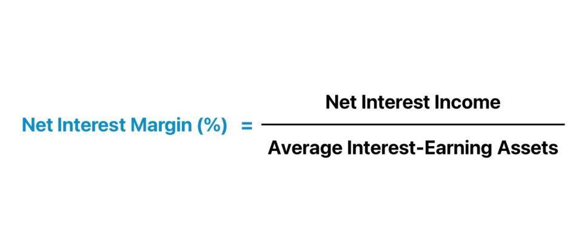

## Table of Contents

## What is margin interest?

Margin interest is the cost you pay to borrow money from your brokerage firm to buy securities. When you use margin, you're essentially taking a loan to invest more than you could with just your own money. This interest is charged on the amount you borrow, and the rate can vary depending on the brokerage and the amount borrowed.

Paying margin interest can be beneficial if the investments you make with the borrowed money grow more than the interest you pay. However, it's risky because if your investments decrease in value, you could lose more than your initial investment. It's important to understand the risks and costs involved before deciding to use margin.

## How is margin interest calculated?

Margin interest is calculated based on the amount of money you borrow from your brokerage and the interest rate they charge. Let's say you borrow $10,000 at an annual interest rate of 8%. To figure out the interest for a year, you would multiply $10,000 by 8%, which gives you $800. That's the total interest you would pay for borrowing $10,000 for a full year.

However, interest is usually calculated daily and added to your account monthly. So, if you borrow $10,000 for a month, the interest for that month would be less than $800. To find the daily interest rate, you divide the annual rate by 365. For an 8% annual rate, the daily rate would be about 0.022%. Multiply this daily rate by $10,000 to get the daily interest, which is about $2.22. Over a 30-day month, this would come to roughly $66.60 in interest.

## What factors affect the margin interest rate?

The margin interest rate can change because of different things. One big thing is the overall interest rates set by the Federal Reserve. When the Fed raises rates, it usually means that borrowing money costs more, so margin interest rates go up too. Another thing that can affect the rate is how much you borrow. Sometimes, if you borrow a lot of money, the brokerage might give you a lower rate because they want your business. But if you borrow a smaller amount, the rate might be higher.

Also, different brokerages have different rates. Some might have lower rates to attract more customers, while others might charge more. The type of account you have can also make a difference. For example, if you have a premium account or a lot of money in your account, you might get a better rate. It's a good idea to shop around and compare rates from different brokerages to find the best deal.

## What is the difference between margin interest and regular interest?

Margin interest and regular interest are both costs you pay for borrowing money, but they are used in different ways. Margin interest is what you pay when you borrow money from a brokerage to buy stocks or other investments. It's like a loan that lets you invest more than you could with just your own money. The interest rate for margin loans can change based on things like the overall interest rates set by the Federal Reserve, how much you borrow, and which brokerage you use.

Regular interest, on the other hand, is what you pay when you borrow money for everyday things like a car loan, a mortgage, or a credit card. This kind of interest is usually set when you take out the loan and might not change as often as margin interest. The rate for regular interest depends on your credit score, the type of loan, and the lender. While both types of interest are costs for borrowing money, they apply to different situations and can have different rates and terms.

## Can you explain the concept of margin borrowing?

Margin borrowing is when you borrow money from your brokerage to buy more stocks or other investments than you could with just your own money. It's like getting a loan from the brokerage, and you use the money to invest. When you do this, you have to put up some of your own money as collateral, which is called the margin. The brokerage will let you borrow a certain amount based on the value of your investments and their rules.

When you use margin borrowing, you have to pay interest on the money you borrow. This is called margin interest. If the investments you buy with the borrowed money go up in value, you can make more money than if you had only used your own money. But it's risky because if the investments go down in value, you could lose more than you started with. You might even have to sell your investments to pay back the loan if the value drops too much, which is called a margin call. So, it's important to understand the risks and be ready to handle them.

## How does the amount of margin used impact the interest charged?

The amount of margin you use can affect how much interest you have to pay. When you borrow more money from your brokerage, you'll usually pay more in interest because you're borrowing a bigger amount. But sometimes, if you borrow a lot, the brokerage might give you a lower interest rate to keep you as a customer. So, the total interest you pay depends on both how much you borrow and the rate you get.

For example, if you borrow $5,000 at an 8% annual rate, you'll pay less interest than if you borrow $10,000 at the same rate. But if you borrow $50,000, the brokerage might offer you a lower rate, like 6%, because they want your business. So, even though you're borrowing more, the lower rate could mean you pay less interest overall. It's important to check with your brokerage to see how the amount you borrow affects the interest rate they charge.

## What are common margin interest rates offered by brokers?

Margin interest rates can be different depending on which brokerage you use and how much money you borrow. Usually, these rates are between 5% and 14% a year. If you borrow a small amount, you might get a higher rate, like 12% or 14%. But if you borrow a lot of money, the brokerage might give you a lower rate, like 5% or 6%, because they want to keep you as a customer.

These rates can also change based on what the Federal Reserve does with interest rates. When the Fed raises rates, margin interest rates usually go up too. It's a good idea to check with different brokerages to see what rates they offer. Some might have special deals or lower rates to attract more customers.

## How can margin interest be minimized?

One way to minimize margin interest is to borrow less money from your brokerage. The less you borrow, the less interest you'll have to pay. If you can invest with your own money instead of using margin, that's even better because you won't have to pay any interest at all. Another way is to pay back the money you borrowed as quickly as you can. The faster you pay it back, the less time the interest has to add up.

Another way to minimize margin interest is to shop around for the best rates. Different brokerages offer different rates, so it's a good idea to compare them. Some brokerages might give you a lower rate if you borrow a lot of money or if you have a lot of money in your account. Also, keep an eye on the Federal Reserve's interest rates because when they go up, margin interest rates usually go up too. If you can, try to borrow when rates are low to save on interest.

## What are the tax implications of margin interest?

Margin interest can be used to lower your taxes if you itemize your deductions on your tax return. You can deduct the interest you paid on money you borrowed to buy investments that produce taxable income, like stocks or bonds. But you can't deduct interest on money you borrowed to buy things that don't produce taxable income, like your house or a car. To take this deduction, you need to fill out a form called Schedule A and keep good records of how much interest you paid and what you used the borrowed money for.

The amount of margin interest you can deduct might be limited if your investment income, like dividends and interest, is less than the margin interest you paid. If that happens, you can only deduct the amount of your investment income. Any extra interest you can't deduct this year can be carried over to future years, but you can only use it when you have enough investment income to cover it. It's a good idea to talk to a tax professional to make sure you're doing everything right and getting all the deductions you can.

## How does margin interest affect investment returns?

Margin interest can make your investment returns go up or down. When you borrow money to invest, you're using something called margin. If the investments you buy with the borrowed money grow more than the interest you have to pay, then you can make more money than if you just used your own money. This is because you're investing more money than you have, and if your investments do well, you get a bigger return.

But margin interest can also hurt your returns if your investments don't do well. If the value of your investments goes down, you still have to pay the interest on the money you borrowed. This means you could lose more money than you started with because you have to pay back the loan plus the interest. It's a risky way to invest, so you need to think carefully about whether using margin is worth it for you.

## What are the risks associated with margin interest?

Using margin interest to invest can be risky. If the value of your investments goes down, you still have to pay back the money you borrowed plus the interest. This means you could lose more money than you started with. If your investments lose a lot of value, you might get a margin call from your brokerage. This means you have to put in more money or sell some of your investments to pay back the loan. If you can't do that, the brokerage might sell your investments for you, which could be at a bad time and make your losses even bigger.

Another risk is that margin interest rates can change. If the Federal Reserve raises interest rates, the cost of borrowing money goes up. This means you might have to pay more interest than you expected, which can eat into your investment returns. Also, using margin means you're investing with money you don't have, so it can be tempting to take bigger risks. If those risks don't pay off, you could end up in a lot of financial trouble. It's important to understand these risks and think carefully before deciding to use margin to invest.

## How do different brokers calculate margin interest differently?

Different brokers might calculate margin interest in slightly different ways, but they usually follow a similar pattern. They take the amount of money you borrowed and multiply it by the daily interest rate. The daily rate is found by dividing the annual interest rate by the number of days in a year. Then, they add up the daily interest for the month to get the total interest you owe. Some brokers might use a 360-day year instead of a 365-day year to make the math easier, which can affect how much interest you pay.

Brokers can also have different ways of setting their interest rates. Some might give you a lower rate if you borrow a lot of money or if you have a lot of money in your account with them. Others might charge a higher rate for smaller loans. The type of account you have can also make a difference. For example, if you have a premium account, you might get a better rate. It's important to check with each broker to see how they calculate interest and what rates they offer, so you can find the best deal for you.

## What is the understanding of Margin Accounts?

Margin accounts are essential tools in the financial trading landscape, offering investors the ability to enhance their purchasing power by borrowing funds from brokers. This borrowing mechanism, known as leverage, allows traders to increase the size of their investments beyond what their capital alone would permit. While leverage can significantly amplify potential gains, it equally magnifies losses, underscoring the importance of careful management.

### Key Features of Margin Trading

1. **Initial Margin Requirement**: This is the percentage of the purchase price of securities that an investor must pay for with their own funds. For instance, if a stock requires a 50% initial margin and costs $10,000, the investor must provide $5,000, while the remainder can be borrowed.

2. **Margin Calls**: These occur when the account's equity falls below a required minimum level, known as the maintenance margin. If the value of securities drops, the broker can demand that the investor deposit additional funds or liquidate positions to cover the shortfall. Failure to comply with a margin call can result in the broker forcibly selling the assets to bring the account back to the required margin level.

3. **Minimum Balance Maintenance**: To avoid forced liquidation, investors must maintain a certain equity percentage in their accounts. Brokers set these maintenance requirements to protect against losses that exceed the investor’s initial margins.

### Operational Aspects of Margin Accounts

- **Calculating Equity**: The equity in a margin account is calculated as the market value of securities minus the borrowed funds. Margin calls are triggered if the equity falls below the broker's maintenance margin. An example calculation is illustrated below:
$$
  \text{Equity} = \text{Current Value of Securities} - \text{Loan Amount}

$$

- **Interest Costs and Fees**: Borrowed funds incur interest, which is a critical consideration for margin account users. Interest rates are determined by the broker and are compounded over the borrowing period, adding to the cost of trades.

- **Risk Management**: Proper risk management strategies, such as setting stop-loss orders and regularly monitoring market conditions, are crucial for margin traders. This helps in preventing significant losses and maintaining the ability to meet margin calls.

Margin accounts serve as powerful instruments in financial trading, offering opportunities for greater returns while also posing increased risk. Investors must be well-versed in the operational dynamics of these accounts and remain vigilant in managing their positions to navigate the inherent challenges of trading on margin effectively.

## What are Interest Charges in Margin Accounts?

The cost of borrowing through margin accounts hinges on the interest rates charged by brokers, which are generally calculated daily and compounded over time. This continuous compounding increases the overall cost of a loan obtained through a margin account, making an understanding of the interest calculation process essential for effective financial management. 

### Factors Influencing Margin Interest Rates
Several variables can impact the interest rates applied to margin accounts. These include:

1. **Brokerage Policies:** Different brokers have varying interest structures, and rates may vary significantly between firms or offer differing tiers based on account balances or client status.
2. **Loan Amounts:** Often, higher loan amounts benefit from lower interest rates due to economies of scale in lending.
3. **Prevailing Market Rates:** General economic conditions and central bank rates may influence the baseline interest rates set by brokers.

### Calculating Margin Interest
Borrowers in margin accounts are often charged interest daily, with it being compounded into the principal, making it crucial to understand both monthly and annualized interest calculations. 

- **Daily Interest Calculation:** 
  The interest for a given day is typically calculated as:
$$
  \text{Daily Interest} = \frac{\text{Annual Interest Rate}}{365} \times \text{Loan Amount}

$$

- **Monthly Interest Calculation:** 
  To find the monthly interest, the daily interest accumulation over a month is summed up:
$$
  \text{Monthly Interest} = \sum_{i=1}^{30} \frac{\text{Annual Interest Rate}}{365} \times \text{Loan Amount}

$$

- **Annualized Interest Calculation:**
  The effective annual [interest rate](/wiki/interest-rate-trading-strategies) can be calculated using:
$$
  \text{Effective Annual Rate} = \left(1 + \frac{\text{Annual Nominal Rate}}{n}\right)^{n} - 1

$$

  Here, $n$ can be 365 if calculated daily.

For better clarity, suppose a trader has a nominal annual interest rate of 6% and a margin loan of $10,000. The daily interest would be:

$$
\text{Daily Interest} = \frac{0.06}{365} \times 10,000 = 1.64
$$

Compounded over 30 days (if no repayment), the total would be approximately $49.20.

### Strategies to Minimize Interest Charges
Traders can employ multiple strategies to reduce the cost of borrowing on margin accounts, thereby enhancing net returns:

1. **Timely Repayment:** Minimizing the time funds are borrowed is the most straightforward way to reduce interest expense.
2. **Utilizing Cash Sweeps:** Redirecting idle cash in the brokerage account to offset the margin balance can lead to reduced interest charges.
3. **Negotiating Rates:** High-value clients can sometimes negotiate more favorable interest terms with their brokers.
4. **Choosing Brokerages Wisely:** Selecting brokers with competitive rate structures can lead to substantial savings over time.

Incorporating these practices allows traders to control interest costs more effectively, thus optimizing their investment strategies and overall profitability. Understanding the intricacies of margin interest calculations not only aids in cost management but also informs strategic decisions in dynamic trading environments.

## What are Financial Calculations in Algorithmic Trading?

Effective [algorithmic trading](/wiki/algorithmic-trading) relies heavily on the precision of financial calculations to drive timely and informed decision-making. Among the primary metrics employed in such trading algorithms are moving averages, the Relative Strength Index (RSI), and measures of [volatility](/wiki/volatility-trading-strategies), each contributing distinct insights into market dynamics.

**Moving Averages**: Moving averages smooth out price data to help identify trends. They can be simple (SMA) or exponential (EMA), with the latter giving more weight to recent prices. For example, a 50-day SMA and a 200-day SMA are commonly used to identify long-term trends. The formula for an SMA is straightforward:

$$
\text{SMA} = \frac{P_1 + P_2 + \ldots + P_n}{n}
$$

where $P$ represents the closing price and $n$ the number of periods.

**Relative Strength Index (RSI)**: The RSI is a momentum oscillator that measures the speed and change of price movements, oscillating between 0 and 100. It is often used to identify overbought or oversold conditions in a market. RSI values above 70 may indicate that a stock is overbought, while values below 30 suggest oversold conditions. The RSI formula is as follows:

$$
\text{RSI} = 100 - \frac{100}{1 + \frac{\text{Average Gain}}{\text{Average Loss}}}
$$

**Volatility Measures**: Volatility is another crucial element, reflecting the degree of variation in trading prices over time. One common measure of volatility is the standard deviation of price, which quantifies the amount of variation or dispersion. Here's a Python snippet for calculating volatility:

```python
import numpy as np

def calculate_volatility(prices):
    returns = np.diff(prices) / prices[:-1]
    volatility = np.std(returns)
    return volatility
```

**Historical Data for Backtesting**: Historical data is vital for backtesting trading strategies, allowing for the simulation of a trading strategy using past data to see how it would have performed. This process provides insights into the potential effectiveness of strategies and allows for calibration before deploying in a live market. For instance, a trading algorithm might backtest a strategy that combines moving average crossovers with RSI thresholds to optimize buy and sell signals.

**Real-Time Data for Adaptive Strategies**: As markets are dynamic, real-time data integration enables trading systems to adjust strategies based on current conditions. For example, if a sharp increase in volatility is detected, an algorithm might reduce position sizes to mitigate risk. Such adaptability is critical in maintaining effectiveness in varying market conditions.

Incorporating precise financial calculations into algorithmic trading models not only enhances the understanding of market behavior but also improves the decision-making process, ultimately leading to potentially more profitable trading outcomes. Accurate financial computations are essential for the reliability and success of algorithmic strategies.

## References & Further Reading

For those seeking to deepen their understanding of concepts such as margin trading, interest calculations, and algorithmic trading, numerous resources are available. Investopedia provides an array of articles covering the fundamentals and intricacies of these financial topics, offering a solid starting point for learners and experienced traders alike.

Books and academic papers on financial markets present both theoretical and applied aspects of trading strategies, lending comprehensive insights into market dynamics. Titles often address various aspects of finance, including the mechanics of algorithmic trading and methods to effectively calculate and manage interest charges.

Online courses and webinars specializing in algorithmic trading offer practical applications and extensive explorations into financial technologies. These resources are invaluable for traders aiming to grasp the complexities of automated trading systems and how they can incorporate advanced computational methods into their trading strategies.

Moreover, traders can benefit from using financial calculators, which serve as powerful tools to comprehend and manage margin interest and investment returns. Whether calculating the effective interest rate on borrowed funds or simulating trading scenarios, these calculators are essential for informed decision-making.

In incorporating these resources into their learning journey, traders are equipped with the knowledge necessary to navigate the evolving landscape of modern finance. Continuous education and practical application of these concepts can significantly enhance trading performance and strategic planning.

