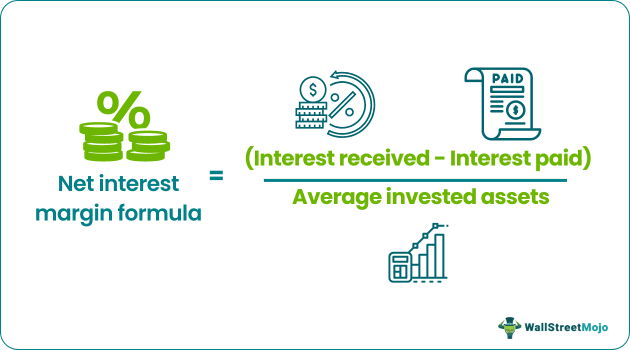

The world of finance is in a constant state of evolution, with technological advancements and innovative financial instruments continually reshaping the landscape. A particularly intriguing area of development within this domain is the intersection of margin interest and algorithmic trading. As financial professionals strive to enhance profitability, understanding the complexities of margin interest calculation becomes vital, especially as it pertains to automated trading strategies.

Margin accounts have emerged as a powerful tool for traders, allowing them to borrow funds from brokers to invest more than they could with their capital alone. This borrowing capability, while amplifying potential gains, also increases the risk of losses, necessitating sophisticated strategies for managing these risks effectively. As such, understanding the core concepts of margin accounts and the intricacies of interest calculations forms the foundation for successful trading.



Automation significantly impacts how traders approach these financial strategies. Algorithmic trading leverages technology to execute trades with speed and accuracy, revolutionizing how market participants engage with financial markets. This automation necessitates a deep understanding of how interest costs from borrowed funds are calculated and integrated into trading algorithms, fundamentally influencing trading outcomes.

In today’s financial markets, maximizing profitability while managing risk is crucial. Traders must be adept at navigating the delicate balance between leveraging borrowed funds and mitigating associated costs. By examining margin interest and its role within algorithmic trading, this article aims to provide insights into enhancing trading performance in an ever-evolving market environment. Whether you're a seasoned trader or new to the world of finance, understanding these elements is key to achieving success.

## Table of Contents

## Understanding Margin Accounts

Margin accounts are essential tools in the financial trading landscape, offering investors the ability to enhance their purchasing power by borrowing funds from brokers. This borrowing mechanism, known as leverage, allows traders to increase the size of their investments beyond what their capital alone would permit. While leverage can significantly amplify potential gains, it equally magnifies losses, underscoring the importance of careful management.

### Key Features of Margin Trading

1. **Initial Margin Requirement**: This is the percentage of the purchase price of securities that an investor must pay for with their own funds. For instance, if a stock requires a 50% initial margin and costs $10,000, the investor must provide $5,000, while the remainder can be borrowed.

2. **Margin Calls**: These occur when the account's equity falls below a required minimum level, known as the maintenance margin. If the value of securities drops, the broker can demand that the investor deposit additional funds or liquidate positions to cover the shortfall. Failure to comply with a margin call can result in the broker forcibly selling the assets to bring the account back to the required margin level.

3. **Minimum Balance Maintenance**: To avoid forced liquidation, investors must maintain a certain equity percentage in their accounts. Brokers set these maintenance requirements to protect against losses that exceed the investor’s initial margins.

### Operational Aspects of Margin Accounts

- **Calculating Equity**: The equity in a margin account is calculated as the market value of securities minus the borrowed funds. Margin calls are triggered if the equity falls below the broker's maintenance margin. An example calculation is illustrated below:
$$
  \text{Equity} = \text{Current Value of Securities} - \text{Loan Amount}

$$

- **Interest Costs and Fees**: Borrowed funds incur interest, which is a critical consideration for margin account users. Interest rates are determined by the broker and are compounded over the borrowing period, adding to the cost of trades.

- **Risk Management**: Proper risk management strategies, such as setting stop-loss orders and regularly monitoring market conditions, are crucial for margin traders. This helps in preventing significant losses and maintaining the ability to meet margin calls.

Margin accounts serve as powerful instruments in financial trading, offering opportunities for greater returns while also posing increased risk. Investors must be well-versed in the operational dynamics of these accounts and remain vigilant in managing their positions to navigate the inherent challenges of trading on margin effectively.

## Interest Charges in Margin Accounts

The cost of borrowing through margin accounts hinges on the interest rates charged by brokers, which are generally calculated daily and compounded over time. This continuous compounding increases the overall cost of a loan obtained through a margin account, making an understanding of the interest calculation process essential for effective financial management. 

### Factors Influencing Margin Interest Rates
Several variables can impact the interest rates applied to margin accounts. These include:

1. **Brokerage Policies:** Different brokers have varying interest structures, and rates may vary significantly between firms or offer differing tiers based on account balances or client status.
2. **Loan Amounts:** Often, higher loan amounts benefit from lower interest rates due to economies of scale in lending.
3. **Prevailing Market Rates:** General economic conditions and central bank rates may influence the baseline interest rates set by brokers.

### Calculating Margin Interest
Borrowers in margin accounts are often charged interest daily, with it being compounded into the principal, making it crucial to understand both monthly and annualized interest calculations. 

- **Daily Interest Calculation:** 
  The interest for a given day is typically calculated as:
$$
  \text{Daily Interest} = \frac{\text{Annual Interest Rate}}{365} \times \text{Loan Amount}

$$

- **Monthly Interest Calculation:** 
  To find the monthly interest, the daily interest accumulation over a month is summed up:
$$
  \text{Monthly Interest} = \sum_{i=1}^{30} \frac{\text{Annual Interest Rate}}{365} \times \text{Loan Amount}

$$

- **Annualized Interest Calculation:**
  The effective annual [interest rate](/wiki/interest-rate-trading-strategies) can be calculated using:
$$
  \text{Effective Annual Rate} = \left(1 + \frac{\text{Annual Nominal Rate}}{n}\right)^{n} - 1

$$

  Here, $n$ can be 365 if calculated daily.

For better clarity, suppose a trader has a nominal annual interest rate of 6% and a margin loan of $10,000. The daily interest would be:

$$
\text{Daily Interest} = \frac{0.06}{365} \times 10,000 = 1.64
$$

Compounded over 30 days (if no repayment), the total would be approximately $49.20.

### Strategies to Minimize Interest Charges
Traders can employ multiple strategies to reduce the cost of borrowing on margin accounts, thereby enhancing net returns:

1. **Timely Repayment:** Minimizing the time funds are borrowed is the most straightforward way to reduce interest expense.
2. **Utilizing Cash Sweeps:** Redirecting idle cash in the brokerage account to offset the margin balance can lead to reduced interest charges.
3. **Negotiating Rates:** High-value clients can sometimes negotiate more favorable interest terms with their brokers.
4. **Choosing Brokerages Wisely:** Selecting brokers with competitive rate structures can lead to substantial savings over time.

Incorporating these practices allows traders to control interest costs more effectively, thus optimizing their investment strategies and overall profitability. Understanding the intricacies of margin interest calculations not only aids in cost management but also informs strategic decisions in dynamic trading environments.

## Algorithmic Trading: An Overview

Algorithmic trading utilizes computer algorithms to autonomously perform financial market trades. This method dramatically enhances the speed and efficiency of trading by allowing precise execution of orders. Algorithmic trading's primary advantage is its capacity to process vast arrays of market data at a speed and scale far beyond human capability.

Historically, [algorithmic trading](/wiki/algorithmic-trading) emerged in the late 20th century with the development of electronic trading platforms. Initially used to automate simple tasks like order routing, the role of algorithmic trading has expanded significantly. Today, complex algorithms can manage everything from market-making and [arbitrage](/wiki/arbitrage) strategies to more sophisticated forms of trading like [statistical arbitrage](/wiki/statistical-arbitrage) and market sentiment analysis.

Trading algorithms can be categorized into several types:

1. **Trend Following Algorithms**: These algorithms implement strategies based on moving averages and other trend indicators, reacting to market movements rather than predicting them.

2. **Arbitrage Algorithms**: These algorithms exploit price discrepancies of identical or similar financial instruments on different markets or in different forms.

3. **Market Making Algorithms**: Aim to profit by continuously buying and selling financial instruments, maintaining a balance between supply and demand, and providing liquidity to the markets.

4. **Mean Reversion Algorithms**: Based on the concept that asset prices will revert to their historical averages over time, these algorithms identify investment opportunities when prices deviate from these averages.

5. **Sentiment-based Algorithms**: Utilize data from social media, news, and other sentiment indicators to anticipate market trends.

The benefits of algorithmic trading include enhanced decision-making precision and reduced psychological impact on traders since algorithms are unaffected by emotional biases. Automation also promotes market efficiency by ensuring that trades are executed at the best possible prices and points in time, which can result in lowered transaction costs and market impact.

However, algorithmic trading also presents several challenges. Developing and maintaining effective trading algorithms requires substantial expertise in both programming and financial markets. Additionally, while algorithms can process large volumes of data quickly, they may also generate errors or exacerbate market [volatility](/wiki/volatility-trading-strategies) under certain conditions.

Currently, algorithmic trading accounts for a significant portion of trading [volume](/wiki/volume-trading-strategy) in major financial markets. As technology continues to advance, its role continues to grow, offering new opportunities for those who can adeptly harness its capabilities. Understanding and adapting to highly automated trading environments is becoming increasingly critical for modern traders.

## Financial Calculations in Algorithmic Trading

Effective algorithmic trading relies heavily on the precision of financial calculations to drive timely and informed decision-making. Among the primary metrics employed in such trading algorithms are moving averages, the Relative Strength Index (RSI), and measures of volatility, each contributing distinct insights into market dynamics.

**Moving Averages**: Moving averages smooth out price data to help identify trends. They can be simple (SMA) or exponential (EMA), with the latter giving more weight to recent prices. For example, a 50-day SMA and a 200-day SMA are commonly used to identify long-term trends. The formula for an SMA is straightforward:

$$
\text{SMA} = \frac{P_1 + P_2 + \ldots + P_n}{n}
$$

where $P$ represents the closing price and $n$ the number of periods.

**Relative Strength Index (RSI)**: The RSI is a momentum oscillator that measures the speed and change of price movements, oscillating between 0 and 100. It is often used to identify overbought or oversold conditions in a market. RSI values above 70 may indicate that a stock is overbought, while values below 30 suggest oversold conditions. The RSI formula is as follows:

$$
\text{RSI} = 100 - \frac{100}{1 + \frac{\text{Average Gain}}{\text{Average Loss}}}
$$

**Volatility Measures**: Volatility is another crucial element, reflecting the degree of variation in trading prices over time. One common measure of volatility is the standard deviation of price, which quantifies the amount of variation or dispersion. Here's a Python snippet for calculating volatility:

```python
import numpy as np

def calculate_volatility(prices):
    returns = np.diff(prices) / prices[:-1]
    volatility = np.std(returns)
    return volatility
```

**Historical Data for Backtesting**: Historical data is vital for backtesting trading strategies, allowing for the simulation of a trading strategy using past data to see how it would have performed. This process provides insights into the potential effectiveness of strategies and allows for calibration before deploying in a live market. For instance, a trading algorithm might backtest a strategy that combines moving average crossovers with RSI thresholds to optimize buy and sell signals.

**Real-Time Data for Adaptive Strategies**: As markets are dynamic, real-time data integration enables trading systems to adjust strategies based on current conditions. For example, if a sharp increase in volatility is detected, an algorithm might reduce position sizes to mitigate risk. Such adaptability is critical in maintaining effectiveness in varying market conditions.

Incorporating precise financial calculations into algorithmic trading models not only enhances the understanding of market behavior but also improves the decision-making process, ultimately leading to potentially more profitable trading outcomes. Accurate financial computations are essential for the reliability and success of algorithmic strategies.

## Managing Interest Charges in Algorithmic Trading

Incorporating interest charges into algorithmic trading strategies can significantly influence profitability. Algorithms designed for trading can integrate interest cost calculations to dynamically assess net returns and adapt strategies accordingly.

#### Accounting for Interest Costs
Algorithmic trading systems can be programmed to include interest costs in their decision-making processes. For instance, when calculating potential returns on an investment, the algorithm can subtract estimated interest charges from gross profits to determine net returns. This precise calculation helps in deciding whether a trade meets the desired profit threshold.

Consider the following simplified Python example to calculate net return after accounting for interest costs:

```python
def calculate_net_return(gross_return, principal, interest_rate, time_period):
    interest_cost = principal * (interest_rate / 100) * time_period
    net_return = gross_return - interest_cost
    return net_return

# Example: Calculate net return with 10% gross return, $1000 principal, 5% interest rate, over 1 year
gross_return = 1000 * 0.10
principal = 1000
interest_rate = 5  # annual rate
time_period = 1  # in years

net_return = calculate_net_return(gross_return, principal, interest_rate, time_period)
print(f"Net return after interest costs: ${net_return}")
```

#### Automation for Dynamic Adjustments
Automation in algorithmic trading allows for real-time recalibrations in response to changes in interest rates and trading conditions. By integrating live market data, algorithms can adjust trading parameters such as position sizes and holding periods to manage interest expenses more effectively.

For instance, suppose an interest rate increases unexpectedly. An automated system can adjust its trading strategy by reducing leveraged positions, thereby limiting exposure to higher interest costs. This dynamic adjustment enables traders to maintain target profitability levels even under fluctuating market conditions.

#### Case Studies and Successful Tactics
Several trading firms have successfully managed interest charges by incorporating sophisticated algorithms. One approach involves the use of predictive analytics to forecast interest rate movements, allowing traders to adjust their strategies proactively. For example, algorithms can analyze macroeconomic indicators and central bank signals to anticipate interest rate hikes or cuts, thereby guiding strategic shifts in portfolio composition.

Another effective tactic includes hedging interest rate exposures through derivative instruments. Some firms utilize swaps or options to lock in interest rates, thereby stabilizing borrowing costs over a specified period. This strategy can shield traders from volatile interest rate environments, ensuring smoother trading operations.

#### Boosting Trading Returns
Effective management of interest charges not only reduces costs but can also enhance overall trading performance. By minimizing unnecessary interest expenses, traders can allocate more resources toward potentially profitable investments. The integration of interest rate considerations into algorithmic strategies underscores the importance of comprehensive and adaptable trading frameworks in achieving financial success. 

In conclusion, the ability to account for and manage interest charges through automation and advanced algorithms is a significant asset in algorithmic trading. By leveraging these techniques, traders can optimize their strategies, maintain competitive advantages, and achieve superior returns in varied market conditions.

## Conclusion

Margin interest calculation and its incorporation into algorithmic trading represent intricate yet highly beneficial components of contemporary finance. By employing sophisticated financial strategies, traders can effectively utilize borrowed capital to augment their trading results while simultaneously mitigating risks. A comprehensive understanding of the interconnectedness of interest expenses, margin accounts, and trading algorithms is vital for achieving financial success.

Throughout this article, we have explored critical aspects of these financial mechanisms, equipping traders with the knowledge necessary to optimize their trading performance. The ability to effectively integrate margin interest considerations into algorithmic trading strategies is not just a skill but a strategic advantage in the fast-evolving financial landscape.

To stay competitive and profitable, traders must continually refine their strategies. This includes keeping pace with fluctuating market conditions and embracing technological advancements in trading platforms and algorithms. Consistent evaluation and improvement of trading strategies are essential to leverage opportunities and maintain a strong position in the financial markets. By doing so, traders can enhance their understanding and execution of margin-based trades, ultimately leading to more informed and profitable investment decisions.

## References & Further Reading

For those seeking to deepen their understanding of concepts such as margin trading, interest calculations, and algorithmic trading, numerous resources are available. Investopedia provides an array of articles covering the fundamentals and intricacies of these financial topics, offering a solid starting point for learners and experienced traders alike.

Books and academic papers on financial markets present both theoretical and applied aspects of trading strategies, lending comprehensive insights into market dynamics. Titles often address various aspects of finance, including the mechanics of algorithmic trading and methods to effectively calculate and manage interest charges.

Online courses and webinars specializing in algorithmic trading offer practical applications and extensive explorations into financial technologies. These resources are invaluable for traders aiming to grasp the complexities of automated trading systems and how they can incorporate advanced computational methods into their trading strategies.

Moreover, traders can benefit from using financial calculators, which serve as powerful tools to comprehend and manage margin interest and investment returns. Whether calculating the effective interest rate on borrowed funds or simulating trading scenarios, these calculators are essential for informed decision-making.

In incorporating these resources into their learning journey, traders are equipped with the knowledge necessary to navigate the evolving landscape of modern finance. Continuous education and practical application of these concepts can significantly enhance trading performance and strategic planning.