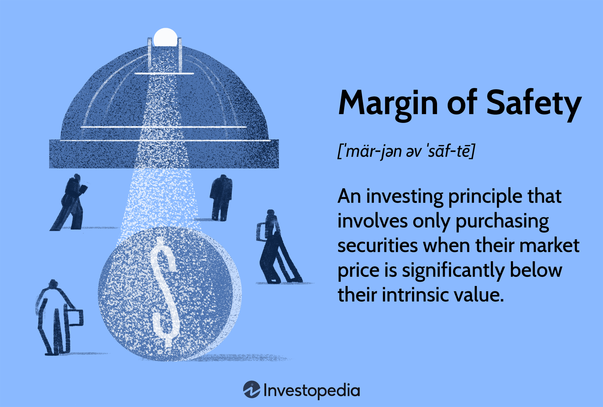

In the world of investing, numerous strategies are designed to manage risk and enhance returns. These strategies, encompassing both time-tested and contemporary approaches, are crucial for effectively understanding and engaging with financial markets. Among these strategies, the 'margin of safety' stands out as a key principle. Introduced by Benjamin Graham, it is employed as a risk management tool that assists investors in making well-informed decisions. This principle involves purchasing securities when their market price is significantly lower than their intrinsic value, thereby providing a buffer against valuation errors and unforeseen market volatility.

Critical to the effective application of the margin of safety is financial analysis. This analysis involves the systematic evaluation of financial data to assess an investment's potential, determine its intrinsic value, and apply the margin of safety. Techniques such as discounted cash flow analysis and earnings evaluation are core components of this process, ensuring that investment decisions are grounded in quantitative and qualitative assessments, thereby mitigating downside risks.

In recent times, technology has revolutionized trading practices through algorithmic trading. This approach utilizes computer algorithms to automate trading decisions, enhancing both efficiency and precision in market transactions. Algorithmic trading can integrate investment strategies along with principles like the margin of safety, to make data-driven and risk-managed decisions. It allows for dynamic decision-making based on real-time market data, thereby enabling investors to respond swiftly to changing market conditions.

Combining these elements—investment strategies, the margin of safety, financial analysis, and algorithmic trading—offers a comprehensive approach to investing. Together, they create a robust framework that not only manages risk but also optimizes returns, ensuring that investors can navigate the complexities of the global financial markets and achieve their financial goals effectively.

## Table of Contents

## Investment Strategies: A Broad Overview

Investment strategies are essential tools for achieving financial goals by guiding how resources are allocated across various asset classes, sectors, and individual securities. These strategies are designed to align with an investor's financial objectives, risk tolerance, and time horizon. Commonly employed investment strategies include value investing, growth investing, and income investing, each offering distinct advantages suited to different investor profiles.

### Value Investing

Value investing focuses on identifying undervalued stocks in the market, characterized by their trading prices being lower than their intrinsic values. This strategy is rooted in the belief that the market often overreacts to good and bad news, resulting in stock price fluctuations that do not necessarily align with a company's long-term fundamentals. Value investors seek to capitalize on these discrepancies by purchasing stocks that are undervalued by the market, with the expectation that their prices will eventually adjust to reflect their true value. Key metrics often considered in value investing include the Price-to-Earnings (P/E) ratio, Price-to-Book (P/B) ratio, and Dividend Yield. This approach, popularized by figures like Benjamin Graham, is known for its emphasis on risk management and a long-term investment horizon.

### Growth Investing

Growth investing is centered around identifying companies that exhibit the potential for above-average growth, typically in terms of revenues, earnings, or cash flows. Investors employing this strategy aim to benefit from the capital appreciation that results from a company’s growth trajectory. Growth stocks are often characterized by high P/E ratios and minimal dividends, as companies reinvest earnings to fuel expansion rather than distribute them to shareholders. This strategy may involve greater risk due to its sensitivity to market [volatility](/wiki/volatility-trading-strategies) and the uncertainty associated with future growth projections. However, it appeals to investors with a higher risk tolerance willing to capitalize on potentially high returns.

### Income Investing

Income investing prioritizes generating a steady stream of income from investments, predominantly through dividends or interest payments. This strategy is favored by investors seeking stability and regular income, such as retirees who rely on their investment portfolios for living expenses. Typical assets within an income investing strategy include dividend-paying stocks, bonds, real estate investment trusts (REITs), and other fixed-income securities. The focus on income generation often results in lower portfolio volatility, making this strategy attractive for risk-averse investors.

By understanding the nuances of these strategies, investors can make informed decisions that align their portfolios with their financial objectives. The right investment strategy reflects an investor's goals, whether aimed at capital appreciation, income stability, or a balanced approach. A thoughtful selection and implementation of these strategies can enhance the likelihood of achieving desired financial outcomes while maintaining appropriate risk levels.

## Understanding the Margin of Safety

The margin of safety is a pivotal concept in value investing that serves as a vital tool for risk management. By purchasing securities at prices significantly below their intrinsic values, investors can build a buffer against potential risks. This approach allows investors to account for errors in valuation, unforeseen market shifts, and specific challenges that a company might face. The basic formula to calculate the margin of safety is expressed as:

$$
\text{Margin of Safety} = \frac{\text{Intrinsic Value} - \text{Market Price}}{\text{Intrinsic Value}} \times 100\%
$$

This formula helps quantify the degree of discount at which a security is trading relative to its estimated intrinsic value, reflecting the potential margin available to absorb adverse events or inaccuracies in assumptions. 

Benjamin Graham introduced the margin of safety concept, which was subsequently embraced and popularized by renowned investors such as Warren Buffett. The principle emphasizes purchasing assets that are underpriced according to their intrinsic value assessments, thus providing a protective layer for investors against downside risks.

Applying the margin of safety necessitates evaluating both qualitative and quantitative factors. Qualitative analysis involves understanding a company's business model, competitive advantages, and industry position. Quantitatively, it requires thorough financial analysis to estimate a company's intrinsic value accurately. This can involve methodologies like discounted cash flow analysis, where future cash flows are projected and discounted back to their present value.

For example, consider a company with an intrinsic value of $100 per share, but its current market price is $70. The margin of safety would be calculated as:

$$
\text{Margin of Safety} = \frac{100 - 70}{100} \times 100\% = 30\%
$$

This indicates a 30% buffer, suggesting that even if the intrinsic value estimate is off by 30%, the investor might still avoid a loss. Such a margin provides resilience against various risks, including market volatility and incorrect valuations, thus ensuring a prudent investment approach.

## Financial Analysis and Its Role in Determining Margin of Safety

Financial analysis is a critical component in the process of determining a margin of safety for investors. This analytical approach involves evaluating a company's financial health, performance, and intrinsic value using various quantitative techniques. Among these techniques, discounted cash flow (DCF) analysis, earnings analysis, and asset valuation are fundamental tools.

The discounted cash flow (DCF) method estimates a company's intrinsic value by forecasting its future cash flows and discounting them to present value using a discount rate. The formula used in DCF analysis is:

$$
\text{DCF} = \sum \left( \frac{CF_t}{(1 + r)^t} \right)
$$

where $CF_t$ is the cash flow at time $t$, and $r$ is the discount rate. This method requires accurate estimation of future cash flows and a suitable discount rate, often representing the investor's required rate of return or the company’s cost of capital.

Earnings analysis, another crucial aspect, involves examining a company's profitability through metrics such as earnings per share (EPS), price-to-earnings (P/E) ratio, and return on equity (ROE). These indicators provide insights into a company’s ability to generate profit relative to its shareholders' equity.

Asset valuation, which assesses a company's assets, is also integral in calculating intrinsic value. This valuation considers both tangible assets like property and equipment and intangible assets such as patents and brand value. By comparing a company's market price to its assessed intrinsic value, investors can identify potential undervaluation.

A rigorous financial analysis helps investors establish a margin of safety by uncovering undervalued securities. The margin of safety is the difference between the intrinsic value determined through financial analysis and the market price of the security. A larger margin of safety implies a greater cushion against potential errors in valuation, unexpected market conditions, or company-specific challenges, safeguarding the investment from downside risks.

Understanding both a company's financial health and prevailing market conditions is crucial in applying the margin of safety effectively. Financial health can be gauged through solvency ratios, [liquidity](/wiki/liquidity-risk-premium) ratios, and other financial metrics that assess a company's ability to meet its obligations. Concurrently, market conditions including economic trends, interest rates, and industry performance can influence both intrinsic values and market prices.

By applying these techniques within the framework of financial analysis, investors can make informed decisions that align with the principles of risk management inherent in the margin of safety. Proper financial analysis not only aids in identifying investment opportunities but also fortifies investment decisions against potential volatility, ensuring a strategic balance between risk and reward.

## Algorithmic Trading: Integrating Investment Strategies and Margin of Safety

Algorithmic trading leverages advanced computer algorithms to automate and streamline trading processes, thereby significantly enhancing the efficiency and precision of market transactions. These algorithms are designed to execute trades at speeds and frequencies that are beyond human capacity, allowing for the execution of complex trading strategies that react in real-time to market conditions.

A central benefit of [algorithmic trading](/wiki/algorithmic-trading) is its ability to incorporate a diverse range of investment strategies, including those focused on minimizing risk, such as the margin of safety. By embedding investment principles directly into the algorithm, traders can ensure that decisions are based on robust, data-driven analyses. For example, algorithms can be programmed to initiate a buy when a stock's market price falls below its intrinsic value—a key tenet of the margin of safety concept. This allows the strategy to be applied consistently, systematically managing risk across numerous trading opportunities.

Automation plays a crucial role in algorithmic trading by allowing for dynamic adjustments according to market fluctuations and real-time data inputs. Algorithms continuously analyze vast quantities of market data, adjusting trading strategies as new information becomes available. For instance, if an algorithm detects a significant deviation in a stock's market price from its intrinsic value based on financial analysis, it can promptly execute buy or sell orders to capitalize on the pricing discrepancy while mitigating potential losses.

Moreover, integrating financial analysis with algorithmic trading provides a competitive advantage by offering a strategic balance between risk and reward. This integration enhances the accuracy and relevance of trading decisions. Through sophisticated models, algorithms can employ financial metrics such as discounted cash flows or asset valuations to determine intrinsic values, acting upon them at optimal moments. 

In conclusion, the synergy between algorithmic trading and investment strategies, including the margin of safety, exemplifies how technology can empower more informed, efficient, and effective trading. By coupling traditional financial analysis methodologies with advanced algorithmic systems, investors are well-equipped to navigate the complexities of modern financial markets.

## The Intersection of Modern Technology and Investment Strategy

Innovations in technology are significantly altering the landscape of investment strategies, chiefly through the integration of real-time data analytics with time-tested principles like the margin of safety. This transformation is largely driven by fintech advancements, including [artificial intelligence](/wiki/ai-artificial-intelligence) (AI) and [machine learning](/wiki/machine-learning) (ML), which provide investors with sophisticated tools to develop and implement effective strategies.

AI and ML algorithms analyze vast amounts of financial data and discern patterns that may not be immediately apparent through traditional analysis. These technologies enable predictive modeling, which assists investors in making decisions grounded in data rather than speculation. For instance, machine learning algorithms can be used to predict stock price movements by analyzing historical price data, economic indicators, and news sentiment. Python libraries such as Scikit-learn and TensorFlow offer robust frameworks to implement these machine learning models, facilitating enhancements in forecasting accuracy and investment decision-making.

The ability to process real-time data empowers investors to respond promptly to market fluctuations, thereby managing risk more effectively. The integration of AI with real-time data analytics tools ensures that investment strategies remain adaptable to changing market conditions. Tools like Python's Pandas can be used for real-time data manipulation and analysis, enabling investors to iterate on their models with continuously updated information. This adaptability is crucial for optimizing portfolio returns while maintaining a vigilant approach to risk management, as emphasized by the margin of safety principle.

Furthermore, technology facilitates the fusion of traditional investment wisdom with advanced analytical techniques. By automating routine tasks, investors can focus on higher-level strategic decision-making. The capacity to simulate various market scenarios and backtest strategies using computational methods enhances the robustness of investment approaches. For example, implementing a [backtesting](/wiki/backtesting) framework in Python, such as Backtrader, allows investors to evaluate the performance of their strategies against historical data, ensuring they align with long-term financial objectives.

In conclusion, the intersection of modern technology and investment strategy heralds a new era of informed and adaptive investment approaches. By leveraging AI, ML, and data analytics, investors can refine their methods to maximize returns and effectively manage risk. The blend of traditional knowledge with cutting-edge technology enables a comprehensive approach to navigating market complexities, positioning investors to achieve their financial goals in an increasingly dynamic market environment.

## Conclusion

Investment strategies, margin of safety, financial analysis, and algorithmic trading collectively form the backbone of a comprehensive approach to investing, ensuring that investors can effectively manage risk while optimizing returns. By intertwining these elements, investors can construct a resilient framework capable of withstanding market fluctuations and uncertainties. Investment strategies, ranging from value and growth investing to algorithmic trading, enable diversification of portfolios and alignment with individual risk appetites and financial goals. The margin of safety provides an additional layer of protection by advocating for the purchase of assets below intrinsic value, thus reducing potential downside risks.

Financial analysis, through techniques such as discounted cash flow (DCF) and earnings analysis, serves as the analytical foundation for ascertaining an asset's intrinsic value, which is critical for applying a margin of safety. Algorithmic trading enhances this process by leveraging technology to automate and refine decision-making, facilitating the incorporation of complex strategies and real-time data adjustments.

As financial markets continue to evolve, the integration of traditional investing principles with cutting-edge technology becomes increasingly vital. The rapid advancements in financial technology (fintech), including AI and machine learning, offer sophisticated tools that extend beyond conventional methodologies. These technologies empower investors to analyze vast datasets, uncover insights, and execute strategies with enhanced precision and speed.

Investors who embrace the synergy between traditional investing wisdom and modern technological innovations are well-equipped to navigate the complexities of today's dynamic markets. This adaptive approach not only helps in maximizing returns but also in safeguarding investments against unforeseen market downturns. As such, the successful investor of the future will be one who effectively combines these diverse yet interconnected components to achieve robust and sustainable financial growth.

## References & Further Reading

[1]: Graham, B. (2003). ["The Intelligent Investor: The Definitive Book on Value Investing."](https://www.amazon.com/Intelligent-Investor-3rd-Ed/dp/0063356724) Harper Business.

[2]: Bergen, J. V. (n.d.). ["A Guide to Value Investing."](https://www.wiley.com/en-us/Value+Investing+For+Dummies%2C+2nd+Edition-p-9780470232224) Investopedia.

[3]: Chan, E. P. (2009). ["Quantitative Trading: How to Build Your Own Algorithmic Trading Business."](https://github.com/ftvision/quant_trading_echan_book) Wiley.

[4]: Jansen, S. (2020). ["Machine Learning for Algorithmic Trading: Predictive models to extract signals from market and alternative data for systematic trading strategies with Python."](https://github.com/stefan-jansen/machine-learning-for-trading) Packt Publishing.

[5]: Lowe, D. (2018). ["Algorithmic Trading and Quantitative Strategies."](https://api.pageplace.de/preview/DT0400.9781498737197_A39374186/preview-9781498737197_A39374186.pdf) Springer.

[6]: Aronson, D. R. (2006). ["Evidence-Based Technical Analysis: Applying the Scientific Method and Statistical Inference to Trading Signals."](https://www.amazon.com/Evidence-Based-Technical-Analysis-Scientific-Statistical/dp/0470008741) Wiley.

[7]: Lopez de Prado, M. (2018). ["Advances in Financial Machine Learning."](https://www.amazon.com/Advances-Financial-Machine-Learning-Marcos/dp/1119482089) Wiley.

[8]: Damodaran, A. (2012). ["Investment Valuation: Tools and Techniques for Determining the Value of Any Asset."](https://books.google.com/books/about/Investment_Valuation.html?id=5SRHAAAAQBAJ) Wiley.