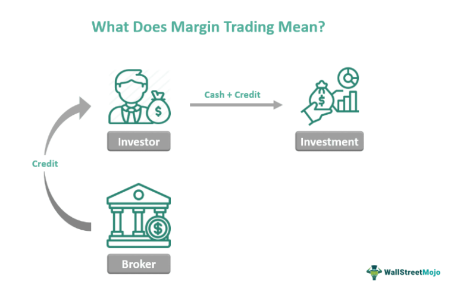

Trading and investment strategies constitute the backbone of financial market operations, providing structures through which investors and traders can navigate the complexities of asset markets. These strategies range from foundational approaches like buying and holding, to advanced techniques such as margin trading and algorithmic trading. Margin trading permits traders to purchase more assets than their capital would ordinarily permit, leveraging borrowed funds to potentially amplify returns. Conversely, algorithmic trading utilizes computer algorithms to automatically execute trades based on pre-programmed criteria, reducing the likelihood of human error and emotional decision-making.

In modern financial markets, margin and algorithmic trading have become increasingly significant. Margin trading offers opportunities for heightened gains but comes with considerable risk, demanding judicious risk management. Algorithmic trading has revolutionized the speed and efficiency of trading activities, enabling participants to process vast amounts of data rapidly and execute trades much faster than manual trading could allow. This progression underscores an era where technology and finance converge closely, reshaping trading landscapes.



This article aims to explore the nuances, potential benefits, and inherent challenges of both margin and algorithmic trading strategies. As the global financial environment evolves, understanding these sophisticated strategies is crucial for participants aiming for success. Moreover, the discussion will extend to how automation, through technologies like artificial intelligence and machine learning, is continuously transforming trading practices, ensuring that market actors remain competitive and informed.

## Table of Contents

## Understanding Margin Trading

Margin trading is a financial strategy that allows investors to trade assets using borrowed funds from a broker, enabling them to take larger positions than they could with their own capital alone. This method of trading is prevalent among individuals and institutions seeking to enhance their purchasing power and potentially maximize returns on investments.

### Mechanics of Margin Trading

In margin trading, investors open margin accounts with brokerage firms. These accounts permit them to borrow money against the collateral of their existing securities. The borrowed funds, typically at a set [interest rate](/wiki/interest-rate-trading-strategies), are used to purchase additional securities, thereby leveraging the initial investment. The level of leverage in margin trading is typically expressed as a ratio. For instance, a 2:1 leverage implies that for every $1 of the investor's capital, they can trade $2 worth of securities. The potential for higher returns arises due to the increased market exposure.

### Leverage and Its Amplifying Effects

Leverage is the core concept in margin trading, allowing investors to amplify their trading outcomes. If the market moves in favor of the trade, the gains are magnified in proportion to the leverage. Conversely, if the market moves against the position, the losses are similarly amplified, potentially exceeding the initial investment. This dual-edged nature of leverage necessitates careful consideration and stringent risk management practices.

### Margin Accounts and Their Requirements

A margin account is distinct from a regular brokerage account in several key aspects. Firstly, investors must satisfy the initial deposit requirement, known as the minimum margin. This is a percentage of the total investment value, commonly set by regulatory authorities and brokerage firms. Once a margin trade is executed, a maintenance margin must be maintained, which is the minimum account balance required to keep the position open. Should the account value fall below this threshold, a margin call is triggered, requiring the investor to deposit additional funds or sell assets to restore the balance.

### Risks and Considerations in Margin Trading

The principal risks associated with margin trading stem from the use of leverage. Margin calls can occur if the market moves adversely, forcing liquidation of assets at potentially inopportune times. Additionally, the interest on borrowed funds increases the cost basis of trades over time, impacting profitability. Investors must also be vigilant about the liquidation risk, where the broker might liquidate assets without prior consent to meet margin requirements.

### Applications in Various Markets

Margin trading is widely used in equity markets, offering traders the potential to profit from both rising and falling stock prices through short selling. Cryptocurrencies have also become a popular arena for margin trading due to their volatile nature, providing substantial opportunities for leveraged gains. The use of margin accounts in these markets necessitates a comprehensive understanding of asset [volatility](/wiki/volatility-trading-strategies), [liquidity](/wiki/liquidity-risk-premium), and market trends to manage risks effectively.

In summary, margin trading is a sophisticated investment strategy that offers significant potential rewards but comes with heightened risks due to leverage. Successful margin traders implement meticulous financial strategies, including risk assessment and portfolio diversification, to protect their investments under fluctuating market conditions.

## Exploring Algorithmic Trading

Algorithmic trading, often referred to as algo-trading or automated trading, involves the use of computer programs to execute trading instructions with minimal human intervention. These instructions can capture a wide range of variables, including timing, price, and [volume](/wiki/volume-trading-strategy), and are designed to maximize efficiency and profits. The primary characteristics of [algorithmic trading](/wiki/algorithmic-trading) include speed, as algorithms can execute trades in fractions of a second; precision, with trades being executed at precise prices and quantities; and discipline, as algorithms follow predefined rules that eliminate impulsive trading.

### Popular Algorithmic Trading Strategies

1. **Trend Following:** This strategy relies on identifying the movement direction of a market and executing buy or sell orders based on the detected trend. It often uses indicators like moving averages and the Relative Strength Index (RSI) to determine market momentum and establish trading signals.

2. **Arbitrage:** Arbitrage involves exploiting price differences between similar or identical assets across different markets or exchanges. By quickly buying the undervalued asset and selling the overvalued one, traders can secure a risk-free profit. This strategy demands high-speed execution capabilities, making it well-suited for algorithmic trading.

3. **Market Making:** Market makers provide liquidity to markets by continually offering bid (purchase) and ask (sale) prices. Automating this process with algorithms increases speed and reduces manual input, ensuring spreads are consistently captured.

### Elimination of Human Biases and Errors

By leveraging algorithms, trading systems can operate without the psychological biases that often influence human traders. Fear, greed, and overconfidence are emotional states that can lead to irrational decision-making. Algorithms, in contrast, are devoid of emotions and adhere strictly to their programming logic. This objectivity helps maintain consistency in strategy execution and reduces the risk of human error, such as entering erroneous orders.

### Technological Requirements and Platforms

Algorithmic trading relies on high-performance computing and robust network infrastructure. Key components include:

- **Programming Knowledge:** Traders require proficiency in programming languages like Python, C++, or Java to develop effective trading algorithms.

- **Data Feeds:** Access to real-time market data is crucial for making informed decisions. Algorithms depend on timely and accurate data to function correctly.

- **Trading Platforms:** Platforms such as MetaTrader, Interactive Brokers, and Trading Technologies provide the necessary tools and APIs for developing and executing algorithms.

Here's a simple example of a Python script using the `pandas` library to analyze a moving average crossover strategy:

```python
import pandas as pd

# Assuming 'data' is a pandas DataFrame with columns 'Date' and 'Close'
data['SMA50'] = data['Close'].rolling(window=50).mean()
data['SMA200'] = data['Close'].rolling(window=200).mean()

data['Signal'] = 0
data['Signal'][50:] = np.where(data['SMA50'][50:] > data['SMA200'][50:], 1, 0)
data['Position'] = data['Signal'].diff()

# Buy signal
data.loc[data['Position'] == 1, ['Date', 'Close']]

# Sell signal
data.loc[data['Position'] == -1, ['Date', 'Close']]
```

### Regulatory Landscape and Systemic Risks

Algorithmic trading is subject to an evolving regulatory framework aimed at mitigating systemic risks. Regulatory bodies such as the U.S. Securities and Exchange Commission (SEC) and Europe's Markets in Financial Instruments Directive (MiFID II) establish guidelines to ensure fair trading practices and market stability. Key areas of concern include the potential for "flash crashes" caused by algorithmic errors and the transparency of complex trading strategies.

Regulations typically require traders to implement risk management controls, maintain audit trails for algorithmic decisions, and ensure that algorithms are thoroughly tested before deployment. These measures help to manage the risks associated with high-frequency trading and prevent market disruptions.

In conclusion, algorithmic trading represents a sophisticated approach to modern finance, blending technology and strategy to enhance trading outcomes. Its rapid evolution continues to shape financial markets, offering both opportunities and challenges for traders and regulators alike.

## The Synergy of Margin and Algorithmic Trading

Margin and algorithmic trading represent two pivotal strategies in modern financial markets, and their combination can yield powerful trading methodologies. By integrating algorithmic decision-making into margin trading, traders can potentially enhance their strategies and improve their trading outcomes.

Algorithmic trading relies on pre-programmed instructions and quantitative models to execute trades, which inherently makes it capable of processing vast amounts of data swiftly and responding to market changes more precisely. This capability is critical when engaging in margin trading, where leveraging borrowed funds can amplify both potential gains and losses. Algorithms can be programmed to continually monitor and adjust the leverage ratio, optimizing the use of borrowed capital by dynamically rebalancing positions as market conditions shift.

### Potential Benefits of Algorithms in Margin Trading

One significant advantage of algorithms managing margin trading accounts is their ability to mitigate emotional biases. Human traders often face the risk of making impulsive decisions based on emotional responses to market volatility. Algorithms, in contrast, adhere strictly to predefined rules, ensuring that trading decisions are consistent and disciplined. Moreover, algorithms can employ strategies like dynamic stop-loss settings and automated rebalancing to manage risks in margin accounts effectively.

For example, consider a scenario where a trader uses an algorithm to monitor the margin level constantly. If the algorithm detects that the margin level is approaching a threshold for a margin call, it can automatically initiate trades to adjust the position size or liquidate positions to prevent the margin call from occurring. This proactive approach can save traders from incurring additional costs and potential liquidation of positions at unfavorable prices.

### Examples of Optimized Algorithmic Margin Trading

Let’s explore some scenarios where algorithmic strategies can optimize margin trading results. A notable application is in high-frequency trading ([HFT](/wiki/high-frequency-trading-strategies)), where algorithms execute a large number of trades in fractions of a second. In a margin trading context, HFT algorithms can exploit small price discrepancies across different markets or instruments, maximizing the leverage used in short-term trades with minimal holding periods.

Additionally, an algorithm might implement trend-following strategies in margin trading. As an example, if an upward trend is detected, the algorithm could increase the leverage, capitalizing on potential price appreciation while setting precise stop-loss orders to mitigate downside risk.

### Risks of Combining Margin and Algorithmic Trading

Despite the advantages, integrating margin and algorithmic trading is not without risks. The most prominent risk is the potential for increased volatility and losses. Algorithmic trading systems can act quickly in response to market signals, which, when combined with leverage, can lead to significant exposure if a trade moves unfavorably.

Another risk stems from technical and operational challenges. A malfunction in the algorithm or unexpected market anomalies might lead to substantial losses, particularly when leveraged positions are involved. This underscores the importance of rigorous testing and the implementation of robust risk management protocols.

Moreover, systemic risks can arise when multiple traders employ similar algorithmic strategies in margin trading. If many algorithms trigger similar trades simultaneously, it might exacerbate market volatility and lead to cascading effects, impacting overall market stability.

In conclusion, while the synergy of margin and algorithmic trading promises enhanced efficiency and potential returns, it also demands comprehensive risk management and monitoring to ensure that the benefits outweigh the associated risks. Traders should remain vigilant, continuously testing and refining their algorithms to navigate the complex dynamics of modern financial markets successfully.

## Best Practices and Risk Management

Effective risk management is crucial in both margin and algorithmic trading to mitigate potential losses and optimize the chances of success. For margin trading, maintaining adequate collateral is essential to avoid margin calls and potential liquidation of positions. Collateral acts as a buffer against adverse price movements, and traders should ensure their margin account remains well-funded to sustain leverage positions. A prudent approach is to keep a collateral surplus, typically exceeding the minimum maintenance margin, to withstand market volatility.

Algorithmic trading, on the other hand, requires a different set of risk management strategies. Robust algorithms should be developed, rigorously tested, and backtested against historical data. These algorithms must incorporate risk management principles such as position sizing, maximum drawdown limits, and exposure limits to manage risk effectively. Platforms like MetaTrader and TradeStation offer tools to develop and test these strategies before deployment in the live market.

Continuous monitoring and adjustment of trading algorithms are imperative due to changing market conditions and potential errors in automated systems. Algorithms may need to be re-optimized or recalibrated based on real-time data and performance metrics. Regular performance reviews can help identify any deviations from expected outcomes and prompt necessary adjustments.

Implementing stop-loss orders is a common risk management measure used to limit losses on individual trades. A stop-loss order is an automatic instruction to close a position when the market price reaches a predetermined level. This strategy can be paired with take-profit orders, which close a position when a target profit level is achieved. Both types of orders enable traders to automate part of their risk management strategy, protecting against significant losses and securing gains.

Diversification is another key strategy for risk management. By spreading investments across various assets or markets, traders can reduce the impact of adverse price movements in a single asset or sector. Diversification aims to balance the portfolio's risk-reward profile and can be implemented across different trading strategies and asset classes.

Finally, developing a comprehensive understanding of market conditions and volatility is vital. Traders should stay informed about economic indicators, geopolitical events, and technical analysis signals that may influence market behavior. By combining technical analysis with [fundamental analysis](/wiki/fundamental-analysis), traders can make more informed decisions and adjust their strategies accordingly.

In summary, effective risk management in trading involves maintaining adequate collateral in margin accounts, using robust and well-monitored algorithms, implementing stop-loss and diversification strategies, and continuously adapting to market conditions. These practices can significantly enhance the probability of achieving consistent trading success while controlling risk exposure.

## Future Trends in Margin and Algorithmic Trading

The trading landscape is undergoing a transformational change with the integration of [artificial intelligence](/wiki/ai-artificial-intelligence) (AI) and [machine learning](/wiki/machine-learning) into trading algorithms. Traditional algorithmic trading strategies are being enhanced by these technologies, offering more sophisticated data analysis, pattern recognition, and predictive modeling capabilities. AI algorithms now analyze vast amounts of data at speeds previously unimaginable, improving decision-making processes and market predictions. Machine learning models, particularly [deep learning](/wiki/deep-learning), are capable of identifying complex market patterns and adapting to changing market conditions, which helps in developing more robust trading strategies.

The impact of technology on margin trading is expected to increase as well. Advanced analytics tools can now model risk more accurately, enhancing risk management strategies. Additionally, the use of AI can optimize the use of leverage by predicting market movements more precisely, therefore potentially improving returns. Moreover, blockchain technology could redefine collateral management by enabling faster and more secure transactions.

Regulatory changes are another [factor](/wiki/factor-investing) shaping the future of algorithmic trading. Authorities globally are increasingly focused on the systemic risks posed by high-frequency and algorithmic trading, given their potential to cause market disruptions. Regulatory bodies, such as the U.S. Securities and Exchange Commission (SEC) and the European Securities and Markets Authority (ESMA), are working on guidelines to ensure transparency and stability. For instance, imposing stricter reporting requirements and circuit breakers are measures being considered to prevent market volatility attributed to algorithmic trading.

Emerging technologies like quantum computing hold promise for revolutionizing trading strategies by solving complex calculations at unprecedented speeds. As these technologies mature, they might offer insights that are currently unimaginable with classical computing. Additionally, investor behavior is evolving, with a growing interest in democratizing trading through platforms that provide algorithmic trading tools to retail investors. This shift could lead to increased market participation and liquidity but also requires careful consideration of risk management practices.

In conclusion, the synergy of AI, machine learning, and emerging technologies with trading strategies such as margin and algorithmic trading presents significant opportunities and challenges. As these technologies continue to evolve, staying informed and adapting to regulatory changes will be crucial for harnessing their full potential in the trading domain.

## Conclusion

In wrapping up our exploration of margin and algorithmic trading, it is critical to highlight both the opportunities and inherent risks associated with these sophisticated financial strategies. Margin trading offers the seductive promise of leveraging capital to amplify potential gains. Yet, this leverage also magnifies the possibility of substantial losses, necessitating a keen understanding of market dynamics and rigorous risk management. Similarly, algorithmic trading provides the advantage of executing trades with precision and speed, capitalizing on even the smallest market inefficiencies. However, the automation of trading decisions introduces risks, including software malfunctions and algorithmic failures, which can trigger significant market disruptions.

Investors and traders must remain vigilant and informed about ongoing market changes and technological advancements to navigate these volatile waters effectively. Continuous learning and awareness of emerging trends can create a competitive edge in adapting to the evolving landscape of financial markets.

Strategically implementing margin and algorithmic trading requires a nuanced understanding of how these methods can complement or hinder one another. Employing robust algorithms to manage margin accounts can optimize trading results but necessitates a comprehensive approach to risk management. Utilizing stop-loss orders, maintaining adequate collateral, and continuously monitoring trading positions are essential practices.

Before engaging in margin or algorithmic trading, consulting with financial advisors is advisable. Professional guidance can help identify potential pitfalls and tailor strategies to individual financial goals and risk tolerances. In the complex world of financial trading, such informed and strategic approaches underpin successful investment outcomes and long-term sustainability.

## References & Further Reading

[1]: Bergstra, J., Bardenet, R., Bengio, Y., & Kégl, B. (2011). ["Algorithms for Hyper-Parameter Optimization."](https://dl.acm.org/doi/10.5555/2986459.2986743) Advances in Neural Information Processing Systems 24.

[2]: ["Advances in Financial Machine Learning"](https://www.amazon.com/Advances-Financial-Machine-Learning-Marcos/dp/1119482089) by Marcos Lopez de Prado

[3]: ["Evidence-Based Technical Analysis: Applying the Scientific Method and Statistical Inference to Trading Signals"](https://books.google.com/books/about/Evidence_Based_Technical_Analysis.html?id=MeoJAQAAMAAJ) by David Aronson

[4]: ["Machine Learning for Algorithmic Trading"](https://github.com/stefan-jansen/machine-learning-for-trading) by Stefan Jansen

[5]: ["Quantitative Trading: How to Build Your Own Algorithmic Trading Business"](https://www.amazon.com/Quantitative-Trading-Build-Algorithmic-Business/dp/1119800064) by Ernest P. Chan