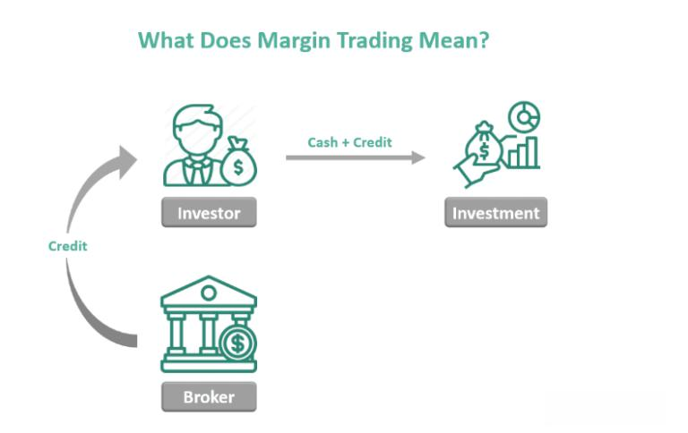

Foreign exchange (Forex) trading involves the exchange of currencies in a decentralized global marketplace. As the largest and most liquid financial market in the world, the Forex market has an average daily trading volume exceeding $6 trillion, which underscores its critical role in the global economy. It operates continuously with the exception of weekends, facilitating currency transactions among banks, governments, businesses, and investors worldwide.

In Forex trading, traders attempt to leverage fluctuations in currency pairs to achieve financial gain. Margin trading amplifies this endeavor by allowing individuals to open larger positions than their initial capital would permit. Through the use of borrowed funds, margin trading magnifies both potential returns and losses. It necessitates a deep understanding of risk management, as the amplified exposure can lead to substantial financial implications during volatile market conditions.



Algorithmic trading, often referred to as algo trading, utilizes computational algorithms to execute trades at optimal prices and speeds, which far exceed human capabilities. By systematically analyzing market data, these algorithms identify trading opportunities based on pre-defined criteria without emotional biases. This method has revolutionized the Forex market by enhancing efficiency, accessing liquidity, and mitigating costs.

The integration of these three components—Forex trading, margin trading, and algorithmic trading—is increasingly significant in contemporary financial markets. Their interplay facilitates a dynamic trading environment that caters to a wide array of investor objectives, from speculative endeavors to robust hedging strategies. This article aims to demystify these aspects of Forex trading, offering insights into how each element operates independently and synergistically. Readers are invited to explore their potential, assessing how these strategies might align with their own investment goals and risk tolerances. Ultimately, this examination serves as a stepping stone for those seeking to navigate the complexities of modern financial trading, empowering them with knowledge to make informed decisions in a rapidly evolving market landscape.

## Table of Contents

## Understanding the Forex Market

The Forex market, also known as the foreign exchange market or FX market, is a global decentralized marketplace for the trading of currencies. It is the largest and most liquid financial market in the world, with an average daily trading volume exceeding $6 trillion as of 2021. Unlike traditional stock markets, the Forex market operates 24 hours a day, five days a week, across major financial centers in different time zones, including London, New York, Tokyo, and Sydney.

A key feature of Forex trading is its high liquidity, which allows traders to buy and sell currencies quickly without causing significant price fluctuations. This liquidity is due to the market's large size and the constant supply of buyers and sellers. Another characteristic is the leverage that Forex trading offers. Leverage enables traders to control large positions with a relatively small amount of capital, amplifying both potential gains and losses.

Currency trading in the Forex market revolves around currency pairs. Each pair consists of two currencies: the base currency and the quote currency. The most traded currency pairs, known as major currency pairs, include EUR/USD (Euro/US Dollar), USD/JPY (US Dollar/Japanese Yen), GBP/USD (British Pound/US Dollar), and USD/CHF (US Dollar/Swiss Franc). These pairs involve the world's most prominent currencies and account for the majority of trades executed in the market.

The rate at which one currency is exchanged for another is called the exchange rate, and it fluctuates based on factors such as economic indicators, political events, and market speculation. For instance, if the exchange rate for EUR/USD increases from 1.1800 to 1.1850, it implies that one euro now buys more US dollars, signifying a strengthening of the euro against the dollar.

Major currencies, such as the US Dollar (USD), Euro (EUR), Japanese Yen (JPY), British Pound (GBP), and Swiss Franc (CHF), play a pivotal role in the Forex market. Due to their economic stability and global acceptance, these currencies are the most actively traded and are considered relatively safe investments. These currencies often serve as the base for currency pairs, with traders using them to speculate on or hedge against movements in other currencies.

In summary, the Forex market is characterized by its immense size, [liquidity](/wiki/liquidity-risk-premium), and continuous operation, with currency pairs and major currencies playing central roles in its dynamics. Understanding these elements is crucial for anyone engaging in Forex trading, as it provides insights into market behavior and the potential for profit.

## Margin Trading in Forex

Margin trading in Forex refers to the practice of using borrowed funds from a broker to trade currencies, thereby allowing traders to access larger positions than their initial investment might otherwise permit. This mechanism amplifies potential returns but also increases the risk, as losses can exceed the initial deposit.

In the Forex market, margin trading operates by requiring a trader to deposit a fraction of the total trade size, referred to as the margin. When a trader opens a position, the broker sets aside a portion of the trader's account as collateral and allows the use of leverage, which is expressed as a ratio, such as 50:1 or 100:1. For example, a leverage ratio of 100:1 means that for every dollar the trader deposits, they can control $100 in trade [volume](/wiki/volume-trading-strategy). This enhanced control allows traders to potentially earn significant returns on a relatively small investment.

The primary benefit of margin trading is the ability to achieve higher profits due to leverage. This means that even minor currency pair movements can lead to substantial profits because a larger portion of capital is at work. Moreover, margin trading offers greater trading flexibility, enabling traders to diversify their investments across different currency pairs, thereby mitigating risk through portfolio diversification.

However, margin trading inherently carries greater risk. Since both profits and losses are amplified, it is possible to incur losses that exceed the initial margin deposit. This potential for significant loss requires traders to implement risk management strategies, such as setting stop-loss orders to automatically close positions at predetermined loss levels. Additionally, trading on margin can lead to margin calls, whereby traders must deposit additional funds or close positions if the account equity falls below a specific threshold. These factors necessitate a comprehensive understanding of market dynamics and a disciplined approach to trading.

## Algorithmic Trading in Forex

Algorithmic trading, commonly referred to as algo trading, is the use of computer algorithms to automate trading strategies based on pre-defined criteria such as timing, price, and volume. This method leverages the computational power of computers to execute orders at speeds and frequencies that would be impossible for human traders.

### Definition of Algorithmic Trading

Algorithmic trading in the Forex market involves the execution of foreign exchange orders using algorithms and automated systems that are programmed to follow set rules. The algorithms monitor market conditions in real-time and make trading decisions based on pre-established criteria, such as technical indicators, price movements, and market data. These algorithms can operate autonomously, reducing the need for human intervention once the strategy is implemented.

### How Algorithms are Used in Forex Trading

In Forex trading, algorithms are typically employed for tasks such as:

1. **Trend Following**: Algorithms are programmed to recognize patterns or trends in currency prices and initiate trades when certain conditions are met. For instance, a simple moving average crossover strategy could be utilized, where a buy signal is generated when a short-term moving average crosses above a long-term moving average.

2. **Arbitrage**: This involves the simultaneous purchase and sale of an asset to profit from a difference in the price across different markets or platforms. Forex algo trading systems can swiftly identify and exploit such price discrepancies.

3. **Market Making**: Algorithms can provide liquidity to the market by continuously quoting buy and sell prices to capture the spread difference. This benefits traders by ensuring lower transaction costs due to tighter bid-ask spreads.

4. **Execution Strategies**: These strategies, such as Volume-Weighted Average Price (VWAP) or Time-Weighted Average Price (TWAP), enable traders to break down large trades into smaller increments to minimize market impact.

### Advantages of Using Algorithmic Trading Strategies

The use of [algorithmic trading](/wiki/algorithmic-trading) in Forex offers several advantages:

- **Speed and Efficiency**: Algorithms can process and act on vast amounts of data in milliseconds, enabling the execution of trades at speeds unattainable by manual trading. This is especially critical in the Forex market, which is highly liquid and volatile.

- **Precision and Elimination of Human Error**: Automated trading reduces the potential for human error that can arise from fatigue or emotional impulses. Algorithms execute trades with precision, following predefined rules without deviation.

- **Backtesting and Optimization**: Traders can backtest algorithms against historical data to evaluate their performance and refine strategies before deploying them live. This allows for the optimization of trading parameters to enhance profitability.

- **24/7 Market Monitoring**: Forex markets operate around the clock, and algo trading systems can monitor and trade in these markets without interruption, seizing trading opportunities as they arise.

In conclusion, algorithmic trading has transformed the Forex market by providing traders with sophisticated tools to enhance their trading strategies, improve execution speed, and capitalize on market opportunities efficiently. Despite these advantages, it is important for traders to remain vigilant about the risks and challenges involved in implementing these high-tech strategies.

## Integrating Margin and Algo Trading

Integrating margin and algorithmic (algo) trading can be a potent approach to maximizing returns in the Forex market. Margin trading allows traders to amplify their potential earnings by borrowing capital, while algorithmic trading leverages computational power to execute trades based on pre-defined criteria. When these methods are combined, they offer an expansive toolkit that can enhance profitability while introducing intricate challenges.

### How Margin and Algo Trading Can Be Used Together

Combining margin and algo trading involves using algorithms to make trading decisions and execute leveraged positions. This integration can allow for improved efficiency and precision in the execution of trades, potentially leading to higher returns.

For instance, a trader might develop an algorithm that identifies currency pairs with high [volatility](/wiki/volatility-trading-strategies) patterns and automatically places leveraged trades using margin accounts when certain conditions are met. The algorithm can quickly analyze large datasets to discern trends that a human trader might miss or react to too slowly.

A practical example could involve creating an algorithmic trading strategy that leverages technical indicators such as Moving Averages or the Relative Strength Index (RSI) to identify entry and [exit](/wiki/exit-strategy) points for trades. Coupled with rules for margin utilization, the algorithm can adjust the degree of leverage based on market volatility, optimizing the risk-return profile.

```python
import talib  # Technical Analysis Library
import numpy as np

# Hypothetical example of a trading strategy based on RSI
def execute_trade(prices, margin_factor):
    rsi = talib.RSI(prices, timeperiod=14)

    # Example of entering a leveraged position when RSI is oversold (<30)
    if rsi[-1] < 30:
        enter_leveraged_trade('buy', margin_factor)
    elif rsi[-1] > 70:
        enter_leveraged_trade('sell', margin_factor)

def enter_leveraged_trade(direction, margin_factor):
    # Placeholder function for executing a leveraged trade
    print(f"Executing {direction} trade with margin factor {margin_factor}")

# Sample data for demonstration
prices = np.random.uniform(low=1.0, high=1.2, size=100)

# Example margin utilization based on volatility
volatility = np.std(prices)
margin_factor = 1 + (volatility * 10)  # Simplified margin factor calculation

execute_trade(prices, margin_factor)
```

### Real-world Strategies Integrating Both Approaches

In actual trading scenarios, high-frequency trading ([HFT](/wiki/high-frequency-trading-strategies)) firms often employ integrated strategies. These firms utilize complex algorithms that operate on tight margins, executing thousands of trades per second to profit from small price discrepancies. The utilization of margin is critical in such environments to maximize potential returns while keeping capital requirements manageable.

Another example includes trend-following strategies that employ algorithmic models to identify emerging market trends and utilize margin to increase exposure accordingly. These strategies can programmatically adjust leverage ratios in response to changing risk parameters, thereby optimizing the risk-reward balance.

### Key Considerations and Potential Pitfalls

While the synergy between margin and algo trading can enhance profitability, it also introduces several considerations and potential risks:

1. **Risk Management**: The amplified exposure due to margin can lead to substantial losses if not properly managed. Algorithms must include robust risk management frameworks, such as stop-loss orders or dynamic position sizing.

2. **Market Volatility**: Algorithmic trading in a volatile market can lead to unpredictable outcomes. Market conditions can change rapidly, causing leveraged positions to result in significant losses.

3. **Algo Reliability**: The functionality and accuracy of the trading algorithms are critical. Bugs or errors in the code can lead to incorrect trades, potentially resulting in financial loss.

4. **Regulatory Compliance**: Traders must ensure compliance with relevant regulations, particularly concerning leverage limits and algorithmic trading disclosures.

5. **Liquidity Concerns**: High levels of leverage can lead to liquidity issues if the market moves unfavorably. Algorithms should account for liquidity constraints to avoid amplified losses.

Successful integration of margin and algorithmic trading requires thorough planning, continuous monitoring, and adaptiveness to market conditions. By addressing these considerations and leveraging real-world data, traders can maximize their returns while mitigating inherent risks.

## Key Risks in Margin and Algo Trading

Margin and algorithmic trading are popular strategies in the Forex market but each carries intrinsic risks that traders must be aware of and manage effectively. 

Margin trading involves borrowing funds from a broker to trade larger positions than one's capital would allow. This leverage can magnify both gains and losses. One major risk in margin trading is the potential for a margin call, which occurs when the equity in an account falls below the broker's required minimum margin. To mitigate this risk, traders should carefully monitor their leverage ratios and ensure they have sufficient funds in their accounts to cover potential losses. Implementing stop-loss orders is another prudent measure to prevent excessive losses, as these orders automatically close a position when it reaches a predetermined price level.

Algorithmic trading, which uses computer programs to execute trades based on predefined criteria, faces its own set of challenges. One such challenge is designing algorithms that can adapt to the changing market conditions, as unanticipated events can quickly render models obsolete. To manage this, continuous [backtesting](/wiki/backtesting) and optimization of algorithms are essential to ensure they perform effectively in various market environments. Another risk is related to technical failures, such as server downtimes or issues with data feeds, which can disrupt the execution of trades. Traders should employ robust technological infrastructure and implement redundancy measures to reduce these risks.

Market volatility poses a considerable risk to both margin and algorithmic trading. Sudden market movements can lead to significant losses, especially if trades are heavily leveraged or if algorithms are not designed to handle extreme volatility. By maintaining diversified portfolios and avoiding excessive leverage, traders can minimize the impact of volatility.

Finally, regulatory risks must also be considered. Changes in regulations can affect trading conditions or even the legality of certain strategies. Staying informed about current and upcoming regulatory changes can help traders adapt their strategies accordingly.

In summary, while margin and algorithmic trading offer significant profitability potential in Forex markets, they require careful risk management and a proactive approach to dealing with the challenges specific to each method. Traders are advised to employ risk management strategies, such as maintaining proper leverage levels, using stop-loss orders, continuously refining trading algorithms, and ensuring that technological and regulatory safeguards are in place.

## Choosing the Right Forex Broker

Selecting the right Forex broker is crucial for traders engaged in margin and algorithmic trading, as the broker plays a pivotal role in execution, security, and the overall trading experience. This decision can substantially impact the profitability and risk management of trading strategies. 

The significance of choosing an appropriate broker cannot be overstated. Margin trading involves borrowing capital from the broker to leverage trades, and algorithmic trading relies on technology and execution speed. Hence, a reliable, technologically adept broker can enhance the efficacy of these trading methods. 

Factors to consider when selecting a Forex broker include:

1. **Regulation and Security**: Ensure the broker is regulated by reputable financial authorities such as the FCA (UK), SEC (USA), or ASIC (Australia). Regulation assures that the broker adheres to strict financial standards, thereby safeguarding client funds.

2. **Trading Platforms and Technology**: A robust, user-friendly trading platform is essential, especially for algorithmic traders who require advanced tools and APIs. MetaTrader 4 and 5 are popular choices, but some brokers offer proprietary platforms with advanced analytical capabilities.

3. **Execution Speed and Reliability**: Fast and reliable trade execution is critical for both margin and algorithmic trading. Delays or slippage can severely affect trading outcomes, especially for high-frequency trading strategies.

4. **Leverage Options**: Different brokers offer varying degrees of leverage. While leverage can amplify gains, it also increases risk, so it is important to choose a broker with leverage options that align with the trader's risk tolerance and strategy.

5. **Fees and Spreads**: Consider the broker's fee structure, including spreads, commissions, and any additional charges. Lower costs can significantly enhance profitability, particularly for high-frequency algorithmic strategies where trade volumes are high.

6. **Customer Support and Service**: Effective customer service is vital for resolving issues promptly. Look for brokers offering 24/7 support with knowledgeable staff.

7. **Reputation and Reviews**: Investigate the broker's reputation through reviews and testimonials from other traders. A history of ethical practices and satisfaction among clients can be indicative of a broker's reliability.

Several brokers are recognized for their excellence in supporting margin and algorithmic trading. Some of these include:

- **Interactive Brokers**: Known for its advanced trading platform, wide range of instruments, and competitive pricing.
- **IG Group**: Offers a robust platform with comprehensive features for algorithmic trading and competitive spreads.
- **TD Ameritrade**: Provides an extensive range of trading tools, research, and customer support, though primarily focused on US markets.
- **Saxo Bank**: Offers a wide range of global markets and advanced trading platforms, ideal for professional traders.
- **OANDA**: Known for its superior execution, and it offers excellent trading platforms and market transparency.

Choosing the right Forex broker requires careful consideration of these factors to align with individual trading strategies and objectives, thereby increasing the likelihood of successfully navigating the Forex market.

## Conclusion

In this article, we have explored the multifaceted dimensions of Forex trading, specifically focusing on the intricacies of margin trading and algorithmic trading strategies. These components are integral to understanding modern financial markets, which are increasingly characterized by rapid technological advancements and complex financial instruments. 

The Forex market, being the largest financial market, facilitates substantial daily trading volumes, thus offering numerous opportunities for profit. Margin trading, while offering the potential for amplified returns through leverage, also entails significant risks that must be carefully managed to prevent substantial losses. On the other hand, algorithmic trading harnesses computational power to execute predefined strategies, enhancing efficiency and minimizing human error.

Looking forward, the future of Forex trading appears to be increasingly dominated by technological innovation. Algorithmic trading strategies are expected to become more sophisticated, incorporating elements of [machine learning](/wiki/machine-learning) and [artificial intelligence](/wiki/ai-artificial-intelligence). These advancements could revolutionize market analysis and decision-making, making it imperative for traders to adapt to these changes. Margin trading will continue to be a central feature of the Forex market, especially as more traders become adept at leveraging this tool responsibly.

We encourage readers to continue educating themselves about these dynamic trading opportunities. As technologies evolve and financial landscapes shift, staying informed is crucial for success. Exploring educational resources, engaging with trading communities, and continually analyzing market trends will empower traders to navigate the complexities of Forex trading effectively. By doing so, traders can make informed decisions that align with their financial goals and risk tolerance, positioning themselves advantageously in the evolving world of Forex trading.

## References & Further Reading

[1]: Chaboud, A. P., Chiquoine, B., Hjalmarsson, E., & Vega, C. (2014). ["Rise of the Machines: Algorithmic Trading in the Foreign Exchange Market."](https://www.jstor.org/stable/43612951) American Economic Journal: Macroeconomics, 6(4), 1-34.

[2]: King, M. R., & Rime, D. (2010). ["The $4 trillion question: What explains FX growth since the 2007 survey?"](https://www.bis.org/publ/qtrpdf/r_qt1012e.pdf) Bank for International Settlements Quarterly Review.

[3]: Dacorogna, M. M., Gençay, R., Müller, U. A., Olsen, R. B., & Pictet, O. V. (2001). ["An Introduction to High-Frequency Finance."](https://archive.org/details/an-introduction-to-high-frequency-finance) Academic Press.

[4]: Aldridge, I. (2013). ["High-Frequency Trading: A Practical Guide to Algorithmic Strategies and Trading Systems."](https://www.amazon.com/High-Frequency-Trading-Practical-Algorithmic-Strategies/dp/1118343506) Wiley.

[5]: Narang, R. K. (2013). ["Inside the Black Box: A Simple Guide to Quantitative and High-Frequency Trading,"](https://onlinelibrary.wiley.com/doi/book/10.1002/9781118662717) 2nd Edition. Wiley.