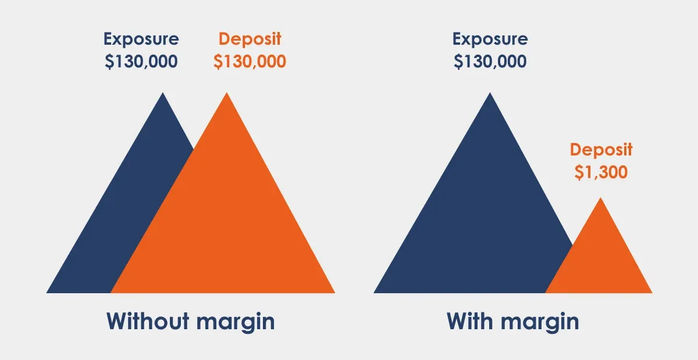

## Table of Contents

## What is margin trading in the Forex market?

Margin trading in the Forex market is when you borrow money from a broker to trade currencies. Instead of using all your own money, you use a small amount as a deposit, called margin, and the broker lends you the rest. This lets you control larger positions than you could with just your own funds. It's like using leverage, which can increase both your potential profits and your potential losses.

For example, if you want to trade $100,000 worth of currency, you might only need to put down $1,000 as margin. The rest, $99,000, is borrowed from the broker. If the currency you bought goes up in value, you can make a lot more money than if you had only used your $1,000. But if the currency goes down, you could lose more than your initial $1,000 because you still have to pay back the borrowed money. So, margin trading can be risky, and it's important to understand how it works before you start.

## How does margin trading differ from traditional trading?

Margin trading and traditional trading are different in how you use money to buy things. In traditional trading, you use only your own money to buy and sell. For example, if you have $1,000, you can only trade with that $1,000. You don't borrow any money, so your potential gains and losses are limited to what you can do with your own money.

In margin trading, you can borrow money from a broker to trade more than you could with just your own money. If you have $1,000, you might be able to trade with $100,000 by putting down your $1,000 as a margin and borrowing the rest. This is called using leverage. It can make your profits bigger if things go well, but it can also make your losses bigger if things go badly. So, margin trading can be riskier than traditional trading because you're using borrowed money.

## What are the basic requirements to start margin trading?

To start margin trading, you need to open a margin account with a broker. This is different from a regular trading account because it lets you borrow money. You'll need to fill out an application and agree to the broker's terms. The broker will also check your financial situation to make sure you can handle the risks of margin trading. They might ask for information about your income, savings, and investment experience.

Once your margin account is set up, you'll need to deposit some money into it. This money is called the initial margin, and it's the minimum amount you need to start trading. The amount can vary depending on the broker and the type of asset you want to trade. After you've made your deposit, you can start trading, but you'll need to keep an eye on your account. If your trades lose money, you might get a margin call, which means you'll need to add more money to your account to keep trading.

## What is leverage and how does it work in Forex margin trading?

Leverage in Forex margin trading is like using a magnifying glass for your money. It lets you control a big amount of money with just a little bit of your own. For example, if you have $1,000 and use leverage, you might be able to trade with $100,000. The broker lends you the rest of the money, and you only need to put down a small part of the total amount as a deposit, called the margin. This means you can make bigger profits if the currency you trade goes up in value.

But leverage can also make your losses bigger if the currency goes down. If your trades lose money, you still have to pay back the money you borrowed from the broker. So, if the market moves against you, you could lose more than the money you put in. That's why using leverage in Forex trading can be risky, and it's important to understand how it works before you start.

## What are the risks associated with margin trading?

Margin trading can be risky because you're borrowing money to trade. If the market goes against you, you could lose more money than you put in. This is because you have to pay back the money you borrowed from the broker, even if your trades lose money. So, if the value of the currency you bought goes down a lot, you could end up owing more money than you have in your account.

Another risk is getting a margin call. This happens when the money in your account falls below a certain level set by the broker. When you get a margin call, you have to add more money to your account quickly, or the broker might close your positions to cover the losses. This can be stressful and can happen suddenly, so you need to be ready to act fast if the market moves against you.

Overall, margin trading can lead to big gains, but it can also lead to big losses. It's important to understand these risks and to only trade with money you can afford to lose. Always keep an eye on your account and be prepared for the possibility that things might not go as planned.

## How can one manage risk when margin trading in Forex?

Managing risk when margin trading in Forex is important to protect your money. One way to do this is by setting stop-loss orders. A stop-loss order is like a safety net that automatically closes your trade if the currency price goes down to a certain level. This can help you limit how much money you might lose on a single trade. Another way to manage risk is by not using too much leverage. Leverage can make your profits bigger, but it can also make your losses bigger. So, it's smart to use less leverage, especially if you're new to trading.

It's also a good idea to keep an eye on your account and make sure you have enough money in it. If your trades start losing money, you might get a margin call from your broker. A margin call means you need to add more money to your account quickly, or the broker might close your trades to cover the losses. To avoid this, you can keep some extra money in your account as a buffer. This way, you're prepared if the market moves against you.

Lastly, it's helpful to learn as much as you can about Forex trading and to practice with a demo account before you start trading with real money. A demo account lets you trade without risking any money, so you can get a feel for how the market works and test your strategies. By understanding the market and practicing, you can make better decisions and manage your risks better when you start trading for real.

## What are margin calls and how do they work?

A margin call happens when the money in your trading account falls below a certain level set by your broker. This can happen if the value of the currencies you're trading goes down a lot. When you get a margin call, it means you need to add more money to your account quickly. If you don't, the broker might close your trades to cover the losses. This is to make sure you can pay back the money you borrowed from them.

Margin calls are important because they help manage the risk for both you and the broker. When you trade on margin, you're using borrowed money, so the broker needs to make sure you can pay it back. If your trades are losing money and your account balance gets too low, the broker will ask you to add more money to keep your trades open. It's a way to protect everyone involved, but it can be stressful and you need to be ready to act fast if you get a margin call.

## What strategies are effective for margin trading in Forex?

One effective strategy for margin trading in Forex is to use stop-loss orders. A stop-loss order is like a safety net that automatically closes your trade if the currency price goes down to a certain level. This helps you limit how much money you might lose on a single trade. Another strategy is to not use too much leverage. Leverage can make your profits bigger, but it can also make your losses bigger. So, it's smart to use less leverage, especially if you're new to trading. This way, you can keep your risks smaller and still have a chance to make money.

Another good strategy is to keep an eye on your account and make sure you have enough money in it. If your trades start losing money, you might get a margin call from your broker. A margin call means you need to add more money to your account quickly, or the broker might close your trades to cover the losses. To avoid this, you can keep some extra money in your account as a buffer. This way, you're prepared if the market moves against you. It's also a good idea to learn as much as you can about Forex trading and to practice with a demo account before you start trading with real money. This helps you understand the market better and make smarter decisions.

## How does margin trading affect currency pair selection?

When you're doing margin trading in Forex, the currency pairs you choose can make a big difference. Some currency pairs are more stable and don't move around as much, like major pairs such as EUR/USD or USD/JPY. These pairs might be safer to trade with margin because they don't have big swings in price, which can help you avoid big losses. On the other hand, if you pick more volatile pairs, like exotic pairs that involve currencies from smaller economies, the prices can change a lot more quickly. This can be riskier when you're using margin because even small changes can lead to big losses or gains.

Choosing the right currency pair also depends on how much leverage you're using. If you're using a lot of leverage, it's usually better to stick with more stable pairs to keep your risks lower. But if you're comfortable with more risk and you understand the market well, you might choose more volatile pairs to try and make bigger profits. The key is to match your currency pair selection with your risk tolerance and trading strategy, so you can manage your margin trading more effectively.

## What are the regulatory considerations for margin trading in different countries?

Margin trading rules can be different in different countries. In the United States, the Commodity Futures Trading Commission (CFTC) and the National Futures Association (NFA) set rules for Forex trading. They have limits on how much leverage you can use, like a maximum of 50:1 for major currency pairs. This is to help protect traders from big losses. In the European Union, the European Securities and Markets Authority (ESMA) also has rules. They limit leverage to 30:1 for major currency pairs and even less for others. These rules are there to make trading safer for everyone.

In other places, like Australia, the Australian Securities and Investments Commission (ASIC) oversees Forex trading. They don't have strict leverage limits like the US or EU, but they still have rules to protect traders. In Japan, the Financial Services Agency (FSA) sets the rules, and they have leverage limits too. Each country has its own way of making sure margin trading is fair and safe. So, if you're thinking about margin trading, it's a good idea to learn about the rules in your country or where your broker is based.

## How do advanced traders use margin trading to optimize their Forex strategies?

Advanced traders use margin trading to fine-tune their Forex strategies by taking advantage of the increased buying power that leverage provides. They carefully select currency pairs based on their [volatility](/wiki/volatility-trading-strategies) and market conditions, often focusing on major pairs like EUR/USD or USD/JPY for more stability. By using less leverage on these pairs, they can manage risk better while still aiming for significant profits. They also use technical analysis tools like charts and indicators to spot trends and entry points, helping them make more informed trading decisions. This way, they can enter and [exit](/wiki/exit-strategy) trades at the right times, maximizing their potential gains while minimizing losses.

Another way advanced traders optimize their strategies is by diversifying their trades across different currency pairs and time frames. They might use margin to open multiple positions, spreading their risk and increasing their chances of making money. They also set strict stop-loss and take-profit orders to automatically manage their trades, which helps them stick to their trading plan and avoid emotional decisions. By constantly monitoring their account balance and being ready for margin calls, they can react quickly to market changes and adjust their strategies as needed. This disciplined approach helps them use margin trading effectively and safely to achieve their trading goals.

## What are the latest trends and tools for margin trading in the Forex market?

In the Forex market, one of the latest trends in margin trading is the use of [algorithmic trading](/wiki/algorithmic-trading). This means traders use computer programs to automatically buy and sell currencies based on set rules. These programs can analyze lots of data quickly and make trades without emotions getting in the way. Many traders use these algorithms to take advantage of small price changes in the market, which can add up to big profits over time. Another trend is the increasing use of social trading platforms, where traders can copy the trades of more experienced traders. This helps new traders learn from the pros and can make margin trading easier and less risky.

New tools are also making margin trading more accessible and efficient. One popular tool is the mobile trading app, which lets traders manage their accounts and make trades from their phones. This means they can keep an eye on the market and react quickly, no matter where they are. Another helpful tool is the risk management software, which helps traders set up stop-loss and take-profit orders easily. These tools can automatically close trades at certain price levels, helping traders stick to their strategies and manage their risks better. Overall, these trends and tools are making margin trading in Forex more advanced and user-friendly for traders of all levels.

## References & Further Reading

[1]: Chaboud, A. P., Chiquoine, B., Hjalmarsson, E., & Vega, C. (2014). ["Rise of the Machines: Algorithmic Trading in the Foreign Exchange Market."](https://www.jstor.org/stable/43612951) American Economic Journal: Macroeconomics, 6(4), 1-34.

[2]: King, M. R., & Rime, D. (2010). ["The $4 trillion question: What explains FX growth since the 2007 survey?"](https://www.bis.org/publ/qtrpdf/r_qt1012e.pdf) Bank for International Settlements Quarterly Review.

[3]: Dacorogna, M. M., Gençay, R., Müller, U. A., Olsen, R. B., & Pictet, O. V. (2001). ["An Introduction to High-Frequency Finance."](https://archive.org/details/an-introduction-to-high-frequency-finance) Academic Press.

[4]: Aldridge, I. (2013). ["High-Frequency Trading: A Practical Guide to Algorithmic Strategies and Trading Systems."](https://www.amazon.com/High-Frequency-Trading-Practical-Algorithmic-Strategies/dp/1118343506) Wiley.

[5]: Narang, R. K. (2013). ["Inside the Black Box: A Simple Guide to Quantitative and High-Frequency Trading,"](https://onlinelibrary.wiley.com/doi/book/10.1002/9781118662717) 2nd Edition. Wiley.