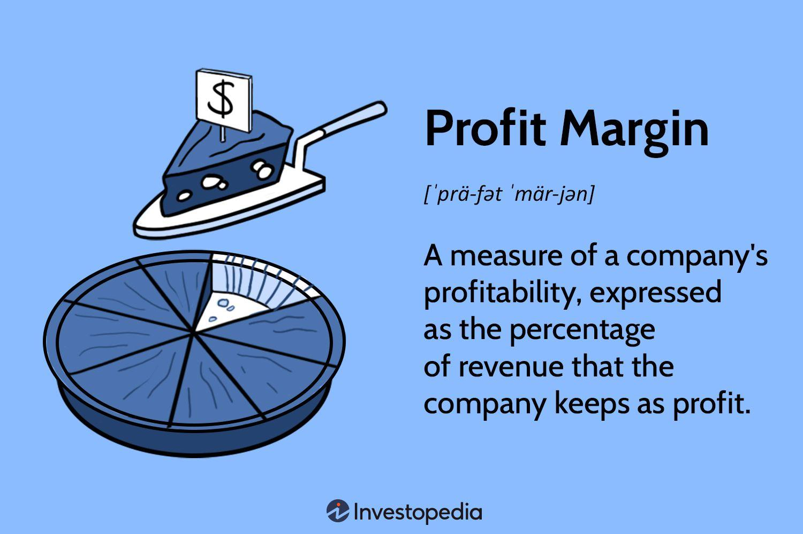

## Table of Contents

## What is a margin in financial terms?

In financial terms, a margin is the difference between the selling price of a product or service and the cost of producing it. This difference is important because it shows how much money a business makes from each sale after covering the costs. For example, if a store buys a shirt for $10 and sells it for $20, the margin is $10. This margin helps the business pay for other expenses like rent, salaries, and utilities.

Margins are also used in investing, particularly in trading stocks or other financial instruments. When someone buys stocks on margin, they are borrowing money from a broker to purchase more stocks than they could afford with their own money. This can increase potential profits but also increases the risk because if the stock price falls, the investor might lose more than their initial investment. Brokers usually require a minimum amount of money, called the margin requirement, to be kept in the account to cover potential losses.

## How does margin trading work?

Margin trading is when you borrow money from a broker to buy more stocks or other investments than you could with just your own money. Imagine you want to buy $10,000 worth of stocks, but you only have $5,000. With margin trading, the broker lends you the other $5,000. This way, you can buy more stocks and maybe make more money if the stock price goes up. But remember, you have to pay back the broker with interest, so it's like taking a loan.

The tricky part about margin trading is the risk. If the stock price goes down, you could lose more than the money you put in. Brokers have rules to protect themselves and you. They might ask for a "margin call," which means you need to add more money to your account if your investments start losing value. If you can't add more money, the broker can sell your stocks to get their money back. So, margin trading can help you make more money, but it can also lead to bigger losses if things don't go as planned.

## What is the difference between initial margin and maintenance margin?

Initial margin is the amount of money you need to put into your account when you start margin trading. It's like a down payment. If you want to buy $10,000 worth of stocks on margin, and the initial margin requirement is 50%, you need to put in $5,000 of your own money. The broker will lend you the other $5,000. This initial margin is important because it shows the broker that you have some skin in the game and can handle the trade.

Maintenance margin is different. It's the minimum amount of money that must stay in your account after you start trading. Brokers set this lower amount to make sure you can cover potential losses. If your account balance drops below the maintenance margin because the stock price goes down, you'll get a margin call. You'll need to add more money or sell some of your stocks to bring your account back up to the required level. This helps protect both you and the broker from big losses.

## Can you explain the concept of margin call?

A margin call happens when the value of your investments drops too low and you need to add more money to your account. When you trade on margin, you borrow money from your broker to buy more stocks than you could with your own cash. But if those stocks lose value, your account balance can go below a certain level called the maintenance margin. When this happens, your broker will ask you for more money to bring your account back up to a safe level.

If you get a margin call, you have a few choices. You can add more money to your account to meet the maintenance margin requirement. Or, you can sell some of your stocks to raise the cash needed. If you don't do either of these things quickly enough, your broker might sell your stocks without asking you first to get their money back. This is why margin calls are important to understand – they can help you manage your investments and avoid big losses.

## How does margin affect the risk and potential return on an investment?

Margin trading can make your investments riskier but also increase your potential returns. When you use margin, you're borrowing money to buy more stocks than you could with your own cash. If the stock price goes up, you can make more money because you own more stocks. For example, if you buy $10,000 worth of stocks with $5,000 of your money and $5,000 borrowed, and the stock price doubles, you earn twice as much as if you had only used your own money.

However, using margin also means you could lose more money if the stock price goes down. If the stocks you bought on margin lose value, you still have to pay back the money you borrowed plus interest. If the price drops a lot, you might get a margin call, which means you need to add more money to your account or sell some stocks. If you can't do that, your broker might sell your stocks at a loss to get their money back. So, margin trading can lead to bigger wins, but it also comes with the risk of bigger losses.

## What are margin requirements and who sets them?

Margin requirements are the rules that say how much money you need to have in your account when you trade on margin. There are two main types: initial margin and maintenance margin. Initial margin is the amount you need to start trading, kind of like a down payment. Maintenance margin is the minimum amount that must stay in your account after you start trading. If your account balance drops below this level, you might get a margin call and need to add more money or sell some stocks.

These requirements are set by different groups. The main one is the Financial Industry Regulatory Authority (FINRA), which makes rules for the whole industry. They set a minimum initial margin requirement of 50% and a maintenance margin of at least 25%. But individual brokers can set their own rules, which might be even stricter. So, it's important to check with your broker to know their specific margin requirements before you start trading on margin.

## How can margin be used in forex trading?

In [forex](/wiki/forex-system) trading, margin is used to control larger positions with a smaller amount of money. When you trade forex, you're trading currencies, and the market moves in small increments called pips. Instead of buying a whole lot of currency, which could be very expensive, you use margin to put down a small amount of money as a deposit. This deposit, known as the margin, lets you open a much bigger position than you could afford with just your own money. For example, if you want to trade $100,000 worth of currency, you might only need to put down $1,000 as margin, depending on the broker's requirements.

Using margin in forex trading can increase your potential profits, but it also comes with more risk. If the currency moves in your favor, you can make more money because you're controlling a larger position. But if the currency moves against you, you can lose more than your initial deposit. Brokers set something called a margin call level, which is the point at which you need to add more money to your account or close some of your positions to avoid bigger losses. So, while margin can help you trade more with less money, it's important to understand the risks involved and manage your trades carefully.

## What are the benefits of using margin in trading?

Using margin in trading can help you make more money. When you trade on margin, you borrow money from your broker to buy more stocks or other investments than you could with just your own money. If the price of what you're trading goes up, you can make bigger profits because you own more of it. For example, if you use margin to buy twice as many stocks and the price doubles, you'll make twice as much money as if you had only used your own cash. This means you can grow your investment faster than if you were just using the money you have.

But margin also comes with some other benefits. It lets you take advantage of opportunities you might miss if you only used your own money. If you see a good chance to invest but don't have enough cash, margin can help you act quickly. Plus, it can help you diversify your investments. Instead of putting all your money into one stock, you can spread it across different investments, which can lower your risk. Just remember, while margin can help you make more money, it also comes with more risk, so you need to be careful and manage your trades well.

## What are the potential risks and downsides of trading on margin?

Trading on margin can be risky because you're borrowing money to buy more stocks than you could with just your own cash. If the price of the stocks goes down, you could lose more money than you put in. This is because you still have to pay back the money you borrowed, plus interest. If your investments lose too much value, you might get a margin call. This means you need to add more money to your account or sell some stocks to cover the losses. If you can't do that, your broker might sell your stocks at a bad time, which could make your losses even bigger.

Another downside of margin trading is the stress it can cause. Since you're using borrowed money, you have to watch your investments closely. The market can change quickly, and if your stocks start losing value, you need to act fast to avoid a margin call. This can be stressful and time-consuming. Also, if you don't manage your trades well, you could end up owing more money than you can afford to pay back. So, while margin trading can help you make more money, it also comes with a lot of risks that you need to be aware of and prepared to handle.

## How do margin accounts differ from cash accounts?

A margin account lets you borrow money from your broker to buy more stocks than you could with just your own money. This means you can buy more stocks and maybe make more money if the stock price goes up. But, you have to pay back the money you borrowed, plus interest. If the stock price goes down, you could lose more money than you put in. Your broker might ask for more money if your investments start losing value, which is called a margin call. If you can't add more money, the broker might sell your stocks to get their money back.

A cash account is different because you can only buy stocks with the money you have in your account. You don't borrow any money, so you can't lose more than what you put in. This makes cash accounts less risky than margin accounts. But, you also can't buy as many stocks, so your potential profits might be smaller. With a cash account, you don't have to worry about margin calls or paying back borrowed money. It's simpler and safer, but it might limit how much you can grow your investments.

## What strategies can be employed to manage margin effectively?

To manage margin effectively, it's important to keep a close eye on your investments. Check your account regularly to make sure the value of your stocks isn't dropping too much. If it is, you might get a margin call, which means you need to add more money or sell some stocks. It's a good idea to set up alerts with your broker so you know when your account is getting close to the maintenance margin level. This way, you can act quickly and avoid big losses.

Another strategy is to only use margin for investments you feel confident about. Don't borrow money to buy risky stocks that might lose value fast. Instead, use margin for stocks that you think will go up in price steadily. Also, try not to use all the margin your broker allows. Keep some extra money in your account as a cushion. This can help you avoid margin calls and give you more time to make decisions if the market changes.

Lastly, think about your overall financial situation before using margin. Only use money you can afford to lose, and make sure you have a plan for paying back what you borrow. It's also smart to diversify your investments so you're not putting all your money into one stock. By spreading out your investments, you can lower your risk and manage margin more effectively.

## How do regulatory bodies monitor and control margin trading practices?

Regulatory bodies like the Financial Industry Regulatory Authority (FINRA) keep an eye on margin trading to make sure it's safe and fair. They set rules that say how much money you need to start trading on margin and how much you need to keep in your account while you're trading. For example, FINRA says you need at least 50% of the stock's value to start trading on margin, and you need to keep at least 25% in your account after you start. These rules help protect both you and the brokers from big losses.

Brokers also have to follow these rules, but they can set even stricter ones if they want to. Regulators check to make sure brokers are following all the rules. They do this by looking at the brokers' records and making sure they're not letting people trade on margin without enough money. If a broker isn't following the rules, the regulators can fine them or even stop them from letting people trade on margin. This helps keep the market safe and fair for everyone.

## What is Margin Buying and Leverage?

Margin buying, a pivotal aspect of trading algorithms, involves borrowing funds to purchase securities, aiming to amplify potential returns. This practice enables traders to access a position larger than their capital would otherwise allow, by leveraging borrowed funds. The allure of margin buying lies in its capacity to enhance returns on investment. However, it also significantly magnifies the risks involved. For instance, if a trader uses $1,000 of their own capital alongside $1,000 borrowed on margin to purchase $2,000 worth of securities, a 10% gain in the securities’ value results in a $200 profit, doubling the trader’s original investment gain. Conversely, a 10% decline would wipe out the trader's initial capital completely, illustrating the amplified risk.

Leverage, in this context, is the use of various financial instruments or borrowed capital to increase potential returns on investment. It is a double-edged sword; while it can potentially increase profits, it also increases the risk of significant losses. The total exposure of a leveraged position can be expressed as:

$$
\text{Total Exposure} = \text{Equity} + \text{Borrowed Capital}
$$

This formula underscores the trader's amplified market exposure relative to their actual financial commitment.

Historically, leverage has played a critical role in financial markets, particularly noticeable during the 1920s leading up to the 1929 stock market crash. The 1920s experienced an unprecedented stock market boom, propelled partly by easy access to credit and rampant margin buying. Investors were able to purchase stocks with as little as 10% down, known as “buying on margin.” This period saw stock prices soar as leverage enabled more participants to enter the market, inflating stock valuations beyond their intrinsic value.

However, the excessive use of leverage also laid the groundwork for the catastrophic 1929 crash. When confidence waned and the market began to decline, margin calls forced investors to liquidate their holdings to cover their borrowed funds, exacerbating the downward spiral. The cascading effect of these forced liquidations contributed to the rapid and extreme market downturn.

The lessons from the late 1920s underscore the critical importance of managing leverage within trading strategies. While leverage can augment returns, its mismanagement can lead to significant financial distress, both on an individual and systemic level. For [algorithmic trading](/wiki/algorithmic-trading), the challenge lies in creating models that judiciously use leverage to optimize returns while implementing robust risk management practices to mitigate potential adverse outcomes.

## What is Short Selling and Margin?

Short selling is a trading strategy that allows investors to profit from a decline in the price of a security. In the context of margin trading, short selling involves borrowing securities and selling them with the expectation of repurchasing them at a lower price. The primary benefit of short selling is that it enables traders to capitalize on anticipated downturns, thus providing opportunities for profit even in declining markets. However, it also introduces unique risks, particularly when combined with margin trading.

When engaging in short selling, a trader borrows shares from a broker to sell them on the open market. The borrowed securities act as collateral for the transaction. The trader then aims to buy the same number of shares back at a lower price, return them to the lender, and pocket the price difference as profit. This strategy relies heavily on accurate market predictions and can be risky if the market moves against the trader's expectations.

### Profit and Loss Dynamics in Short Selling with Margin

The profit and loss dynamics in margin-based short selling are determined by several [factor](/wiki/factor-investing)s, including the initial selling price, repurchase price, and the interest or fees incurred on the borrowed funds. The basic formula for calculating profit or loss in a short sale is:

$$

\text{Profit/Loss} = (\text{Initial Sale Price} - \text{Repurchase Price}) \times \text{Number of Shares} - \text{Interest \& Fees}
$$

Let's consider a practical example:

1. A trader short sells 100 shares of a company at $50 per share, hoping the price will drop.
2. The initial proceeds from the sale are $5,000.
3. After some time, the stock price drops to $40, and the trader decides to cover the short position by purchasing the shares back.
4. The repurchase cost is $4,000.
5. Assuming a $100 fee for borrowing the securities, the net profit would be calculated as follows:

$$
\text{Profit} = (5,000 - 4,000) - 100 = 900
$$

### Risks Associated with Margin in Short Selling

While the potential for profit exists, the margin component of short selling magnifies both gains and losses. One significant risk is that there is theoretically unlimited loss potential. If the stock price increases instead of decreases, the trader must still repurchase the shares, potentially at a much higher price. Unlike traditional investments, where the maximum loss is the amount invested, losses in short selling can exceed the initial investment, especially when margin is involved.

Moreover, market [volatility](/wiki/volatility-trading-strategies) and broker-imposed margin calls can exacerbate losses. If the stock price rises significantly and the trader's margin account falls below the broker's maintenance requirement, a margin call may be triggered, forcing the trader to add more capital to the account or close out the position at a loss.

In summary, while short selling with margin offers lucrative opportunities in declining markets, it requires careful risk management and a deep understanding of market dynamics. Traders must be cognizant of the costs associated with borrowing securities and be prepared for the potential of rapid and significant losses.

## What are margin calls and what is their impact?

A margin call occurs when the value of an investor's collateral falls below the required margin level set by the brokerage. This situation prompts the brokerage to request additional funds or securities to restore the account to the required margin level. The condition that triggers a margin call is primarily a decrease in the value of the securities held in a margin account, reducing the equity balance. The formula for a margin call can be expressed as:

$$
\text{Equity} = \text{Market Value of Securities} - \text{Loaned Amount}
$$

$$
\text{Equity} < \text{Maintenance Margin Requirement}
$$

When a margin call is triggered, traders may face several consequences that can significantly impact their trading strategies. Firstly, they need to provide additional capital or sell portions of their positions, potentially at a loss, to meet the margin requirement. This forced liquidation can disrupt planned strategies, particularly in algorithmic trading where specific conditions and setups are critical. Moreover, the need to replenish capital can strain financial resources and reduce the trader's ability to take advantage of other market opportunities.

Historically, margin calls have played crucial roles in notable financial events, such as the Silver Thursday crash of March 27, 1980. During this event, the Hunt brothers had accumulated a massive position in silver, financed primarily through borrowed money. As silver prices began to decline, margin calls were triggered, forcing the liquidation of positions at lower prices and exacerbating the market crash. This event highlighted the systemic risks associated with excessive leverage and the domino effect that margin calls could initiate, both on individual traders and the broader financial market. The lessons from Silver Thursday underscore the importance of prudent risk management and the need for regulations to mitigate excessive leverage and its potentially destabilizing effects on financial markets.

## How can margin usage be optimized in algorithmic trading?

Optimizing margin usage in algorithmic trading is crucial for enhancing trading efficiency and managing risks. To achieve this, traders can employ various methods and tools designed to maximize return on investment while ensuring adequate risk management.

One effective approach is the use of sophisticated algorithmic models that analyze historical data and current market conditions to determine optimal leverage levels. These models can dynamically adjust margin allocation based on market volatility, [liquidity](/wiki/liquidity-risk-premium), and the trader's risk tolerance. By doing so, they ensure that traders are neither over-leveraged nor underutilizing available margin, thus maintaining a balanced and efficient trading strategy.

Risk management tools, such as stop-loss orders and dynamic hedging, play an essential role in optimizing margin usage. Stop-loss orders automatically [exit](/wiki/exit-strategy) a position when a certain loss threshold is reached, preventing excessive loss and preserving capital. Dynamic hedging adjusts positions in real time to offset potential losses in other areas of the portfolio, effectively managing risk and optimizing margin utilization.

Portfolio optimization techniques, such as mean-variance optimization, can also enhance margin efficiency. These techniques help identify the optimal asset allocation that maximizes expected return for a given level of risk, leading to more efficient use of margin. The optimization is generally guided by the formula:

$$

\text{Maximize} \:\: E(R_p) - \frac{\lambda}{2} \cdot \text{Var}(R_p) 
$$

where $E(R_p)$ is the expected portfolio return, $\lambda$ is the risk aversion factor, and $\text{Var}(R_p)$ is the portfolio return variance.

Return on Margin (ROM) serves as a vital performance metric in trading, measuring the efficiency of margin usage by comparing profit to the amount of margin employed. ROM is calculated as:

$$

\text{ROM} = \frac{\text{Net Profit}}{\text{Used Margin}} 
$$

A high ROM indicates that the trade strategy effectively generates profits relative to the margin used, which traders aim to maximize by optimizing leverage and position sizes. Algorithmic trading systems often include features for measuring and optimizing ROM to ensure that margin is used efficiently and profitably.

Moreover, deploying automated risk management systems that include margin monitoring and alerts can ensure that traders remain informed of their margin status and can act swiftly to reallocate resources when necessary. These systems help prevent margin calls and optimize the deployment of trading capital.

In conclusion, optimizing margin usage in algorithmic trading involves a combination of sophisticated algorithmic models, risk management tools, and performance metrics like ROM. By employing these techniques, traders can enhance their trading efficiency, reduce risk, and improve overall returns.

## References & Further Reading

[1]: ["Advances in Financial Machine Learning"](https://www.amazon.com/Advances-Financial-Machine-Learning-Marcos/dp/1119482089) by Marcos Lopez de Prado

[2]: ["Evidence-Based Technical Analysis: Applying the Scientific Method and Statistical Inference to Trading Signals"](https://www.amazon.com/Evidence-Based-Technical-Analysis-Scientific-Statistical/dp/0470008741) by David Aronson

[3]: ["Machine Learning for Algorithmic Trading"](https://github.com/PacktPublishing/Machine-Learning-for-Algorithmic-Trading-Second-Edition) by Stefan Jansen

[4]: ["Quantitative Trading: How to Build Your Own Algorithmic Trading Business"](https://books.google.com/books/about/Quantitative_Trading.html?id=j70yEAAAQBAJ) by Ernest P. Chan