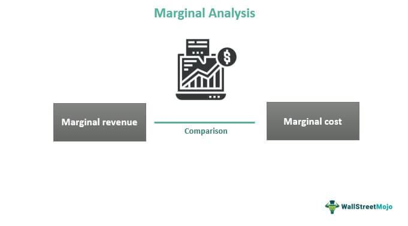

Economic frameworks are essential for analyzing the intricate relationships between market dynamics and business decision-making processes. They provide the foundation for understanding how businesses interact with markets and how they adapt to changes in economic conditions. Microeconomics is a fundamental branch of economics that focuses on the behaviors of individuals and firms within these market structures. It explores how these entities make decisions about resource allocation, production, and consumption, effectively dissecting the mechanisms of supply and demand that dictate pricing.

Marginal analysis, a pivotal concept within microeconomics, plays a crucial role in decision-making by helping businesses evaluate the additional benefits and costs associated with incremental changes in their operations. This type of analysis is instrumental in determining optimal levels of production and can guide firms in making informed choices that enhance operational efficiency and maximize profit margins. By calculating and comparing marginal costs and benefits, businesses can strategically optimize the use of their resources.



In the modern financial landscape, algorithmic trading represents an evolution in applying these economic principles. This technology-driven approach uses algorithms to automate trading processes, integrating microeconomic concepts and marginal analysis to refine trading strategies for maximum efficiency and profitability. Algorithmic trading systems analyze vast amounts of market data to evaluate potential trades by assessing the marginal expected returns against the marginal transaction costs. This continuous examination of market conditions allows algorithms to adjust trading parameters dynamically, ensuring that trade executions align with strategic financial goals.

This article will examine the connections between business economics, microeconomics, marginal analysis, and algorithmic trading. By exploring these intersections, we aim to elucidate how businesses can apply these concepts to foster efficient decision-making, streamline operations, and achieve competitive advantages in the marketplace.

## Table of Contents

## Understanding Business Economics and Microeconomics

Business economics is a field that integrates economic theory with business practices to assess and develop strategies for enterprise success. It addresses the strategies, structures, and profitability of business entities, focusing on the application of various economic principles and methodologies to solve practical challenges. This discipline is inherently linked with microeconomics, which provides a foundation for understanding the mechanisms of supply and demand that govern the pricing of goods and services in competitive markets.

Microeconomics, one of the main branches of economics, studies how individual entities such as consumers and firms make decisions about allocation of resources. It analyzes factors that influence decisions regarding production and consumption under conditions of scarcity, thereby shaping market dynamics. The primary focus of microeconomics is on understanding the behaviors and interactions of individuals and firms in making choices that lead to efficient resource distribution.

A core component of microeconomic analysis is the concept of supply and demand. Demand refers to the relationship between the price of a product and the quantity of the product that consumers are willing and able to purchase at that price. Conversely, supply pertains to the relationship between the price of a good and the quantity that producers are willing to sell. The intersection of the demand and supply curves determines the market equilibrium, signifying the ideal price and quantity at which goods and services should be exchanged in a market.

Furthermore, microeconomics investigates how decisions about resource allocation affect production outputs and consumption patterns. It investigates into various market structures, including perfect competition, monopoly, and oligopoly, to understand how these impact pricing strategies and market power. Businesses use these insights to make informed decisions regarding pricing, product development, and competitive positioning.

Fundamental to microeconomics is the understanding of how businesses make decisions about resource allocation. This involves examining opportunity costs and trade-offs, which are crucial for determining the most efficient use of limited resources. For instance, businesses allocate resources to certain projects by comparing the expected returns against alternative investments, a process which is heavily reliant on marginal analysis—a subject further explored in subsequent sections.

In summary, grasping the principles of business economics and microeconomics is critical for comprehending how firms can optimize their strategies and operations through effective decision-making. By evaluating supply and demand dynamics and resource allocation strategies, businesses can enhance their market positioning, improving both sustainability and profitability.

## Marginal Analysis: A Key Decision-Making Tool

Marginal analysis is a pivotal concept in economics, aiding businesses in evaluating the incremental benefits and costs associated with changes in their operations. This form of analysis is particularly applied in production settings to assess the impact of modifying production levels. By examining marginal changes, businesses can make informed decisions about scaling their operations up or down, directly influencing their efficiency and profitability.

At its core, marginal analysis seeks to identify the optimal point where marginal benefits, the additional gains derived from the next unit of production, equate to marginal costs, the extra expense incurred from producing that additional unit. This equilibrium, $MB = MC$, represents the most efficient allocation of resources, ensuring that resources are neither over-utilized nor under-utilized. The result is maximized economic efficiency: resources are allocated to their best use, minimizing waste while maximizing output. 

In practical business terms, marginal analysis is instrumental in evaluating the profitability of new projects or expansions. When considering a new endeavor, a business must weigh the incremental revenues against the incremental costs. For instance, if a company is contemplating the expansion of its product line, marginal analysis will assist in determining whether the expected additional revenue will justify the additional costs. A Python snippet might analyze this scenario using hypothetical data:

```python
def marginal_analysis(marginal_revenue, marginal_cost):
    if marginal_revenue > marginal_cost:
        return "Proceed with the expansion"
    elif marginal_revenue < marginal_cost:
        return "Do not proceed"
    else:
        return "Indifferent"

# Example
marginal_revenue = 5000
marginal_cost = 4500
decision = marginal_analysis(marginal_revenue, marginal_cost)
print(decision)
```

This straightforward analysis provides critical insight into business resource allocation decisions. By focusing on the changes at the margin, businesses can respond nimbly to market conditions, driving profitability and sustainability through strategic operations management.

## The Role of Marginal Analysis in Microeconomics

Marginal analysis is a fundamental concept in microeconomics, providing insights into how individual firms and consumers make decisions under varying economic conditions. It focuses on understanding the implications of small changes in production or consumption, allowing businesses to make informed decisions that enhance their operational efficiency and profitability.

One of the key applications of marginal analysis in microeconomics is in assessing the impact of incremental changes in production levels. For example, consider a firm evaluating whether to increase its output. Marginal analysis would involve comparing the marginal cost (MC) and marginal revenue (MR) of producing an additional unit of output. Mathematically, the condition for profit maximization is expressed as:

$$
MR = MC
$$

When marginal revenue equals marginal cost, the firm achieves an optimal production level, as any further increase would result in higher costs than revenue, decreasing overall profit. Similarly, if marginal revenue exceeds marginal cost, it indicates potential for increased profitability through expanded production.

Additionally, marginal analysis aids firms in evaluating opportunity costs, which is essential for decision-making regarding resource allocation. For instance, when considering whether to hire additional labor or invest in new machinery, a firm would analyze the marginal benefits against the marginal costs of each option. This helps determine the most cost-effective resource allocation strategy that maximizes profitability.

In microeconomic terms, businesses often employ marginal analysis to evaluate consumer demand and pricing strategies. By assessing the elasticity of demand, firms can set prices that optimize revenue without deterring customers. For example, if a small price increase results in a proportionately smaller decrease in quantity demanded, the firm can raise prices without significantly affecting sales [volume](/wiki/volume-trading-strategy), hence boosting revenue.

Through marginal analysis, firms strive to achieve maximum efficiency by effectively balancing resource input and output levels. By continuously analyzing marginal changes, businesses can adapt to market dynamics and respond to shifts in consumer preferences or technological advancements. This dynamic approach ensures that firms remain competitive and profitable in a fluctuating economic environment.

In summary, marginal analysis serves as a pivotal tool in microeconomics, enabling firms to navigate complex economic interactions by focusing on the incremental benefits and costs of their decisions. This analytical framework not only enhances operational efficiency but also plays a crucial role in strategic decision-making, ensuring sustained profitability and growth.

## Algorithmic Trading and Marginal Analysis

Algorithmic trading utilizes algorithms to automate the decision-making process in trading, applying marginal analysis principles to facilitate optimal trade execution. By employing sophisticated mathematical models and computational techniques, trading algorithms scrutinize vast amounts of market data to evaluate the marginal expected returns against marginal transaction costs. This involves calculating the difference between the incremental revenue from a trading strategy and its associated costs to ensure that each trade contributes positively to the overall portfolio.

To achieve efficient trade volume optimization and effective risk management, these algorithms continuously assess the market landscape. They respond dynamically to fluctuations by fine-tuning variables and criteria essential for trade initiation or closure. For instance, the algorithm may adjust trade size or timing based on real-time data, enhancing profitability while keeping risks within acceptable bounds. 

A mathematical representation often used in [algorithmic trading](/wiki/algorithmic-trading) is:

$$
\text{Net Expected Return} = \sum_{i=1}^{n} \left( E(R_i) - C_i \right)
$$

where $E(R_i)$ represents the expected return of trade $i$, and $C_i$ denotes the transaction cost associated with that trade. The goal is to maintain a positive net expected return, ensuring that the benefits of a trade outweigh its costs.

Additionally, the ability of trading algorithms to monitor market conditions continuously and adjust strategies ensures sustained profitability. They may integrate [machine learning](/wiki/machine-learning) models to predict market trends and compute optimal responses swiftly. In a Python setting, such algorithms might employ libraries like NumPy for numerical computations and Pandas for managing data, efficiently processing tick-by-tick data to refine trading decisions. 

```python
import numpy as np
import pandas as pd

# Example of calculating marginal expected returns
def calculate_marginal_return(data):
    data['expected_return'] = data['price_change'] / data['price']
    data['transaction_costs'] = data['volume'] * data['commission_rate']
    return data['expected_return'] - data['transaction_costs']

market_data = pd.DataFrame({
    'price_change': np.random.rand(100),
    'price': np.random.rand(100) + 0.5,
    'volume': np.random.randint(1, 100, 100),
    'commission_rate': 0.001
})

market_data['marginal_return'] = calculate_marginal_return(market_data)
```

In conclusion, by integrating principles of marginal analysis, algorithmic trading systems not only optimize trade execution but also navigate the challenges inherent in volatile markets effectively. This synergy between economics and computational algorithms exemplifies the application of marginal analysis in the contemporary financial landscape.

## Applications of Marginal Analysis in Business

Marginal analysis is a critical component in business decision-making processes, particularly in price setting, resource allocation, and investment decisions. Below are specific applications of marginal analysis in various business sectors.

In manufacturing, marginal analysis helps determine the appropriate level of production to maximize profits. By analyzing marginal cost (MC), the cost of producing one additional unit, firms can decide whether increasing or decreasing production levels will lead to better profitability. The decision rule is straightforward: if the marginal revenue (MR), the revenue from selling one more unit, exceeds the marginal cost, the firm should increase production. Conversely, if marginal cost exceeds marginal revenue, a reduction in production is advisable. The condition for optimal production is achieved when $\text{MR} = \text{MC}$.

In the service industry, marginal analysis is used to balance pricing strategies with customer satisfaction and demand elasticity. Service providers often face fluctuating demand and capacity constraints, making it essential to price their offerings in a way that optimizes both customer acquisition and profit margins. Marginal analysis assists in identifying the pricing point where total revenue is maximized without alienating customers, considering the marginal benefits of attracting an additional customer versus the marginal costs associated with service provision.

Financial firms utilize marginal analysis to evaluate the cost-benefit ratio of introducing new financial products. By assessing the marginal expected returns against the marginal risks and costs associated with developing and marketing a new financial instrument, firms can decide on the viability of these products. This form of analysis is crucial, especially in markets driven by competitive pressures and regulatory constraints, ensuring that new introductions contribute positively to the firm's overall profitability.

Moreover, marginal analysis aids these firms in optimal resource allocation, particularly capital allocation. By calculating the marginal rate of return on different investment opportunities, financial managers can prioritize projects or investments that yield the highest incremental gains.

In summary, marginal analysis enables businesses to make informed decisions about production levels, pricing, resource allocation, and investment, directly affecting their profitability and competitiveness in the market. This analytical approach serves as a guideline for rational decision-making amidst the uncertainties and dynamic conditions of modern markets.

## Limitations and Challenges of Marginal Analysis

Marginal analysis is a valuable tool in economics and business decision-making. However, it has inherent limitations that must be acknowledged. A fundamental challenge is its reliance on accurate and comprehensive data. Reliable data is essential for assessing incremental changes in costs and benefits. Yet, in practice, data may be incomplete, outdated, or subject to external shocks that are difficult to predict. This reliance can lead to suboptimal decision-making if the data does not accurately reflect current market conditions.

Moreover, marginal analysis often operates under the assumption of perfect markets, where all participants have complete information, and there are no transaction costs or externalities. However, real-world markets often deviate significantly from this ideal. Factors such as information asymmetry, transaction costs, and market power can distort the outcomes predicted by marginal analysis, making it less effective.

Behavioral economics introduces another limitation by highlighting that psychological factors can influence decision-making processes. Human behavior often diverges from the rational decision-making model assumed in traditional economics. Cognitive biases, emotions, and heuristics can lead individuals and firms to make decisions that do not align with the outcomes predicted by marginal analysis.

In some cases, marginal analysis can oversimplify complex economic interactions. For example, it may not fully capture the interconnectedness of global supply chains or the impact of regulatory changes on business operations. As such, while marginal analysis provides valuable insights, it does not always consider broader economic or strategic factors that might influence the decision-making process.

Businesses must recognize these limitations and adapt their use of marginal analysis accordingly. By incorporating behavioral insights and considering market imperfections, firms can enhance their decision-making frameworks. Additionally, they should remain flexible in their analysis, allowing for adjustments as new data and market conditions evolve.

## Conclusion

Marginal analysis remains an essential tool for efficient decision-making across economics and business. By evaluating the additional benefits and costs associated with changes in operations or strategies, firms can fine-tune their activities to optimize performance. This approach aids in streamlining processes, reducing unnecessary expenditures, and enhancing profitability. A core principle of marginal analysis is finding the equilibrium where marginal benefits equal marginal costs, which represents optimal resource utilization.

In the context of finance, algorithmic trading provides a contemporary illustration of marginal analysis principles. Trading algorithms automatically execute decisions by analyzing market data to balance marginal expected returns against marginal transaction costs. This continuous assessment allows for dynamic resource allocation, promoting cost-effectiveness and profitability under rapidly changing market conditions.

To leverage marginal analysis effectively, businesses must understand its complexities and applications thoroughly. This involves not only assessing immediate quantitative factors but also accounting for qualitative elements that may affect decision-making. The capability to adapt and apply these principles strategically offers firms a significant competitive edge, enabling them to respond swiftly to economic fluctuations and market demands.

## References & Further Reading

[1]: Varian, H. R. (1992). ["Microeconomic Analysis"](https://archive.org/details/microeconomicana0000vari_g1b1). W.W. Norton & Company.

[2]: Frank, R. H. (2008). ["Microeconomics and Behavior"](https://archive.org/details/microeconomicsbe0000fran_f2k7). McGraw-Hill Education.

[3]: Pindyck, R. S., & Rubinfeld, D. L. (2017). ["Microeconomics"](https://archive.org/details/microeconomics0007pind). Pearson.

[4]: Lopez de Prado, M. (2018). ["Advances in Financial Machine Learning"](https://www.amazon.com/Advances-Financial-Machine-Learning-Marcos/dp/1119482089). Wiley.

[5]: Hull, J. C. (2010). ["Options, Futures, and Other Derivatives"](https://www.semanticscholar.org/paper/Options%2C-Futures%2C-and-Other-Derivatives-Hull/89bdee500c8623864fc9eb7a471546aa713acc44). Pearson.

[6]: Chan, E. P. (2009). ["Quantitative Trading: How to Build Your Own Algorithmic Trading Business"](https://github.com/ftvision/quant_trading_echan_book). Wiley.

[7]: Aronson, D. (2007). ["Evidence-Based Technical Analysis: Applying the Scientific Method and Statistical Inference to Trading Signals"](https://www.amazon.com/Evidence-Based-Technical-Analysis-Scientific-Statistical/dp/0470008741). Wiley.