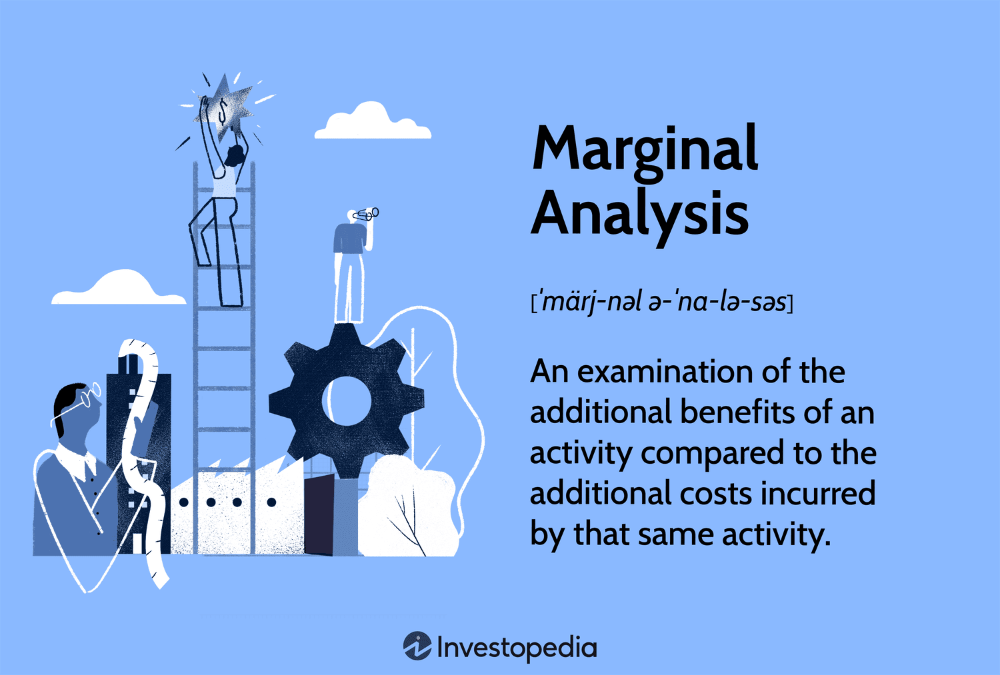

## Table of Contents

## What is marginal analysis?

Marginal analysis is a way of making decisions by looking at the extra benefits and costs of doing a little bit more or a little bit less of something. It's like when you're thinking about eating another slice of pizza. You weigh the extra enjoyment you'll get from that slice against how much more full you'll feel or how much more it will cost.

This method is used a lot in economics and business. For example, a company might use marginal analysis to decide whether to produce one more unit of a product. They would compare the extra revenue from selling that unit to the extra cost of making it. If the revenue is higher than the cost, it makes sense to produce it. This helps businesses make smarter choices about how much to produce or how much to invest in something.

## How does marginal analysis apply to business decisions?

Marginal analysis helps businesses make smart choices by looking at the extra benefits and costs of doing a little more or a little less of something. For example, if a company is thinking about making one more product, they use marginal analysis to see if the extra money they will make from selling that product is more than the extra cost of making it. If it is, then it makes sense to produce that extra product. This way, businesses can figure out the best amount to produce to make the most profit.

This method is also useful for other business decisions, like whether to spend more on advertising or to hire more workers. For advertising, a company might look at how much extra sales they get from spending a bit more on ads and compare that to the cost of those ads. If the extra sales bring in more money than the ads cost, it's a good idea to spend more. For hiring, a business might think about how much more work can get done with one more employee and weigh that against the salary they have to pay. If the extra work brings in more money than the salary costs, hiring makes sense.

## Can you explain the concept of marginal cost?

Marginal cost is the extra cost a business has to pay to make one more item or provide one more service. It's like if you're baking cookies and you want to know how much it costs to bake one more cookie. You would look at the cost of the extra ingredients, the extra time you spend baking, and maybe even the extra electricity you use. That's the marginal cost of that one more cookie.

In a business, understanding marginal cost helps a lot. If a company can sell that one more item for more than it costs to make it, then making that item is a good idea. For example, if it costs $5 to make one more widget and they can sell it for $7, they will make an extra $2 profit. But if the cost to make it is $8, then they lose money by making it. So, businesses use marginal cost to decide how much to produce to make the most profit without wasting resources.

## What is marginal revenue and how is it calculated?

Marginal revenue is the extra money a business makes from selling one more item or service. It's like if you're selling lemonade and you want to know how much more money you'll get if you sell one more cup. If you usually sell cups for $1 each, then the marginal revenue for selling one more cup is $1.

To calculate marginal revenue, you look at the total revenue before and after selling that one more item. You subtract the total revenue before from the total revenue after to find the difference. That difference is the marginal revenue. For example, if you sold 10 cups of lemonade and made $10, and then you sold one more cup and made $11, the marginal revenue for that one more cup is $11 - $10 = $1.

## How do businesses use marginal analysis to maximize profit?

Businesses use marginal analysis to figure out the best way to make more profit by looking at the extra benefits and costs of doing a little more or a little less. For example, they might think about making one more product. They compare the extra money they will make from selling that product (marginal revenue) to the extra cost of making it (marginal cost). If the extra money is more than the extra cost, it makes sense to make that product because it will add to their profit. If the extra cost is more than the extra money, it's better not to make it because it will reduce their profit.

By using marginal analysis, businesses can decide the best amount to produce. They keep making more products as long as the marginal revenue is higher than the marginal cost. When the two are equal, they stop because making more won't add to their profit. This helps them find the sweet spot where they make the most money without wasting resources. It's like finding the right balance so they can be as profitable as possible.

## What is the relationship between marginal cost and marginal revenue in decision making?

In decision making, businesses look at how much it costs to make one more thing (marginal cost) and how much more money they will make by selling it (marginal revenue). If the extra money they get from selling it is more than the extra cost of making it, it makes sense to produce it. This is because they will make more profit by doing so. For example, if it costs $5 to make one more toy and they can sell it for $7, they will make an extra $2 profit by making that toy.

On the other hand, if the extra cost of making something is more than the extra money they will make from selling it, it's better not to produce it. This is because it will reduce their profit. For example, if it costs $8 to make one more toy but they can only sell it for $7, they will lose $1 by making that toy. By comparing marginal cost and marginal revenue, businesses can decide the best amount to produce to maximize their profit without wasting resources.

## Can you provide examples of marginal analysis in real-world business scenarios?

A small bakery wants to know if it should bake more cakes. They look at the cost of making one more cake, which includes the ingredients, extra time, and electricity. This is their marginal cost. They also check how much more money they can make by selling that cake, which is their marginal revenue. If the extra money they get from selling the cake is more than the cost of making it, they will bake more cakes. This helps them decide how many cakes to bake to make the most profit without wasting ingredients.

A company that makes smartphones is thinking about making one more phone. They figure out the extra cost of making that phone, like the materials, labor, and factory costs. That's their marginal cost. They also look at how much more money they will make by selling that phone, which is their marginal revenue. If the extra money they make is more than the extra cost, they will make that phone. This way, they can decide how many phones to make to maximize their profit without spending too much on production.

A farmer is considering planting more corn. They calculate the extra cost of planting and harvesting one more acre of corn, including seeds, labor, and equipment. This is their marginal cost. They also estimate how much more money they will make by selling the extra corn, which is their marginal revenue. If the extra money from selling the corn is more than the cost of planting it, they will plant more corn. This helps them decide how much land to use to make the most profit without overworking their resources.

## How does marginal analysis help in determining the optimal level of production?

Marginal analysis helps businesses figure out the best amount of stuff to make by looking at the extra money they make and the extra cost of making one more thing. They compare the extra money they get from selling one more item, which is called marginal revenue, to the extra cost of making that item, which is called marginal cost. If the extra money they make is more than the extra cost, it makes sense to make that item because it will add to their profit. They keep making more things as long as the extra money is more than the extra cost.

When the extra money they make from selling one more item is the same as the extra cost of making it, businesses stop making more. This is because making more won't add to their profit. By using marginal analysis, businesses can find the sweet spot where they make the most money without wasting resources. This helps them decide how much to produce to be as profitable as possible.

## What are the limitations of marginal analysis in economic theory?

Marginal analysis is a useful tool, but it has some limits. One big limit is that it can be hard to measure the exact extra costs and benefits of doing something. For example, if a business wants to make one more product, they might not know exactly how much more it will cost to make it or how much more money they will make from selling it. Also, sometimes things like employee happiness or the environment are hard to put a number on, but they can still affect a business's decisions.

Another limit is that marginal analysis looks at decisions one at a time, but in real life, decisions can affect each other. For example, if a company decides to make more of one product, it might mean they have less time or money to make another product. So, looking at each decision by itself might not give the full picture. This means businesses need to think about how all their choices fit together, not just one decision at a time.

## How does marginal analysis influence pricing strategies?

Marginal analysis helps businesses figure out the best price for their products by looking at how much it costs to make one more item and how much more money they can make by selling it. If the extra money they make from selling one more item is more than the extra cost of making it, they might decide to lower the price a bit to sell more items. This can help them make more profit overall, even if they make less money on each item. For example, if it costs $5 to make one more toy and they can sell it for $7, they might lower the price to $6 to sell more toys and make more total profit.

But if the extra cost of making one more item is more than the extra money they can make, they might decide to raise the price. This way, they can make more money on each item they sell, even if they sell fewer items. For example, if it costs $8 to make one more toy and they can only sell it for $7, they might raise the price to $9 to cover the cost and make a profit. By using marginal analysis, businesses can find the best price to make the most money without losing too much on each item they sell.

## What role does marginal analysis play in resource allocation within a firm?

Marginal analysis helps businesses decide how to use their resources, like money, time, and materials, in the best way. They do this by looking at the extra benefits and costs of using a little more or a little less of something. For example, if a company is thinking about buying more machines, they will compare the extra money they can make from using those machines to the cost of buying them. If the extra money is more than the cost, it makes sense to buy more machines. This way, businesses can figure out how to spend their resources to make the most profit without wasting anything.

Sometimes, businesses need to decide how to use their resources between different projects or products. Marginal analysis helps them see which project or product will give them the most extra benefit for the least extra cost. For example, if a company is choosing between making more of product A or product B, they will look at the extra profit they can make from each. If product A gives them more extra profit for the same extra cost, they will choose to make more of product A. By using marginal analysis, businesses can make sure they are using their resources in the best way to be as successful as possible.

## How can advanced statistical methods enhance the accuracy of marginal analysis in complex business environments?

Advanced statistical methods can make marginal analysis more accurate by helping businesses better understand and predict the extra costs and benefits of their decisions. For example, regression analysis can look at past data to see how changes in production or pricing affect costs and revenues. This can help businesses make better guesses about what will happen if they make one more item or change their prices. Also, methods like time series analysis can look at how things change over time, which can be important because costs and benefits can change depending on the time of year or other factors.

In complex business environments, where many things can affect decisions, advanced statistical methods can help businesses see the big picture. Techniques like multivariate analysis can look at many different factors at once, like how changes in raw material costs, labor costs, and market demand all affect the extra costs and benefits of making one more product. This can help businesses make smarter choices by understanding how all these factors work together. By using these advanced methods, businesses can make their marginal analysis more precise and make better decisions about how to use their resources.

## What is the role of marginal analysis in microeconomics?

Marginal analysis is a fundamental concept in microeconomics, providing insights into how individual firms and consumers make decisions under varying economic conditions. It focuses on understanding the implications of small changes in production or consumption, allowing businesses to make informed decisions that enhance their operational efficiency and profitability.

One of the key applications of marginal analysis in microeconomics is in assessing the impact of incremental changes in production levels. For example, consider a firm evaluating whether to increase its output. Marginal analysis would involve comparing the marginal cost (MC) and marginal revenue (MR) of producing an additional unit of output. Mathematically, the condition for profit maximization is expressed as:

$$
MR = MC
$$

When marginal revenue equals marginal cost, the firm achieves an optimal production level, as any further increase would result in higher costs than revenue, decreasing overall profit. Similarly, if marginal revenue exceeds marginal cost, it indicates potential for increased profitability through expanded production.

Additionally, marginal analysis aids firms in evaluating opportunity costs, which is essential for decision-making regarding resource allocation. For instance, when considering whether to hire additional labor or invest in new machinery, a firm would analyze the marginal benefits against the marginal costs of each option. This helps determine the most cost-effective resource allocation strategy that maximizes profitability.

In microeconomic terms, businesses often employ marginal analysis to evaluate consumer demand and pricing strategies. By assessing the elasticity of demand, firms can set prices that optimize revenue without deterring customers. For example, if a small price increase results in a proportionately smaller decrease in quantity demanded, the firm can raise prices without significantly affecting sales [volume](/wiki/volume-trading-strategy), hence boosting revenue.

Through marginal analysis, firms strive to achieve maximum efficiency by effectively balancing resource input and output levels. By continuously analyzing marginal changes, businesses can adapt to market dynamics and respond to shifts in consumer preferences or technological advancements. This dynamic approach ensures that firms remain competitive and profitable in a fluctuating economic environment.

In summary, marginal analysis serves as a pivotal tool in microeconomics, enabling firms to navigate complex economic interactions by focusing on the incremental benefits and costs of their decisions. This analytical framework not only enhances operational efficiency but also plays a crucial role in strategic decision-making, ensuring sustained profitability and growth.

## What is the relationship between Algorithmic Trading and Marginal Analysis?

Algorithmic trading utilizes algorithms to automate the decision-making process in trading, applying marginal analysis principles to facilitate optimal trade execution. By employing sophisticated mathematical models and computational techniques, trading algorithms scrutinize vast amounts of market data to evaluate the marginal expected returns against marginal transaction costs. This involves calculating the difference between the incremental revenue from a trading strategy and its associated costs to ensure that each trade contributes positively to the overall portfolio.

To achieve efficient trade volume optimization and effective risk management, these algorithms continuously assess the market landscape. They respond dynamically to fluctuations by fine-tuning variables and criteria essential for trade initiation or closure. For instance, the algorithm may adjust trade size or timing based on real-time data, enhancing profitability while keeping risks within acceptable bounds. 

A mathematical representation often used in [algorithmic trading](/wiki/algorithmic-trading) is:

$$
\text{Net Expected Return} = \sum_{i=1}^{n} \left( E(R_i) - C_i \right)
$$

where $E(R_i)$ represents the expected return of trade $i$, and $C_i$ denotes the transaction cost associated with that trade. The goal is to maintain a positive net expected return, ensuring that the benefits of a trade outweigh its costs.

Additionally, the ability of trading algorithms to monitor market conditions continuously and adjust strategies ensures sustained profitability. They may integrate [machine learning](/wiki/machine-learning) models to predict market trends and compute optimal responses swiftly. In a Python setting, such algorithms might employ libraries like NumPy for numerical computations and Pandas for managing data, efficiently processing tick-by-tick data to refine trading decisions. 

```python
import numpy as np
import pandas as pd

# Example of calculating marginal expected returns
def calculate_marginal_return(data):
    data['expected_return'] = data['price_change'] / data['price']
    data['transaction_costs'] = data['volume'] * data['commission_rate']
    return data['expected_return'] - data['transaction_costs']

market_data = pd.DataFrame({
    'price_change': np.random.rand(100),
    'price': np.random.rand(100) + 0.5,
    'volume': np.random.randint(1, 100, 100),
    'commission_rate': 0.001
})

market_data['marginal_return'] = calculate_marginal_return(market_data)
```

In conclusion, by integrating principles of marginal analysis, algorithmic trading systems not only optimize trade execution but also navigate the challenges inherent in volatile markets effectively. This synergy between economics and computational algorithms exemplifies the application of marginal analysis in the contemporary financial landscape.

## References & Further Reading

[1]: Varian, H. R. (1992). ["Microeconomic Analysis"](https://archive.org/details/microeconomicana0000vari_g1b1). W.W. Norton & Company.

[2]: Frank, R. H. (2008). ["Microeconomics and Behavior"](https://archive.org/details/microeconomicsbe0000fran_f2k7). McGraw-Hill Education.

[3]: Pindyck, R. S., & Rubinfeld, D. L. (2017). ["Microeconomics"](https://archive.org/details/microeconomics0007pind). Pearson.

[4]: Lopez de Prado, M. (2018). ["Advances in Financial Machine Learning"](https://www.amazon.com/Advances-Financial-Machine-Learning-Marcos/dp/1119482089). Wiley.

[5]: Hull, J. C. (2010). ["Options, Futures, and Other Derivatives"](https://www.semanticscholar.org/paper/Options%2C-Futures%2C-and-Other-Derivatives-Hull/89bdee500c8623864fc9eb7a471546aa713acc44). Pearson.

[6]: Chan, E. P. (2009). ["Quantitative Trading: How to Build Your Own Algorithmic Trading Business"](https://github.com/ftvision/quant_trading_echan_book). Wiley.

[7]: Aronson, D. (2007). ["Evidence-Based Technical Analysis: Applying the Scientific Method and Statistical Inference to Trading Signals"](https://www.amazon.com/Evidence-Based-Technical-Analysis-Scientific-Statistical/dp/0470008741). Wiley.