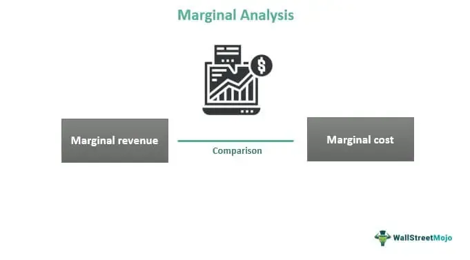

Understanding the nuances of economic decision-making is crucial in today's fast-paced business environment. As businesses face mounting pressures to remain competitive, efficient resource allocation becomes paramount. Marginal analysis, a fundamental concept within microeconomics, offers a systematic approach to assessing how individuals and firms can optimize their decision-making processes. By evaluating the additional costs and benefits of a decision, marginal analysis helps in determining the most profitable allocation of resources, thereby guiding managerial decisions toward the achievement of organizational goals.

In recent years, algorithmic trading has emerged as a cutting-edge financial strategy that leverages the principles of economic decision-making and marginal analysis. By employing sophisticated algorithms to evaluate real-time data, algorithmic trading enables rapid and precise execution of trades, optimizing both timing and pricing. The intertwining of these economic principles with advanced computing technologies underscores a broader trend where businesses seek to marry economic theory with practical application to gain strategic advantages.



This article explores the interconnection between economic decision-making, marginal analysis, and algorithmic trading, and examines how these concepts influence various business decisions. By understanding and applying these interrelated principles, managers can enhance organizational efficiency and adapt to the complexities of modern market dynamics.

## Table of Contents

## Understanding Economic Decision-Making

Economic decision-making is a foundational aspect of business strategy, centered on selecting the optimal course of action from a set of alternatives. This process is guided by the constraints imposed by limited resources and the objectives businesses aim to achieve. Decision-making in an economic context involves not only evaluating the immediate costs and benefits of each alternative but also anticipating future impacts on the firm's goals.

For businesses, efficient decision-making is tantamount to maximizing profit while navigating the complex landscape of market dynamics, consumer preferences, and regulatory environments. This requires a comprehensive understanding of both microeconomic and macroeconomic factors that influence business operations. Managers are often tasked with the challenging role of synthesizing these factors into actionable strategies that propel their organizations towards defined objectives.

Economic theories provide essential frameworks for aligning managerial strategies with company goals. For instance, the cost-benefit analysis, a quintessential economic approach, aids managers in evaluating whether the benefits of a certain decision surpass its costs. Another crucial concept is opportunity cost, which involves considering the potential returns of the next best alternative when making decisions. These theoretical foundations empower managers to make informed choices that enhance efficiency and drive growth.

In mathematical terms, economic decision-making often involves optimizing a particular function, such as profit ($\pi$) or utility ($U$), subject to certain constraints. This can be represented by:

$$
\max \, \pi = f(Q) - C(Q)
$$

Where $f(Q)$ is the revenue generated from producing quantity $Q$, and $C(Q)$ is the cost associated with it. Decision-making involves finding the quantity $Q$ that maximizes $\pi$.

Furthermore, managers employ various analytical and computational tools to support their decision-making processes. Integrating data analytics and leveraging predictive algorithms allow for more precise assessments of market trends and consumer behavior, thus enhancing the strategic decision-making framework.

In conclusion, effective economic decision-making is integral to maintaining a competitive edge in today's fast-paced business environment. By intricately understanding and applying economic theories, managers can optimize resource allocation, minimize costs, and maximize profits, thereby ensuring their organization's sustainability and success.

## The Role of Marginal Analysis

Marginal analysis is a critical tool in economic decision-making, focusing on incremental changes in the production process or business strategy. This analytical method allows decision-makers to break down complex decisions into smaller components, evaluating the additional benefits and costs associated with a specific choice. This approach enables businesses to optimize various operational aspects and make informed decisions that enhance profitability and resource efficiency.

The concept of marginal analysis was notably developed by the economist Alfred Marshall. His contributions laid the foundation for understanding how small changes in production levels can impact overall economic outcomes. Marginal analysis is particularly useful in determining optimal production levels and pricing strategies, crucial for maximizing profits while minimizing costs. By examining the marginal cost (MC) and marginal revenue (MR) of production, businesses can decide the most efficient point to expand production—where MC equals MR. This alignment ensures that resources are precisely allocated to maximize returns.

For instance, in a practical business setting, a manager may face the decision of whether to increase production by one unit. By conducting a marginal analysis, they can assess the additional cost of producing this extra unit compared to the expected revenue. If the marginal revenue exceeds the marginal cost, it is advantageous for the business to increase production. Conversely, if the marginal cost surpasses the marginal revenue, reducing production would be more beneficial.

Mathematically, this is represented as:

$$

\text{If } MR > MC \quad \text{then increase production.}
$$

$$

\text{If } MR < MC \quad \text{then decrease production.}
$$

Moreover, managers leverage marginal analysis to ensure that resource allocation is both efficient and profitable across various departments. For example, in marketing, it helps determine the optimal budget allocation by assessing the marginal gains of increasing advertisement spending. Such precise allocation enables companies to maintain a competitive edge by focusing resources where they yield the highest return on investment.

In summary, marginal analysis serves as an indispensable tool for businesses striving to enhance operational efficiency and ensure that every resource is utilized effectively. Through this approach, companies can not only optimize their production and pricing strategies but also fine-tune various managerial decisions to align with their broader organizational objectives.

## Managerial Decision-Making and Marginal Analysis

Managerial economics uses marginal analysis to facilitate decision-making across diverse market conditions. At its core, marginal analysis involves examining the additional benefits and costs associated with a decision, enabling managers to determine the most efficient use of resources. This method is instrumental in optimizing processes such as production levels and resource allocation, ultimately aligning business strategies with organizational objectives.

A fundamental component of this approach is assessing opportunity costs. Opportunity cost refers to the potential benefits a business misses out on when choosing one alternative over another. For instance, if a firm decides to allocate resources to Project A instead of Project B, the opportunity cost is the value derived from the benefits of Project B that are foregone. Quantifying this cost aids in ensuring that resources are deployed where they can generate the highest value.

Cost-benefit analysis is another critical aspect of marginal analysis in managerial decision-making. This technique involves evaluating the total expected costs against the total expected benefits of a proposed action. Managers utilize this analysis to ascertain whether a decision is financially viable. For example, calculating the net present value (NPV) of a potential investment is a common application of cost-benefit analysis:

$$
\text{NPV} = \sum \frac{R_t}{(1 + i)^t} - C_0
$$

where $R_t$ represents the net cash inflow during period $t$, $i$ is the discount rate, and $C_0$ is the initial investment cost. A positive NPV indicates that the projected earnings exceed the anticipated costs, justifying the investment.

Optimizing resource allocation is crucial for maximizing efficiency. Firms aim to allocate resources in a manner that maximizes output and profit. Marginal analysis helps in determining the point at which the marginal cost (MC) equals the marginal revenue (MR) — the optimum level of production. Formally, the condition for profit maximization is:

$$
\text{MC} = \text{MR}
$$

This equilibrium ensures that resources are utilized efficiently, enhancing the firm's overall competitive advantage.

In summary, the application of marginal analysis in managerial economics provides a structured framework for evaluating opportunity costs, performing cost-benefit analysis, and optimizing resource allocation. These tools are essential for managers to make informed decisions that align with the organization's strategic objectives, fostering long-term success and sustainability.

## Algorithmic Trading and Economic Principles

Algorithmic trading involves the use of complex computerized systems to perform trades at optimal times and prices. This approach leverages advanced algorithms to analyze vast datasets, execute strategies, and manage portfolios more efficiently than traditional methods. The integration of marginal analysis into these algorithms is essential for evaluating trading opportunities and risks effectively.

Marginal analysis, a core concept in microeconomics, involves assessing the additional benefits relative to the additional costs of a decision. In [algorithmic trading](/wiki/algorithmic-trading), this analysis helps in determining the potential profitability of executing a trade. The trading systems evaluate factors such as bid-ask spreads, transaction costs, and price movements to make informed decisions. By assessing the marginal gain from executing a trade versus not trading, algorithms strive to maximize expected returns.

Algorithmic trading systems rely on real-time data and a variety of economic indicators. These indicators can include interest rates, inflation metrics, and market [liquidity](/wiki/liquidity-risk-premium) measures. By modeling and processing these variables swiftly, algorithms can make split-second decisions, often outpacing human traders.

A foundational element of algorithmic trading is its reliance on statistical and mathematical models to predict future price movements. For instance, algorithms commonly employ moving averages, linear regression, and other stochastic models to recognize trends or deviations in market data. Here is a simplified example using a moving average crossover strategy in Python:

```python
import numpy as np
import pandas as pd

# Assume 'data' is a DataFrame with historical stock prices with a 'price' column
data['Short_MA'] = data['price'].rolling(window=40).mean() # 40-day short moving average
data['Long_MA'] = data['price'].rolling(window=100).mean() # 100-day long moving average

# Generate trading signals based on moving average crossovers
data['Signal'] = np.where(data['Short_MA'] > data['Long_MA'], 1, 0) 
data['Position'] = data['Signal'].diff()

# Identify buy and sell signals
buy_signals = data[data['Position'] == 1]
sell_signals = data[data['Position'] == -1]
```

In this code snippet, the algorithm generates trading signals based on the crossover of short and long moving averages, offering a basic mechanistic approach to decision-making. The marginal gain from following such a strategy is determined by the change in cumulative returns when signals generate buy or sell actions.

Algorithmic trading is inherently data-driven and employs marginal analysis to adapt to rapidly changing market dynamics. It enhances the ability to execute large volumes of trades transparently and consistently, making it indispensable to modern financial markets. Through the continuous assessment of marginal benefits and costs using real-time data, algorithms not only optimize trade executions but also manage the inherent risks in trading more effectively.

## Applications of Marginal Analysis in Various Industries

Marginal analysis, a critical tool in microeconomics, extends beyond financial markets and finds significant applications across various industries, enhancing operational efficiency and strategic decision-making. In the manufacturing sector, marginal analysis assists in determining the optimal level of production. By evaluating the cost of producing one additional unit of a product (marginal cost) against the revenue generated from that unit (marginal revenue), companies can decide whether increasing production will contribute positively to their profits. This balancing act ensures resource allocation aligns with demand, minimizing waste and maximizing profitability.

In logistics, marginal analysis aids in optimizing supply chain operations. For instance, when managing inventory, businesses analyze the incremental cost of holding additional stock against the potential benefit it brings, such as improved customer satisfaction or reduced stockout occurrences. This approach guides companies in maintaining an optimal balance of inventory that minimizes costs while meeting service level objectives.

Service sectors, such as hospitality and retail, also benefit from marginal analysis, particularly in pricing strategies. Businesses frequently employ this analysis to determine the pricing of services or products. By assessing the marginal benefit perceived by the customer compared to the marginal cost of service provision, companies can set prices that maximize customer value while ensuring profitability.

Case studies illustrate the tangible benefits of marginal analysis in these industries. For example, a manufacturing firm might use marginal analysis to streamline its production schedule, avoiding overproduction and storing excessive inventory, which ties up capital and increases risk. In logistics, a company could optimize its transportation routes, weighing the marginal fuel cost against delivery times to enhance efficiency and reduce expenses. Meanwhile, a service provider, like a telecommunications company, might leverage marginal analysis to adjust pricing dynamically based on customer usage patterns to optimize revenue.

These examples underscore marginal analysis's versatility, illustrating its capacity to inform critical decisions by providing a structured framework to evaluate incremental changes. As industries face ever-evolving challenges, from fluctuating market demands to resource constraints, employing marginal analysis as part of a decision-making toolkit offers a pathway to sustaining competitive advantage and achieving operational excellence.

## Challenges in Applying Economic Theories to Managerial Decisions

Applying economic theories to managerial decisions is fraught with challenges, primarily due to market [volatility](/wiki/volatility-trading-strategies) and incomplete data. These factors introduce substantial uncertainties, complicating the decision-making process for managers who aim to maintain a competitive advantage in a rapidly changing business environment.

Market volatility is a significant challenge, as it introduces unpredictability in prices, supply and demand, and overall economic conditions. This volatility can disrupt well-laid plans and forecasts, requiring managers to frequently revisit and adjust their strategies. For instance, a sudden economic downturn could invalidate profit projections based on previous stable market conditions. To navigate these fluctuations, managers must develop flexible strategies that can adapt to short-term changes without compromising long-term objectives.

Incomplete data adds another layer of complexity to managerial decision-making. Often, managers must make decisions based on partial or uncertain information. This lack of complete data makes it difficult to conduct accurate cost-benefit analyses or predict future market trends and consumer behaviors. To mitigate these issues, managers can leverage advanced data analytics and predictive modeling. However, even these tools often depend on assumptions that may not hold true in all contexts.

Continuous learning and adaptation are essential for effectively applying economic theories under these challenging conditions. Managers must stay informed about advancements in economic theory and business analytics to refine their decision-making processes continually. For example, techniques such as [machine learning](/wiki/machine-learning) can be used to identify patterns in data that may not be immediately obvious. A simple Python code snippet to illustrate how managers can use machine learning for prediction could use the popular library scikit-learn as follows:

```python
from sklearn.model_selection import train_test_split
from sklearn.ensemble import RandomForestRegressor
import numpy as np

# Sample data: features and target
X = np.array([[market_index, interest_rate] for market_index, interest_rate in zip(range(100), range(100))])
y = np.array([profit for profit in range(100)])

# Splitting data into training and test sets
X_train, X_test, y_train, y_test = train_test_split(X, y, test_size=0.2, random_state=42)

# Model training
model = RandomForestRegressor()
model.fit(X_train, y_train)

# Making predictions
predictions = model.predict(X_test)
```

This code demonstrates how managers can use historical data to predict future profits, aiding in decision-making under uncertain conditions.

In conclusion, while economic theories offer valuable frameworks for managerial decisions, real-world challenges such as market volatility and incomplete data require managers to continuously adapt their approaches. By integrating new technologies and maintaining a commitment to learning, managers can better apply economic principles to achieve strategic goals.

## Conclusion

The integration of economic decision-making frameworks, marginal analysis, and algorithmic trading strategies has significantly reshaped contemporary business strategies. In an increasingly competitive and complex business environment, managers who adeptly harness these concepts are well-positioned to optimize decision-making processes and enhance organizational efficiency.

Economic decision-making principles guide managers in choosing the most effective courses of action by weighing alternatives against available resources and organizational objectives. Marginal analysis, a cornerstone of microeconomic theory, provides a vital tool for this decision-making process by breaking down decisions into incremental parts and evaluating the additional benefits and costs involved. This granular approach ensures resources are allocated in the most efficient and profitable manner possible.

Algorithmic trading exemplifies the practical application of these economic principles within the financial markets. Trading algorithms leverage real-time data and economic indicators to execute trades at optimal times and prices, employing marginal analysis to continuously assess and recalibrate trading opportunities and associated risks. This precision in trade execution not only streamlines operations but also maximizes profitability.

To maintain competitive advantage in such a dynamic landscape, it is imperative for managers to keep abreast of ongoing advancements in economic theories and technological innovations. Continuous learning and adaptation are essential to effectively applying these concepts, which are continually evolving through research and practical iteration. By remaining informed and responsive to new developments, businesses can sustain their growth and success in an ever-changing market.

## References & Further Reading

[1]: Marshall, A. (1890). ["Principles of Economics."](https://archive.org/details/principlesecono00marsgoog) Macmillan & Co.

[2]: Latibeaudiere, A. (2019). ["Marginal Analysis in Managerial Economics: Maximizing Profit and Efficiency."](https://corporatefinanceinstitute.com/resources/economics/marginal-analysis/)

[3]: Pardo, R. (2008). ["The Evaluation and Optimization of Trading Strategies."](https://onlinelibrary.wiley.com/doi/book/10.1002/9781119196969) Wiley Trading Series.

[4]: De Prado, M. L. (2018). ["Advances in Financial Machine Learning."](https://www.amazon.com/Advances-Financial-Machine-Learning-Marcos/dp/1119482089) Wiley.

[5]: Chan, E. P. (2009). ["Quantitative Trading: How to Build Your Own Algorithmic Trading Business."](https://github.com/ftvision/quant_trading_echan_book) Wiley Trading Series.

[6]: Aronson, D. R. (2006). ["Evidence-Based Technical Analysis: Applying the Scientific Method and Statistical Inference to Trading Signals."](https://www.amazon.com/Evidence-Based-Technical-Analysis-Scientific-Statistical/dp/0470008741) Wiley.

[7]: Jansen, S. (2020). ["Machine Learning for Algorithmic Trading: Predictive Models to Extract Signals from Market and Alternative Data for Systematic Trading Strategies."](https://www.amazon.com/Machine-Learning-Algorithmic-Trading-alternative/dp/1839217715) Packt Publishing.