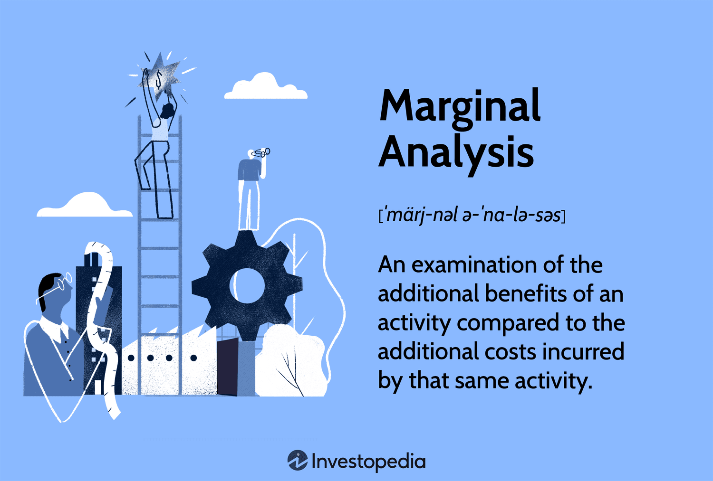

## Table of Contents

## What is marginal analysis and why is it important in managerial decision-making?

Marginal analysis is a way of looking at the costs and benefits of doing a little bit more or a little bit less of something. It helps people and businesses make choices by comparing the extra cost of doing something with the extra benefit it brings. For example, if a company is thinking about making more of a product, they would use marginal analysis to see if the extra money they make from selling more is worth the extra cost of making more.

This kind of analysis is really important in managerial decision-making because it helps managers make smart choices about how to use their resources. By focusing on the extra costs and benefits, managers can decide if it makes sense to expand, cut back, or change what they're doing. This helps them avoid wasting money and time on things that don't add enough value, and instead, focus on what will help the business grow and succeed.

## How does marginal analysis help in optimizing business decisions?

Marginal analysis helps businesses make better decisions by looking at the extra costs and benefits of small changes. Imagine you run a lemonade stand and you're thinking about making more lemonade. You would use marginal analysis to see if the extra money you make from selling more lemonade is worth the extra cost of buying more lemons and sugar. If the extra money you make is more than the extra cost, it makes sense to make more lemonade. But if the extra cost is more than the extra money, it's better to stick with what you're doing.

This method helps businesses find the sweet spot where they're making the most profit. For example, a factory might use marginal analysis to decide how many hours to run their machines. They'll keep running the machines as long as the extra money they make from producing more goods is more than the extra cost of running the machines longer. Once the extra cost starts to be more than the extra money, they'll stop. By doing this, businesses can use their resources in the best way possible and make decisions that help them grow and be successful.

## Can you explain the concept of marginal cost and its role in decision-making?

Marginal cost is the extra cost a business pays to make one more item or provide one more service. For example, if a bakery makes cakes and it costs them $5 more to make one extra cake, then the marginal cost of that cake is $5. This cost includes things like the extra ingredients, labor, and any other expenses that go up when they make one more cake.

Understanding marginal cost is really important for making good business decisions. If a business knows the marginal cost, they can compare it to the extra money they make from selling that item. If the extra money they make is more than the marginal cost, it makes sense to make more. But if the marginal cost is higher than the extra money they make, then they should stop making more because it would cost them money instead of making them money. This helps businesses decide how much to produce to make the most profit.

## What is marginal benefit and how do managers use it alongside marginal cost?

Marginal benefit is the extra value or satisfaction that someone gets from doing a little bit more of something. For example, if a customer buys one more ice cream cone and it makes them happier, the happiness they get from that extra cone is the marginal benefit. Businesses look at marginal benefit to see how much extra money they can make from selling one more item or service.

Managers use marginal benefit and marginal cost together to make smart decisions. They compare the extra money they can make (marginal benefit) to the extra cost of making one more item (marginal cost). If the marginal benefit is more than the marginal cost, it makes sense to make more because they will make more money. But if the marginal cost is higher than the marginal benefit, they should stop making more because it would cost them more than they would make. This helps managers find the best amount to produce to make the most profit.

## How can marginal analysis be applied to pricing strategies?

Marginal analysis can help businesses set their prices in a smart way. Imagine you sell cookies and you want to know how much to charge for each one. You can use marginal analysis to see how changing the price affects how many cookies you sell and how much money you make. If you lower the price a little bit, you might sell more cookies, but you need to see if the extra money you make from selling more is worth the lower price. If the extra money (marginal benefit) is more than the cost of making those extra cookies (marginal cost), then lowering the price makes sense. But if the extra money is less than the cost, then you should keep the price the same or even raise it.

This way of thinking can also help with other pricing strategies, like discounts or promotions. For example, if you're thinking about having a sale, you can use marginal analysis to see if the extra sales from the lower price will make up for the lower profit per item. If the extra sales bring in more money than the cost of the discount, then the sale is a good idea. By using marginal analysis, businesses can find the best price that helps them sell more and make more money, without losing too much profit on each item.

## What are some common pitfalls to avoid when using marginal analysis?

One common pitfall to avoid when using marginal analysis is ignoring fixed costs. Marginal analysis focuses on the extra costs and benefits of doing a little more or less, but it can be easy to forget about the costs that don't change no matter how much you produce. For example, if you're deciding whether to make more cookies, you need to remember that the cost of your oven and rent stays the same, even if you make more cookies. Ignoring these fixed costs can lead to wrong decisions because you might think you're making more money than you really are.

Another pitfall is not considering the bigger picture. Marginal analysis looks at small changes, but sometimes these small changes can affect other parts of your business. For example, if you lower the price of your cookies to sell more, you might not think about how it could make your brand seem cheaper or how it might upset customers who paid more before. It's important to think about how your decisions fit into your overall business strategy and goals.

Lastly, it's easy to make mistakes with data when using marginal analysis. If you don't have good, accurate information about your costs and benefits, your analysis won't be helpful. For instance, if you guess the cost of making one more cookie instead of knowing it for sure, you might decide to make more cookies when you shouldn't. Always make sure your data is correct and up-to-date to make the best decisions.

## Can you provide examples of marginal analysis in real-world business scenarios?

A restaurant owner wants to decide if they should stay open for an extra hour each night. They use marginal analysis to figure this out. The extra cost of staying open includes paying the staff for another hour and using more electricity. The extra benefit is the money they make from the customers who come in during that hour. If the money they make is more than the extra costs, it makes sense to stay open longer. But if the extra costs are more than the money they make, they should close at the usual time. This helps the owner make a smart choice about their hours.

A clothing store is thinking about having a big sale. They use marginal analysis to see if it's a good idea. The extra cost of the sale is the lower profit they make on each item sold at a discount. The extra benefit is the money they make from selling more items because of the lower prices. If the extra money they make from selling more clothes is more than the cost of the discount, then the sale is worth it. But if the extra money is less than the cost, they should not have the sale. This helps the store decide if a sale will help them make more money or not.

## How does marginal analysis differ when applied to short-term versus long-term decisions?

When using marginal analysis for short-term decisions, businesses focus on immediate costs and benefits. For example, a company might look at the extra cost of making one more product right now and compare it to the extra money they can make from selling it. Short-term decisions often involve things like daily production levels, pricing adjustments, or whether to accept a special order. The key is to see if the extra money made from a small change is more than the extra cost, helping the business make quick decisions that can boost profits in the short run.

In contrast, long-term decisions using marginal analysis consider costs and benefits over a longer period. For example, a business might think about the extra cost of buying a new machine and compare it to the extra money they can make over several years by using that machine. Long-term decisions involve things like investing in new technology, expanding facilities, or entering new markets. These decisions need to look at how small changes now can affect the business in the future, taking into account not just immediate costs but also future savings and profits. This helps businesses plan for growth and sustainability over time.

## What advanced techniques can enhance the effectiveness of marginal analysis in complex business environments?

In complex business environments, using advanced techniques can make marginal analysis even better. One way to do this is by using data analytics and predictive modeling. These tools help businesses look at a lot of information and make guesses about what might happen in the future. For example, a company can use these tools to see how changes in the market or customer behavior might affect the extra costs and benefits of their decisions. By understanding these patterns, businesses can make smarter choices about things like how much to produce or what price to set.

Another advanced technique is scenario analysis. This means looking at different "what if" situations to see how they might change the results of marginal analysis. For example, a business might want to know what would happen if there was a big change in the price of their materials or if a new competitor came into the market. By running different scenarios, they can see how these changes might affect their costs and benefits. This helps them plan for different possibilities and make decisions that work well no matter what happens.

## How can marginal analysis be integrated with other decision-making tools like cost-benefit analysis?

Marginal analysis and cost-benefit analysis can work together to help businesses make better decisions. Marginal analysis looks at the extra costs and benefits of small changes, like making one more product or changing the price a little bit. Cost-benefit analysis, on the other hand, looks at the total costs and benefits of a whole project or decision. By using both together, businesses can see both the big picture and the small details. For example, a company might use cost-benefit analysis to decide if it's worth building a new factory, and then use marginal analysis to figure out how many products to make in that factory to make the most profit.

This combination helps businesses make smarter choices. First, cost-benefit analysis gives a broad view of whether a project or decision is worth doing at all. Then, marginal analysis helps fine-tune the decision by looking at the impact of small changes. For example, if a company decides to start a new product line after a cost-benefit analysis, they can use marginal analysis to decide the best production level for that product. This way, they can make sure the new product line is not only a good idea overall but also optimized for maximum profit. By using both tools together, businesses can make decisions that are both strategic and detailed.

## What are the limitations of marginal analysis, and how can they impact decision-making outcomes?

Marginal analysis can be really helpful, but it has some limitations that businesses need to watch out for. One big problem is that it only looks at the extra costs and benefits of small changes, but it might miss important fixed costs. For example, if a company is thinking about making more products, marginal analysis might not consider the cost of the factory or the machines they already have. This can lead to wrong decisions because the business might think they're making more money than they really are. Another limitation is that marginal analysis doesn't always take into account how changes can affect other parts of the business. For instance, if a store lowers the price of a product to sell more, they might not think about how it could change their brand or upset customers who paid more before.

These limitations can impact decision-making outcomes in big ways. If a business doesn't think about fixed costs, they might decide to make more of a product when it's not really profitable. This can lead to wasting money and resources. Also, if they don't consider the bigger picture, they might make choices that help in the short term but hurt the business in the long run. For example, lowering prices might bring in more sales right away, but it could damage the brand's reputation over time. To make the best decisions, businesses need to use marginal analysis carefully and think about these limitations, making sure to look at the whole picture and not just the small changes.

## How can data analytics and machine learning improve the accuracy of marginal analysis in managerial decision-making?

Data analytics and [machine learning](/wiki/machine-learning) can make marginal analysis more accurate by helping businesses look at a lot of information quickly and find patterns that might be hard to see otherwise. For example, a company can use data analytics to see how changes in things like the price of materials or customer behavior might affect the extra costs and benefits of their decisions. Machine learning can take this even further by predicting what might happen in the future based on past data. This means businesses can make better guesses about how small changes will affect their profits, helping them make smarter choices about things like how much to produce or what price to set.

Using these tools also helps businesses avoid some of the problems with marginal analysis, like missing important fixed costs or not thinking about the bigger picture. By looking at a lot of data, businesses can see how all the different parts of their operations fit together. This helps them understand how small changes can affect the whole business, not just the immediate costs and benefits. With data analytics and machine learning, managers can make decisions that are based on a full understanding of their business, leading to better outcomes and more profit.

## What is involved in understanding economic decision-making?

Economic decision-making is a foundational aspect of business strategy, centered on selecting the optimal [course](/wiki/best-algorithmic-trading-courses) of action from a set of alternatives. This process is guided by the constraints imposed by limited resources and the objectives businesses aim to achieve. Decision-making in an economic context involves not only evaluating the immediate costs and benefits of each alternative but also anticipating future impacts on the firm's goals.

For businesses, efficient decision-making is tantamount to maximizing profit while navigating the complex landscape of market dynamics, consumer preferences, and regulatory environments. This requires a comprehensive understanding of both microeconomic and macroeconomic factors that influence business operations. Managers are often tasked with the challenging role of synthesizing these factors into actionable strategies that propel their organizations towards defined objectives.

Economic theories provide essential frameworks for aligning managerial strategies with company goals. For instance, the cost-benefit analysis, a quintessential economic approach, aids managers in evaluating whether the benefits of a certain decision surpass its costs. Another crucial concept is opportunity cost, which involves considering the potential returns of the next best alternative when making decisions. These theoretical foundations empower managers to make informed choices that enhance efficiency and drive growth.

In mathematical terms, economic decision-making often involves optimizing a particular function, such as profit ($\pi$) or utility ($U$), subject to certain constraints. This can be represented by:

$$
\max \, \pi = f(Q) - C(Q)
$$

Where $f(Q)$ is the revenue generated from producing quantity $Q$, and $C(Q)$ is the cost associated with it. Decision-making involves finding the quantity $Q$ that maximizes $\pi$.

Furthermore, managers employ various analytical and computational tools to support their decision-making processes. Integrating data analytics and leveraging predictive algorithms allow for more precise assessments of market trends and consumer behavior, thus enhancing the strategic decision-making framework.

In conclusion, effective economic decision-making is integral to maintaining a competitive edge in today's fast-paced business environment. By intricately understanding and applying economic theories, managers can optimize resource allocation, minimize costs, and maximize profits, thereby ensuring their organization's sustainability and success.

## What is the Role of Marginal Analysis?

Marginal analysis is a critical tool in economic decision-making, focusing on incremental changes in the production process or business strategy. This analytical method allows decision-makers to break down complex decisions into smaller components, evaluating the additional benefits and costs associated with a specific choice. This approach enables businesses to optimize various operational aspects and make informed decisions that enhance profitability and resource efficiency.

The concept of marginal analysis was notably developed by the economist Alfred Marshall. His contributions laid the foundation for understanding how small changes in production levels can impact overall economic outcomes. Marginal analysis is particularly useful in determining optimal production levels and pricing strategies, crucial for maximizing profits while minimizing costs. By examining the marginal cost (MC) and marginal revenue (MR) of production, businesses can decide the most efficient point to expand production—where MC equals MR. This alignment ensures that resources are precisely allocated to maximize returns.

For instance, in a practical business setting, a manager may face the decision of whether to increase production by one unit. By conducting a marginal analysis, they can assess the additional cost of producing this extra unit compared to the expected revenue. If the marginal revenue exceeds the marginal cost, it is advantageous for the business to increase production. Conversely, if the marginal cost surpasses the marginal revenue, reducing production would be more beneficial.

Mathematically, this is represented as:

$$

\text{If } MR > MC \quad \text{then increase production.}
$$

$$

\text{If } MR < MC \quad \text{then decrease production.}
$$

Moreover, managers leverage marginal analysis to ensure that resource allocation is both efficient and profitable across various departments. For example, in marketing, it helps determine the optimal budget allocation by assessing the marginal gains of increasing advertisement spending. Such precise allocation enables companies to maintain a competitive edge by focusing resources where they yield the highest return on investment.

In summary, marginal analysis serves as an indispensable tool for businesses striving to enhance operational efficiency and ensure that every resource is utilized effectively. Through this approach, companies can not only optimize their production and pricing strategies but also fine-tune various managerial decisions to align with their broader organizational objectives.

## How does Managerial Decision-Making relate to Marginal Analysis?

Managerial economics uses marginal analysis to facilitate decision-making across diverse market conditions. At its core, marginal analysis involves examining the additional benefits and costs associated with a decision, enabling managers to determine the most efficient use of resources. This method is instrumental in optimizing processes such as production levels and resource allocation, ultimately aligning business strategies with organizational objectives.

A fundamental component of this approach is assessing opportunity costs. Opportunity cost refers to the potential benefits a business misses out on when choosing one alternative over another. For instance, if a firm decides to allocate resources to Project A instead of Project B, the opportunity cost is the value derived from the benefits of Project B that are foregone. Quantifying this cost aids in ensuring that resources are deployed where they can generate the highest value.

Cost-benefit analysis is another critical aspect of marginal analysis in managerial decision-making. This technique involves evaluating the total expected costs against the total expected benefits of a proposed action. Managers utilize this analysis to ascertain whether a decision is financially viable. For example, calculating the net present value (NPV) of a potential investment is a common application of cost-benefit analysis:

$$
\text{NPV} = \sum \frac{R_t}{(1 + i)^t} - C_0
$$

where $R_t$ represents the net cash inflow during period $t$, $i$ is the discount rate, and $C_0$ is the initial investment cost. A positive NPV indicates that the projected earnings exceed the anticipated costs, justifying the investment.

Optimizing resource allocation is crucial for maximizing efficiency. Firms aim to allocate resources in a manner that maximizes output and profit. Marginal analysis helps in determining the point at which the marginal cost (MC) equals the marginal revenue (MR) — the optimum level of production. Formally, the condition for profit maximization is:

$$
\text{MC} = \text{MR}
$$

This equilibrium ensures that resources are utilized efficiently, enhancing the firm's overall competitive advantage.

In summary, the application of marginal analysis in managerial economics provides a structured framework for evaluating opportunity costs, performing cost-benefit analysis, and optimizing resource allocation. These tools are essential for managers to make informed decisions that align with the organization's strategic objectives, fostering long-term success and sustainability.

## References & Further Reading

[1]: Marshall, A. (1890). ["Principles of Economics."](https://archive.org/details/principlesecono00marsgoog) Macmillan & Co.

[2]: Latibeaudiere, A. (2019). ["Marginal Analysis in Managerial Economics: Maximizing Profit and Efficiency."](https://corporatefinanceinstitute.com/resources/economics/marginal-analysis/)

[3]: Pardo, R. (2008). ["The Evaluation and Optimization of Trading Strategies."](https://onlinelibrary.wiley.com/doi/book/10.1002/9781119196969) Wiley Trading Series.

[4]: De Prado, M. L. (2018). ["Advances in Financial Machine Learning."](https://www.amazon.com/Advances-Financial-Machine-Learning-Marcos/dp/1119482089) Wiley.

[5]: Chan, E. P. (2009). ["Quantitative Trading: How to Build Your Own Algorithmic Trading Business."](https://github.com/ftvision/quant_trading_echan_book) Wiley Trading Series.

[6]: Aronson, D. R. (2006). ["Evidence-Based Technical Analysis: Applying the Scientific Method and Statistical Inference to Trading Signals."](https://www.amazon.com/Evidence-Based-Technical-Analysis-Scientific-Statistical/dp/0470008741) Wiley.

[7]: Jansen, S. (2020). ["Machine Learning for Algorithmic Trading: Predictive Models to Extract Signals from Market and Alternative Data for Systematic Trading Strategies."](https://www.amazon.com/Machine-Learning-Algorithmic-Trading-alternative/dp/1839217715) Packt Publishing.