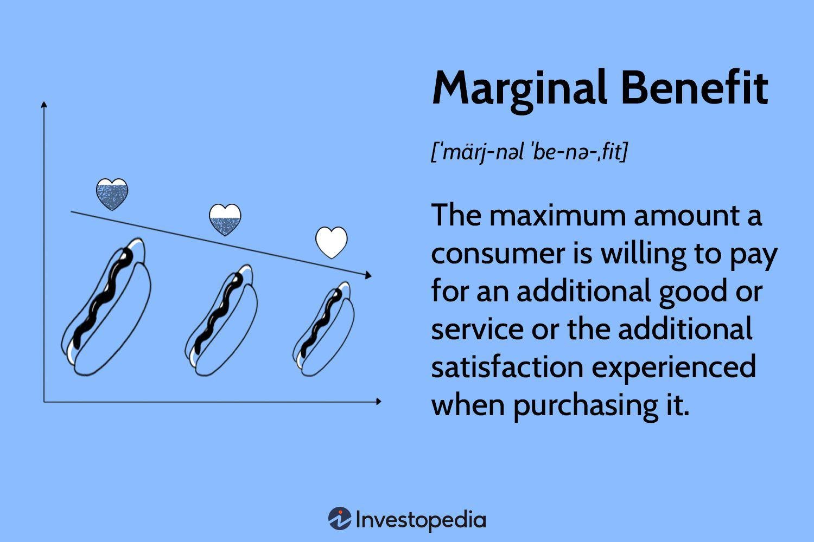

In the ever-evolving landscape of economics and finance, understanding economic theories and their practical applications is paramount. One such critical theory is that of marginal benefit, a concept that provides insight into decision-making processes related to consumer behavior and business strategies. Marginal benefit refers to the additional satisfaction or utility that an individual or business receives from consuming an additional unit of a good or service. This concept is integral to various economic decisions, influencing how consumers allocate their resources and how businesses set prices and optimize production levels.

The significance of marginal benefit extends beyond consumer decision-making. It is a fundamental element in various strategic frameworks used by businesses to maximize profitability and enhance customer satisfaction. In understanding consumer choices, marginal benefit helps businesses tailor their offerings and strategies to align with consumer preferences, ensuring effective resource allocation and efficient pricing mechanisms.



Moreover, in algorithmic trading, marginal analysis involving marginal benefit calculations plays a crucial role. Algorithmic trading systems leverage this concept to evaluate potential trades based on the expected returns and associated costs, optimizing trading strategies to capitalize on marginal returns. Understanding the intricacies of marginal benefit is essential not only for theoretical analysis but also for practical applications in optimizing financial and strategic outcomes.

This article explores the theoretical foundations of marginal benefit, its importance in economic theory, and its applications in various fields, such as algorithmic trading and business strategy. By examining these concepts, the article aims to provide readers with a comprehensive understanding of how marginal benefit influences decision-making processes in both consumer and corporate landscapes.

## Table of Contents

## Understanding Marginal Benefit

Marginal benefit represents the additional satisfaction or utility that consumers receive from consuming an additional unit of a good or service. It is crucial in understanding consumer behavior and plays a significant role in decision-making processes. When allocating resources, individuals and businesses evaluate the marginal benefit to ensure that each unit consumed contributes positively to overall utility. 

In economic theory, marginal benefit is analyzed to set optimal pricing strategies. By comprehending how much value or satisfaction consumers derive from an additional unit, businesses can adjust prices to reflect these perceptions, potentially maximizing sales and revenue. This concept is directly linked to the consumer demand curve; as the price of a good changes, so does the quantity demanded, reflecting the varying levels of marginal benefit.

Typically, the marginal benefit decreases as consumption increases, a principle known as the law of diminishing marginal utility. This principle posits that as consumers consume more units of a particular good, the additional satisfaction derived from each subsequent unit decreases. For example, the enjoyment or utility gained from consuming the first slice of pizza is generally higher than the enjoyment from consuming the fourth or fifth slice. Mathematically, this can be expressed as a declining marginal benefit function, where the derivative of the total benefit with respect to quantity is positive but decreasing:

$$
MB(q) = \frac{dU}{dq}
$$

Where $MB(q)$ is the marginal benefit at quantity $q$, and $U$ is the total utility function.

This characteristic of diminishing marginal utility is pivotal for economic [agents](/wiki/agents) when determining how to allocate their limited resources among various competing needs and wants. Understanding and calculating marginal benefits enable consumers to make optimal purchasing decisions and businesses to devise pricing strategies that align with consumer satisfaction levels.

## Economic Theory: Law of Diminishing Marginal Benefit

The Law of Diminishing Marginal Benefit is a fundamental principle in economic theory, describing how the additional satisfaction or utility a consumer gains from each additional unit of a good or service decreases as the quantity consumed increases. This concept is closely related to the law of diminishing marginal utility, which quantifies how value or benefit diminishes with each subsequent unit.

Mathematically, if $U(x)$ is the utility derived from consuming $x$ units of a good, the marginal benefit $MB$ can be expressed as:

$$
MB(x) = \frac{dU}{dx}
$$

As consumption $x$ increases, $MB(x)$ tends to decrease. This principle assists individuals and organizations in understanding and predicting consumer behavior. Consumers allocate their limited resources—such as time and money—based on the perceived benefits of additional consumption. Thus, as marginal benefit decreases, consumers are less likely to continue purchasing additional units at the same price unless the cost decreases.

For businesses, recognizing the diminishing marginal benefit helps in setting optimal pricing strategies. For instance, companies might offer discounts or bulk pricing to counteract the decreasing utility consumers experience after a certain threshold. Such pricing strategies exploit the consumer's perception of value to maximize sales [volume](/wiki/volume-trading-strategy) and overall revenue.

Moreover, this principle assists economists and marketers in optimizing resource allocation and predicting how changes in price or product features can alter consumer demand. By analyzing marginal benefit, businesses can identify price points that maximize the perceived value for consumers while ensuring profitability.

Understanding the decline in marginal benefit is crucial for developing strategies that align production with consumer preferences, ensuring resources are effectively utilized to enhance both customer satisfaction and business performance.

## Marginal Benefit vs. Marginal Cost

In economic decision-making, the comparison between marginal benefit and marginal cost is fundamental. Marginal benefit refers to the additional advantage or utility gained from the consumption or production of one more unit of a good or service, while marginal cost refers to the additional expense incurred to produce or acquire that additional unit.

The primary objective for businesses is to ensure that the marginal benefit exceeds the marginal cost, thereby maximizing overall profitability. This relationship can be expressed mathematically as:

$$
\text{Maximize Profit} = \sum (\text{Marginal Benefit}_i - \text{Marginal Cost}_i)
$$

where $i$ represents the respective units of output or services examined.

In practice, businesses utilize this comparison to make informed production and investment decisions. When the marginal benefit of producing an additional unit is greater than the marginal cost, it is considered advantageous to increase production. Conversely, if the marginal cost surpasses the marginal benefit, reducing production or reevaluating resource allocation might be more beneficial.

This balance is particularly crucial in competitive markets where efficiency can dramatically impact a company's bottom line. As firms strive for optimal operational performance, they employ strategies such as cost-benefit analyses and marginal analysis to maintain a profitable equilibrium. This strategic planning involves examining current and future market conditions, cost structures, and consumer preferences. By constantly refining their approaches based on marginal benefit versus marginal cost considerations, businesses can effectively navigate market competition and achieve sustainable growth.

## Algorithmic Trading and Marginal Analysis

Algorithmic trading leverages advanced computational techniques to make informed and timely trading decisions in financial markets. A critical component of this strategy is marginal analysis, which assesses the marginal benefit relative to the marginal cost of executing a trade. By optimizing this balance, [algorithmic trading](/wiki/algorithmic-trading) aims to enhance overall trading performance and profitability.

At the core of algorithmic trading is the calculation of expected returns and costs associated with potential trades. Algorithms evaluate these parameters to determine whether executing an additional trade will result in a net gain. In mathematical terms, this involves comparing the marginal benefit (MB) to the marginal cost (MC) for each trade opportunity. The objective is to execute trades where MB exceeds MC, thus maximizing profit. This can be represented by the condition:

$$
\text{MB} > \text{MC}
$$

Python code is often used to execute these algorithms in real-time, making quick decisions based on live market data. A simplified example of such an algorithm might involve fetching market data, calculating potential returns, and evaluating associated costs as follows:

```python
def evaluate_trade(decision_variables):
    # Mock function for expected return calculation
    expected_return = calculate_expected_return(decision_variables)
    # Mock function for cost calculation
    transaction_cost = calculate_transaction_cost(decision_variables)

    # Marginal Benefit vs Marginal Cost
    if expected_return > transaction_cost:
        execute_trade(decision_variables)
    else:
        pass  # No action taken if marginal cost outweighs benefit

def calculate_expected_return(variables):
    # Placeholder for expected return logic
    return variables['price_change'] * variables['quantity']

def calculate_transaction_cost(variables):
    # Placeholder for cost calculation logic
    return variables['fixed_cost'] + variables['variable_cost']

def execute_trade(variables):
    # Mock trading function
    print(f"Trade executed for {variables['stock']} at {variables['price']}")

# Example call
decision_variables = {'price_change': 5, 'quantity': 100, 'fixed_cost': 2, 'variable_cost': 1, 'stock': 'AAPL', 'price': 150}
evaluate_trade(decision_variables)
```

In this Python snippet, the `evaluate_trade` function models the evaluation of a stock trade. It calculates the expected return and transaction cost for a given set of decision variables. If the expected return surpasses the transaction cost, it executes the trade, demonstrating a scenario where the marginal benefit justifies the transaction.

This methodology allows trading algorithms to efficiently capitalize on small price movements in the market, providing opportunities to generate substantial returns over numerous trades. By continuously refining these models and incorporating real-time data, algorithmic strategies can dynamically adjust to market conditions, optimizing outcomes.

Overall, incorporating marginal analysis into algorithmic trading equips traders with the ability to make calculated, data-driven decisions aimed at maximizing financial performance. As technology progresses, the precision and sophistication of these algorithms continue to evolve, making marginal analysis an indispensable tool in modern finance.

## Applications of Marginal Benefit in Business

Businesses leverage the concept of marginal benefit to fine-tune their operations, enhancing customer satisfaction while optimizing profitability. Marginal benefit guides key business decisions, particularly in pricing, resource allocation, and production levels.

Firstly, in pricing strategies, understanding marginal benefit is essential. Businesses strive to set prices where consumers perceive the maximum value. By analyzing the utility consumers derive from additional units of a product, companies can adopt utility-based pricing models. These models adjust prices in line with the perceived value added by each unit, ensuring that prices align with consumer utility and willingness to pay. For instance, a software company might offer different pricing tiers for its products, with each tier providing additional features that have a high marginal benefit to specific consumer segments.

In resource allocation, marginal benefit analysis assists businesses in distributing their resources efficiently. By evaluating the additional benefit obtained from investing in a particular area, companies can prioritize projects and investments that yield the highest return. This is crucial in sectors where resources are limited and must be judiciously allocated to maximize output and customer value.

The concept also plays a critical role when launching new products. Before introducing a product to the market, companies assess the marginal benefit to anticipate consumer response. If a new product offers significant incremental benefits over existing alternatives, it is likelier to succeed. Conversely, if the marginal benefit is negligible, the product may struggle to capture market share.

An application of marginal benefit analysis can be seen in production. Businesses aim to produce up to the point where the marginal benefit of producing an additional unit equals the marginal cost. This equilibrium ensures that each unit produced adds optimal value, contributing to overall efficiency and profit maximization.

Overall, businesses that effectively apply marginal benefit principles in their operations can enhance consumer satisfaction and ensure strategic resource use, thus achieving a competitive edge in the market.

## Conclusion

Understanding marginal benefits is vital for making informed economic and business decisions. This economic concept serves as a fundamental framework for analyzing consumer behavior, providing insights into how individuals make choices based on incremental benefits. The diminished additional satisfaction gained from consuming an extra unit of a good explains the common consumer tendency to diversify spending and explore various products.

Businesses leverage the understanding of marginal benefits to craft strategic decisions in pricing, resource allocation, and investment. In pricing strategies, companies use the diminishing marginal benefit to set prices that maximize profit while ensuring consumer satisfaction. For instance, price discrimination strategies often rely on an analysis of consumer surplus and marginal benefits to optimize revenue across different market segments.

Moreover, marginal benefit is integral to algorithmic trading, where algorithms assess the expected marginal returns relative to costs. By incorporating real-time data and predictive analytics, these algorithms optimize trading actions, seeking to maximize the marginal return per transaction while minimizing associated risks and costs. This quantitative analysis is crucial for high-frequency trading environments where rapid decision-making can lead to substantial financial gains or losses.

Strategic business practices frequently integrate marginal analysis to optimize resource use. For example, businesses often conduct marginal analysis to determine the ideal levels of production and inventory, ensuring resources are not wasted and operational efficiencies are maximized. By understanding the relationship between marginal cost and marginal benefit, companies can make judicious decisions that enhance profitability and competitiveness in the market.

Ultimately, the ability to effectively apply marginal benefit analysis can substantially improve the financial performance of individuals and organizations. By integrating this economic insight, stakeholders can ensure resources are utilized efficiently, contributing to sustainable business growth and economic stability.

## References & Further Reading

[1]: ["Advances in Financial Machine Learning"](https://www.amazon.com/Advances-Financial-Machine-Learning-Marcos/dp/1119482089) by Marcos Lopez de Prado

[2]: ["Evidence-Based Technical Analysis: Applying the Scientific Method and Statistical Inference to Trading Signals"](https://www.amazon.com/Evidence-Based-Technical-Analysis-Scientific-Statistical/dp/0470008741) by David Aronson

[3]: ["Machine Learning for Algorithmic Trading"](https://github.com/PacktPublishing/Machine-Learning-for-Algorithmic-Trading-Second-Edition) by Stefan Jansen

[4]: ["Quantitative Trading: How to Build Your Own Algorithmic Trading Business"](https://www.amazon.com/Quantitative-Trading-Build-Algorithmic-Business/dp/1119800064) by Ernest P. Chan