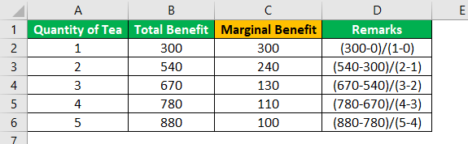

Understanding the principles of marginal cost and marginal benefit is fundamental in the fields of economics, trading, and finance. These concepts are vital as they guide decision-making processes by helping individuals and institutions assess the additional costs and benefits associated with producing or consuming one more unit of resources. Marginal cost refers to the expense of producing one additional unit of a good or service, while marginal benefit represents the additional gain or utility derived from this production or consumption.

The emergence and growth of algorithmic trading—a method of executing trades using pre-programmed rules and computer algorithms—have introduced new dimensions to the application of marginal cost and marginal benefit. Algorithmic trading systems analyze vast quantities of market data at high speed, facilitating swift trading decisions aimed at maximizing returns. This technological advancement has significantly transformed financial markets and trading practices by offering increased efficiency and precision over traditional methods.



This article explores how marginal cost and marginal benefit principles are applied within the context of algorithmic trading. By examining how these economic concepts can enhance trading strategies and improve financial outcomes, we aim to shed light on their importance in optimizing performance. Traders and economists can leverage these principles to design more effective algorithms, balance tradeoffs, and ultimately gain a competitive edge in the fast-paced, dynamic world of algorithmic trading. The integration of marginal analysis with advanced trading technologies promises to reshape the landscape of finance, providing an opportunity for more strategic and informed decision-making.

## Table of Contents

## Understanding Marginal Cost and Marginal Benefit

Marginal cost and marginal benefit are foundational concepts in economics, central to the efficient allocation of resources in various fields, including trading and investing. Marginal cost (MC) is defined as the cost of producing one additional unit of a good or service. It is calculated by taking the change in total cost (ΔTC) that arises from producing an additional unit and dividing it by the change in quantity produced (ΔQ):

$$
MC = \frac{\Delta TC}{\Delta Q}
$$

This measure helps businesses and traders assess the implications of scaling up production or operations, thereby enabling informed decision-making.

Conversely, marginal benefit (MB) represents the additional gain or value derived from consuming or producing an additional unit of a good or service. Similar to marginal cost, it is calculated as the change in total benefit (ΔTB) per change in quantity:

$$
MB = \frac{\Delta TB}{\Delta Q}
$$

The essence of economic efficiency lies in balancing marginal cost and marginal benefit. The optimal allocation of resources is achieved when the marginal benefit of an action equals its marginal cost (MB = MC). This equilibrium ensures that resources are neither over-allocated nor underutilized, thus maximizing net benefits.

In practical applications, understanding marginal cost and marginal benefit is crucial for making decisions that enhance profitability and utility. In trading, for instance, these concepts aid in maximizing returns on investment by ensuring that the cost of executing additional trades or strategies is justified by the expected benefits.

In essence, the proper application of these principles allows traders and investors to refine their strategies, ensuring that each incremental action is optimally beneficial, thereby contributing to overall economic efficiency and strategic success.

## Algorithmic Trading: An Overview

Algorithmic trading employs sophisticated computer algorithms to execute trading decisions, allowing for operations at unprecedented speed and [volume](/wiki/volume-trading-strategy). These algorithms are designed to analyze vast arrays of market data, capturing intricate patterns and opportunities that may be invisible to the human eye. In milliseconds, they can process market signals and execute trades, enabling traders to exploit even the most transient market inefficiencies.

Characterized by its efficiency and precision, [algorithmic trading](/wiki/algorithmic-trading) has gained prominence as a formidable force in financial markets. Currently, it accounts for a significant proportion of all securities trades, ranging from equities to commodities and [forex](/wiki/forex-system) markets. This widespread adoption has been driven by several factors, including the ability of these systems to reduce transaction costs, mitigate human errors, and operate beyond the typical constraints of human traders.

One of the key advantages of algorithmic trading over traditional methods lies in its scalability and speed. Unlike human traders, algorithms can simultaneously monitor multiple markets and execute high-frequency trades swiftly, which is imperative in today's fast-paced market environments. With latency measured in microseconds, these algorithms can swiftly react to market changes, fostering enhanced [liquidity](/wiki/liquidity-risk-premium) and market efficiency.

Furthermore, understanding the cost-benefit dynamics of algorithmic trading is critical for the development of robust and effective algorithms. The process entails weighing the marginal costs—such as computational resources, data acquisition, and infrastructure required to develop and operate the algorithms—against the marginal benefits, primarily the additional profit generated. By optimizing these variables, traders strive to maximize the profitability and efficiency of their operations.

Incorporating a deep comprehension of these dynamics allows traders and developers to refine and enhance algorithmic strategies. Tailored algorithms can be calibrated to adapt to various market conditions, further providing a competitive edge and aligning with specific financial goals. This integration of technology and strategic economic analysis signifies a paradigm shift in the way financial markets operate, continuing to push the boundaries of modern trading practices.

## Applying Marginal Cost and Marginal Benefit in Algo Trading

In algorithmic trading, the concept of marginal cost encompasses the expenses involved in creating and executing trading algorithms. These costs include the development time, computational resources, and continuous maintenance required to keep the algorithms efficient and competitive. Additionally, direct costs such as transaction fees and data procurement further contribute to the marginal cost. Marginal costs are not static; they can fluctuate based on technological advancements and market conditions.

Conversely, marginal benefit represents the additional profits generated by utilizing these algorithms in trading activities. This benefit derives from the algorithm’s ability to execute trades more efficiently and at a higher frequency than manual methods, potentially leading to increased financial returns. The primary challenge for traders is to regularly assess whether the marginal benefits derived from their algorithms exceed the associated marginal costs. This assessment ensures that the resources are being utilized optimally to maximize profits.

To effectively manage these economic principles, traders must take into account not only the apparent expenses and gains but also the opportunity costs associated with alternative trading strategies. Opportunity cost refers to the potential benefits an investor forgoes when choosing one strategy over another. In algorithmic trading, the decision to deploy a particular algorithm involves analyzing whether it offers better prospects compared to other strategies that could have been employed with the same resources.

Balancing marginal cost and marginal benefit is pivotal to achieving optimal trading outcomes. This balance can be mathematically represented as:

$$
\Delta \text{Profit} = \Delta \text{Benefit} - \Delta \text{Cost}
$$

where $\Delta \text{Profit}$ should remain positive to indicate a beneficial strategy. If $\Delta \text{Cost}$ surpasses $\Delta \text{Benefit}$, it may be a signal to revise or replace the trading algorithm.

Advanced tools and analytical methods can assist traders in this balancing act. For instance, by employing sensitivity analysis, traders can evaluate how changes in market conditions or algorithm parameters might impact cost and benefit dynamics. Moreover, incorporating feedback loops to continuously update and refine algorithms based on real-time performance can further enhance profit margins. By carefully managing these economic principles, traders can achieve more effective and profitable outcomes in algorithmic trading.

## Optimization Techniques in Algo Trading

Optimization techniques are fundamental in helping traders achieve the right equilibrium between marginal cost and marginal benefit in algorithmic trading. By pursuing strategies that balance input resources and generated returns, traders can refine the effectiveness and profitability of their trading algorithms.

Backtesting stands out as a predominant method for optimization within algorithmic trading. It involves simulating an algorithm's performance using historical market data to assess its potential success and pitfalls. This approach allows traders to analyze how their strategies would have performed in the past, providing critical insights into their reliability and efficiency. The process can involve computationally intensive tasks if the data set is large, necessitating efficient coding practices to handle the data appropriately.

Machine learning and [artificial intelligence](/wiki/ai-artificial-intelligence) have become increasingly significant in predictive analysis for algo trading. These technologies can handle vast amounts of data and detect complex patterns that may not be discernible through traditional analysis methods. Using supervised learning methods, for instance, algorithms can be trained on historical data to predict future price movements. An example of a [machine learning](/wiki/machine-learning) method frequently used in this context is the Random Forest algorithm, which is adept at managing overfitting—a common challenge in trading model development—by averaging predictions from multiple decision trees.

Here is a simplified example using Python for [backtesting](/wiki/backtesting) with a machine learning model:

```python
import pandas as pd
from sklearn.ensemble import RandomForestClassifier
from sklearn.model_selection import train_test_split
from sklearn.metrics import accuracy_score

# Load historical trading data into a Pandas DataFrame
data = pd.read_csv('historical_data.csv')
X = data.drop('target', axis=1)  # Features
y = data['target']  # Target variable (e.g., stock price movement)

# Split the data into training and test sets
X_train, X_test, y_train, y_test = train_test_split(X, y, test_size=0.2, random_state=42)

# Initialize the Random Forest Classifier
model = RandomForestClassifier(n_estimators=100, random_state=42)

# Train the model
model.fit(X_train, y_train)

# Make predictions on the test set
y_pred = model.predict(X_test)

# Evaluate the model
accuracy = accuracy_score(y_test, y_pred)
print(f'Model Accuracy: {accuracy:.2f}')
```

Cost-reduction strategies are an integral part of the optimization process, focusing on minimizing transaction costs and improving algorithm efficiency. Transaction costs, including brokerage fees, bid-ask spreads, and slippage, can substantially impact the profitability of trades. Efficient algorithms that can streamline processes while reducing execution times result in lower computational costs and improved overall performance.

Moreover, enhancing algorithm efficiency involves refining code to increase speed and reduce complexity without compromising on reliability. This might include optimizing the algorithm's logic, selecting suitable data structures, and employing parallel processing techniques to expedite execution.

These optimization techniques collectively empower traders to hone their trading strategies, thereby achieving optimal financial results. By applying such methods, traders can effectively manage the balance between marginal cost and marginal benefit, leading to more informed trading decisions and superior market performance.

## Challenges and Considerations

The dynamic nature of financial markets presents numerous challenges when applying economic principles such as marginal cost and marginal benefit in algorithmic trading. One of the foremost challenges is market [volatility](/wiki/volatility-trading-strategies), which can significantly impact real-time trading decisions. Volatility affects not only the prices and returns but also the liquidity and transaction costs, thus influencing the marginal costs and benefits associated with specific trades. For instance, a sudden spike in volatility may increase the marginal cost of a trade due to higher spreads or slippage, while potentially altering the perceived marginal benefits if expected returns change.

Additionally, regulatory changes present challenges that can have profound effects on trading algorithms and their inherent cost structures. Regulatory bodies continuously adapt and update trading rules, which can necessitate modifications to existing algorithms. Such changes might require additional resource allocation for development and compliance, thereby impacting the marginal cost. For instance, the implementation of new compliance standards might increase audit trails and data reporting requirements, adding layers of complexity and cost.

Security and data privacy are also critical considerations in the algorithmic trading environment. Given the technological reliance on vast datasets and complex algorithms, these systems are prone to cybersecurity risks. The potential for data breaches or unauthorized access can jeopardize sensitive trading data, incurring additional costs both in terms of security measures and potential financial damages. Ensuring robust encryption and data protection standards is essential but can increase the operational costs associated with maintaining secure trading environments.

Furthermore, traders must be prepared to adapt their strategies continuously to these evolving conditions. This adaptability involves a readiness to refine algorithms in response to changing market dynamics, regulatory landscapes, and emerging security threats. Flexibility in strategy development can be supported by employing advanced technologies such as machine learning, which allows algorithms to learn from new data and adjust trades accordingly. In the Python ecosystem, tools like TensorFlow or PyTorch can be employed to build adaptive models capable of recognizing shifts in market conditions, thus optimizing the balance between marginal costs and benefits.

In summary, while the application of economic principles like marginal cost and marginal benefit in algorithmic trading offers significant advantages, traders must navigate the inherent challenges that come with ever-changing financial markets. By addressing market volatility, adapting to regulatory changes, ensuring data security, and maintaining flexible strategies, traders can optimize their algorithmic systems to withstand the complex and fluctuating trading environment.

## Conclusion

The principles of marginal cost and marginal benefit are pivotal in the field of algorithmic trading. By understanding and implementing these economic tenets, traders can make well-informed and effective decisions that enhance their investment strategies. An acute awareness of the balance between the costs incurred in running trading algorithms and the benefits gained from them fosters sharper decision-making processes. This balanced approach not only promotes efficiency but also aids in achieving optimal trading outcomes.

Although the landscape of algorithmic trading is fraught with challenges such as market volatility and regulatory changes, it is also a field rich with potential. Innovative solutions and optimization techniques, including advancements in machine learning and AI, continue to refine trading strategies. These technological enhancements enable traders to better navigate the complexities of modern financial markets.

The integration of economic theory with cutting-edge technology holds the promise of further revolutionizing trading practices. By meticulously calculating and maximizing marginal benefits relative to marginal costs, traders can harness these principles to gain a competitive edge. Mastery in applying these economic concepts is therefore not merely academic; it translates directly to financial gains and strategic superiority in the competitive world of algorithmic trading.

## References & Further Reading

[1]: Bergstra, J., Bardenet, R., Bengio, Y., & Kégl, B. (2011). ["Algorithms for Hyper-Parameter Optimization."](https://dl.acm.org/doi/10.5555/2986459.2986743) Advances in Neural Information Processing Systems 24.

[2]: ["Advances in Financial Machine Learning"](https://www.amazon.com/Advances-Financial-Machine-Learning-Marcos/dp/1119482089) by Marcos Lopez de Prado

[3]: ["Evidence-Based Technical Analysis: Applying the Scientific Method and Statistical Inference to Trading Signals"](https://www.amazon.com/Evidence-Based-Technical-Analysis-Scientific-Statistical/dp/0470008741) by David Aronson

[4]: ["Machine Learning for Algorithmic Trading"](https://github.com/stefan-jansen/machine-learning-for-trading) by Stefan Jansen

[5]: ["Quantitative Trading: How to Build Your Own Algorithmic Trading Business"](https://github.com/LucindaYa/quant-resources/blob/master/Quantitative%20Trading%20How%20to%20Build%20Your%20Own%20Algorithmic%20Trading%20Business.pdf) by Ernest P. Chan