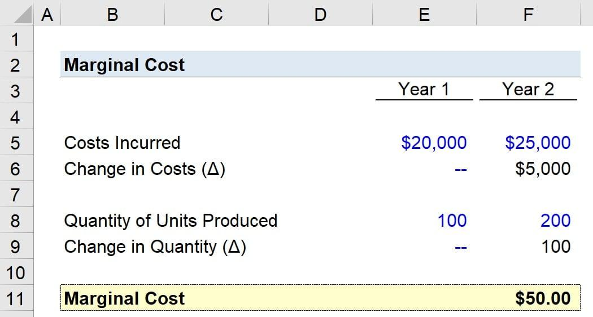

## Table of Contents

## What is marginal cost?

Marginal cost is the cost of producing one more unit of a product. Imagine you are making cookies. If you've already made 10 cookies and it costs you $2 to make one more, that $2 is the marginal cost of the 11th cookie. Businesses use marginal cost to decide if it's worth making more of something. If the price they can sell the product for is higher than the marginal cost, it makes sense to produce more.

Understanding marginal cost helps businesses make smart choices. For example, if a company finds that the marginal cost of making another T-shirt is $5, but they can only sell it for $4, they would lose money on that T-shirt. So, they might decide not to make any more. On the other hand, if they can sell it for $6, they would make a profit, and it would be a good idea to keep producing. This way, marginal cost helps guide production decisions to maximize profits.

## Why is marginal cost important in economics?

Marginal cost is important in economics because it helps businesses decide how much to produce. It's like a guide that tells them if making one more item will be profitable. If the cost of making one more item is less than what they can sell it for, it makes sense to produce more. This helps businesses make more money by figuring out the best amount of stuff to make.

It also helps in setting prices. If a business knows how much it costs to make one more item, they can set a price that covers that cost and still makes a profit. This is important for staying competitive in the market. Understanding marginal cost helps businesses make smart choices about production and pricing, which can lead to better overall economic decisions.

## How do you calculate marginal cost?

To calculate marginal cost, you need to know how much it costs to make one more item. First, you look at the total cost of making all the items you have so far. Then, you make one more item and look at the new total cost. The difference between these two total costs is the marginal cost. For example, if making 10 items costs $100 and making 11 items costs $105, the marginal cost of the 11th item is $5.

This calculation is important because it helps businesses decide if it's worth making more items. If the price they can sell the item for is more than the marginal cost, it makes sense to produce more. But if the price is less than the marginal cost, they might lose money by making more. So, knowing the marginal cost helps businesses make smart choices about how much to produce to make the most profit.

## What is the difference between marginal cost and average cost?

Marginal cost is the cost of making one more item. For example, if it costs $100 to make 10 cookies and $105 to make 11 cookies, the marginal cost of the 11th cookie is $5. This helps businesses decide if making more items will be profitable. If they can sell the 11th cookie for more than $5, it makes sense to make it. But if they can only sell it for less than $5, they might lose money.

Average cost, on the other hand, is the total cost divided by the number of items made. Using the same example, if it costs $100 to make 10 cookies, the average cost per cookie is $100 divided by 10, which is $10. Average cost gives businesses an idea of how much it costs to make each item on average. It's useful for understanding overall production costs, while marginal cost helps with decisions about making more items.

## Can you provide an example of marginal cost in a business scenario?

Imagine a small bakery that makes cupcakes. The bakery has already made 50 cupcakes, and the total cost so far is $100. The owner decides to make one more cupcake, and after making it, the total cost goes up to $102. The difference between the new total cost ($102) and the old total cost ($100) is $2. That $2 is the marginal cost of making the 51st cupcake. 

The bakery owner can use this information to decide if it's worth making more cupcakes. If they can sell the 51st cupcake for more than $2, it makes sense to keep baking. For example, if they can sell it for $3, they will make a profit of $1 on that cupcake. But if they can only sell it for $1.50, they would lose $0.50. So, knowing the marginal cost helps the bakery owner make smart choices about how many cupcakes to bake to maximize their profits.

## How does marginal cost relate to the supply curve?

Marginal cost is closely related to the supply curve in economics. The supply curve shows how much of a product businesses are willing to sell at different prices. It usually slopes upward because as the price goes up, businesses are willing to produce and sell more. This is because the higher price means that even items with a higher marginal cost can still be profitable to produce. So, the supply curve is often based on the marginal cost of production. If the price is higher than the marginal cost, businesses will produce more, which shifts the supply curve to the right.

In simple terms, think of a lemonade stand. If it costs 50 cents to make one more cup of lemonade (the marginal cost), the stand owner will only make more lemonade if they can sell it for more than 50 cents. If the price they can sell it for is $1, they'll make a lot more lemonade because it's profitable. But if the price drops to 40 cents, they'll stop making more because they'll lose money. This decision-making process based on marginal cost helps shape the supply curve, showing how much businesses are willing to supply at different prices.

## What factors can cause marginal cost to change?

Marginal cost can change because of many things. One big reason is the cost of the stuff you need to make your product. If the price of ingredients or materials goes up, it will cost more to make one more item. For example, if the price of flour goes up, it will cost more to make one more loaf of bread. Another reason is how much it costs to use machines or pay workers. If you need to work longer hours or use more machines to make one more item, the cost can go up.

Also, the size of your business can affect marginal cost. When a business is small, making one more item might not cost much more. But as the business gets bigger, it might need to buy more expensive equipment or hire more workers, which can make the cost of making one more item go up. Sometimes, though, if a business gets really big, it can buy things in bulk and save money, which can make the marginal cost go down. So, the marginal cost can change a lot depending on what's happening with costs and how big the business is.

## How does economies of scale affect marginal cost?

Economies of scale can make the marginal cost go down. When a business gets bigger, it can often buy things in bulk, like materials or supplies, which can be cheaper. Also, a bigger business might be able to use its machines and workers more efficiently. For example, if a factory makes more cars, it can spread the cost of running the factory over more cars, making each car cheaper to make. So, as the business grows, the cost of making one more item can go down because the business is more efficient and can buy things at a lower price.

But, there's a point where economies of scale can stop helping and even start to make the marginal cost go up. This is called diseconomies of scale. When a business gets too big, it might become harder to manage. It might need more managers or more complicated systems, which can cost more money. Also, if the business needs to build a new factory or buy new machines to make more items, that can make the cost of making one more item go up. So, while getting bigger can lower the marginal cost at first, if the business grows too much, the cost of making one more item can start to increase.

## What is the role of marginal cost in decision making for production?

Marginal cost plays a big role in helping businesses decide how much to make. It's the cost of making one more item, like one more cookie or one more car. Businesses look at the marginal cost to see if making more stuff will make them money. If the price they can sell the item for is more than the marginal cost, it makes sense to make more. For example, if it costs $2 to make one more cookie and they can sell it for $3, they will make a profit of $1 on that cookie. But if they can only sell it for $1, they would lose $1, so they would stop making more cookies.

Understanding marginal cost helps businesses make smart choices about production. They can use it to figure out the best amount of stuff to make to make the most money. If the marginal cost starts to go up a lot, it might mean that making more stuff isn't worth it anymore. For example, if a factory is working really hard and the cost of making one more car goes up to $20,000, but they can only sell it for $18,000, they would lose money. So, they might decide to make fewer cars. By looking at the marginal cost, businesses can keep making decisions that help them be more profitable.

## How do externalities impact the calculation of marginal cost?

Externalities are things that happen because of making a product that affect other people, but the business doesn't pay for them. For example, if a factory makes a lot of smoke that makes the air dirty, the cost of cleaning up the air is not paid by the factory. This means the real cost of making one more item is higher than what the factory thinks it is. If the factory only looks at its own costs, it might think it's okay to make more stuff because it looks profitable. But if they had to pay for the dirty air too, the cost of making one more item would be higher, and they might decide to make less.

So, externalities can make the marginal cost different from what the business sees. If the business had to pay for all the extra costs that affect other people, like pollution or noise, the marginal cost would go up. This could change their decisions about how much to produce. If they had to think about these extra costs, they might make less of the product because it wouldn't be as profitable. Understanding externalities helps us see the true cost of making things and can lead to better decisions for everyone.

## What are the limitations of using marginal cost in economic analysis?

Using marginal cost in economic analysis can be tricky because it doesn't always show the whole picture. Sometimes, businesses only look at their own costs and don't think about the extra costs that affect other people, like pollution. These are called externalities. If a factory makes a lot of smoke, the cost of cleaning up the air isn't paid by the factory, so the real cost of making one more item is higher than what the factory sees. This can make businesses think making more stuff is a good idea when it might not be if they had to pay for all the extra costs.

Another problem is that marginal cost can change a lot. It can go up if a business gets too big and needs more expensive equipment or more workers. It can also go down if a business gets bigger and can buy things cheaper. This means that the marginal cost can be hard to predict and can change the decisions a business makes. If the cost of making one more item goes up a lot, a business might decide to make less, but if it goes down, they might decide to make more. So, while marginal cost is a helpful tool, it has its limits because it can be affected by many things that are hard to control or predict.

## How can advanced statistical models improve the accuracy of marginal cost calculations?

Advanced statistical models can help businesses figure out marginal cost more accurately by looking at a lot of data at once. These models can take into account things like changes in the price of materials, how much workers cost, and even how much machines are used. By using all this information, the models can predict how the cost of making one more item might change over time. This helps businesses make better decisions about how much to produce because they have a clearer picture of what it will really cost.

Also, these models can help businesses see patterns that they might miss if they just looked at costs one at a time. For example, they can show how the cost of making one more item goes up or down when the business gets bigger or smaller. This is important because it helps businesses plan for the future and understand how different things affect their costs. By using advanced statistical models, businesses can make smarter choices about production and stay more profitable.

## What is the concept of Marginal Cost in Economics?

Marginal cost in economics refers to the additional cost incurred when producing one more unit of a product. It is a crucial measure that helps firms decide the optimal level of production to achieve cost efficiency. The mathematical formula for calculating marginal cost (MC) is expressed as:

$$
MC = \frac{\Delta TC}{\Delta Q}
$$

where $\Delta TC$ represents the change in total costs, and $\Delta Q$ signifies the change in quantity produced.

The concept of marginal cost is intrinsically linked to economies of scale, which describe the cost advantages that enterprises attain due to the scale of their operation. As production volume increases, businesses can often reduce the per-unit cost by spreading fixed costs over a larger number of units and utilizing operational efficiencies. This reduction in average costs can result in lower marginal costs up to a certain point. However, after reaching optimal production levels, diseconomies of scale may occur, potentially increasing marginal costs due to factors such as resource limitations or managerial inefficiencies.

A pivotal consideration for firms is identifying the production level where marginal cost equals marginal revenue (MR). Marginal revenue is the additional income from selling one more unit. Profit maximization occurs at this equilibrium point (MC = MR) because it ensures that the cost of producing an additional unit is exactly balanced by the revenue it generates, meaning that producing beyond this point would lead to a decrease in profitability as the cost of production would surpass the revenue gained. Thus, understanding and applying marginal cost principles not only aids in optimizing production processes but also in strategic pricing decisions and overall business profitability assessments.

## How is the calculation of marginal cost performed?

Calculating marginal cost is a fundamental component of economic analysis, involving fixed and variable costs. Fixed costs, such as rent or salaries, remain unchanged irrespective of production levels. Conversely, variable costs, like raw materials and utility bills, vary directly with the [volume](/wiki/volume-trading-strategy) of output. Understanding these cost components is crucial for calculating the marginal cost accurately.

To determine the marginal cost, the following formula is used:

$$
MC = \frac{\Delta TC}{\Delta Q}
$$

Where $MC$ stands for marginal cost, $\Delta TC$ represents the change in total cost, and $\Delta Q$ denotes the change in quantity produced. This formula captures the additional cost incurred when one more unit of a product is manufactured.

Consider a manufacturing scenario where producing 100 units incurs a total cost of $1000, and increasing production to 101 units raises the total cost to $1020. The marginal cost can be calculated as follows:

1. Calculate the change in total cost: $\Delta TC = 1020 - 1000 = 20$
2. Determine the change in quantity: $\Delta Q = 101 - 100 = 1$
3. Apply the marginal cost formula: $MC = \frac{20}{1} = 20$

Thus, the marginal cost for producing the 101st unit is $20. This marginal cost analysis helps illustrate how adjustments in production levels impact overall cost efficiency.

In practical terms, businesses utilize this concept to decide whether increasing production is economically viable. If the marginal revenue exceeds or equals the marginal cost, it suggests that expanding production could enhance profitability. This approach ensures that enterprises make informed decisions tailored to their financial and operational dynamics.

## What are the benefits of marginal cost analysis?

Marginal cost analysis offers substantial benefits by guiding organizations in resource allocation and strategic decision-making. By focusing on the most profitable product lines, companies can optimize their production processes, ensuring that resources are directed toward outputs that create the most value. This is achieved by calculating the marginal cost, which allows firms to ascertain whether producing an additional unit results in a profit or loss, thereby streamlining production strategies.

One significant advantage of marginal cost analysis is its application in determining the viability of accepting special orders. When faced with a special order, businesses can compare the additional revenue against the marginal cost to decide if the order is financially beneficial. For this purpose, the decision criterion involves checking if the price of the special order exceeds the marginal cost. If this condition holds, the order can contribute positively to the company's net profit.

Additionally, marginal cost analysis helps organizations identify the production point where further increases become unprofitable. This situation occurs when the cost of producing an extra unit surpasses the price at which it can be sold, leading to negative returns for each additional unit. By understanding where this threshold lies, companies can make informed decisions about scaling production. Essentially, the point where marginal cost equals marginal revenue is where profit maximization occurs, beyond which production should not increase.

Mathematically, this can be expressed as:

$$
\Delta C = \frac{\Delta TC}{\Delta Q}
$$

where $\Delta C$ is the marginal cost, $\Delta TC$ is the change in total cost, and $\Delta Q$ is the change in quantity produced. An efficient allocation of resources requires attention to changes in both $TC$ and $Q$ to maintain profitability.

By employing marginal cost analysis, not only do companies streamline production, but they also enhance their capability to make data-backed decisions in response to fluctuating market conditions. This analytical approach empowers businesses to remain competitive by ensuring that expansion efforts align with economic realities and market demands, thereby sustaining long-term profitability.

## What are some case studies and examples?

Examining real-world applications of marginal cost analysis reveals how businesses across various sectors optimize production and enhance trading strategies. The practical use of marginal cost calculations has proven particularly beneficial in industries like manufacturing and finance, where precise cost management is vital. This section provides specific examples to illustrate these concepts.

### Manufacturing: Optimizing Production

A notable example in manufacturing is Toyota's implementation of lean manufacturing principles, which effectively utilize marginal cost analysis. Toyota's Production System emphasizes eliminating waste and improving efficiency. By closely monitoring marginal costs, Toyota can determine the optimal production level that minimizes costs and maximizes outputs. For instance, if the marginal cost of producing an additional vehicle equals the marginal revenue from its sale, Toyota achieves efficient production without unnecessary resource expenditure.

In another example, consider a hypothetical widget manufacturing company. If the company incurs a total production cost of $150,000 for 1,000 widgets and $155,000 for 1,050 widgets, the marginal cost (MC) of producing the next 50 widgets is calculated as:

$$
\text{MC} = \frac{\Delta \text{Total Cost}}{\Delta \text{Quantity}} = \frac{155,000 - 150,000}{1,050 - 1,000} = 100
$$

This indicates that each of the additional 50 widgets costs $100 to produce, helping the company evaluate whether increasing production aligns with their revenue goals.

### Algorithmic Trading: Refining Strategies

In finance, Renaissance Technologies, one of the most successful quantitative hedge funds, exemplifies the application of marginal cost analysis in [algorithmic trading](/wiki/algorithmic-trading). In algorithmic trading, every trade incurs costs such as transaction fees and market impact costs. By analyzing these marginal costs, trading algorithms can be designed to execute trades only when the expected marginal profit exceeds the marginal cost, thereby maximizing returns.

Consider a Python snippet that calculates marginal cost per trade:

```python
# Example of marginal cost calculation in trading
def calculate_marginal_cost(previous_cost, current_cost, previous_trades, current_trades):
    return (current_cost - previous_cost) / (current_trades - previous_trades)

previous_cost, current_cost = 5000, 5200  # Example costs
previous_trades, current_trades = 100, 105  # Example number of trades

marginal_cost = calculate_marginal_cost(previous_cost, current_cost, previous_trades, current_trades)
print(f"Marginal cost per trade: ${marginal_cost:.2f}")
```

This snippet helps trading firms to continuously assess and adjust their trading strategies, ensuring that each trade contributes positively to overall profitability.

### Diverse Sector Applications

Beyond manufacturing and finance, marginal cost analysis is applicable in other sectors such as energy and transportation. Energy companies, for instance, use marginal cost calculations to determine the additional cost of generating one more kilowatt-hour of electricity and decide whether it's economical to ramp up production to meet peak demand. Similarly, transportation companies leverage these calculations to evaluate the cost-effectiveness of adding more vehicles or flights to their schedules.

In conclusion, the strategic implementation of marginal cost insights allows businesses across industries to enhance operational efficiencies and refine strategies, ultimately leading to improved profitability and competitiveness.

## References & Further Reading

[1]: ["Principles of Economics"](https://open.lib.umn.edu/principleseconomics/chapter/1-1-defining-economics/) by N. Gregory Mankiw

[2]: ["Managerial Economics & Business Strategy"](https://www.amazon.com/Managerial-Economics-Business-Strategy-Michael/dp/1260940543) by Michael R. Baye and Jeff Prince

[3]: ["Algorithmic Trading: Winning Strategies and Their Rationale"](https://www.wiley.com/en-us/Algorithmic+Trading%3A+Winning+Strategies+and+Their+Rationale-p-9781118460146) by Ernest P. Chan

[4]: ["The Lean Startup: How Today's Entrepreneurs Use Continuous Innovation to Create Radically Successful Businesses"](https://www.amazon.com/Lean-Startup-Entrepreneurs-Continuous-Innovation/dp/0307887898) by Eric Ries

[5]: Varian, H. R. (1992). ["Microeconomic Analysis"](https://archive.org/details/microeconomicana0000vari_g1b1). W. W. Norton & Company.