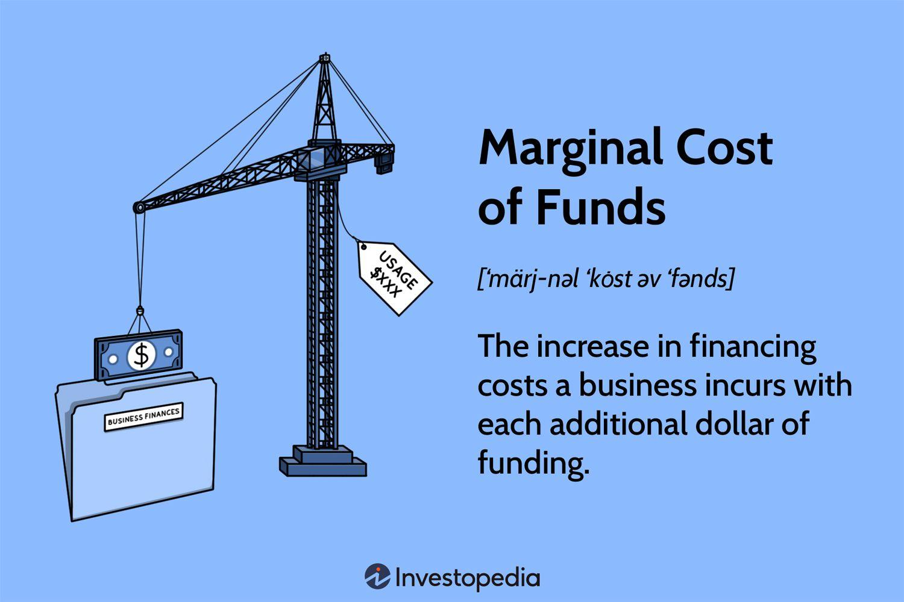

## Table of Contents

## What is the marginal cost of funds?

The marginal cost of funds is the cost of getting one more dollar of money for a bank or financial institution. It is important because it helps banks decide how much interest to charge on loans or how much to pay on savings accounts. To find the marginal cost of funds, banks look at the costs of all their different sources of money, like savings accounts, certificates of deposit, and loans from other banks. They then figure out the average cost of getting one more dollar from these sources.

This concept is used by banks to make sure they are not spending more to get money than they are earning from lending it out. If the marginal cost of funds is high, banks might decide to raise the interest rates on loans to cover their costs. On the other hand, if the cost is low, they might lower the rates to attract more borrowers. Understanding the marginal cost of funds helps banks manage their money wisely and stay profitable.

## How is the marginal cost of funds calculated?

To calculate the marginal cost of funds, banks add up all the different ways they get money, like savings accounts, certificates of deposit, and loans from other banks. They then figure out how much it costs to get one more dollar from each of these sources. This involves looking at the interest rates they pay on these sources of money. For example, if a bank pays 2% interest on savings accounts and 3% on certificates of deposit, they consider these rates when calculating the cost of one more dollar.

Once they know the cost of getting one more dollar from each source, they calculate a weighted average. This means they take into account how much money comes from each source. If most of their money comes from savings accounts, the 2% rate will have a bigger impact on the final calculation than the 3% rate from certificates of deposit. The result is the marginal cost of funds, which helps the bank decide how much to charge for loans and how much to pay on savings. This way, they can make sure they are not spending more to get money than they are [earning](/wiki/earning-announcement) from lending it out.

## Why is the marginal cost of funds important for banks?

The marginal cost of funds is really important for banks because it helps them figure out how much it costs to get more money. When banks know this cost, they can decide how much interest to charge on loans. If the cost of getting more money is high, banks might need to charge more interest on loans to make sure they don't lose money. On the other hand, if the cost is low, they might lower the interest rates to attract more people to borrow money.

Understanding the marginal cost of funds also helps banks stay profitable. If banks charge too little interest on loans compared to what they pay to get money, they could lose money. By knowing the exact cost of getting one more dollar, banks can set their loan rates just right. This way, they can cover their costs and make a profit, which is important for keeping the bank running smoothly and helping the economy grow.

## What are the different sources of funds for a bank?

Banks get money from many different places. One big source is from people who put their money into savings accounts. When people save money at a bank, the bank uses that money to give out loans to others. Banks also get money from certificates of deposit, where people agree to keep their money in the bank for a certain time and the bank pays them interest. Another source is money from other banks or financial institutions, which can be in the form of loans or lines of credit.

Another way banks get money is by selling bonds or other securities to investors. When banks sell bonds, they promise to pay back the money with interest over time. Banks also get money from the central bank, like the Federal Reserve in the U.S., which can lend money to banks to help them meet their needs. All these different sources help banks have enough money to lend to people and businesses, which is a big part of what banks do.

## How does the marginal cost of funds affect loan pricing?

The marginal cost of funds is important for banks when they decide how much interest to charge on loans. When a bank figures out the cost of getting one more dollar, they use this information to set the interest rates on loans. If the cost of getting more money is high, the bank might need to charge more interest on loans. This helps them make sure they don't lose money. They need to cover the cost of the money they borrow or pay to savers, plus make a profit.

On the other hand, if the cost of getting more money is low, banks might lower the interest rates on loans. This can attract more people to borrow money because the loans are cheaper. By understanding the marginal cost of funds, banks can set loan prices that are fair and still profitable. This way, they can keep lending money to people and businesses, which helps the economy grow.

## What is the relationship between the marginal cost of funds and the interest rate?

The marginal cost of funds is how much it costs a bank to get one more dollar. This cost is really important because it helps banks decide what interest rate to charge on loans. If the marginal cost of funds is high, it means the bank has to pay a lot to get more money. So, they might charge higher interest rates on loans to make sure they can cover their costs and still make a profit. It's like if you had to pay more for something, you would want to sell it for more money too.

On the other hand, if the marginal cost of funds is low, the bank doesn't have to pay as much to get more money. This means they can charge lower interest rates on loans. Lower rates can attract more people to borrow money because the loans are cheaper. So, the interest rate on loans goes up or down based on the marginal cost of funds. It's all about making sure the bank can cover its costs and make money, while also helping people and businesses get the loans they need.

## How do regulatory requirements influence the marginal cost of funds?

Regulatory requirements can change how much it costs banks to get more money. For example, rules about how much money banks have to keep in reserve can affect the marginal cost of funds. If banks need to keep more money in reserve, they might have less money to lend out. This can make it more expensive for them to get new money because they have to pay more to get it from other places. So, the cost of getting one more dollar goes up because of these rules.

Also, regulations about how much risk banks can take can change the cost of funds. If the rules say banks can't take too many risks, they might have to pay more to get money because people see them as safer places to put their money. But, if the rules are strict, banks might have to pay higher rates to attract money from savers or other banks. This makes the marginal cost of funds higher because it costs more to get that extra dollar.

## Can you explain the concept of marginal cost of funds-based lending rate (MCLR)?

The marginal cost of funds-based lending rate, or MCLR, is a way banks figure out how much interest to charge on loans. It's based on how much it costs the bank to get one more dollar of money. Banks look at the cost of all the different ways they get money, like savings accounts, certificates of deposit, and loans from other banks. They then use this cost to decide the interest rate on loans. If the cost of getting more money goes up, the MCLR goes up too, and banks might charge more interest on loans. If the cost goes down, the MCLR goes down, and banks might charge less interest.

MCLR helps make sure that the interest rates on loans are fair and based on real costs. It's important because it helps banks stay profitable while also being clear with customers about how loan rates are set. When banks use MCLR, they can adjust loan rates more quickly when the cost of getting money changes. This way, the rates stay in line with the bank's costs, and customers can understand why their loan rates might change.

## How does the marginal cost of funds impact a bank's profitability?

The marginal cost of funds is really important for a bank's profitability because it helps them figure out how much it costs to get more money. When banks know this cost, they can decide how much interest to charge on loans. If it costs a lot to get more money, banks might need to charge more interest on loans to make sure they don't lose money. They need to cover the cost of the money they borrow or pay to savers, plus make a profit. So, if the marginal cost of funds goes up, banks might have to raise their loan rates to stay profitable.

On the other hand, if the cost of getting more money is low, banks can charge less interest on loans. This can attract more people to borrow money because the loans are cheaper. By understanding the marginal cost of funds, banks can set loan prices that are fair and still profitable. This way, they can keep lending money to people and businesses, which helps the economy grow. So, the marginal cost of funds is a big part of how banks make sure they are making money and not losing it.

## What are the challenges in accurately determining the marginal cost of funds?

Figuring out the exact marginal cost of funds can be tricky for banks. One big challenge is that banks get money from lots of different places, like savings accounts, certificates of deposit, and loans from other banks. Each of these sources has a different cost, and it can be hard to figure out the exact cost of getting one more dollar from each one. Also, the costs can change over time, so banks need to keep updating their calculations to make sure they are accurate.

Another challenge is that there are rules and regulations that can affect how much it costs banks to get money. For example, banks might have to keep a certain amount of money in reserve, which can make it more expensive to get new money. Plus, there are rules about how much risk banks can take, which can also change the cost of funds. All these things make it hard for banks to know the exact marginal cost of funds, but it's really important for them to get it as close as possible to make good decisions about loan rates and stay profitable.

## How do economic conditions affect the marginal cost of funds?

Economic conditions can change how much it costs banks to get more money. When the economy is doing well, people might put more money into savings accounts because they feel confident about their money. This can make it cheaper for banks to get money because they don't have to pay as much interest to attract savings. On the other hand, if the economy is not doing well, people might take their money out of the bank or ask for higher interest rates to keep their money there. This can make it more expensive for banks to get money because they have to pay more to get people to save with them.

Also, interest rates set by the central bank can affect the marginal cost of funds. If the central bank raises interest rates, it can cost banks more to borrow money from them or from other banks. This means the cost of getting one more dollar goes up. When the central bank lowers interest rates, it can make it cheaper for banks to get money. So, banks need to keep an eye on economic conditions and central bank rates to figure out how much it costs them to get more money, which helps them decide how much to charge on loans.

## What advanced strategies can banks use to optimize their marginal cost of funds?

Banks can use advanced strategies to make the cost of getting more money as low as possible. One way is by using data and computers to look at all the different places they get money from, like savings accounts and loans from other banks. They can see which sources are cheaper and try to get more money from those places. Banks can also use special computer programs to predict how the cost of money might change in the future. This helps them plan ahead and make smart choices about where to get money from.

Another strategy is to work closely with other banks and financial institutions. By sharing information and working together, banks can find better deals on money. They can also use something called "funds transfer pricing," which helps them figure out the real cost of getting money from different places. This way, they can see which sources are the cheapest and use those more. By using these advanced strategies, banks can keep the cost of getting more money low, which helps them make more profit and offer better rates to their customers.

## What is the Cost of Funds: A Financial Foundation?

The cost of funds is a pivotal concept in finance, representing the expense incurred by businesses or institutions to secure capital or financing. This cost plays a critical role in shaping a company's financial planning and profitability. For financial institutions, the cost of funds encompasses the interest paid on borrowings, deposits, and any other expenses associated with raising capital.

To illustrate, consider a bank that borrows money to lend to its customers. The [interest rate](/wiki/interest-rate-trading-strategies) it pays on these borrowings constitutes a primary component of its cost of funds. Additionally, if the bank attracts deposits by offering interest, these interest payments are also included in its cost calculations. Hence, the cost of funds can be expressed as:

$$
\text{Cost of Funds} = \frac{\text{Total Interest Payments}}{\text{Total Borrowed or Deposited Capital}}
$$

Effectively managing the cost of funds is of paramount importance, as it directly influences a financial institution's profitability and strategic decision-making. A lower cost of funds typically allows for more competitive loan offerings, potentially expanding the institution's market share. Conversely, higher costs can compress profit margins and limit growth opportunities.

Strategic management involves optimizing the mix of funding sources to minimize costs while ensuring adequate [liquidity](/wiki/liquidity-risk-premium) and financial stability. Financial managers might resort to a blend of short-term and long-term borrowings, alongside customer deposits, to achieve this balance. A thorough understanding of the interest rate environment and market conditions is essential for these decisions.

Furthermore, the cost of funds has broader implications for monetary policy and economic stability. Central banks monitor it closely, as fluctuations can signal shifts in borrowing and lending trends, impacting overall economic activity.

In summary, the cost of funds serves as a fundamental financial metric that influences an institution's operational costs, pricing strategies, and competitive positioning within the market. By effectively controlling this cost, companies can enhance their financial performance and sustain long-term growth.

## What are the incremental insights into the marginal cost of funds?

The marginal cost of funds represents the additional cost a business incurs when it raises one more unit of money. This cost is important for financial managers as they make strategic decisions about the company’s capital structure and financing options. By understanding this concept, businesses can strategically optimize their funding strategies and ensure long-term financial health.

Calculating the marginal cost of funds can involve determining the additional interest or expenses incurred by securing new funding, whether through debt or equity. For example, if a business takes on additional borrowing at an interest rate higher than its current average, the marginal cost would be this higher rate. The primary goal is to assess whether the benefits of securing additional funds outweigh the incremental costs associated with them.

When financial managers evaluate the marginal cost of funds, they consider the weighted average cost of capital (WACC) as a critical benchmark. The WACC Equation is as follows:

$$
WACC = \frac{E}{V} \cdot Re + \frac{D}{V} \cdot Rd \cdot (1 - Tc)
$$

where:
- $E$ is the market value of the equity,
- $V$ is the total value of equity and debt,
- $Re$ is the cost of equity,
- $D$ is the market value of the debt,
- $Rd$ is the cost of debt,
- $Tc$ is the corporate tax rate.

Financial managers must assess the cost of new funds in comparison with the existing WACC to determine the impact on corporate finance strategies. If the marginal cost of new funds is lower than the current WACC, it suggests that the new funds may result in a reduction of the overall capital cost, potentially increasing shareholder value.

Moreover, understanding the marginal cost of funds aids in making decisions about project viability and investment returns. If the expected return on a new investment exceeds the marginal cost of the funds required for that investment, it is typically considered a worthwhile endeavor.

Python can be used to automate the calculations involved in determining the marginal cost of funds. For example, to compute the WACC, one could use:

```python
def calculate_wacc(E, D, Re, Rd, Tc):
    V = E + D
    return (E/V) * Re + (D/V) * Rd * (1 - Tc)

# Example usage:
E = 500000  # Market value of equity
D = 300000  # Market value of debt
Re = 0.08   # Cost of equity
Rd = 0.05   # Cost of debt
Tc = 0.21   # Corporate tax rate

wacc = calculate_wacc(E, D, Re, Rd, Tc)
print(f"The Weighted Average Cost of Capital (WACC) is: {wacc:.2%}")
```

By focusing on these calculations and comparisons, businesses can make informed decisions on financing that align with strategic goals, minimizing unnecessary costs, and ensuring financial sustainability.

## How does trading performance and risk management impact each other?

Transaction costs, which include broker fees, bid-ask spreads, and market impact, constitute a critical component in the evaluation of trading strategy performance. For high-frequency trading ([HFT](/wiki/high-frequency-trading-strategies)) strategies, these costs are particularly significant due to the high [volume](/wiki/volume-trading-strategy) of trades executed over brief time intervals. According to empirical studies, even slight variations in transaction costs can dramatically affect the net profitability of these strategies.

The risk associated with trading is multifaceted, encompassing both financial exposure and operational aspects. Incorporating transaction costs into risk management frameworks is essential to preempt potential financial losses. One common approach is to integrate these costs into the Value at Risk (VaR) calculations. The VaR can be adjusted to account for transaction costs as follows:

$$
\text{Adjusted VaR} = \text{Initial VaR} + \text{Expected Transaction Costs}
$$

This adjustment considers not only the potential market risks but also the impact of costs on the capital at risk.

Profitability in trading hinges on the delicate balance between transaction costs and return generation. Effective strategies often involve optimizing order execution to minimize costs while maintaining desired exposure levels. Algorithmic strategies can utilize techniques such as order slicing and timing optimizations to reduce impact costs, thus enhancing overall strategy performance.

Investors are encouraged to adopt comprehensive strategies that adequately weigh cost management against risk mitigation. For instance, deploying [machine learning](/wiki/machine-learning) algorithms for pattern recognition in market data can improve predictive accuracy, thereby informing better decision-making regarding trade execution and risk management. By leveraging advanced statistical techniques, traders can dynamically adjust their strategies in response to shifting market conditions, thus achieving a meticulous balance.

Investors should also remain vigilant about evolving regulatory and market conditions, which can affect both transaction costs and trading risks. Continuous monitoring and adaptive strategy development are paramount for maintaining competitiveness and achieving sustained success in ever-changing financial markets.

## References & Further Reading

[1]: Amihud, Y., Mendelson, H., & Pedersen, L. H. (2005). ["Liquidity and asset prices."](https://pages.stern.nyu.edu/~lpederse/papers/LiquidityAssetPricing.pdf) Foundations and Trends in Finance, 1(4), 269-364.

[2]: Treleaven, P., Galas, M., & Lalchand, V. (2013). ["Algorithmic trading review."](https://dl.acm.org/doi/10.1145/2500117) Communications of the ACM, 56(11), 76-85.

[3]: Luenberger, D. G. (1997). ["Investment Science"](https://www.amazon.com/Investment-Science-David-G-Luenberger/dp/0199740089). Oxford University Press.

[4]: Hasbrouck, J. (2007). ["Empirical Market Microstructure: The Institutions, Economics, and Econometrics of Securities Trading"](https://academic.oup.com/book/52241). Oxford University Press.

[5]: Kissell, R. (2013). ["The Science of Algorithmic Trading and Portfolio Management"](https://www.sciencedirect.com/book/9780124016897/the-science-of-algorithmic-trading-and-portfolio-management). Academic Press.