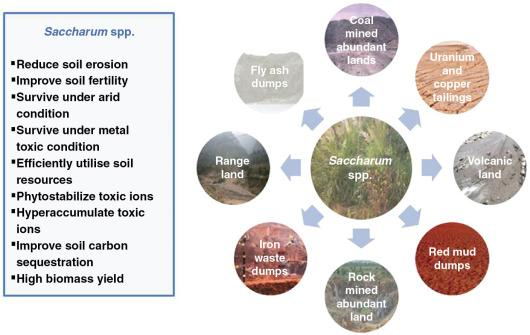

## Table of Contents

## What is marginal land?

Marginal land is land that is not very good for farming. It might have poor soil, not enough water, or other problems that make it hard to grow crops. Farmers usually don't want to use this land because it is not easy to make money from it.

Even though marginal land is not great for farming, it can still be used for other things. For example, people might use it to grow special plants that don't need good soil, or they might use it for grazing animals. Sometimes, people also use marginal land for things like solar farms or wind turbines, which don't need good soil to work.

## What are the main characteristics of marginal land?

Marginal land has several characteristics that make it less useful for farming. The soil might be poor, meaning it doesn't have enough nutrients for plants to grow well. It might also be too rocky or sandy, which makes it hard for roots to spread out and get water. Another problem can be the lack of water. Marginal land might be in a dry area where there isn't enough rain, or it might not have good access to rivers or wells.

Besides soil and water issues, marginal land can also have other challenges. It might be on slopes or hills, which makes it hard to use farming equipment. The land could also be in a place where the weather is too extreme, with very hot summers or very cold winters. These conditions can make it difficult for crops to survive. Because of all these problems, farmers usually find it more difficult and less profitable to use marginal land for growing crops.

## How is marginal land classified?

Marginal land is classified based on how good it is for farming. People look at things like the soil, water, and the land's shape to decide if it's marginal. If the soil doesn't have enough nutrients or is too rocky, it might be called marginal. If there isn't enough water because it's too dry or there are no good water sources nearby, that can make the land marginal too. Also, if the land is on a steep hill or in a place with bad weather, it might be harder to farm and could be classified as marginal.

There are different ways to measure how marginal a piece of land is. Scientists and farmers use tools and tests to check the soil's quality and how much water is available. They might also look at maps and data about the land's shape and weather patterns. By putting all this information together, they can decide if the land is too hard to farm and should be called marginal. This helps them figure out if it's better to use the land for something other than growing crops.

## What are the environmental factors that contribute to land being considered marginal?

Environmental factors play a big role in making land marginal. One key [factor](/wiki/factor-investing) is the soil quality. If the soil doesn't have enough nutrients or is too rocky, it's hard for plants to grow well. Another important factor is water availability. If the land is in a dry area with little rain, or if there are no good sources of water nearby, it becomes challenging to farm. The land's shape can also be a problem. If it's on a steep slope, it's difficult to use farming equipment and the soil can wash away easily.

In addition to soil, water, and land shape, the climate can make land marginal. If the area has very hot summers or very cold winters, it can be tough for crops to survive. Extreme weather like storms or droughts can also damage the land and make it even harder to farm. All these environmental factors together can make the land less useful for growing crops, which is why it's considered marginal.

## What are the economic implications of using marginal land?

Using marginal land can be tough on a farmer's wallet. Because the soil isn't very good and there might not be enough water, it's harder to grow crops that can be sold for a lot of money. Farmers might need to spend more money on things like fertilizers to make the soil better, or on irrigation systems to bring in water. All these extra costs can make it hard for them to make a profit. Sometimes, the crops they do manage to grow might not be as healthy or big, which means they can't sell them for as much money.

On the other hand, there are some ways to make money from marginal land without trying to grow regular crops. Farmers can use it to grow special plants that don't need good soil, or they can let animals graze on it. These options might not bring in as much money as growing crops on good land, but they can still be useful. Another idea is to use the land for things like solar panels or wind turbines. These don't need good soil at all, and they can bring in money from selling electricity. So, while using marginal land for farming can be a money-loser, there are other ways to make it work economically.

## How does marginal land differ from arable land?

Marginal land and arable land are different because of how easy or hard it is to grow crops on them. Arable land is good for farming. It has soil with lots of nutrients, enough water, and a shape that makes it easy to use farming equipment. Farmers can grow crops like wheat, corn, and vegetables on arable land and usually make a good amount of money from it. On the other hand, marginal land is not as good for farming. The soil might not have enough nutrients, or it might be too rocky or sandy. There might not be enough water, and the land could be on a steep slope, making it hard to use farming equipment.

Because of these differences, farmers choose to use arable land for growing crops that need good soil and water. They can plant, grow, and harvest these crops more easily and make more money. Marginal land, though, is often left alone or used for other things. Farmers might use it to grow special plants that don't need good soil, or they might let animals graze on it. Sometimes, people use marginal land for things like solar panels or wind turbines, which don't need good soil at all. So, while arable land is great for growing crops, marginal land is better for other uses.

## What are the potential uses of marginal land in agriculture?

Even though marginal land is not great for growing regular crops, it can still be used in farming in some ways. Farmers can use it to grow special plants that don't need good soil. These plants might be used for things like making biofuel or feeding animals. For example, some farmers grow switchgrass or other tough plants on marginal land because these plants can survive in poor soil and don't need a lot of water.

Another way to use marginal land in agriculture is for grazing animals. The land might not be good for growing crops, but it can still have enough grass or other plants for cows, sheep, or goats to eat. This can help farmers make some money from the land without trying to grow crops that need good soil. By using marginal land for grazing, farmers can keep their animals fed and still make use of land that isn't great for other farming activities.

## Can marginal land be rehabilitated or improved? If so, how?

Yes, marginal land can be rehabilitated or improved. One way to do this is by adding things to the soil to make it better. Farmers can use things like compost or manure to add nutrients to the soil. They might also use special fertilizers that help the soil hold onto water better. Another way to improve the land is by planting cover crops. These are plants that you grow not to sell, but to help the soil. They can add nutrients back into the soil and help stop it from washing away.

Another way to improve marginal land is by changing how water is used. Farmers can set up irrigation systems to bring water to dry areas. They can also use techniques like terracing to make steep slopes easier to farm. Terracing means making flat steps on a hill so the soil doesn't wash away. Sometimes, improving marginal land takes a long time and a lot of work. But if farmers keep working on it, they can make the land better for growing crops and make more money from it.

## What role does marginal land play in sustainable development?

Marginal land plays an important role in sustainable development because it can be used for things other than regular farming. Since it's not very good for growing crops, people can use it for things like making energy from the sun or wind. This helps the environment because it means less need for dirty energy from oil or coal. Also, using marginal land for these new ways can help create jobs and bring money to areas that might not have many other ways to make money.

Another way marginal land helps with sustainable development is by being used for growing special plants. These plants can be used to make biofuel, which is a cleaner way to power cars and machines. They can also be used to feed animals, which means less need to use good farmland for grazing. By using marginal land like this, we can save the better land for growing food for people. This helps make sure there's enough food for everyone, which is a big part of sustainable development.

## How can marginal land be utilized for bioenergy production?

Marginal land can be used to grow special plants that can be turned into bioenergy. These plants, like switchgrass or miscanthus, can grow on land that isn't very good for regular farming. They don't need rich soil or a lot of water, so they're perfect for marginal land. Once these plants are grown, they can be harvested and turned into things like biofuel. Biofuel can be used to power cars and machines, which helps reduce our need for dirty energy from oil or coal.

Using marginal land for bioenergy also helps the environment. When we grow these special plants, we're not taking away good farmland that could be used to grow food for people. This means we can still have enough food while also making more clean energy. Plus, growing plants on marginal land can help stop the soil from washing away and can even make the soil better over time. So, using marginal land for bioenergy is a smart way to help the planet and make sure we have enough energy for everyone.

## What are the challenges and limitations of developing marginal land?

Developing marginal land can be hard because it often has poor soil that doesn't have enough nutrients for plants to grow well. The land might also be in a dry area without enough water, or it could be on a steep slope where it's tough to use farming equipment. All these problems make it expensive and difficult to make the land better. Farmers might need to spend a lot of money on things like fertilizers, irrigation systems, and special techniques like terracing to make the land usable. This can make it hard for them to make a profit, especially if the crops they grow aren't very valuable.

Another challenge is that improving marginal land can take a long time. It might take years of adding nutrients to the soil and trying different ways to keep water in the ground before the land gets better. During this time, farmers might not be able to grow much on the land, which means they won't make much money. There's also a risk that even after all this work, the land might still not be good enough for growing valuable crops. So, while it's possible to develop marginal land, it's a big challenge that requires a lot of time, money, and patience.

## What advanced technologies or practices are being researched to better utilize marginal land?

Scientists are working on new ways to make marginal land better. One way they are doing this is by using special plants called bioenergy crops. These plants, like switchgrass and miscanthus, can grow on land that isn't very good for regular farming. They don't need a lot of water or rich soil, so they're perfect for marginal land. Researchers are also studying how to use things like drones and sensors to check the soil and help farmers know when to water or add nutrients. This can make it easier to grow crops on land that's hard to farm.

Another thing scientists are looking into is using new kinds of fertilizers and soil treatments. These can help add nutrients to the soil and make it hold water better. Some researchers are even trying out different ways to change the land's shape, like terracing, to stop soil from washing away on slopes. By using these new technologies and practices, farmers might be able to grow more on marginal land and make more money from it. It's all about finding smart ways to use land that isn't very good for regular farming.

## References & Further Reading

[1]: Food and Agriculture Organization of the United Nations. (2018). ["Marginal lands."](https://www.fao.org/news/archive/news-by-date/2018/en/)

[2]: Bureau of Land Management. (n.d.). ["Southwestern U.S. land characteristics."](https://www.blm.gov/office/north-dakota-field-office)

[3]: National Research Council. (2010). ["The New Harvest: Agricultural Innovation in Africa."](https://www.researchgate.net/publication/303405356_The_New_Harvest_Agricultural_Innovation_in_Africa) Washington, DC: The National Academies Press.

[4]: Bergstra, J., Bardenet, R., Bengio, Y., & Kégl, B. (2011). ["Algorithms for Hyper-Parameter Optimization."](https://dl.acm.org/doi/10.5555/2986459.2986743) Advances in Neural Information Processing Systems 24.

[5]: ["Advances in Financial Machine Learning"](https://www.amazon.com/Advances-Financial-Machine-Learning-Marcos/dp/1119482089) by Marcos Lopez de Prado

[6]: ["Machine Learning for Algorithmic Trading"](https://github.com/stefan-jansen/machine-learning-for-trading) by Stefan Jansen