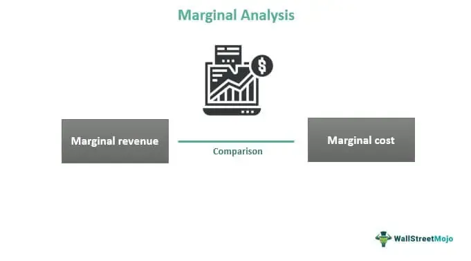

In today's rapidly evolving financial landscape, acquiring a nuanced understanding of the complex processes governing finance, marginal lending, and algorithmic trading is paramount. These sectors form the backbone of modern financial systems, underpinning a vast array of economic activities. Marginal lending involves the provision of credit by financial institutions under certain conditions, facilitating liquidity and enabling market participants to engage in more extensive trading and investment activities. This lending is intricately linked to interest rate dynamics and market conditions. 

Algorithmic trading, on the other hand, represents a technological revolution in the financial markets, where complex algorithms execute trades at speeds and volumes that are impossible for human traders. The interconnection between algorithmic trading and marginal lending is critical, as the strategies employed in automated trading often consider interest rate movements, which in turn influence lending decisions and conditions. 



This article offers a comprehensive overview of how these interconnected sectors operate and affect one another, exploring key concepts, benefits, challenges, and emerging trends. By gaining this understanding, readers can equip themselves with the knowledge necessary to navigate and capitalize on these financial systems effectively.

## Table of Contents

## Understanding Marginal Lending

Marginal lending refers to the mechanism through which financial institutions, notably central banks, provide short-term loans to banks requiring liquidity to meet immediate obligations. Marginal lenders operate by offering funds at a pre-determined interest rate known as the marginal lending rate, often set above the main refinancing rate to manage liquidity and stabilize financial markets.

**Differentiating Marginal Lending Concepts**

Marginal lending is often confused with terms like margin lending and overnight lending. Margin lending involves borrowing funds to invest in securities, using the purchased assets as collateral. In contrast, marginal lending generally refers to the facility provided by central banks to maintain liquidity, not specifically linked to securities trading. Overnight lending is a short-term loan facility usually repaid by the next business day. While both marginal lending and overnight lending serve liquidity needs, marginal lending is often utilized as a last resort at a higher cost.

**Interest Rates in Marginal Lending Decisions**

Interest rates play a critical role in the decision-making processes of marginal lenders. The marginal lending rate acts as a ceiling for short-term interest rates in the interbank market. When banks face short-term [liquidity](/wiki/liquidity-risk-premium) shortages, higher marginal lending rates can make borrowing costly, discouraging unnecessary resort to these funds. Thus, central banks can manage economic stability by adjusting these rates in response to market conditions.

**Market Conditions Affecting Marginal Lending**

Several market conditions influence the decisions of marginal lenders to extend credit. A liquidity crunch in the financial system often leads to an increased reliance on marginal lending facilities. Economic indicators, such as inflation rates and economic growth forecasts, impact the central bank's decision to adjust lending rates, influencing how banks utilize these facilities. Moreover, during periods of economic instability, marginal lenders may introduce more stringent conditions to secure their exposures, promoting prudent risk management across the financial system.

In conclusion, understanding marginal lending requires a grasp of its defining characteristics, differences from similar financial concepts, and the pivotal role of interest rates and market conditions in lending decisions. These insights are essential for banks and financial institutions to navigate the complexities of short-term liquidity management effectively.

## The Lending Process in Financial Markets

Financial institutions follow a structured process in lending that is crucial for maintaining the stability and functionality of financial markets. This process involves detailed credit assessment and risk management to mitigate potential defaults and ensure profitable operations.

### Credit Assessment and Risk Management

Credit assessment is a critical step where financial institutions evaluate a borrower's ability to repay the loan. This process involves analyzing the borrower's credit history, income, assets, and liabilities. Various tools and techniques such as credit scoring models, financial statements analysis, and qualitative assessments are employed. Risk management involves identifying, assessing, and prioritizing risks followed by coordinated efforts to minimize, monitor, and control the probability or impact of these risks. A robust risk management strategy includes the use of techniques like diversification, hedging, insurance, and setting aside capital reserves.

### Lending Products

Financial institutions offer a variety of lending products, catering to the needs of both businesses and individual borrowers. Common lending products include:

1. **Term Loans**: Typically used by businesses for capital expenditures or expansion projects. The borrower receives a lump sum and repays the loan over a fixed period with regular payments.

2. **Mortgages**: Long-term loans secured by real estate. They allow individuals to purchase homes and pay off the amount over extended periods.

3. **Lines of Credit**: Flexible loans that provide borrowers a fixed credit limit which can be accessed as needed. They are essential for businesses to manage cash flow variations.

4. **Credit Cards**: A revolving form of credit that individuals can use for daily purchases.

5. **Commercial Loans**: Tailored for business operations, including inventory purchase and working capital.

These products are essential because they provide the necessary capital for businesses to grow and for individuals to manage personal financial needs effectively.

### Role of Interest Rates and Creditworthiness

Interest rates and creditworthiness play a pivotal role in determining the terms and conditions of loans. Interest rates, set by central banks, influence the cost of borrowing. Lower interest rates generally encourage borrowing, while higher rates discourage it. Creditworthiness, on the other hand, affects the likelihood of an applicant's approval for a loan and the [interest rate](/wiki/interest-rate-trading-strategies) they might be offered. Higher credit scores often lead to more favorable loan terms.

### Market Dynamics and Central Bank Policies

Market dynamics and central bank policies significantly influence the availability and cost of credit. Market dynamics include factors like economic growth, inflation, and market competition. These factors affect demand and supply for credit. Central bank policies are equally important. Through tools like the federal funds rate, open market operations, and reserve requirements, central banks regulate money supply and maintain economic stability. For example, during economic slowdowns, central banks might lower interest rates to encourage borrowing and stimulate economic growth.

These elements together constitute the complex yet systematic lending process within financial markets. Effective management of these processes ensures not only the profitability for financial institutions but also the broader stability and growth of the economy.

## Algo Trading: Automation in Finance

Algorithmic trading, often referred to as algo trading, is a method of executing orders using automated pre-programmed trading instructions. These instructions account for variables such as timing, price, and [volume](/wiki/volume-trading-strategy). The primary goal of [algorithmic trading](/wiki/algorithmic-trading) is to systematically perform high-speed trade executions that minimize human intervention. This advanced trading mechanism has become increasingly significant in financial markets due to its potential to improve liquidity, enhance market efficiency, and reduce trading costs.

One of the key advantages of algorithmic trading is its ability to handle large volumes of trades with consistency and accuracy. Financial entities employ various algorithmic trading strategies, each designed to capitalize on different market conditions. Some common strategies include:

1. **Trend Following**: This strategy involves following market trends using technical indicators like moving averages and momentum oscillators. The algorithm detects the trend direction and executes trades accordingly.

2. **Arbitrage**: Arbitrage strategies exploit price inefficiencies between different markets or instruments. For instance, if a stock is traded at different prices on two exchanges, an algorithm can exploit this price differential to generate profit.

3. **Market Making**: This involves providing liquidity to the market by simultaneously posting buy and sell orders. Algorithms are programmed to quote prices on both sides of the market and earn a spread from this.

4. **Statistical Arbitrage**: Statistical models are utilized to identify trading opportunities based on historical price relationships among securities.

5. **Mean Reversion**: This strategy is based on the hypothesis that asset prices will revert to their historical average over time. Algorithms identify deviations from the mean and execute trades that capitalize on expected reversions.

Algorithmic trading heavily relies on interest rates and market data to refine algorithmic predictions and optimize decision-making processes. Interest rates, serving as foundational economic indicators, are integrated into algorithms to guide investment strategies, especially those sensitive to rate fluctuations such as bonds and currencies. Real-time market data feeds, including prices and volumes, are fed into the algorithms to make calculative decisions dynamically.

The impact of algorithmic trading on market liquidity, efficiency, and stability is substantial. Algo trading increases market liquidity by facilitating a higher volume of trades with narrower bid-ask spreads. This added liquidity often leads to enhanced market efficiency, ensuring that prices reflect all available information. However, the rapid pace and volume of trades executed by algorithms can sometimes lead to market [volatility](/wiki/volatility-trading-strategies), as evidenced by instances like the "Flash Crash" of 2010.

In conclusion, algorithmic trading represents a transformative force in financial markets. Its capacity to process vast quantities of data and execute trades with precision positions it as an integral component of modern financial markets, capable of delivering superior execution performance and promoting overall market efficiency.

## The Interplay Between Marginal Lending and Algo Trading

Movements in interest rates significantly influence both lending decisions made by financial institutions and the strategies employed in algorithmic trading. Marginal lenders are often sensitive to central bank interest rate changes as these directly affect the cost of funds and the return on lending. When interest rates rise, the cost of borrowing increases, leading lenders to adjust their credit extension strategies. Higher rates might cause lenders to become more selective, enhancing their risk management practices to mitigate potential defaults. Conversely, a decrease in rates may encourage more aggressive lending due to lower borrowing costs.

Algorithmic trading, which relies heavily on market data and trends, also adjusts its strategies in response to changes in interest rates. For instance, a high-interest rate environment may result in algorithms adopting more conservative, risk-averse strategies to align with the general market sentiment. Conversely, low-interest rates could trigger algorithms focused on capturing increased trading volumes and potential [arbitrage](/wiki/arbitrage) opportunities within the market.

The potential for algorithmic trading to optimize risk management for lenders lies in its ability to process vast amounts of financial market data quickly and efficiently. By integrating real-time data analytics, algo trading systems can assist in identifying trends or anomalies that human analysts might miss. For example, predictive modeling techniques incorporated within these algorithms can provide lenders with insights into probable interest rate changes and help adjust lending portfolios accordingly. This enables lenders to balance risk while optimizing returns.

Predictive models play a crucial role in algorithmic trading, especially in forecasting interest rate movements and assessing their impact on lending conditions. Many algo trading platforms employ [machine learning](/wiki/machine-learning) algorithms, such as time-series analysis, to detect patterns within historical and current market data. An example Python snippet using a popular library like `pandas` or `statsmodels` could resemble:

```python
import pandas as pd
from statsmodels.tsa.arima_model import ARIMA

# Load historical interest rate data
data = pd.read_csv('interest_rate_data.csv')
interest_rates = data['interest_rate']

# Fit ARIMA model
model = ARIMA(interest_rates, order=(1, 1, 1))
model_fit = model.fit(disp=0)

# Forecast future interest rates
forecast = model_fit.forecast(steps=5)
print(forecast)
```

Such models simulate potential future scenarios, giving both traders and lenders the capability to preemptively strategize based on predicted interest rate changes. Consequently, the interplay between marginal lending and algorithmic trading is enriched, as predictive insights derived from these models foster an environment where both lending practices and trading strategies can be fine-tuned to align with anticipated market conditions.

In summary, the interconnected nature of interest rates, marginal lending, and algorithmic trading creates a dynamic financial ecosystem. As technology and predictive analytics evolve, the risk management processes and strategic decision-making of lenders are increasingly intertwined with algorithmic trading innovations, driving efficiencies in both sectors.

## Future Trends in Finance, Lending, and Trading

Emerging trends in finance are being driven by a combination of sustainability considerations, technological advancements, and changes in regulatory environments.

The rise of sustainable finance and the push for [ESG](/wiki/esg-investing)-compliant trading strategies are central to these developments. Environmental, Social, and Governance (ESG) factors are becoming crucial investment considerations, as stakeholders increasingly demand that financial institutions contribute positively to societal and environmental goals. This shift is evident in the rising popularity of green bonds, ESG-focused mutual funds, and sustainable asset management practices. The global commitment to the Paris Agreement and the United Nations Sustainable Development Goals (SDGs) has further accelerated the integration of ESG criteria in financial decision-making. Research shows that ESG-compliant portfolios not only mitigate risks associated with unsustainable business models but also potentially enhance long-term financial performance.

Technological advancements, particularly in Artificial Intelligence (AI) and Machine Learning, are profoundly impacting lending and trading landscapes. AI-powered algorithms are being used to automate credit scoring, improve risk assessment, and personalize financial products for consumers. In trading, machine learning models analyze vast datasets to identify patterns and predict market movements, enhancing the speed and accuracy of algorithmic trading strategies. Technologies such as blockchain are being explored to increase transparency, reduce transaction costs, and protect against fraud in financial services. The use of natural language processing (NLP) in sentiment analysis enables traders to gauge market sentiment from news articles, social media, and other unstructured data sources.

Regulatory changes are anticipated to significantly affect financial services, particularly in lending and trading. Governments and regulatory bodies are introducing stricter guidelines to ensure financial stability and protect consumers. The European Union’s Markets in Financial Instruments Directive II (MiFID II) is an example of tighter controls over trading practices, aiming for greater transparency and fairness in financial markets. In the United States, the Dodd-Frank Wall Street Reform and Consumer Protection Act continues to influence regulatory landscapes by addressing issues like [hedge fund](/wiki/hedge-fund-trading-strategies) regulation and over-the-counter derivatives trading.

Moreover, regulations focusing on data privacy and cybersecurity are becoming essential as financial institutions rely more on digital operations. The General Data Protection Regulation (GDPR) in Europe and similar initiatives worldwide underscore the importance of safeguarding customer information, which affects how financial services are delivered.

In conclusion, the future of finance, lending, and trading will be shaped by the interplay of sustainability, technology, and regulation. Financial institutions must adapt to these trends to remain competitive, leveraging innovative technologies while maintaining compliance with evolving regulations. The ongoing pursuit of sustainable and technologically advanced solutions in financial services will likely reshape the market landscape profoundly in the coming years.

## Conclusion

In summary, the interconnected realms of finance, marginal lending, and algorithmic trading are fundamental to modern financial markets. Understanding these elements enables financial professionals to navigate the complex market environments and make informed decisions. Marginal lending, with its reliance on interest rates and market conditions, plays a crucial role in enabling liquidity and capital allocation. Meanwhile, algorithmic trading, through automation and data-driven strategies, enhances market efficiency and liquidity.

Professionals equipped with knowledge of these processes can optimize their strategies, leveraging marginal lending to secure advantageous credit terms and using algorithmic trading to capitalize on market opportunities swiftly and accurately. The insights gained from these areas highlight the importance of a robust understanding of financial systems and market dynamics.

As the financial landscape continues to evolve rapidly, continuous learning and adaptation are essential for maintaining competitiveness. With advancements in technology, such as [artificial intelligence](/wiki/ai-artificial-intelligence) and machine learning, reshaping the fields of lending and trading, staying abreast of these developments is imperative. Professionals must commit to ongoing education to harness these innovations effectively and respond adeptly to regulatory changes and emerging trends.

In conclusion, mastering the intricacies of finance, marginal lending, and algorithmic trading offers a competitive advantage, equipping professionals to thrive in an ever-changing financial environment.

## References & Further Reading

[1]: ["Advances in Financial Machine Learning"](https://www.amazon.com/Advances-Financial-Machine-Learning-Marcos/dp/1119482089) by Marcos Lopez de Prado

[2]: ["Machine Learning for Algorithmic Trading"](https://github.com/stefan-jansen/machine-learning-for-trading) by Stefan Jansen

[3]: ["Evidence-Based Technical Analysis: Applying the Scientific Method and Statistical Inference to Trading Signals"](https://www.amazon.com/Evidence-Based-Technical-Analysis-Scientific-Statistical/dp/0470008741) by David Aronson

[4]: Bernanke, B. S., & Blinder, A. S. (1992). ["The Federal Funds Rate and the Channels of Monetary Transmission."](https://www.nber.org/papers/w3487) American Economic Review, 82(4), 901-921.

[5]: Garratt, R., Mahadeva, L., Svirydzenka, K., & Wooldridge, P. (2018). ["Policy frameworks for the open market operations of the major central banks."](https://scholar.google.com/citations?user=T7MaYJIAAAAJ&hl=en) Bank for International Settlements, Quarterly Review. 