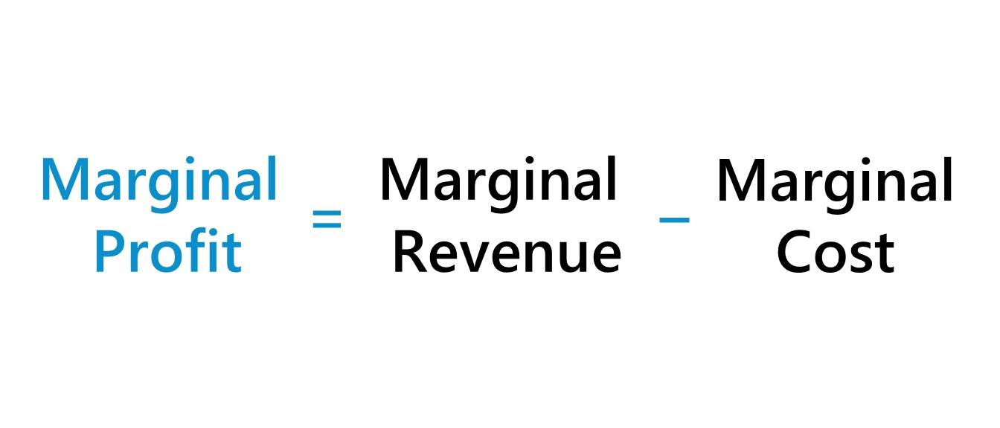

In economic analysis and trading, understanding marginal profit can offer significant insights for businesses and traders alike. Marginal profit, defined as the additional profit earned from producing or selling one more unit of a product or service, serves as a critical metric for evaluating profitability. This article seeks to explore the multifaceted concept of marginal profit, focusing on its calculation, importance, and application in economic formulas and algorithmic trading.

In particular, the calculation of marginal profit involves subtracting the marginal cost (MC) from the marginal revenue (MR), expressed as:



$$
\text{Marginal Profit} = \text{MR} - \text{MC}
$$

This formula provides a quantitative measure that can guide decision-makers in optimizing production output and ensuring efficient allocation of resources. Beyond static calculations, marginal profit analysis plays a significant role in enhancing trading outcomes within automated systems. The use of this metric in algorithmic trading aids in strategizing optimal trading volumes, determining profitable entry and exit points, and optimizing trading strategies through comprehensive data analysis.

As markets and trading environments grow increasingly complex, understanding and managing marginal profit becomes essential for driving better decision-making in modern trading scenarios. The ability to accurately compute and interpret this metric can empower businesses to identify opportunities for growth and efficiency in production, thereby improving competitive positioning and operational success.

## Table of Contents

## Understanding Marginal Profit

Marginal profit is a critical concept in economics, particularly for businesses aiming to maximize their profitability through scalable production. It is defined as the additional profit acquired from the production and sale of one extra unit of a product or service. The calculation of marginal profit is straightforward, as it involves determining the difference between marginal revenue and marginal cost. The formula used is:

$$
\text{Marginal Profit} = \text{Marginal Revenue (MR)} - \text{Marginal Cost (MC)}
$$

In this equation, Marginal Revenue refers to the additional income generated from the sale of one more unit, while Marginal Cost accounts for the extra expenses incurred in producing that unit.

Understanding marginal profit is essential for businesses to evaluate whether increasing production will be beneficial. A positive marginal profit signifies that the additional revenue from the sale of another unit exceeds the additional costs, making it advantageous to enhance production. Conversely, a negative marginal profit indicates that the costs outweigh the revenue, suggesting that scaling back or maintaining current production levels might be more prudent.

For decision-makers, marginal profit serves as a key determinant when strategizing production outputs. This analysis guides businesses in optimizing their production processes by directing resources toward activities that yield the best economic returns. It provides insights into how resources can be reallocated to ensure maximum profitability without unnecessary costs. By accurately gauging marginal profit, businesses can fine-tune their operations, improve efficiency, and make informed decisions that align with their financial objectives.

## How to Calculate Marginal Profit

The formula for calculating marginal profit involves determining the difference between marginal revenue (MR) and marginal cost (MC). Mathematically, this is expressed as:

$$
\text{Marginal Profit} = \text{MR} - \text{MC}
$$

- **Marginal Cost (MC)** is the additional expense incurred to produce one more unit of a product or service. It reflects how much cost increases when production rises by a single unit. This cost can include materials, labor, and other expenditures that vary with production levels.

- **Marginal Revenue (MR)** is the additional income earned from selling one more unit. It demonstrates the increase in total revenue that arises from selling an extra unit.

To illustrate with an example, consider a company that incurs an additional cost of $10 to produce one more unit of its product. If this additional unit is sold and generates $20 in additional revenue, the marginal profit from this unit can be calculated as follows:

$$
\text{Marginal Profit} = 20 - 10 = 10
$$

This indicates that for each additional unit produced and sold, the company earns an extra $10 in profit. Understanding and correctly computing marginal profit assists businesses in making informed decisions about scaling production, optimizing resource allocation, and enhancing overall profitability. Incorporating such calculations into business strategies can also signal when to expand production up to the point where marginal profit approaches zero, implying an optimal balance between cost and revenue.

## The Role of Marginal Profit in Economic Formulas

Understanding marginal profit is essential for businesses aiming to achieve optimal production levels in accordance with economic theory. Marginal profit is fundamentally tied to production decisions and serves as a guiding metric. One of the key relationships involving marginal profit is its alignment with the concepts of economies of scale and supply-demand equilibrium.

Economies of scale refer to the cost advantage realized when production becomes efficient, as the average cost per unit decreases with increased output. Marginal profit facilitates the identification of the most profitable production level by indicating when the cost reductions resulting from increased production no longer contribute positively to profit. Thus, it aids in pinpointing the transition from economies of scale to diseconomies of scale, where additional production might lead to increased per-unit costs.

In terms of supply-demand equilibrium, marginal profit plays a critical role by equating marginal cost (MC) with marginal revenue (MR). This equality, expressed as $MC = MR$, signifies the optimal production level at which the firm maximizes its profitability without allowing marginal profit to dip below zero. This equation ensures that resources are allocated efficiently, maximizing output without wastage.

Economic theory generally advises firms to adjust production until the additional cost of producing one more unit (marginal cost) equals the additional revenue generated (marginal revenue). In this scenario, firms achieve zero marginal profit, meaning no incentive exists to either increase or decrease production since the cost of producing one more unit is exactly covered by the revenue it generates. This principle ensures that firms operate at their most efficient point on the production curve, fulfilling market demand without excess supply.

Integrating marginal profit calculations into production planning supports strategic decision-making, enabling firms to maintain a competitive edge by not only understanding but also predicting the impact of production changes on overall profitability.

## Application in Algorithmic Trading

In [algorithmic trading](/wiki/algorithmic-trading), marginal profit is a crucial [factor](/wiki/factor-investing) for optimizing trading volumes and enhancing decision-making processes. It helps in identifying the most advantageous moments to enter or [exit](/wiki/exit-strategy) trades, thereby maximizing potential earnings while minimizing risks. By leveraging marginal profit calculations, traders can fine-tune their strategies to improve trade execution and resource allocation.

Algorithmic trading frequently employs margin calculators, tools designed to quantify the collateral required for various trading positions. These calculators provide insights into the potential impact of new trades on a trader’s available margin, facilitating more informed decision-making. Understanding collateral requirements is vital as it ensures traders maintain sufficient margin to meet their positions, avoiding margin calls or forced liquidations. This understanding directly ties into optimizing trading strategies, as it helps traders effectively manage their leverage and exposure to market risks.

Moreover, algorithmic trading programs often incorporate analyses of marginal profit to refine their trading algorithms. These analyses assist in establishing criteria for profitable entry and exit points, which are pivotal for achieving desired profitability targets. For instance, a trading algorithm might be programmed to execute trades only when the expected marginal profit exceeds a certain threshold, ensuring that each trade contributes positively to the overall portfolio return.

In practice, traders can program algorithms to constantly assess market data and calculate expected marginal profits. For example, using Python, a trader might implement a basic margin profit calculation like this:

```python
def calculate_marginal_profit(marginal_revenue, marginal_cost):
    return marginal_revenue - marginal_cost

# Example usage
marginal_revenue = 200
marginal_cost = 150
marginal_profit = calculate_marginal_profit(marginal_revenue, marginal_cost)
print(f"Marginal Profit: ${marginal_profit}")
```

This flexibility allows algorithmic trading platforms to adapt to dynamic market conditions, ensuring the strategic alignment of trades based on current and projected market trends. Consequently, traders can achieve higher efficiency and profitability by consistently evaluating and applying marginal profit considerations within their trading frameworks.

## Challenges in Computing Marginal Profit

Accurate computation of marginal profit hinges largely on the precision of data regarding costs and revenues. Achieving this precision requires a robust understanding and correct allocation of both variable and fixed costs. Variable costs, which change with the level of output, must be accurately traced to additional units produced. In contrast, fixed costs, which remain static regardless of production [volume](/wiki/volume-trading-strategy), challenge analysts by necessitating careful allocation across units to avoid skewed interpretations.

Incorrect allocations can lead to miscalculation of marginal costs, ultimately affecting marginal profit determinations. If fixed costs are disproportionately allocated to additional units, the calculated marginal cost could be erroneously high, rendering the production of additional units falsely unprofitable. Conversely, overlooking certain variable costs can result in understated marginal costs, providing a misguided view of profitability.

Moreover, market [volatility](/wiki/volatility-trading-strategies) poses a significant challenge in calculating marginal profit due to its impact on revenue projections. Price fluctuations, influenced by market changes, directly affect marginal revenue. Frequent updates to revenue data are imperative to ensure that marginal profit calculations remain relevant and accurate.

To address these challenges, employing scenario analyses can be highly beneficial. Scenario analyses allow businesses to simulate different market conditions and cost structures. This approach helps in understanding how shifts in either variable costs or price levels may impact marginal profit, facilitating better-informed decision-making.

Real-time data analytics and [machine learning](/wiki/machine-learning) could be leveraged to dynamically adjust cost and revenue estimates. For instance, Python libraries such as Pandas and NumPy can be used to handle large datasets, ensuring that cost and revenue components are continuously updated:

```python
import pandas as pd
import numpy as np

# Create a dataframe for costs and revenues
data = pd.DataFrame({
    'units_produced': np.arange(1, 101),
    'variable_cost': np.random.rand(100) * 10 + 50,  # Example variable cost
    'fixed_cost': 500,  # Example fixed cost
    'revenue': np.random.rand(100) * 20 + 80  # Example revenue per unit
})

# Calculate marginal cost and marginal revenue
data['total_cost'] = data['variable_cost'] + data['fixed_cost'] / data['units_produced']
data['marginal_cost'] = data['total_cost'].diff()
data['marginal_revenue'] = data['revenue'].diff()

# Calculate marginal profit
data['marginal_profit'] = data['marginal_revenue'] - data['marginal_cost']
```

In conclusion, the accurate computation of marginal profit is crucial for determining the profitability of incremental production decisions. It requires diligent cost allocation, frequent updates to revenue data, and an understanding of market dynamics. By employing data-driven techniques and scenario analyses, businesses can better navigate these challenges to make sound strategic decisions.

## Conclusion

Marginal profit is essential for both economic theory and practical business strategy. By mastering its calculation and interpretation, businesses and traders can make more informed decisions, ensuring that production management aligns with financial goals and trading strategies are optimized for maximum returns. For production management, understanding marginal profit allows firms to adjust output levels to the optimal point where profitability is maximized without incurring unnecessary costs. In trading, it helps assess trade efficiencies and determine positions that yield the best results with minimal risk.

As markets evolve and become increasingly complex, the capability to comprehend and manipulate intricate profit mechanics grows in importance. Firms are compelled to adapt quickly to changes in market conditions, technology, and consumer behavior to remain competitive. This adaptability necessitates a thorough understanding of financial metrics like marginal profit. Accurate financial assessments, including continuous updates and scenario analyses, can drive better strategic decisions and operational success.

In conclusion, the significance of marginal profit extends beyond theoretical analysis; it is a critical component of effective management and strategic planning. By keeping abreast of profit trends and leveraging advanced analysis tools, businesses and traders can sustain their competitive edge in today's rapidly changing markets.

## References & Further Reading

[1]: ["Advances in Financial Machine Learning"](https://www.amazon.com/Advances-Financial-Machine-Learning-Marcos/dp/1119482089) by Marcos Lopez de Prado

[2]: ["Evidence-Based Technical Analysis: Applying the Scientific Method and Statistical Inference to Trading Signals"](https://www.amazon.com/Evidence-Based-Technical-Analysis-Scientific-Statistical/dp/0470008741) by David Aronson

[3]: ["Machine Learning for Algorithmic Trading"](https://github.com/stefan-jansen/machine-learning-for-trading) by Stefan Jansen

[4]: ["Quantitative Trading: How to Build Your Own Algorithmic Trading Business"](https://www.amazon.com/Quantitative-Trading-Build-Algorithmic-Business/dp/1119800064) by Ernest P. Chan