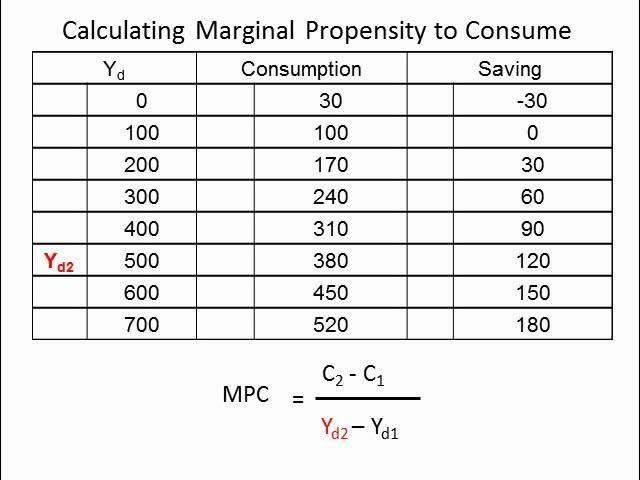

## Table of Contents

## What is the Marginal Propensity to Consume (MPC)?

The Marginal Propensity to Consume (MPC) is a concept in economics that shows how much of an extra dollar of income people will spend on goods and services. It is calculated by dividing the change in consumption by the change in income. For example, if someone gets an extra $100 and they spend $80 of it, their MPC is 0.8. This number is always between 0 and 1 because people can't spend more than they earn, and they might save some of it.

MPC is important because it helps economists understand and predict how changes in income will affect overall spending in the economy. If the MPC is high, it means people are likely to spend most of their extra income, which can boost economic growth. On the other hand, if the MPC is low, people are saving more of their income, which might slow down economic activity. Governments and businesses use this information to make decisions about policies and investments.

## How is MPC calculated?

The Marginal Propensity to Consume, or MPC, is calculated by looking at how much more people spend when they get more money. You take the change in how much people spend and divide it by the change in how much money they have. For example, if someone's income goes up by $100 and they spend an extra $80, the MPC would be $80 divided by $100, which equals 0.8.

This number tells us the fraction of extra income that people will use to buy things. The MPC is always between 0 and 1 because people can't spend more than they earn, and they might choose to save some of their extra money. Knowing the MPC helps economists guess how changes in income will affect spending in the whole economy.

## What is the formula for MPC?

The formula for the Marginal Propensity to Consume (MPC) is simple. You take the change in how much people spend and divide it by the change in how much money they have. For example, if someone's income goes up by $100 and they spend an extra $80, the MPC would be $80 divided by $100, which equals 0.8.

This number, the MPC, tells us the fraction of extra income that people will use to buy things. It's always between 0 and 1 because people can't spend more than they earn, and they might choose to save some of their extra money. Knowing the MPC helps economists guess how changes in income will affect spending in the whole economy.

## Can you explain the concept of MPC with a simple example?

Imagine you get an extra $100 in your pocket. You decide to spend $80 of it on things you want or need, like a new shirt or some groceries. The rest, $20, you put into your savings account. The part you spent, $80, compared to the extra money you got, $100, helps us figure out your Marginal Propensity to Consume (MPC). In this case, your MPC is $80 divided by $100, which is 0.8. That means for every extra dollar you get, you're likely to spend 80 cents.

This number, the MPC, is useful because it shows how people might spend extra money they get. If lots of people have a high MPC, like 0.8, it means they'll spend most of their extra money, which can help the economy grow. If people have a low MPC, they'll save more, which might slow things down. Economists use this to guess how the economy will do when people's incomes change.

## What is the relationship between MPC and the consumption function?

The Marginal Propensity to Consume (MPC) and the consumption function are closely related. The consumption function is a formula that economists use to predict how much people will spend based on their income. It shows that when people get more money, they will spend some of it and save the rest. The MPC is a key part of this formula because it tells us the fraction of extra income that people will spend. For example, if the MPC is 0.8, it means that for every extra dollar people get, they will spend 80 cents and save 20 cents.

In the consumption function, the MPC is the slope of the line that shows how consumption changes with income. If you draw a graph where the horizontal line shows income and the vertical line shows consumption, the MPC tells you how steep that line is. A higher MPC means the line is steeper, showing that people spend a bigger part of their extra income. This relationship helps economists understand and predict how changes in income will affect spending in the economy.

## How does MPC affect the multiplier effect in economics?

The Marginal Propensity to Consume (MPC) plays a big role in the multiplier effect, which is how spending by one person can lead to more spending by others, making the overall effect on the economy bigger. When someone spends money, that money goes to someone else, who then might spend some of it too. The MPC tells us how much of their extra money people will spend. If the MPC is high, meaning people spend most of their extra money, the multiplier effect will be stronger. This is because the money keeps moving from one person to another, creating more spending and boosting the economy.

For example, if the MPC is 0.8, it means that for every dollar someone gets, they spend 80 cents. That 80 cents goes to someone else, who might spend 80% of that, which is 64 cents, and so on. Each round of spending adds up, and the total effect on the economy can be much bigger than the first dollar spent. The size of the multiplier depends on the MPC; a higher MPC leads to a bigger multiplier because more money keeps circulating in the economy. This is why understanding the MPC is important for predicting how government spending or tax cuts might affect economic growth.

## What factors can influence an individual's MPC?

Many things can affect how much of their extra money people choose to spend, which is what the Marginal Propensity to Consume (MPC) measures. One big [factor](/wiki/factor-investing) is how confident people feel about the future. If people think the economy will do well and they will keep [earning](/wiki/earning-announcement) money, they might spend more of their extra cash. But if they are worried about losing their job or the economy slowing down, they might save more and spend less. Another factor is how much money people already have. Someone with a lot of savings might feel okay spending more of their extra money because they have a safety net. But someone with little savings might save more of their extra money to feel more secure.

Another thing that can change someone's MPC is their age. Younger people, who might be starting families or buying their first home, often have a higher MPC because they need to spend money on things like furniture or baby stuff. Older people, who might be thinking about retirement, could have a lower MPC because they want to save more for the future. Also, how much people owe on things like credit cards or loans can affect their MPC. If someone has a lot of debt, they might use their extra money to pay that off instead of spending it, which would lower their MPC.

## How does MPC vary across different income levels?

The Marginal Propensity to Consume (MPC) can change depending on how much money people make. People with lower incomes often have a higher MPC. This means they spend a bigger part of any extra money they get. They might need to use that extra money right away to buy things like food or pay bills. So, if someone with a low income gets an extra $100, they might spend most of it, maybe $90 or more, because they don't have a lot of savings to fall back on.

On the other hand, people with higher incomes usually have a lower MPC. They might already have enough money to cover their needs, so they don't need to spend all of their extra money right away. Instead, they might save more of it or invest it. If someone with a high income gets an extra $100, they might only spend $50 or less of it, putting the rest into savings or investments. This difference in MPC across income levels is important for understanding how changes in income affect spending in the whole economy.

## What are the limitations of using MPC in economic analysis?

Using the Marginal Propensity to Consume (MPC) in economic analysis has some limits. One big problem is that MPC can change over time and it's not the same for everyone. Things like how people feel about the future, how old they are, and how much money they make can change their MPC. So, if economists use one MPC number for everyone, their predictions might not be very accurate. Also, MPC doesn't tell us everything about how people spend money. For example, it doesn't say anything about how much money people already have saved up, which can also affect how much they spend.

Another limitation is that MPC doesn't take into account other things that can affect spending, like taxes, interest rates, and big events like a recession. If the government changes taxes or if interest rates go up or down, that can change how much people spend, but MPC doesn't show that. Also, during tough economic times, people might save more money even if their income stays the same, which would change their MPC. Because of these things, economists need to be careful when they use MPC to make predictions about the economy. They need to think about other factors too, not just the MPC.

## How can MPC be used to predict changes in consumer spending?

The Marginal Propensity to Consume (MPC) helps economists guess how much more people will spend if they get more money. It's like a simple rule: if the MPC is high, people will spend most of their extra money. So, if everyone's income goes up by $100 and the MPC is 0.8, people will spend about $80 of that extra $100. This helps economists predict that if people get more money, spending in the economy will go up a lot because people are spending most of it.

But, using MPC to predict spending isn't perfect. People's MPC can change because of things like how they feel about the future, how old they are, and how much money they already have. If people are worried about losing their jobs, they might save more of their extra money instead of spending it, even if their MPC was high before. So, economists need to think about these other things too when they use MPC to guess how much spending will change.

## What is the difference between MPC and Marginal Propensity to Save (MPS)?

The Marginal Propensity to Consume (MPC) and the Marginal Propensity to Save (MPS) are two sides of the same coin when it comes to what people do with extra money. MPC tells us how much of an extra dollar someone will spend. For example, if someone gets $100 more and spends $80 of it, their MPC is 0.8. This means they spend 80 cents out of every extra dollar they get. MPC is important because it helps economists guess how much spending in the economy will change when people's incomes go up or down.

On the other hand, the Marginal Propensity to Save (MPS) tells us how much of that extra dollar someone will save. Using the same example, if someone gets $100 more and saves $20 of it, their MPS is 0.2. This means they save 20 cents out of every extra dollar. Together, MPC and MPS always add up to 1 because every extra dollar either gets spent or saved. Understanding both helps economists see the full picture of how people use their money when their income changes.

## How do economists use MPC in macroeconomic models and policy-making?

Economists use the Marginal Propensity to Consume (MPC) in big economic models to guess how changes in people's income will affect spending in the whole economy. They put the MPC into these models to see what might happen if, for example, the government gives people more money through tax cuts or direct payments. If the MPC is high, it means people will spend most of that extra money, which can make the economy grow faster. This helps economists and policymakers decide on the best ways to help the economy, like figuring out if a tax cut or more government spending would be more effective.

In policy-making, knowing the MPC helps governments decide how to use their money to help the economy. For example, if the MPC is high, a government might choose to give people money directly because they know people will spend most of it, boosting the economy. But if the MPC is low, they might decide to spend money on things like building roads or schools, which can create jobs and help the economy in a different way. By understanding the MPC, policymakers can make smarter choices about how to use taxes and spending to keep the economy healthy.

## What is the Understanding of Marginal Propensity to Consume (MPC)?

The Marginal Propensity to Consume (MPC) is a critical economic concept that quantifies the proportion of additional income an individual is likely to spend rather than save. This concept is integral to Keynesian economics, developed by economist John Maynard Keynes, which emphasizes the role of aggregate demand in influencing economic output and employment levels.

MPC is typically expressed as a ratio, calculated using the formula:

$$
\text{MPC} = \frac{\Delta C}{\Delta Y}
$$

where $\Delta C$ represents the change in consumption, and $\Delta Y$ represents the change in income. The value of MPC ranges between 0 and 1. An MPC of 0 indicates that all additional income is saved, while an MPC of 1 signifies that all additional income is spent.

Several factors influence MPC, including consumer confidence, interest rates, and economic policies. A higher level of consumer confidence, for instance, may encourage individuals to increase spending in anticipation of continued income stability or growth. Conversely, high interest rates might incentivize saving over spending, thus reducing the MPC. Economic policies, such as tax cuts or cash transfers, can directly affect disposable income and consequently influence MPC.

Understanding MPC is crucial for predicting economic growth trends and assisting policymakers in formulating effective fiscal strategies. For example, if policymakers observe a high MPC, they may implement measures to stimulate spending, knowing that such actions will likely translate into significant increases in aggregate demand. This understanding aids in adjusting fiscal policies to promote sustained economic growth and stable employment rates.

By incorporating consumer behavior insights derived from MPC, economists and policymakers can better anticipate how changes in income levels might affect overall economic activity, ensuring that interventions are both timely and effective.

## What is the calculation of MPC?

Calculating the Marginal Propensity to Consume (MPC) involves analyzing changes in consumption relative to changes in income over a defined period. The fundamental formula for MPC is expressed as:

$$
\text{MPC} = \frac{\Delta C}{\Delta Y}
$$

where $\Delta C$ denotes the change in consumption and $\Delta Y$ represents the change in income. This calculation provides insight into how much of an additional dollar of income is spent by consumers.

Accurate determination of MPC necessitates precise data collection on consumer spending habits and income variations. Researchers typically use data sources such as household surveys, national accounts, and econometric models to derive MPC values. For instance, household surveys capture consumer spending details and related income information, offering a microeconomic perspective on spending behaviors.

Econometric models play a critical role in calculating MPC as they enable the analysis of large datasets, identifying patterns and correlations between income changes and consumer spending. These models help in isolating factors that may influence consumption, such as demographic variables, savings rates, and economic conditions.

Real-world applications of MPC calculations are vital for evaluating economic policies, such as assessing the impact of tax cuts or stimulus packages on consumer spending levels. For example, if a government implements a tax reduction, determining the MPC can assist in forecasting the resulting increase in consumption, thereby facilitating predictions on economic growth.

Incorporating MPC into economic analyses aids policymakers in formulating strategies that encourage consumer spending, ultimately influencing overall economic activity. By understanding how consumers allocate additional income, policymakers can tailor fiscal measures to stimulate or stabilize the economy effectively.

 to Algorithmic Trading (Algo Trading)

Algorithmic trading, often referred to as algo trading, harnesses the power of computerized systems to execute trades automatically based on a set of predefined criteria. This approach has gained popularity in financial markets primarily due to its capacity for processing vast quantities of data and executing trades at exceptionally high speeds. By utilizing sophisticated algorithms, these systems can analyze market conditions, economic indicators, and price movements, enabling traders to make informed decisions in real time.

The core of [algorithmic trading](/wiki/algorithmic-trading) lies in its use of advanced mathematical models and computational algorithms to identify trading opportunities that may be imperceptible to human traders. These algorithms not only minimize the potential for human error but also optimize trading strategies by ensuring consistent and efficient execution of trades. Furthermore, algorithmic trading significantly enhances market [liquidity](/wiki/liquidity-risk-premium), as it often involves high-frequency trading that contributes to tightened bid-ask spreads and increased trading volumes.

Incorporating economic concepts such as the Marginal Propensity to Consume (MPC) into algorithmic trading strategies offers an added layer of insight when analyzing market trends and consumer behavior. By integrating MPC, algo trading systems can dynamically adjust their trading parameters according to shifts in economic cycles and consumer confidence. This integration helps traders predict market movements more accurately, particularly in consumer-driven sectors such as retail and commodities, where spending behavior significantly impacts market dynamics.

In summary, algorithmic trading serves as a pivotal tool for modern traders and financial institutions, offering enhanced precision, speed, and efficiency in trade execution. By weaving together traditional economic theories and cutting-edge technology, algo trading opens up new pathways for strategic market analysis and decision-making.

## References & Further Reading

[1]: Keynes, J. M. (1936). ["The General Theory of Employment, Interest, and Money."](https://www.files.ethz.ch/isn/125515/1366_KeynesTheoryofEmployment.pdf) Palgrave Macmillan.

[2]: Lopez de Prado, M. (2018). ["Advances in Financial Machine Learning."](https://www.amazon.com/Advances-Financial-Machine-Learning-Marcos/dp/1119482089) Wiley.

[3]: Chan, E. P. (2008). ["Quantitative Trading: How to Build Your Own Algorithmic Trading Business."](https://github.com/ftvision/quant_trading_echan_book) Wiley.

[4]: Baumeister, C., & Hamilton, J. D. (2015). ["Sign Restrictions, Structural Vector Autoregressions, and Useful Prior Information."](https://onlinelibrary.wiley.com/doi/pdf/10.3982/ECTA12356) The American Economic Review.

[5]: Jansen, S. (2020). ["Machine Learning for Algorithmic Trading: Predictive models to extract signals from market and alternative data for systematic trading strategies with Python."](https://www.amazon.com/Machine-Learning-Algorithmic-Trading-alternative/dp/1839217715) Packt Publishing.