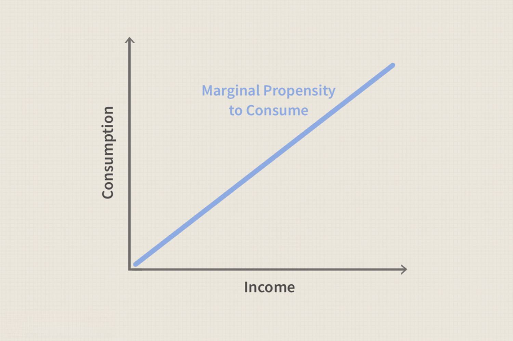

In today's fast-paced financial world, understanding economic concepts is crucial for effective decision-making. A deep comprehension of these concepts not only aids in navigating the complexities of economic systems but also strengthens the ability to predict and respond to market changes effectively. One key concept that plays a significant role in economic analysis and trading strategies is the Marginal Propensity to Consume (MPC). This concept is central to the study of consumer behavior, providing insight into how income variations influence spending habits.

The Marginal Propensity to Consume is an essential tool in Keynesian economics, which emphasizes the total spending in an economy and its effects on output and inflation. By understanding MPC, economists and policymakers can make more informed predictions about economic growth and devise fiscal policies that stabilize the economy.



Parallel to these economic theories, technological advancements have significantly impacted financial markets, particularly through the development of algorithmic trading, or algo trading. Algo trading has become a prominent method utilized by traders and institutions to execute orders efficiently and quickly, capitalizing on market data and computational finance models. It leverages complex algorithms to make decisions about trading of securities, minimizing human errors and optimizing transaction timing and pricing.

This article explores the interplay between economic theories and modern trading techniques, providing a comprehensive view of their confluence. We discuss Marginal Propensity to Consume, its calculation methods, and its integration into algorithmic trading systems to better understand market behavior and enhance trading strategies. As technology permeates economic practices, the synergy between these domains promises to drive innovation and efficiency in financial markets.

## Table of Contents

## Understanding Marginal Propensity to Consume (MPC)

The Marginal Propensity to Consume (MPC) is a critical economic concept that quantifies the proportion of additional income an individual is likely to spend rather than save. This concept is integral to Keynesian economics, developed by economist John Maynard Keynes, which emphasizes the role of aggregate demand in influencing economic output and employment levels.

MPC is typically expressed as a ratio, calculated using the formula:

$$
\text{MPC} = \frac{\Delta C}{\Delta Y}
$$

where $\Delta C$ represents the change in consumption, and $\Delta Y$ represents the change in income. The value of MPC ranges between 0 and 1. An MPC of 0 indicates that all additional income is saved, while an MPC of 1 signifies that all additional income is spent.

Several factors influence MPC, including consumer confidence, interest rates, and economic policies. A higher level of consumer confidence, for instance, may encourage individuals to increase spending in anticipation of continued income stability or growth. Conversely, high interest rates might incentivize saving over spending, thus reducing the MPC. Economic policies, such as tax cuts or cash transfers, can directly affect disposable income and consequently influence MPC.

Understanding MPC is crucial for predicting economic growth trends and assisting policymakers in formulating effective fiscal strategies. For example, if policymakers observe a high MPC, they may implement measures to stimulate spending, knowing that such actions will likely translate into significant increases in aggregate demand. This understanding aids in adjusting fiscal policies to promote sustained economic growth and stable employment rates.

By incorporating consumer behavior insights derived from MPC, economists and policymakers can better anticipate how changes in income levels might affect overall economic activity, ensuring that interventions are both timely and effective.

## Calculation of MPC

Calculating the Marginal Propensity to Consume (MPC) involves analyzing changes in consumption relative to changes in income over a defined period. The fundamental formula for MPC is expressed as:

$$
\text{MPC} = \frac{\Delta C}{\Delta Y}
$$

where $\Delta C$ denotes the change in consumption and $\Delta Y$ represents the change in income. This calculation provides insight into how much of an additional dollar of income is spent by consumers.

Accurate determination of MPC necessitates precise data collection on consumer spending habits and income variations. Researchers typically use data sources such as household surveys, national accounts, and econometric models to derive MPC values. For instance, household surveys capture consumer spending details and related income information, offering a microeconomic perspective on spending behaviors.

Econometric models play a critical role in calculating MPC as they enable the analysis of large datasets, identifying patterns and correlations between income changes and consumer spending. These models help in isolating factors that may influence consumption, such as demographic variables, savings rates, and economic conditions.

Real-world applications of MPC calculations are vital for evaluating economic policies, such as assessing the impact of tax cuts or stimulus packages on consumer spending levels. For example, if a government implements a tax reduction, determining the MPC can assist in forecasting the resulting increase in consumption, thereby facilitating predictions on economic growth.

Incorporating MPC into economic analyses aids policymakers in formulating strategies that encourage consumer spending, ultimately influencing overall economic activity. By understanding how consumers allocate additional income, policymakers can tailor fiscal measures to stimulate or stabilize the economy effectively.

 to Algorithmic Trading (Algo Trading)

Algorithmic trading, often referred to as algo trading, harnesses the power of computerized systems to execute trades automatically based on a set of predefined criteria. This approach has gained popularity in financial markets primarily due to its capacity for processing vast quantities of data and executing trades at exceptionally high speeds. By utilizing sophisticated algorithms, these systems can analyze market conditions, economic indicators, and price movements, enabling traders to make informed decisions in real time.

The core of [algorithmic trading](/wiki/algorithmic-trading) lies in its use of advanced mathematical models and computational algorithms to identify trading opportunities that may be imperceptible to human traders. These algorithms not only minimize the potential for human error but also optimize trading strategies by ensuring consistent and efficient execution of trades. Furthermore, algorithmic trading significantly enhances market [liquidity](/wiki/liquidity-risk-premium), as it often involves high-frequency trading that contributes to tightened bid-ask spreads and increased trading volumes.

Incorporating economic concepts such as the Marginal Propensity to Consume (MPC) into algorithmic trading strategies offers an added layer of insight when analyzing market trends and consumer behavior. By integrating MPC, algo trading systems can dynamically adjust their trading parameters according to shifts in economic cycles and consumer confidence. This integration helps traders predict market movements more accurately, particularly in consumer-driven sectors such as retail and commodities, where spending behavior significantly impacts market dynamics.

In summary, algorithmic trading serves as a pivotal tool for modern traders and financial institutions, offering enhanced precision, speed, and efficiency in trade execution. By weaving together traditional economic theories and cutting-edge technology, algo trading opens up new pathways for strategic market analysis and decision-making.

## Algorithmic Trading Strategies Incorporating MPC

Incorporating the Marginal Propensity to Consume (MPC) into algorithmic trading strategies involves a sophisticated approach to analyzing consumer spending data and its impact on market movements. Algorithmic trading systems integrate MPC calculations to dynamically adjust trading parameters based on economic cycles, enabling traders to anticipate shifts in consumer behavior that could influence market trends.

By leveraging MPC, algorithmic trading algorithms can be developed to account for changes in consumer confidence and spending potential. This is achieved by analyzing the relationship between incremental changes in income and the corresponding changes in consumption. An effective algorithm will use historical data and real-time economic indicators to evaluate MPC, thus allowing traders to make more precise market predictions.

For example, algorithms might be programmed to respond to variations in consumer savings rates or changes in disposable income, adapting trading strategies accordingly. The Python code snippet below provides a simplified illustration of how MPC calculations can be integrated into a trading strategy:

```python
# Sample Python code for incorporating MPC into trading strategy
def calculate_mpc(change_in_consumption, change_in_income):
    return change_in_consumption / change_in_income

# Assume incoming data streams of change in consumption (ΔC) and change in income (ΔY)
delta_c = 10  # Change in consumption
delta_y = 20  # Change in income

mpc = calculate_mpc(delta_c, delta_y)

def adjust_trading_parameters(current_position, mpc):
    if mpc > 0.5:
        # Indicating high consumer spending propensity
        new_position = current_position * 1.05  # Increase position by 5%
    else:
        # Indicating lower consumer spending propensity
        new_position = current_position * 0.95  # Decrease position by 5%
    return new_position

# Example current trading position
current_position = 1000
new_position = adjust_trading_parameters(current_position, mpc)
```

This strategic approach is particularly effective in consumer-driven markets such as retail and commodities, where shifts in consumer spending patterns can significantly impact demand and prices. By integrating MPC into algorithmic trading, traders gain a competitive edge in timing market entries and exits, thereby optimizing their trading performance.

Understanding the interplay between MPC and various economic variables through algorithmic trading also aids in crafting strategies that consider the broader economic context. This enhances decision-making by accounting for factors influencing consumer behavior, such as fiscal policies or [interest rate](/wiki/interest-rate-trading-strategies) changes, ultimately contributing to more robust and resilient trading models.

## Conclusion

The intersection of economic concepts and technology-driven trading methods opens new avenues for financial market analysis. Marginal Propensity to Consume (MPC) remains a fundamental economic indicator, providing vital insights into consumer behavior and the overall economic environment. By tracking how much of additional income is spent rather than saved, MPC reflects trends in economic health, guiding policymakers and analysts alike.

Algorithmic trading leverages these insights to enable more informed and strategic trading decisions. Integrating MPC into algorithmic trading strategies allows for real-time adjustments based on fluctuations in consumer spending and confidence. This integration offers enhanced precision in predicting market movements, particularly in consumer-driven sectors like retail and commodities. As technological advancements continue, the fusion of established economic theories with sophisticated computational algorithms will lead to the development of innovative trading strategies that can adapt to changing economic conditions.

Staying informed about these developments is crucial for finance professionals, economists, and traders. As the financial landscape continues to evolve, a deep understanding of both economic indicators such as MPC and the technological tools available for analysis will remain essential for successful decision-making and strategy formulation.

## References & Further Reading

[1]: Keynes, J. M. (1936). ["The General Theory of Employment, Interest, and Money."](https://www.files.ethz.ch/isn/125515/1366_KeynesTheoryofEmployment.pdf) Palgrave Macmillan.

[2]: Lopez de Prado, M. (2018). ["Advances in Financial Machine Learning."](https://www.amazon.com/Advances-Financial-Machine-Learning-Marcos/dp/1119482089) Wiley.

[3]: Chan, E. P. (2008). ["Quantitative Trading: How to Build Your Own Algorithmic Trading Business."](https://github.com/ftvision/quant_trading_echan_book) Wiley.

[4]: Baumeister, C., & Hamilton, J. D. (2015). ["Sign Restrictions, Structural Vector Autoregressions, and Useful Prior Information."](https://onlinelibrary.wiley.com/doi/pdf/10.3982/ECTA12356) The American Economic Review.

[5]: Jansen, S. (2020). ["Machine Learning for Algorithmic Trading: Predictive models to extract signals from market and alternative data for systematic trading strategies with Python."](https://www.amazon.com/Machine-Learning-Algorithmic-Trading-alternative/dp/1839217715) Packt Publishing.