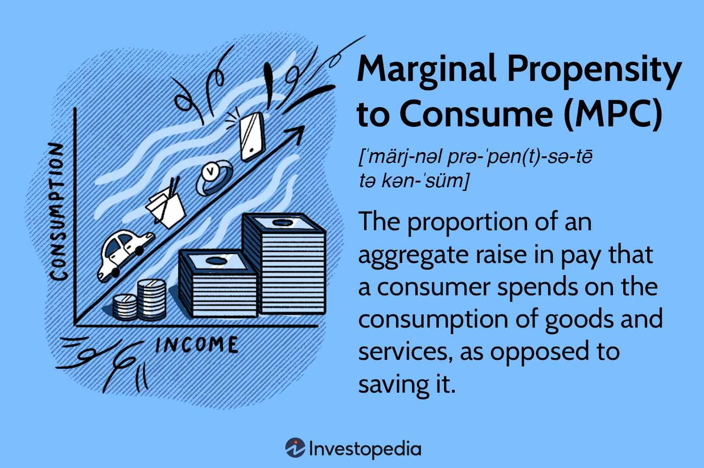

## Table of Contents

## What is the Marginal Propensity to Consume (MPC)?

The Marginal Propensity to Consume (MPC) is a term used in economics to describe how much of an extra dollar of income people will spend on goods and services. If someone gets an extra dollar, the MPC tells us what part of that dollar they will use to buy things instead of saving it. For example, if someone's MPC is 0.8, it means they will spend 80 cents of every extra dollar they get.

MPC is important because it helps economists understand how changes in income can affect the overall economy. When people spend more of their extra income, it can lead to more demand for goods and services, which can help businesses grow and create more jobs. On the other hand, if people save most of their extra income, it might slow down the economy because there's less demand for products. So, knowing the MPC helps in making economic policies that can encourage spending or saving, depending on what the economy needs.

## How is the MPC calculated?

To calculate the Marginal Propensity to Consume (MPC), you need to know how much someone's spending changes when their income changes. You do this by taking the change in their consumption and dividing it by the change in their income. For example, if someone's income goes up by $100 and they spend an extra $80, their MPC would be $80 divided by $100, which equals 0.8. This means they spend 80 cents out of every extra dollar they earn.

The formula for MPC is simple: MPC = Change in Consumption / Change in Income. This calculation gives you a number between 0 and 1. If the number is close to 1, it means people are spending almost all of their extra income. If it's close to 0, it means they are saving most of it. Understanding this helps economists predict how changes in income might affect the economy because it shows how much more people will spend when they earn more money.

## Why is the MPC important in economics?

The Marginal Propensity to Consume (MPC) is important in economics because it helps us understand how people will spend their extra money. When people get more income, like from a raise or a bonus, the MPC shows how much of that extra money they will use to buy things instead of saving it. This is important because when people spend more, it helps the economy grow. Businesses sell more products, which can lead to more jobs and more money being made overall.

Economists use the MPC to make better plans for the economy. If they know that people will spend a lot of their extra money, they might create policies to give people more income, like tax cuts or benefits, to boost spending and help the economy. On the other hand, if people are saving a lot of their extra money, the economy might need a different kind of help. So, knowing the MPC helps economists decide what kind of policies will work best to keep the economy healthy and growing.

## What is the relationship between MPC and the multiplier effect?

The Marginal Propensity to Consume (MPC) and the multiplier effect are closely related in economics. The multiplier effect shows how an initial change in spending can lead to a bigger overall change in the economy. When someone spends money, it becomes income for someone else, who then spends part of it, and this cycle continues. The MPC is important here because it tells us how much of that extra income people will spend. If the MPC is high, meaning people spend a lot of their extra money, the multiplier effect will be stronger because more money keeps circulating in the economy.

For example, if the government gives people more money through a stimulus, and people have a high MPC, they will spend a lot of that money. This spending leads to more income for businesses, which then pay their workers, who spend their earnings, and so on. The total increase in economic activity can be much larger than the initial amount of money given out. So, the MPC helps economists predict how big the multiplier effect will be, which is crucial for planning economic policies that aim to boost the economy.

## How does the MPC differ from the Average Propensity to Consume (APC)?

The Marginal Propensity to Consume (MPC) and the Average Propensity to Consume (APC) are both used to understand how people spend their money, but they measure different things. The MPC looks at how much of any extra money someone gets, they will spend. It's like if you get $10 more in your paycheck, how much of that $10 will you use to buy things? The MPC is calculated by dividing the change in spending by the change in income. It tells us about the behavior of spending extra money.

On the other hand, the APC looks at how much of someone's total income they spend on buying things. It's like looking at your whole paycheck and figuring out what part of it you use to buy stuff. To find the APC, you take your total spending and divide it by your total income. While the MPC focuses on how you spend extra money, the APC gives a bigger picture of your overall spending habits. Both are useful, but they give different kinds of information about how people use their money.

## What factors influence the MPC?

Several things can change how much people spend when they get extra money, which we call the Marginal Propensity to Consume (MPC). One big thing is how much money people already have. If someone doesn't have a lot of money, they might spend most of any extra money they get because they need things like food and clothes. But if someone has a lot of money, they might save more of their extra money instead of spending it. Another thing that can change the MPC is how confident people feel about the future. If they think things will be good, they might spend more of their extra money. But if they're worried about losing their job or the economy getting worse, they might save more.

Other things like how old people are and what the government does can also affect the MPC. Younger people might spend more of their extra money because they're still building their lives and need to buy things. Older people might save more for retirement. Also, if the government gives people money through things like tax cuts or benefits, it can make them feel like they have more to spend, which can increase the MPC. On the other hand, if the government raises taxes, people might feel like they have less money to spend, so their MPC might go down. All these things together help explain why the MPC can be different for different people and at different times.

## Can the MPC be greater than 1? Why or why not?

The Marginal Propensity to Consume (MPC) is a number that shows how much of extra money people spend. It's always between 0 and 1 because you can't spend more than all of the extra money you get. If you get $10 more, you can spend up to $10, but not more than that. So, the MPC can't be bigger than 1 because that would mean you're spending more money than you actually have, which doesn't make sense.

However, there are times when it might seem like the MPC is more than 1. This can happen if people start spending money they were saving before, or if they borrow money to spend more. But when we talk about the MPC, we're looking at just the extra money someone gets and how much of that they spend. So, even if it looks like people are spending more than their extra money, the true MPC, based on just the new money, stays between 0 and 1.

## How does the MPC vary across different income levels?

The Marginal Propensity to Consume (MPC) often changes depending on how much money people have. People with lower incomes usually have a higher MPC. This means they spend a bigger part of any extra money they get. They might need to use that money to buy things they need, like food or clothes. On the other hand, people with higher incomes often have a lower MPC. They might already have enough money to buy what they need, so they save more of their extra money instead of spending it.

This difference in MPC between income levels can affect the whole economy. When people with lower incomes get more money, they spend a lot of it, which can help businesses and the economy grow. But when people with higher incomes get more money, they might save more of it, which doesn't help the economy as much right away. Understanding how the MPC changes with income helps economists make better plans to keep the economy healthy.

## What role does the MPC play in fiscal policy?

The Marginal Propensity to Consume (MPC) is important for making decisions about fiscal policy, which is how the government uses spending and taxes to help the economy. When the government wants to boost the economy, they might give people more money through things like tax cuts or benefits. If people have a high MPC, they will spend a lot of this extra money, which helps businesses sell more and can create more jobs. So, knowing the MPC helps the government decide how much money to give out to make the economy grow.

On the other hand, if the economy is growing too fast and causing inflation, the government might want people to spend less. They could raise taxes or cut benefits to take money out of people's pockets. If people have a low MPC, they will save more of their money instead of spending it, which can slow down the economy and help control inflation. By understanding how much people will spend their extra money, the government can use fiscal policy to keep the economy balanced and healthy.

## How do economists estimate the MPC in real-world data?

Economists estimate the Marginal Propensity to Consume (MPC) by looking at real-world data, like how people's spending changes when they get more money. They might use surveys to ask people about their income and spending habits. Another way is to look at big sets of data from things like tax records or spending reports. They compare how much people's income changes with how much their spending changes. If people's income goes up by $100 and their spending goes up by $80, the MPC would be 0.8. This helps economists see how much of extra money people spend.

Sometimes, economists do special studies where they give people a little extra money to see what they do with it. These studies can show how much people spend right away and over time. By doing this, economists can get a good idea of the MPC for different groups of people. They also use math models to look at all this data and come up with the best estimate of the MPC. This helps them understand how changes in income might affect the whole economy.

## What are the criticisms or limitations of using the MPC in economic models?

One big problem with using the Marginal Propensity to Consume (MPC) in economic models is that it can be hard to get right. People's spending habits can change a lot depending on things like how much money they have, how old they are, and how they feel about the future. So, the MPC might be different for different people and at different times. This makes it tough for economists to use one number for everyone. Also, if the MPC is wrong, the plans they make for the economy might not work as well as they hoped.

Another issue is that the MPC doesn't tell the whole story about how the economy works. It only looks at how much people spend when they get more money, but it doesn't say anything about why they spend or save. For example, if people are saving more because they're worried about losing their jobs, the MPC might go down, but that doesn't mean the economy is doing well. So, economists need to look at other things too, like how much people are working and what businesses are doing, to get a full picture of the economy.

## How has the concept of MPC evolved in modern economic theory?

The idea of the Marginal Propensity to Consume (MPC) has changed a lot since it was first used in economics. At first, it was just about how much of extra money people would spend. Economists used it to predict how giving people more money would help the economy grow. But now, they know it's more complicated than that. They've learned that the MPC can change depending on a lot of different things, like how much money people have, their age, and how they feel about the future. So, modern economic theories try to take all these things into account when they use the MPC.

In today's economic models, the MPC is not just one number for everyone. Economists now look at how the MPC might be different for different groups of people. They also use new ways to study it, like giving people a little extra money and seeing what they do with it. This helps them understand not just how much people spend, but also why they spend or save. By doing this, economists can make better plans for the economy that take into account all the different ways people might react to getting more money.

## What is the Understanding of Marginal Propensity to Consume (MPC)?

The Marginal Propensity to Consume (MPC) is a fundamental concept in Keynesian macroeconomic theory, describing the fraction of additional income that a consumer allocates for consumption, as opposed to saving. This measurement offers insights into consumer behavior and is crucial for economic analysis. MPC is mathematically expressed as:

$$
\text{MPC} = \frac{\Delta C}{\Delta Y}
$$

where $\Delta C$ represents the change in consumption and $\Delta Y$ is the change in income. For example, if an individual receives an additional income of one dollar and spends 80 cents of it, the MPC would be 0.8, indicating that 80% of the additional income is directed toward consumption.

Understanding MPC is essential for several reasons. It serves as a parameter in economic modeling and forecasting, enabling economists to estimate the impact of fiscal policies on overall economic activity. For instance, policymakers can predict how a tax cut, which increases disposable income, might translate into additional consumer spending and thereby stimulate economic growth. Higher MPC values suggest that fiscal stimuli, such as government spending and tax reductions, can have a pronounced effect on boosting demand due to the multiplier effect.

MPC also informs the behavior of consumers under varying economic conditions. Typically, individuals with lower income levels tend to have a higher MPC because they spend a larger portion of any additional income to meet basic needs. Conversely, wealthier individuals often exhibit a lower MPC, as they are more likely to save or invest extra earnings.

Overall, MPC is pivotal in analyzing how changes in income levels affect consumer spending patterns, guiding crucial decisions in policy-making and economic strategy development.

## How does MPC influence Economic Policy?

The Marginal Propensity to Consume (MPC) is instrumental in designing fiscal and monetary policies aimed at maintaining or stimulating economic activity. In the economic context, policymakers closely monitor MPC to determine how changes in fiscal measures will impact consumption and, consequently, the broader economy. During economic slowdowns, governments can employ strategies such as increasing public spending or cutting taxes to inject additional income into the hands of consumers, with the expectation that a significant portion will be spent, not saved. 

The effectiveness of these policy measures largely depends on the value of MPC. A higher MPC indicates that consumers are more likely to spend rather than save additional income, thereby amplifying the impact of fiscal interventions through the multiplier effect. This multiplier effect is calculated using the formula:

$$
\text{Multiplier} = \frac{1}{1 - \text{MPC}}
$$

This equation highlights how the potency of fiscal policy is closely tied to MPC. For instance, if MPC is 0.8, the resulting multiplier is 5, suggesting that each dollar of increased spending could generate a fivefold increase in economic output. Understanding this relationship helps governments predict and manage the effects of their fiscal policies with greater precision.

Moreover, these insights are not limited merely to recessionary conditions. During periods of economic expansion, recognizing the MPC aids in assessing the potential overheating of the economy. In such scenarios, policymakers might implement measures to temper excessive consumption and inflation, often by increasing interest rates or reducing public expenditure.

By aligning fiscal and monetary policies with the prevailing MPC, governments can effectively stabilize the economy, manage inflation, and promote sustainable growth. As a key determinant of consumption dynamics, MPC thus serves as an invaluable tool for economic planning and decision-making.

## How do consumption patterns relate to economic growth?

Consumption is a fundamental component of Gross Domestic Product (GDP), accounting for a significant portion of economic activity in most economies. The Marginal Propensity to Consume (MPC) is thus a crucial metric in assessing economic health, as it dictates how income changes translate into consumption changes. MPC is calculated by the formula:

$$
\text{MPC} = \frac{\Delta C}{\Delta Y}
$$

where $\Delta C$ represents the change in consumption and $\Delta Y$ represents the change in income.

A notable trend in consumption patterns is the inverse relationship between MPC and income levels. As individuals' income increases, their basic needs are typically met more completely, resulting in a lower proportion of additional income being spent. Consequently, MPC tends to decrease with higher income levels. This phenomenon is supported by the Keynesian consumption function, which suggests that as disposable income rises, the percentage increase in consumption is less than the percentage increase in income. Therefore, higher-income individuals or households have a greater propensity to save additional income rather than consume it.

Understanding consumption patterns is vital for predicting economic activity because shifts in consumer spending can have substantial impacts on GDP. For instance, in a high-MPC economy, an increase in national income results in a significant boost in consumption, which then amplifies economic growth through the multiplier effect. Conversely, in a low-MPC environment, increases in income do not significantly drives up consumption, potentially leading to slower economic expansion.

Moreover, recognizing how consumption patterns evolve with income levels can assist in anticipating the impacts of fiscal or monetary policy. Policies aiming to increase disposable income, such as tax cuts or direct transfers, may have varying effects depending on the prevalent MPC. In economies or demographics with a high MPC, such policies are likely to stimulate economic activity more effectively compared to those with a lower MPC.

In summary, consumption patterns, influenced by changes in the MPC, are instrumental in understanding how variations in income levels can affect economic activities. Economists and policymakers use this insight to forecast economic trends and to tailor policies that can stimulate or stabilize economic growth effectively.

## References & Further Reading

[1]: Keynes, J. M. (1936). ["The General Theory of Employment, Interest and Money."](https://www.files.ethz.ch/isn/125515/1366_KeynesTheoryofEmployment.pdf) Macmillan Cambridge University Press.

[2]: "Algorithmic Trading: Winning Strategies and Their Rationale" by Ernest P. Chan

[3]: Mankiw, N. G. (2014). ["Principles of Economics."](https://books.google.com/books/about/Principles_of_Economics.html?id=K-jKAgAAQBAJ) Cengage Learning.

[4]: Kahneman, D., & Tversky, A. (1979). ["Prospect Theory: An Analysis of Decision under Risk."](https://psycnet.apa.org/record/1988-97762-011) Econometrica, 47(2), 263-292.

[5]: Sims, C. A. (1980). ["Macroeconomics and Reality."](https://www.semanticscholar.org/paper/MACROECONOMICS-AND-REALITY-Sims/46649df2532231b8431a547d0838b1229469fa4c) Econometrica, 48(1), 1-48.