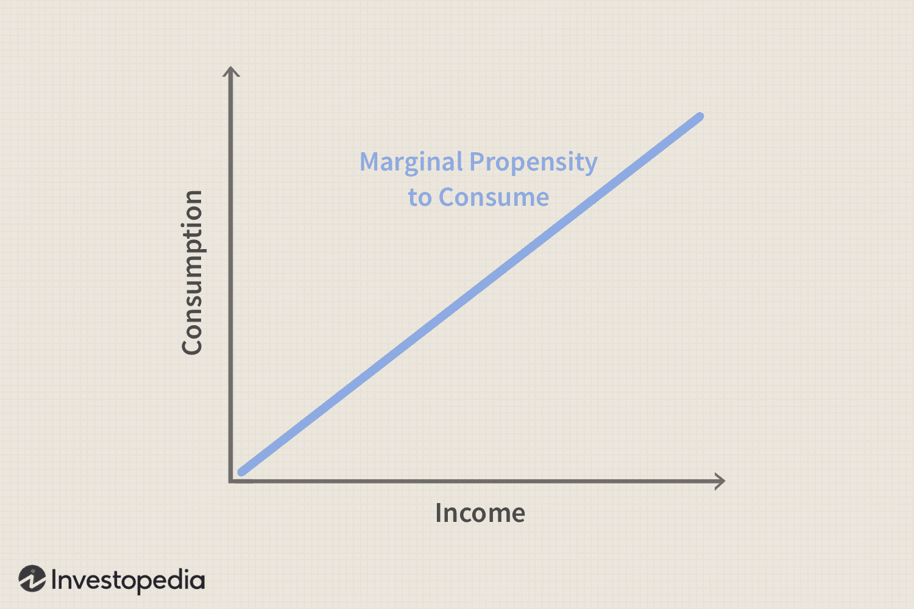

In today's dynamic economic landscape, understanding the interplay between various financial concepts is crucial for economists, policymakers, and investors. This article explores the interconnectedness of the Marginal Propensity to Consume (MPC), consumption patterns, and algorithmic trading. By examining MPC, a central concept in Keynesian macroeconomic theory, we aim to highlight its significance in economic forecasting, fiscal policy-making, and investment strategies.

MPC measures the proportion of additional income that consumers are likely to spend rather than save, offering insights into consumer behavior and economic health. This measure is not just academic; it has practical implications. For instance, governments might adjust public spending or tax policies based on MPC to incentivize consumer spending and stimulate economic growth, especially during downturns.



Algorithmic trading, which leverages computer algorithms for executing trades, increasingly uses economic indicators, including those related to consumer spending. Understanding how MPC affects market behavior can potentially enhance trading strategies, optimizing them to predict market trajectories more effectively and achieve better investment outcomes.

Therefore, the exploration of these concepts is vital as it draws connections between economic theories and modern technological applications in finance. This interconnectedness influences fiscal policies, shapes market dynamics, and guides investment decisions. As such, ongoing research at this intersection is essential for adapting to evolving global markets and economic conditions.

## Table of Contents

## Understanding Marginal Propensity to Consume (MPC)

The Marginal Propensity to Consume (MPC) is a fundamental concept in Keynesian macroeconomic theory, describing the fraction of additional income that a consumer allocates for consumption, as opposed to saving. This measurement offers insights into consumer behavior and is crucial for economic analysis. MPC is mathematically expressed as:

$$
\text{MPC} = \frac{\Delta C}{\Delta Y}
$$

where $\Delta C$ represents the change in consumption and $\Delta Y$ is the change in income. For example, if an individual receives an additional income of one dollar and spends 80 cents of it, the MPC would be 0.8, indicating that 80% of the additional income is directed toward consumption.

Understanding MPC is essential for several reasons. It serves as a parameter in economic modeling and forecasting, enabling economists to estimate the impact of fiscal policies on overall economic activity. For instance, policymakers can predict how a tax cut, which increases disposable income, might translate into additional consumer spending and thereby stimulate economic growth. Higher MPC values suggest that fiscal stimuli, such as government spending and tax reductions, can have a pronounced effect on boosting demand due to the multiplier effect.

MPC also informs the behavior of consumers under varying economic conditions. Typically, individuals with lower income levels tend to have a higher MPC because they spend a larger portion of any additional income to meet basic needs. Conversely, wealthier individuals often exhibit a lower MPC, as they are more likely to save or invest extra earnings.

Overall, MPC is pivotal in analyzing how changes in income levels affect consumer spending patterns, guiding crucial decisions in policy-making and economic strategy development.

## MPC and Economic Policy

The Marginal Propensity to Consume (MPC) is instrumental in designing fiscal and monetary policies aimed at maintaining or stimulating economic activity. In the economic context, policymakers closely monitor MPC to determine how changes in fiscal measures will impact consumption and, consequently, the broader economy. During economic slowdowns, governments can employ strategies such as increasing public spending or cutting taxes to inject additional income into the hands of consumers, with the expectation that a significant portion will be spent, not saved. 

The effectiveness of these policy measures largely depends on the value of MPC. A higher MPC indicates that consumers are more likely to spend rather than save additional income, thereby amplifying the impact of fiscal interventions through the multiplier effect. This multiplier effect is calculated using the formula:

$$
\text{Multiplier} = \frac{1}{1 - \text{MPC}}
$$

This equation highlights how the potency of fiscal policy is closely tied to MPC. For instance, if MPC is 0.8, the resulting multiplier is 5, suggesting that each dollar of increased spending could generate a fivefold increase in economic output. Understanding this relationship helps governments predict and manage the effects of their fiscal policies with greater precision.

Moreover, these insights are not limited merely to recessionary conditions. During periods of economic expansion, recognizing the MPC aids in assessing the potential overheating of the economy. In such scenarios, policymakers might implement measures to temper excessive consumption and inflation, often by increasing interest rates or reducing public expenditure.

By aligning fiscal and monetary policies with the prevailing MPC, governments can effectively stabilize the economy, manage inflation, and promote sustainable growth. As a key determinant of consumption dynamics, MPC thus serves as an invaluable tool for economic planning and decision-making.

## Consumption Patterns and Economic Growth

Consumption is a fundamental component of Gross Domestic Product (GDP), accounting for a significant portion of economic activity in most economies. The Marginal Propensity to Consume (MPC) is thus a crucial metric in assessing economic health, as it dictates how income changes translate into consumption changes. MPC is calculated by the formula:

$$
\text{MPC} = \frac{\Delta C}{\Delta Y}
$$

where $\Delta C$ represents the change in consumption and $\Delta Y$ represents the change in income.

A notable trend in consumption patterns is the inverse relationship between MPC and income levels. As individuals' income increases, their basic needs are typically met more completely, resulting in a lower proportion of additional income being spent. Consequently, MPC tends to decrease with higher income levels. This phenomenon is supported by the Keynesian consumption function, which suggests that as disposable income rises, the percentage increase in consumption is less than the percentage increase in income. Therefore, higher-income individuals or households have a greater propensity to save additional income rather than consume it.

Understanding consumption patterns is vital for predicting economic activity because shifts in consumer spending can have substantial impacts on GDP. For instance, in a high-MPC economy, an increase in national income results in a significant boost in consumption, which then amplifies economic growth through the multiplier effect. Conversely, in a low-MPC environment, increases in income do not significantly drives up consumption, potentially leading to slower economic expansion.

Moreover, recognizing how consumption patterns evolve with income levels can assist in anticipating the impacts of fiscal or monetary policy. Policies aiming to increase disposable income, such as tax cuts or direct transfers, may have varying effects depending on the prevalent MPC. In economies or demographics with a high MPC, such policies are likely to stimulate economic activity more effectively compared to those with a lower MPC.

In summary, consumption patterns, influenced by changes in the MPC, are instrumental in understanding how variations in income levels can affect economic activities. Economists and policymakers use this insight to forecast economic trends and to tailor policies that can stimulate or stabilize economic growth effectively.

## Algorithmic Trading: An Overview

Algorithmic trading involves the use of computer algorithms to conduct trading operations, automating the process and executing trades faster and more efficiently than human traders. This approach can process vast amounts of data, perform intricate analyses, and react to market changes within milliseconds. Key to its effectiveness is the ability to exploit minor price discrepancies across different markets, a process known as [arbitrage](/wiki/arbitrage).

These algorithms often utilize economic indicators to inform and refine strategy decisions. Notably, consumption patterns, as represented by the Marginal Propensity to Consume (MPC), are becoming integral to [algorithmic trading](/wiki/algorithmic-trading) models. The rationale is that consumer spending trends can signal economic shifts that might impact asset prices. For instance, a high MPC may suggest robust consumer spending, potentially hinting at economic growth and influencing the pricing of securities linked to consumer goods sectors.

Python, a popular language in algorithmic trading, offers powerful libraries such as NumPy for numerical calculations and Pandas for managing datasets. Consider a simple Python example calculating potential trading signals based on a hypothetical economic indicator influenced by MPC:

```python
import pandas as pd
import numpy as np

def calculate_trading_signal(data, mpc_factor):
    # Assume `data` is a DataFrame containing historical economic indicators
    data['signal'] = np.where(data['indicator'] > mpc_factor, 1, -1) # Buy if indicator > mpc_factor else sell
    return data['signal']

# Example usage
historical_data = pd.DataFrame({'indicator': [0.7, 0.6, 0.8, 0.9, 0.65]})
mpc_factor = 0.75
signals = calculate_trading_signal(historical_data, mpc_factor)
print(signals)
```

In this code, `calculate_trading_signal` generates a simple buy/sell signal based on whether an economic indicator exceeds a threshold (mpc_factor). Such algorithms can be expanded and integrated with real-time data feeds to create automated trading strategies that respond dynamically to changes in consumer spending patterns and other economic indicators.

As algorithmic trading continues to grow, integrating economic metrics like MPC into trading algorithms will likely enhance the ability to anticipate market trends and adapt investment strategies, ultimately offering competitive advantages in financial markets.

## Integrating MPC into Algorithmic Trading Strategies

To integrate Marginal Propensity to Consume (MPC) into algorithmic trading strategies, traders leverage MPC-related data to enhance the predictive power of their trading algorithms. By analyzing variations in consumer spending, which can be triggered by economic stimuli such as tax cuts or government spending, traders can gain insights into shifts in market demand and corresponding price level adjustments.

For instance, changes in MPC can indicate potential growth or contraction in consumer spending, which directly affects companies' revenue and profit forecasts. Traders utilize this information to anticipate stock price movements or broader market trends. For example, if a stimulus package is expected to increase consumer incomes and the MPC is high, traders might predict an increase in consumer goods stocks.

Here's a simple approach to incorporating MPC data into a trading algorithm using Python:

```python
import pandas as pd
import numpy as np

# Load data - Assume 'data' is a DataFrame containing income and consumption columns
data = pd.read_csv('economic_data.csv')
data['MPC'] = data['Change_in_Consumption'] / data['Change_in_Income']

# Define a basic trading function based on MPC
def trading_strategy(data, threshold=0.8):
    signals = []
    for index, row in data.iterrows():
        if row['MPC'] > threshold:
            signals.append('BUY')
        elif row['MPC'] < (1 - threshold):
            signals.append('SELL')
        else:
            signals.append('HOLD')
    return signals

# Apply the trading strategy
data['Trade_Signal'] = trading_strategy(data)
```

In this script, the algorithm calculates MPC for each data point, decides whether to buy, sell, or hold an asset based on the MPC threshold, and generates a trading signal accordingly. High MPC values could signal increased market demand, justifying a 'BUY' decision, whereas low values might suggest 'SELL'.

Furthermore, by continuously monitoring MPC data, traders can dynamically adjust their algorithm parameters, optimizing trading positions as economic conditions evolve. This adaptability helps enhance potential profits while simultaneously reducing risks associated with unforeseen market shifts.

As algorithmic trading platforms become increasingly sophisticated, the integration of economic indicators like MPC fosters a deeper understanding of market dynamics, empowering traders to make more informed and strategic decisions.

## Conclusion

The connection between the Marginal Propensity to Consume (MPC), economic policies, and algorithmic trading highlights the transformative impact of integrating traditional economic theories with advanced technological applications. MPC, a fundamental measure of how additional income is spent, serves as a pivotal indicator in developing effective fiscal policies aimed at stimulating economic growth. By understanding consumer behavior through MPC, policymakers can craft strategies that encourage spending, thereby amplifying the multiplier effect and advancing economic expansion.

In the context of algorithmic trading, incorporating MPC into trading strategies offers traders valuable insights into market trends and consumer spending patterns. Predictive models that [factor](/wiki/factor-investing) in variations in MPC can optimize investment strategies by adjusting trading positions in response to economic stimuli that affect market demand and price levels. This integration of economic indicators enables algorithms to enhance decision-making processes, achieving improved accuracy in market predictions, resulting in optimized profits and reduced risks for investors.

Continued research and development at the intersection of economic theory and technology are essential as global markets and economic environments undergo rapid changes. The synergistic effects generated by understanding MPC in conjunction with technological advancements in trading platforms underscore an evolving landscape where both economists and traders can significantly benefit. By leveraging economic data through technological platforms, the financial sector can adapt more effectively to changing economic conditions, ultimately driving sustained economic growth and innovation in investment strategies.

## References & Further Reading

[1]: Keynes, J. M. (1936). ["The General Theory of Employment, Interest and Money."](https://www.files.ethz.ch/isn/125515/1366_KeynesTheoryofEmployment.pdf) Macmillan Cambridge University Press.

[2]: "Algorithmic Trading: Winning Strategies and Their Rationale" by Ernest P. Chan

[3]: Mankiw, N. G. (2014). ["Principles of Economics."](https://books.google.com/books/about/Principles_of_Economics.html?id=K-jKAgAAQBAJ) Cengage Learning.

[4]: Kahneman, D., & Tversky, A. (1979). ["Prospect Theory: An Analysis of Decision under Risk."](https://psycnet.apa.org/record/1988-97762-011) Econometrica, 47(2), 263-292.

[5]: Sims, C. A. (1980). ["Macroeconomics and Reality."](https://www.semanticscholar.org/paper/MACROECONOMICS-AND-REALITY-Sims/46649df2532231b8431a547d0838b1229469fa4c) Econometrica, 48(1), 1-48.