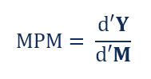

## Table of Contents

## What is the Marginal Propensity to Import (MPM)?

The Marginal Propensity to Import (MPM) is a measure that shows how much a country's imports change when its income changes. It is calculated by dividing the change in imports by the change in income. If a country's income goes up, people might buy more things from other countries, so imports increase. The MPM tells us how sensitive imports are to changes in income.

For example, if a country's income increases by $100 and its imports increase by $20, the MPM would be 0.2. This means that for every extra dollar of income, the country spends 20 cents on imports. The MPM is important for understanding how much of an increase in income will be spent on foreign goods, which can affect the country's trade balance and overall economy.

## How is MPM calculated?

The Marginal Propensity to Import (MPM) is calculated by looking at how much a country's imports change when its income changes. To find the MPM, you take the change in imports and divide it by the change in income. For example, if a country's income goes up by $100 and its imports go up by $20, the MPM would be $20 divided by $100, which equals 0.2.

This number, 0.2, means that for every extra dollar of income the country gets, it spends 20 cents on imports. The MPM helps us understand how much of the new income will be used to buy things from other countries. It's a simple way to see how sensitive a country's imports are to changes in its income.

## Why is MPM important in economics?

The Marginal Propensity to Import (MPM) is important in economics because it helps us understand how a country's income changes affect its spending on foreign goods. When a country's income goes up, people might spend more money on things from other countries. By knowing the MPM, economists can predict how much of that new income will be spent on imports. This is useful for figuring out how a country's trade balance might change. If the MPM is high, it means a lot of the new income will be spent on imports, which could lead to a bigger trade deficit.

MPM also helps in making economic policies. Governments and policymakers use the MPM to plan how to manage the economy. For example, if they want to reduce a trade deficit, they might look at the MPM to see how changes in income could affect imports. By understanding the MPM, they can make better decisions about taxes, spending, and other economic policies. This way, they can try to keep the economy balanced and healthy.

## What factors influence the MPM of a country?

Several things can change a country's Marginal Propensity to Import (MPM). One big factor is how much people in the country like to buy things from other countries. If people are used to buying a lot of foreign stuff, the MPM will be higher. Another factor is how much money people have. If people get more money, they might spend more on imports, making the MPM go up. Also, if the country's own stuff is more expensive than foreign stuff, people might choose to buy more from other countries, which would increase the MPM.

Another thing that can affect the MPM is the exchange rate. If a country's money is worth less compared to other countries' money, it can make foreign stuff cheaper. This might make people buy more imports, so the MPM could go up. Government rules and taxes can also play a role. If the government makes it easier or cheaper to import things, the MPM might go up. But if they make it harder or more expensive, the MPM might go down. All these things together help decide how much of a country's new income will be spent on imports.

## How does MPM relate to a country's trade balance?

The Marginal Propensity to Import (MPM) is important because it shows how much a country's imports change when its income changes. If a country's income goes up, people might spend more on things from other countries. This can affect the country's trade balance, which is the difference between what a country sells to other countries (exports) and what it buys from them (imports). If the MPM is high, it means a bigger part of the new income is spent on imports. This could make the trade balance worse if exports don't go up by the same amount.

The trade balance is important for a country's economy. If a country buys more from other countries than it sells to them, it has a trade deficit. A high MPM can make this deficit bigger because more of the country's money is going to other countries. On the other hand, if the MPM is low, it means less of the new income is spent on imports, which could help keep the trade balance more even or even lead to a trade surplus if exports are strong. Understanding the MPM helps economists and policymakers predict and manage the trade balance better.

## Can MPM change over time? If so, why?

Yes, the Marginal Propensity to Import (MPM) can change over time. This happens because a lot of things in a country can change. For example, if people start to like buying more things from other countries, the MPM will go up. Or if the country's own stuff gets more expensive compared to foreign stuff, people might choose to buy more imports, which would also make the MPM go up. Changes in how much money people have can also affect the MPM. If people get more money, they might spend more on imports, making the MPM higher.

Another reason the MPM can change is because of government rules and the exchange rate. If the government makes it easier or cheaper to import things, the MPM might go up. But if they make it harder or more expensive, the MPM might go down. Also, if a country's money is worth less compared to other countries' money, it can make foreign stuff cheaper. This might make people buy more imports, so the MPM could go up. All these things together can make the MPM change over time.

## How does MPM affect the multiplier effect in an economy?

The Marginal Propensity to Import (MPM) can change how the multiplier effect works in an economy. The multiplier effect is when spending by one person leads to more spending by others, making the total effect on the economy bigger than the first bit of spending. If the MPM is high, it means people spend a lot of their new money on things from other countries. When they do this, less money stays in the country to be spent again and again. This can make the multiplier effect smaller because less money is going around inside the country.

On the other hand, if the MPM is low, more of the new money stays in the country. People spend it on things made at home, which can lead to more spending and a bigger multiplier effect. So, a low MPM can make the economy grow more because more money is being spent and re-spent inside the country. Understanding how MPM affects the multiplier effect helps economists and policymakers see how changes in income might affect the whole economy.

## What is the difference between MPM and Marginal Propensity to Consume (MPC)?

The Marginal Propensity to Import (MPM) and the Marginal Propensity to Consume (MPC) are two different measures in economics that look at how people spend their money. MPM shows how much of a country's new income is spent on things from other countries. If a country's income goes up, and people start buying more stuff from abroad, the MPM tells us how much of that new money is going to imports. It's important because it can affect a country's trade balance and how much money stays in the country to help the economy grow.

On the other hand, the Marginal Propensity to Consume (MPC) looks at how much of a person's extra income they spend on anything, not just imports. If someone gets more money, the MPC tells us how much of that new money they will spend on things like food, clothes, or other stuff they need or want. The MPC is important because it helps us understand how spending can grow the economy. When people spend more, it can lead to more jobs and more money moving around in the economy. Both MPM and MPC help economists understand how money is spent and how it affects the economy, but they focus on different parts of spending.

## How do economists use MPM in macroeconomic models?

Economists use the Marginal Propensity to Import (MPM) in macroeconomic models to understand how changes in a country's income affect its spending on things from other countries. When a country's income goes up, people might spend more money on imports. By knowing the MPM, economists can predict how much of that new income will be spent on foreign goods. This helps them figure out how the country's trade balance might change. If the MPM is high, it means a lot of the new money will leave the country, which could make the trade balance worse.

In their models, economists also use MPM to see how it affects the overall economy. A high MPM can make the multiplier effect smaller. The multiplier effect is when spending by one person leads to more spending by others, making the total effect on the economy bigger. If a lot of new money is spent on imports, less money stays in the country to be spent again and again. This can slow down the economy's growth. By understanding the MPM, economists can make better plans for things like taxes and spending to help keep the economy balanced and growing.

## What are the implications of a high MPM for domestic industries?

When a country has a high Marginal Propensity to Import (MPM), it means that people in that country spend a lot of their new money on things from other countries. This can be tough for domestic industries because people are choosing to buy foreign stuff instead of things made at home. If a lot of money is going to other countries, there's less money left for people to spend on things made in their own country. This can make it hard for local businesses to sell their products and stay profitable.

Because of this, domestic industries might struggle to grow or even stay in business. When people buy more imports, it can lead to fewer jobs in the country's own factories and shops. Companies might have to cut back on what they make or even close down if they can't sell enough. This can hurt the whole economy because fewer people working means less money being spent, which can slow down growth. So, a high MPM can have big effects on the health of a country's own businesses and the jobs they provide.

## How does MPM impact fiscal and monetary policy decisions?

When a country has a high Marginal Propensity to Import (MPM), it means people spend a lot of their new money on things from other countries. This can make it harder for the government to use fiscal policy, like changing taxes or spending, to help the economy grow. If a lot of the new money is spent on imports, less money stays in the country to be spent again and again. This can make the multiplier effect smaller, which is when spending by one person leads to more spending by others. So, the government might need to find other ways to boost the economy, like focusing on policies that encourage people to buy more things made at home.

Monetary policy, which is about controlling the money supply and interest rates, can also be affected by a high MPM. If people spend a lot on imports, the central bank might worry about the trade balance getting worse. They might try to make the country's money worth less to make foreign stuff more expensive, which could make people buy more things made at home. But this can be tricky because it might also make prices go up at home. So, when deciding on monetary policy, the central bank has to think about how a high MPM could change the economy and try to find the best way to keep things balanced.

## Can you provide a case study where MPM significantly affected a country's economy?

In the early 2000s, China's economy was growing really fast. As people in China got more money, they started buying more things from other countries. China's Marginal Propensity to Import (MPM) was pretty high because people liked buying foreign stuff. This meant a lot of the new money was going to other countries instead of staying in China. Because of this, China's trade balance got worse, and it made it harder for the government to use spending to help the economy grow even more. The government had to think of new ways to keep the economy strong, like making it easier for people to buy things made in China.

To deal with the high MPM, China's central bank also had to be careful about monetary policy. They didn't want the trade balance to get too bad, so they tried to keep the value of the Chinese money, the yuan, just right. If the yuan was too strong, it would make foreign stuff cheaper, and people would buy even more imports. But if it was too weak, it could make prices go up at home. By understanding how the MPM was affecting the economy, the central bank could make better decisions about the money supply and interest rates to keep things balanced and help the economy grow in a healthy way.

## What is the Role of MPM in Economic Analysis?

The Marginal Propensity to Import (MPM) is an economic metric used to analyze how changes in disposable income affect a nation's import levels. It is calculated as the ratio of the change in imports ($\Delta M$) to the change in disposable income ($\Delta Y$):

$$
\text{MPM} = \frac{\Delta M}{\Delta Y}
$$

This measurement is essential for understanding consumer behavior regarding imported goods as income levels fluctuate. An elevated MPM implies that with increased income, a significant portion is spent on foreign goods, reflecting consumer preferences and competitive pricing of imports.

In developed economies, the MPM tends to be higher due to greater access to a diverse array of foreign goods and higher disposable incomes, allowing consumers to purchase imported products more frequently. These economies often have mature markets for domestic goods, driving consumers to seek variety or potentially better pricing through imports. The implication is significant for trade balances and foreign exchange rates, as a higher MPM can lead to trade deficits if not offset by exports.

Conversely, developing economies might experience a lower MPM due to several factors. These include limited access to international goods, trade barriers, and a tendency for consumers to prioritize essentials that are locally produced as disposable income increases. However, as these economies grow and income levels rise, MPM can increase, indicating a shift towards more sophisticated consumption patterns that include foreign goods.

Understanding the MPM allows policymakers to predict how changes in national income levels might affect trade balances, facilitating strategies to enhance economic stability. It also helps in designing effective tariffs and trade agreements by identifying products with high import propensities when domestic income rises.

From an analytical perspective, incorporating MPM into economic models can help predict changes in global trade flows. Analysts might use the MPM alongside other metrics to forecast economic vulnerabilities or opportunities, making it a crucial tool for comprehensive economic analysis.

## How can MPM be integrated into trading algorithms?

The inclusion of the Marginal Propensity to Import (MPM) into trading algorithms provides traders with the ability to better anticipate changes in import demand that correlate with variations in disposable income. This integration involves the application of MPM to enhance the robustness of trading strategies by predicting economic trends that impact import levels. Understanding and quantifying MPM is crucial for determining how changes in national income can drive consumer preferences towards imported goods, key to forecasting shifts in global trading patterns.

To integrate MPM into trading algorithms effectively, it is essential to leverage economic data analytics and predictive modeling. First, traders must develop a robust model to calculate MPM using historical economic data. This can be expressed as:

$$
\text{MPM} = \frac{\Delta \text{Imports}}{\Delta \text{Income}}
$$

Where $\Delta \text{Imports}$ represents the change in import levels, and $\Delta \text{Income}$ refers to the change in national income.

After calculating MPM, traders can incorporate this into their predictive models using [machine learning](/wiki/machine-learning) techniques. Python, with its extensive libraries for data manipulation and machine learning, can be an ideal platform for this purpose. For instance, linear regression can be used to estimate the relationship between national income and import levels based on historical data. Here is a sample implementation using Python's Scikit-Learn library:

```python
from sklearn.model_selection import train_test_split
from sklearn.linear_model import LinearRegression
import pandas as pd

# Load your dataset
data = pd.read_csv('economic_data.csv')

# Assume 'Income' and 'Imports' are columns in your dataset
X = data[['Income']].values
y = data['Imports'].values

# Split the data into training and testing sets
X_train, X_test, y_train, y_test = train_test_split(X, y, test_size=0.2, random_state=0)

# Initialize and fit the linear regression model
model = LinearRegression()
model.fit(X_train, y_train)

# Predict import changes for new income data
predictions = model.predict(X_test)
```

Incorporating MPM into trading algorithms provides several advantages. By predicting the impact of income changes on import demands, traders can make informed decisions that align with projected global economic trends. Additionally, incorporating MPM enhances the adaptability and accuracy of trading algorithms, allowing them to adjust trading strategies in response to dynamic economic conditions.

Further, the utilization of MPM can also complement traditional economic indicators within algorithmic frameworks. When combined with leading and lagging indicators, MPM enables a more comprehensive model that reflects both short-term and long-term economic conditions.

Nevertheless, traders must remain vigilant of external variables that might influence MPM calculations, such as government trade policies and international market disruptions. By doing so, they can enhance the reliability and effectiveness of their algorithmic trading strategies. Implementing rigorous testing and validation processes is crucial to ensure that these models provide accurate predictions that align with real-world economic shifts.

## References & Further Reading

- **Bergstra, J., et al. 'Algorithms for Hyper-Parameter Optimization.'** This paper explores methodologies for optimizing algorithm parameters, a crucial aspect of developing robust trading models. The insights into hyper-parameter optimization can greatly enhance the effectiveness of trading algorithms by fine-tuning them to react optimally under various market conditions.

- **Lopez de Prado, M. 'Advances in Financial Machine Learning.'** Lopez de Prado's work is seminal in the application of machine learning to financial markets. This book covers various aspects of using machine learning techniques to improve trading strategies, offering insights into model development, feature selection, and avoiding overfitting.

- **Aronson, D. 'Evidence-Based Technical Analysis.'** Aronson's book provides a rigorous approach to technical analysis, focusing on data-driven decision-making rather than subjective interpretations. This resource is valuable for traders aiming to integrate technical analysis with quantitative methods to develop more reliable trading strategies.

- **Jansen, S. 'Machine Learning for Algorithmic Trading.'** Jansen's work serves as a practical guide to applying machine learning in trading. It covers a range of machine learning applications from developing trading strategies to implementing real-time systems, making it an essential resource for those interested in the practical implementation of machine learning in trading algorithms.

