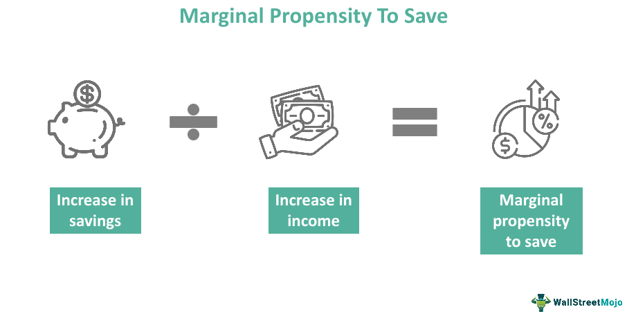

In the intricate tapestry of economics and finance, theories and concepts play a pivotal role in explaining and predicting investment and spending behaviors. Among these conceptual frameworks is the Marginal Propensity to Invest (MPI), an essential component in understanding how investments respond to changes in income. Rooted deeply in economic theory, MPI provides insights into the mechanisms that drive investment decisions, impacting both microeconomic and macroeconomic landscapes.

In recent times, the evolution of technology and the emergence of algorithmic trading have dramatically reshaped the way investment decisions are made. Algorithmic trading, which relies on complex algorithms and high-speed data analysis, has introduced new variables and considerations in economic behaviors related to investment. These technological advancements compel economists and investors to reconsider traditional economic theories and assess MPI from a modern perspective.



This article aims to illuminate the underlying economics of investment propensity theory, offering a comprehensive examination of MPI's calculation and its implications in contemporary finance, particularly through the lens of algorithmic trading. By dissecting these concepts, readers will gain a nuanced understanding of how MPI influences economic policies and individual investment strategies, equipping them with the knowledge to adeptly navigate the ever-evolving financial landscape.

## Table of Contents

## Understanding the Marginal Propensity to Invest (MPI)

The Marginal Propensity to Invest (MPI) is a fundamental concept within Keynesian economic theory, representing the ratio of the change in investment (ΔI) to the change in income (ΔY). This metric helps economists and policymakers understand how variations in income levels can affect investment behavior, making it an essential tool for predicting economic shifts and formulating strategies to stimulate economic growth.

Originating from Keynesian economics, the MPI operates alongside the marginal propensity to consume (MPC). While the MPC focuses on changes in consumer spending in response to changes in income, the MPI concentrates on how income changes affect investment levels. Understanding both propensities is crucial for a comprehensive grasp of economic dynamics.

In mathematical terms, MPI is expressed as:

$$
\text{MPI} = \frac{\Delta I}{\Delta Y}
$$

where $\Delta I$ denotes the change in investment, and $\Delta Y$ denotes the change in income. A higher MPI indicates that a significant portion of additional income is likely to be invested, whereas a lower MPI suggests that less additional income is allocated towards investment.

This measure provides critical insights into the allocation of income within an economy. For instance, if a government seeks to boost economic activity through fiscal policy, understanding the MPI can guide decisions about which sectors or areas may benefit most from increased income or financial incentives.

The origins of MPI, rooted in the work of economist John Maynard Keynes, highlight investment's role in achieving economic equilibrium. Keynesian theory posits that investment is a primary driver of economic cycles, with fluctuations in investment leading to variations in aggregate demand and, subsequently, economic output.

Beyond its theoretical foundations, MPI also finds practical application in evaluating the effectiveness of policy measures. By assessing the impact of fiscal stimuli or other economic interventions on investment behavior, economists can better predict outcomes and adjust policies to optimize economic growth.

Understanding the MPI's mathematical and theoretical underpinnings empowers stakeholders to make informed decisions in responding to economic trends, ensuring balanced growth and stability. Through this lens, the MPI emerges not only as a theoretical construct but as a practical guide for navigating the complexities of modern economic landscapes.

## The Role of MPI in Economic Theory

The Marginal Propensity to Invest (MPI) serves as a pivotal economic indicator that goes beyond theoretical speculation to offer real-world applicability in understanding and predicting economic behavior. Fundamentally, MPI measures how changes in income levels influence investment behavior, a concept that extends into macroeconomic structures affecting aggregate demand and the multiplier effect.

### Aggregate Demand and Multiplier Effect

The concept of MPI is intertwined with aggregate demand, which represents the total demand for goods and services within an economy at a given overall price level and time. The MPI contributes to fluctuations in aggregate demand by influencing how much of any incremental income is directed towards investment as opposed to consumption. Higher MPI values suggest that a larger portion of additional income is invested rather than spent on consumption, which subsequently amplifies the investment component of aggregate demand.

The multiplier effect, a critical aspect of Keynesian economics, explains how initial changes in spending lead to further changes in income and output, impacting the overall economy. The MPI plays a crucial role here; it determines the extent of amplification. The formula for the investment multiplier (k) reflects this relationship:

$$

k = \frac{1}{1 - MPI - MPC} 
$$

Where MPC is the marginal propensity to consume. This equation highlights how MPI, alongside MPC, influences the effectiveness of fiscal policies designed to stimulate economic growth.

### Business Investments

For businesses, understanding MPI is essential for strategic planning and capital allocation. Firms, guided by MPI insights, make informed decisions about expanding operations, investing in new technologies, or entering new markets. Businesses often adjust their investment strategies based on anticipated changes in income, leveraging MPI to forecast returns on investments and gauge economic conditions.

### Government Policies

Government policymakers utilize MPI to forecast and fine-tune economic outputs through fiscal and monetary policies. A high MPI indicates robust investment confidence, suggesting that policies geared towards economic growth, like tax incentives or subsidies for business investments, may be more effective. Conversely, a lower MPI might prompt interventions aimed at stimulating investment through lower interest rates or enhancing [liquidity](/wiki/liquidity-risk-premium) in financial markets.

### Broader Economic Implications

On a broader scale, MPI's role extends to impacting economic stability and growth. Variabilities in MPI can indicate economic sentiment, affecting national and global business cycles. Economies with dynamic MPI values can exhibit more pronounced cyclical behaviors, where periods of rapid investment growth are followed by contractions.

In conclusion, understanding and utilizing MPI is crucial for both policymakers and investors. For policymakers, it aids in crafting informed strategies to stabilize or stimulate economic activity. For investors, grasping MPI dynamics enables better assessment of market conditions and more strategic allocation of resources. As economic landscapes evolve, MPI continues to be a vital tool for navigating economic fluctuations and driving investment decisions.

## Factors Influencing MPI

Multiple factors influence the Marginal Propensity to Invest (MPI), a key metric that indicates how the investment level changes with income fluctuations. These factors are essential for understanding how investment decisions are made across different economic landscapes.

### Interest Rates

Interest rates play a fundamental role in determining MPI. Lower interest rates usually reduce the cost of borrowing, thereby increasing the propensity to invest as businesses find it cheaper to finance new projects. Conversely, higher interest rates can restrain investment activities by making loans more expensive. Central banks often adjust interest rates to control economic growth and inflation, indirectly affecting MPI.

### Expected Rates of Return

Investment decisions are primarily driven by the expected returns. A higher expected rate of return increases the MPI as investors are more inclined to allocate additional income towards investments promising higher yields. This relationship can be expressed mathematically where an investor's choice, given an expected rate of return $R$, maximizes the expected utility, influencing how income changes are invested.

### Availability of Financing

The availability of capital and credit also significantly influences MPI. When financing is readily available, companies have more opportunities to invest in capital-intensive projects, thus increasing MPI. Economic environments that promote easy access to loans and credit facilities tend to experience higher levels of investment.

### Technological Advancements

Technological progress affects MPI by creating new investment opportunities and improving the efficiency of existing processes. Innovations can lead to new industries and products, driving companies to invest in cutting-edge technologies to maintain competitive edges. Furthermore, technology reduces operational costs, allowing firms to reinvest savings into additional ventures.

### Risk Appetite

Investment decisions are heavily dependent on the risk tolerance of individuals and firms. A higher risk appetite can lead to increased MPI as stakeholders are more open to investing in high-risk, high-reward ventures. On the other hand, economic uncertainties often result in a lower propensity to invest as the perceived risks outweigh the potential returns.

### Interplay of Influencing Factors

The interaction among these factors can be complex. For instance, technological advancements might lead to higher expected rates of return, which, coupled with low interest rates, can significantly boost MPI. However, if there is significant economic uncertainty, even these favorable conditions might not lead to increased investment due to decreased risk appetite.

Incorporating these variables into economic models provides a comprehensive view of how MPI shapes investment behaviors. Understanding these dynamics is crucial for economists and policymakers, as they influence strategies aimed at encouraging investment, driving economic growth, and stabilizing economic fluctuations.

## MPI and Algorithmic Trading

Algorithmic trading, which utilizes computer algorithms to execute financial transactions at high speed and [volume](/wiki/volume-trading-strategy), has become a pivotal part of modern financial markets. Its success largely hinges on data-driven strategies and the ability to predict market movements. Here, the concept of the Marginal Propensity to Invest (MPI) plays a crucial role in shaping these strategies. 

MPI provides valuable insights into investment behavior by measuring the change in investment in response to a change in income. In [algorithmic trading](/wiki/algorithmic-trading), these insights help in developing predictive models that can anticipate shifts in investment patterns based on economic indicators. Algorithms can be constructed to automatically adjust trading strategies in response to changes that may signal a modified MPI, such as variations in interest rates or economic forecasts.

For practical application, an algorithm might involve programming a trading bot to respond to changes in MPI as follows:

```python
# Hypothetical Python example for algorithmic trading based on MPI changes

class InvestmentBot:
    def __init__(self, initial_investment, initial_income):
        self.investment = initial_investment
        self.income = initial_income
        self.mpi = self.calculate_mpi()

    def calculate_mpi(self, new_investment=None, new_income=None):
        if new_investment is None or new_income is None:
            return 0
        return (new_investment - self.investment) / (new_income - self.income)

    def update_parameters(self, new_investment, new_income):
        self.mpi = self.calculate_mpi(new_investment, new_income)
        self.investment = new_investment
        self.income = new_income

    def trade_decision(self):
        """Adjusts trading strategy based on MPI values."""
        if self.mpi > 0.5:
            self.execute_trade("Buy")
        elif self.mpi < 0.2:
            self.execute_trade("Sell")

    def execute_trade(self, decision):
        # Placeholder for trade execution logic
        print(f"Executing a {decision} order based on MPI.")

# Example usage
bot = InvestmentBot(initial_investment=1000, initial_income=2000)
bot.update_parameters(new_investment=1100, new_income=2050)
bot.trade_decision()
```

One of the primary advantages of incorporating MPI in algorithmic trading is the ability to align trading strategies with macroeconomic trends. For example, during periods of economic growth where incomes are rising, an increasing MPI may suggest robust investment activity, thus signaling a buying opportunity. Conversely, during economic downturns, a declining MPI might prompt the algorithm to take a conservative approach, such as selling or refraining from making risky investments.

The intersection of MPI with algorithmic trading underscores the significant applications of economic theory in the development of sophisticated financial models. By incorporating MPI into their algorithms, traders can enhance decision-making processes, leading to more responsive and adaptive trading strategies in an increasingly volatile market environment.

## Comparing MPI with Marginal Propensity to Consume (MPC)

The Marginal Propensity to Invest (MPI) and the Marginal Propensity to Consume (MPC) are foundational concepts in economics, offering insights into how changes in income are allocated between consumption and investment. While each measures a distinct economic behavior, together they help shape comprehensive economic models and inform policy decisions.

### Contrasting MPI and MPC

MPI quantifies the proportion of additional income that is allocated to investment internally or externally within an economy. The formula for MPI is:

$$
\text{MPI} = \frac{\Delta I}{\Delta Y}
$$

where $\Delta I$ is the change in investment and $\Delta Y$ is the change in income. In contrast, MPC measures the proportion of additional income that is spent on consumption:

$$
\text{MPC} = \frac{\Delta C}{\Delta Y}
$$

where $\Delta C$ represents the change in consumption. Both metrics provide valuable information about economic behavior in response to income variations, although they capture different aspects of spending.

### Implications for Economic Modeling

The implications of MPI and MPC extend to both long-term growth and short-term economic activity. High MPI suggests that an economy is likely to invest significantly in capital goods, potentially promoting long-term growth through increased productive capacity. Conversely, a high MPC indicates a strong inclination toward consumption, fueling immediate economic activity and supporting businesses driven by consumer demand.

Economic models often use the sum of MPC and MPI, alongside other propensities, to determine the marginal propensity to spend, influencing aggregate demand. The relationship between these propensities significantly affects the multiplier effect, which is crucial in determining the overall impact of fiscal policies on economic output.

### Policy Implications

Understanding the differences between MPI and MPC is crucial for policymakers tasked with fostering economic stability and growth. Policies that target savings and investments can modify MPI, while those aimed at increasing household income and spending will affect MPC. During economic downturns, increasing MPC through direct cash transfers can quickly boost demand, while enhancing MPI can stimulate investments in infrastructure and technology, laying the groundwork for future growth.

In summary, while MPI and MPC focus on different components of income distribution, their interplay is central to economic modeling and policy crafting. By leveraging the insights provided by these metrics, economists and policymakers can better forecast economic trends and devise strategies to stabilize and grow the economy.

## Conclusion

The marginal propensity to invest (MPI) serves as a fundamental tool for analyzing economic behavior and formulating strategies meant to guide fiscal policies. As a key concept originating from Keynesian economics, it enables the examination of how changes in income levels impact investment decisions. The application of MPI is not limited to theoretical exploration; it plays a vital role in practical environments, particularly under the paradigm shifts introduced by modern technology and finance.

One of the most profound transformations in financial markets is the rise of algorithmic trading. This innovative approach leverages sophisticated algorithms to automate investment decisions, leading to a more efficient processing of market data and trends. MPI insights become indispensable in the algorithmic framework, as they help fine-tune models that predict and respond to shifts in investment patterns. By incorporating MPI values, these algorithms enhance their predictive accuracy, thereby optimizing decisions and maximizing returns.

As the world continues to experience rapid technological advancements and shifting economic conditions, understanding investment propensities like MPI becomes increasingly crucial. This understanding aids investors, policymakers, and economists in making informed decisions that not only respond to current economic climates but also anticipate future trends. By integrating these insights, stakeholders can devise strategies that foster long-term stability and growth.

This article has offered a comprehensive overview of MPI, equipping readers with vital insights needed to adeptly navigate the complexities of economic and investment landscapes. Recognizing the intersection of traditional economic theories with modern financial systems underscores the relevance of concepts like MPI as indispensable tools for driving economic development and innovation.

## References & Further Reading

[1]: Keynes, J. M. (1936). ["The General Theory of Employment, Interest, and Money."](http://keynes-general-theory.com/generaltheory.pdf) Palgrave Macmillan.

[2]: ["Advances in Financial Machine Learning"](https://www.amazon.com/Advances-Financial-Machine-Learning-Marcos/dp/1119482089) by Marcos Lopez de Prado

[3]: Cartea, Á., Jaimungal, S., & Penalva, J. (2015). ["Algorithmic and High-Frequency Trading."](https://assets.cambridge.org/97811070/91146/frontmatter/9781107091146_frontmatter.pdf) Cambridge University Press.

[4]: ["Machine Learning for Algorithmic Trading"](https://github.com/stefan-jansen/machine-learning-for-trading) by Stefan Jansen

[5]: Parker, J. A. (2017). ["Understanding the Great Recession: The Role of Household Balance Sheets."](https://www.aeaweb.org/articles?id=10.1257/mac.20140104) National Bureau of Economic Research.