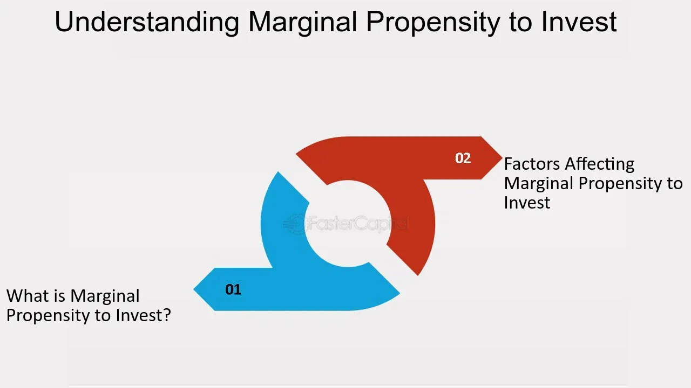

## Table of Contents

## What is the Marginal Propensity to Invest (MPI)?

The Marginal Propensity to Invest (MPI) is a concept in economics that describes how much a business or individual will increase their investment when their income goes up. It's like a measure of how sensitive investment is to changes in income. If a company gets more money, the MPI helps us understand how much of that extra money they will use to buy new equipment, expand their business, or invest in other ways.

Think of it this way: if you get a bonus at work, you might decide to put some of that money into a new project or business idea. The MPI tells us what fraction of that bonus you would invest. Economists use this information to predict how changes in income might affect the overall economy, because more investment can lead to more jobs and growth.

## How is MPI calculated?

To calculate the Marginal Propensity to Invest (MPI), you need to know two things: how much investment changed and how much income changed. You take the change in investment and divide it by the change in income. For example, if a company's income went up by $100,000 and they decided to invest an extra $20,000, the MPI would be $20,000 divided by $100,000, which equals 0.2. This means that for every extra dollar of income, the company invests 20 cents.

The MPI is useful because it helps predict how businesses might react to changes in their income. If the MPI is high, it means businesses are likely to invest a lot when they get more money, which can boost the economy. If it's low, businesses might be saving more or spending on other things instead of investing. Economists use this number to understand and forecast economic trends based on how much companies are willing to invest with their additional income.

## What is the difference between Marginal Propensity to Consume and MPI?

The Marginal Propensity to Consume (MPC) and the Marginal Propensity to Invest (MPI) are two different ways to look at how people or businesses use extra money. MPC is about how much of an extra dollar someone will spend on things they want or need, like food, clothes, or entertainment. If someone gets a raise and decides to spend 80 cents of every extra dollar on these things, their MPC is 0.8. It's a way to see how much people will boost the economy by buying stuff when they have more money.

On the other hand, MPI is about how much of that extra dollar someone will put into investments, like buying new equipment for a business or starting a new project. If a business gets more money and decides to invest 20 cents of every extra dollar, their MPI is 0.2. This helps economists understand how much businesses will grow or expand when they have more money, which can also help the economy grow in different ways. Both MPC and MPI are important because they show different paths that extra money can take in the economy.

## Why is MPI important in economic theory?

MPI is important in economic theory because it helps us understand how businesses react to having more money. When a business gets extra income, the MPI tells us how much of that money they will use to invest in things like new machines, buildings, or other projects. This is important because when businesses invest more, it can lead to more jobs and help the economy grow. Economists use MPI to predict how changes in income might affect the overall economy, which helps them make better plans and policies.

Also, MPI shows us how sensitive businesses are to changes in their income. If the MPI is high, it means businesses are likely to invest a lot when they get more money, which can be good for the economy. But if the MPI is low, it might mean businesses are saving more or spending on other things instead of investing. Understanding this helps economists see the bigger picture of how money moves around in the economy and how it can affect growth and development.

## How does MPI affect economic growth?

MPI affects economic growth by showing how much businesses will invest when they get more money. When businesses have a high MPI, it means they will use a big part of their extra money to buy new things like machines or to start new projects. This kind of spending can create more jobs and help the economy grow. For example, if a factory buys new equipment, it might need more workers to run it, which means more people have jobs and more money to spend.

On the other hand, if the MPI is low, businesses might not invest as much even when they get more money. They might save it or spend it on other things instead. This can slow down economic growth because there are fewer new projects and jobs being created. Economists look at the MPI to understand how businesses are likely to act and how that will affect the economy. By knowing the MPI, they can make better plans to help the economy grow.

## What factors influence the MPI in an economy?

Several things can affect how much businesses decide to invest when they get more money, and this is what we call the Marginal Propensity to Invest (MPI). One big [factor](/wiki/factor-investing) is how confident businesses feel about the future. If they think the economy will do well, they might be more willing to spend on new projects or equipment because they believe they'll make more money back. But if they're worried about the future, like if there might be a recession, they might decide to hold onto their money instead of investing it.

Another thing that can change the MPI is the [interest rate](/wiki/interest-rate-trading-strategies). When interest rates are low, borrowing money is cheaper, so businesses might be more likely to take out loans to invest in new things. But when interest rates are high, borrowing costs more, and businesses might decide it's not worth it to invest because they'll have to pay back a lot of money. The overall health of the economy also matters. If the economy is growing and people are buying more, businesses might see it as a good time to invest and grow their operations.

Lastly, government policies can play a big role in the MPI. If the government offers tax breaks or other incentives for investing, businesses might be more likely to use their extra money to buy new things. On the other hand, if there are a lot of regulations or taxes that make investing harder, businesses might decide to save their money instead. All these factors together help decide how much businesses will invest when they get more money, which can affect how the whole economy grows.

## Can you explain the relationship between MPI and the multiplier effect?

The Marginal Propensity to Invest (MPI) is closely tied to the multiplier effect in economics. The multiplier effect is the idea that an initial increase in spending can lead to a much larger increase in overall economic activity. When businesses have a high MPI, they invest more of their extra money. This investment can lead to more jobs and more spending by workers, which then ripples through the economy, causing even more growth. So, a higher MPI can make the multiplier effect stronger because more initial spending goes into investments that keep the cycle of growth going.

On the other hand, if the MPI is low, businesses don't invest as much of their extra money. This means less new spending on things like machines or buildings, which can slow down the multiplier effect. When businesses hold onto their money instead of investing it, there's less of a boost to the economy. So, the MPI is important because it shows how much businesses will help keep the multiplier effect going by choosing to invest rather than save their extra money.

## How do changes in interest rates impact MPI?

Interest rates play a big role in how much businesses decide to invest when they get more money, which is what the Marginal Propensity to Invest (MPI) measures. When interest rates are low, borrowing money is cheaper. This means businesses might be more likely to take out loans to buy new equipment or start new projects because they won't have to pay back as much interest. So, when interest rates go down, the MPI usually goes up because businesses feel it's a good time to invest.

On the other hand, when interest rates are high, borrowing money costs more. This can make businesses think twice about taking out loans to invest because they'll have to pay back a lot more money. When interest rates go up, businesses might decide to save their extra money instead of investing it, which means the MPI usually goes down. This shows how changes in interest rates can affect how much businesses are willing to invest and, in turn, impact the overall economy.

## What role does business confidence play in determining MPI?

Business confidence is a big deal when it comes to deciding how much businesses will invest when they get more money. This is what we call the Marginal Propensity to Invest (MPI). If businesses feel good about the future and think the economy will do well, they're more likely to use their extra money to buy new things like machines or start new projects. They believe that by investing, they'll make more money later on. So, when business confidence is high, the MPI usually goes up because businesses are eager to invest.

On the flip side, if businesses are worried about the future, like if they think there might be tough times ahead, they might decide to hold onto their money instead of investing it. They might think it's safer to save or spend on other things rather than take the risk of investing. When business confidence is low, the MPI tends to go down because businesses aren't as willing to put their extra money into new investments. This shows how important it is for businesses to feel good about the future when deciding how much to invest.

## How can government policies influence MPI?

Government policies can have a big impact on how much businesses decide to invest when they get more money. This is what we call the Marginal Propensity to Invest (MPI). If the government offers tax breaks or other incentives for investing, businesses might be more likely to use their extra money to buy new things like machines or start new projects. These incentives make it more attractive for businesses to invest because they can save money on taxes or get other benefits. Also, if the government spends a lot on things like building roads or schools, it can make businesses feel more confident about the future, which can also boost the MPI.

On the other hand, if there are a lot of regulations or high taxes that make investing harder, businesses might decide to save their money instead of investing it. For example, if it's really hard to get the permits needed to build a new factory, or if the taxes on business profits are very high, businesses might think twice about investing. So, government policies can either encourage businesses to invest more, which raises the MPI, or they can make businesses more cautious, which can lower the MPI. This shows how important it is for governments to think about how their policies affect business decisions and the overall economy.

## What are some real-world examples of high and low MPI?

In the United States during the tech boom of the late 1990s, many companies had a high MPI. They were getting a lot of money from investors and were eager to spend it on new technology and ideas. Companies like Amazon and Google were investing heavily in new projects and expanding their businesses because they believed the future was bright. This high MPI helped fuel a lot of growth and innovation in the economy.

On the other hand, during the 2008 financial crisis, many businesses in Europe had a low MPI. They were worried about the future and decided to save their money instead of investing it. Even when they got more money, they were cautious and didn't want to take risks. This low MPI made it harder for the economy to recover because businesses weren't spending on new projects or hiring more workers.

## How does MPI vary across different sectors of the economy?

MPI can be different in different parts of the economy. For example, in the tech industry, companies often have a high MPI. They get a lot of money from investors and use it to buy new technology or start new projects. They believe that by investing, they can grow their business and make more money in the future. This is why you see a lot of new gadgets and apps coming out from tech companies.

In contrast, industries like utilities or basic manufacturing might have a lower MPI. These businesses might not see as many new opportunities to invest in, so they are more likely to save their extra money instead of spending it on new projects. They might feel that it's safer to keep their money rather than take risks on new investments. This means that even when they get more money, they don't invest as much of it, which can affect how fast their part of the economy grows.

## What is the Marginal Propensity to Invest (MPI)?

The Marginal Propensity to Invest (MPI) is a fundamental concept within Keynesian economic theory, representing the ratio of the change in investment (ΔI) to the change in income (ΔY). This metric helps economists and policymakers understand how variations in income levels can affect investment behavior, making it an essential tool for predicting economic shifts and formulating strategies to stimulate economic growth.

Originating from Keynesian economics, the MPI operates alongside the marginal propensity to consume (MPC). While the MPC focuses on changes in consumer spending in response to changes in income, the MPI concentrates on how income changes affect investment levels. Understanding both propensities is crucial for a comprehensive grasp of economic dynamics.

In mathematical terms, MPI is expressed as:

$$
\text{MPI} = \frac{\Delta I}{\Delta Y}
$$

where $\Delta I$ denotes the change in investment, and $\Delta Y$ denotes the change in income. A higher MPI indicates that a significant portion of additional income is likely to be invested, whereas a lower MPI suggests that less additional income is allocated towards investment.

This measure provides critical insights into the allocation of income within an economy. For instance, if a government seeks to boost economic activity through fiscal policy, understanding the MPI can guide decisions about which sectors or areas may benefit most from increased income or financial incentives.

The origins of MPI, rooted in the work of economist John Maynard Keynes, highlight investment's role in achieving economic equilibrium. Keynesian theory posits that investment is a primary driver of economic cycles, with fluctuations in investment leading to variations in aggregate demand and, subsequently, economic output.

Beyond its theoretical foundations, MPI also finds practical application in evaluating the effectiveness of policy measures. By assessing the impact of fiscal stimuli or other economic interventions on investment behavior, economists can better predict outcomes and adjust policies to optimize economic growth.

Understanding the MPI's mathematical and theoretical underpinnings empowers stakeholders to make informed decisions in responding to economic trends, ensuring balanced growth and stability. Through this lens, the MPI emerges not only as a theoretical construct but as a practical guide for navigating the complexities of modern economic landscapes.

## What is the role of MPI in economic theory?

The Marginal Propensity to Invest (MPI) serves as a pivotal economic indicator that goes beyond theoretical speculation to offer real-world applicability in understanding and predicting economic behavior. Fundamentally, MPI measures how changes in income levels influence investment behavior, a concept that extends into macroeconomic structures affecting aggregate demand and the multiplier effect.

### Aggregate Demand and Multiplier Effect

The concept of MPI is intertwined with aggregate demand, which represents the total demand for goods and services within an economy at a given overall price level and time. The MPI contributes to fluctuations in aggregate demand by influencing how much of any incremental income is directed towards investment as opposed to consumption. Higher MPI values suggest that a larger portion of additional income is invested rather than spent on consumption, which subsequently amplifies the investment component of aggregate demand.

The multiplier effect, a critical aspect of Keynesian economics, explains how initial changes in spending lead to further changes in income and output, impacting the overall economy. The MPI plays a crucial role here; it determines the extent of amplification. The formula for the investment multiplier (k) reflects this relationship:

$$

k = \frac{1}{1 - MPI - MPC} 
$$

Where MPC is the marginal propensity to consume. This equation highlights how MPI, alongside MPC, influences the effectiveness of fiscal policies designed to stimulate economic growth.

### Business Investments

For businesses, understanding MPI is essential for strategic planning and capital allocation. Firms, guided by MPI insights, make informed decisions about expanding operations, investing in new technologies, or entering new markets. Businesses often adjust their investment strategies based on anticipated changes in income, leveraging MPI to forecast returns on investments and gauge economic conditions.

### Government Policies

Government policymakers utilize MPI to forecast and fine-tune economic outputs through fiscal and monetary policies. A high MPI indicates robust investment confidence, suggesting that policies geared towards economic growth, like tax incentives or subsidies for business investments, may be more effective. Conversely, a lower MPI might prompt interventions aimed at stimulating investment through lower interest rates or enhancing [liquidity](/wiki/liquidity-risk-premium) in financial markets.

### Broader Economic Implications

On a broader scale, MPI's role extends to impacting economic stability and growth. Variabilities in MPI can indicate economic sentiment, affecting national and global business cycles. Economies with dynamic MPI values can exhibit more pronounced cyclical behaviors, where periods of rapid investment growth are followed by contractions.

In conclusion, understanding and utilizing MPI is crucial for both policymakers and investors. For policymakers, it aids in crafting informed strategies to stabilize or stimulate economic activity. For investors, grasping MPI dynamics enables better assessment of market conditions and more strategic allocation of resources. As economic landscapes evolve, MPI continues to be a vital tool for navigating economic fluctuations and driving investment decisions.

## How does MPI compare with Marginal Propensity to Consume (MPC)?

The Marginal Propensity to Invest (MPI) and the Marginal Propensity to Consume (MPC) are foundational concepts in economics, offering insights into how changes in income are allocated between consumption and investment. While each measures a distinct economic behavior, together they help shape comprehensive economic models and inform policy decisions.

### Contrasting MPI and MPC

MPI quantifies the proportion of additional income that is allocated to investment internally or externally within an economy. The formula for MPI is:

$$
\text{MPI} = \frac{\Delta I}{\Delta Y}
$$

where $\Delta I$ is the change in investment and $\Delta Y$ is the change in income. In contrast, MPC measures the proportion of additional income that is spent on consumption:

$$
\text{MPC} = \frac{\Delta C}{\Delta Y}
$$

where $\Delta C$ represents the change in consumption. Both metrics provide valuable information about economic behavior in response to income variations, although they capture different aspects of spending.

### Implications for Economic Modeling

The implications of MPI and MPC extend to both long-term growth and short-term economic activity. High MPI suggests that an economy is likely to invest significantly in capital goods, potentially promoting long-term growth through increased productive capacity. Conversely, a high MPC indicates a strong inclination toward consumption, fueling immediate economic activity and supporting businesses driven by consumer demand.

Economic models often use the sum of MPC and MPI, alongside other propensities, to determine the marginal propensity to spend, influencing aggregate demand. The relationship between these propensities significantly affects the multiplier effect, which is crucial in determining the overall impact of fiscal policies on economic output.

### Policy Implications

Understanding the differences between MPI and MPC is crucial for policymakers tasked with fostering economic stability and growth. Policies that target savings and investments can modify MPI, while those aimed at increasing household income and spending will affect MPC. During economic downturns, increasing MPC through direct cash transfers can quickly boost demand, while enhancing MPI can stimulate investments in infrastructure and technology, laying the groundwork for future growth.

In summary, while MPI and MPC focus on different components of income distribution, their interplay is central to economic modeling and policy crafting. By leveraging the insights provided by these metrics, economists and policymakers can better forecast economic trends and devise strategies to stabilize and grow the economy.

## References & Further Reading

[1]: Keynes, J. M. (1936). ["The General Theory of Employment, Interest, and Money."](http://keynes-general-theory.com/generaltheory.pdf) Palgrave Macmillan.

[2]: ["Advances in Financial Machine Learning"](https://www.amazon.com/Advances-Financial-Machine-Learning-Marcos/dp/1119482089) by Marcos Lopez de Prado

[3]: Cartea, Á., Jaimungal, S., & Penalva, J. (2015). ["Algorithmic and High-Frequency Trading."](https://assets.cambridge.org/97811070/91146/frontmatter/9781107091146_frontmatter.pdf) Cambridge University Press.

[4]: ["Machine Learning for Algorithmic Trading"](https://github.com/stefan-jansen/machine-learning-for-trading) by Stefan Jansen

[5]: Parker, J. A. (2017). ["Understanding the Great Recession: The Role of Household Balance Sheets."](https://www.aeaweb.org/articles?id=10.1257/mac.20140104) National Bureau of Economic Research.