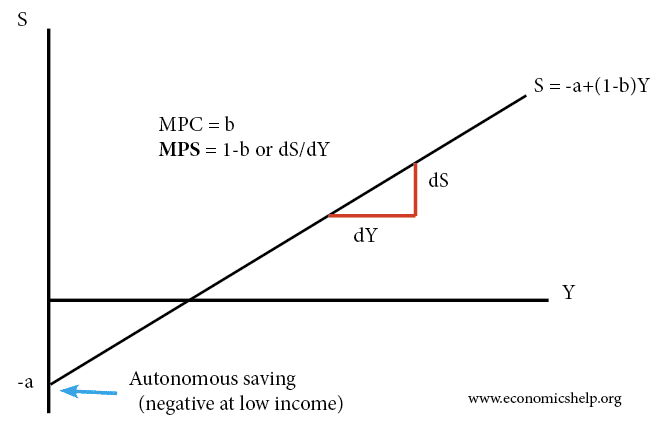

In today's fast-paced financial environment, understanding various economic concepts can give investors and policymakers an edge. This article explores the dynamics of savings behavior, focusing on concepts like Marginal Propensity to Save (MPS), its calculation, and the role of algorithmic trading in shaping investment decisions. MPS plays a crucial role in Keynesian economics, acting as a bellwether for the broader economic behavior of individuals and households. It measures the fraction of additional income that is saved rather than consumed, providing insight into consumer consumption patterns and saving habits. This, in turn, affects aggregate demand and overall economic health.

Algorithmic trading, a facet of modern financial markets, uses automated systems to execute trades. These systems can integrate economic indicators like MPS to refine trading strategies, helping investors navigate market volatility with precision. As financial decisions are increasingly data-driven, the synergy between traditional economic indicators and advanced trading technologies can lead to more effective strategies for individual investors and policymakers alike.



By leveraging knowledge of MPS and embracing sophisticated trading algorithms, stakeholders can better manage portfolios and forecast economic trends. This integration of economic theory with technological advancements underscores the potential for more informed and strategic economic decision-making. Looking forward, understanding these fundamental concepts is not only beneficial but essential for thriving in the evolving financial landscape.

## Table of Contents

## Understanding Savings Behavior

Savings behavior is a fundamental aspect of economic analysis, reflecting the choices individuals make between immediate consumption and future financial security. The decision to save or spend is contingent upon a myriad of factors, including income levels, interest rates, and the broader economic outlook.

Income levels play a pivotal role in determining savings behavior. Generally, as individuals' income increases, their ability to set aside money for savings improves. However, this relationship is often influenced by the marginal propensity to consume, which reflects the portion of additional income that individuals are likely to spend rather than save. Consequently, higher income earners typically exhibit a higher marginal propensity to save, allowing for more significant savings accumulation over time.

Interest rates are another significant determinant of savings behavior. Higher interest rates offer more substantial returns on savings, incentivizing individuals to save more. Conversely, lower interest rates may lead to increased consumption, as the opportunity cost of saving diminishes. This dynamic interaction plays a critical role in shaping economic policies, as central banks adjust interest rates to manage economic growth and inflation.

The economic outlook, encompassing factors such as employment stability, inflation expectations, and economic growth prospects, also affects savings decisions. During periods of economic uncertainty, individuals may increase their savings as a precautionary measure against potential financial instability. This behavior underscores the importance of consumer confidence in driving economic activity and highlights the interconnectedness between savings behavior and economic performance.

The Marginal Propensity to Save (MPS) is a critical indicator in this analysis, providing insights into the proportion of additional income that individuals save. MPS is calculated by the formula:

$$
\text{MPS} = \frac{\Delta S}{\Delta Y}
$$

where $\Delta S$ represents the change in savings, and $\Delta Y$ denotes the change in income. For instance, if an individual receives an additional $1,000 in income and decides to save $200, the MPS would be 0.2. This metric aids economists in understanding consumer responses to shifts in income and guides the formulation of monetary and fiscal policies.

Understanding savings behavior is crucial for forecasting economic trends and designing effective economic policies. By examining the factors influencing savings choices, policymakers can craft strategies that promote economic stability and growth, ultimately benefiting both individuals and the broader economy.

## Marginal Propensity to Save (MPS): Definition and Calculation

Marginal Propensity to Save (MPS) is a fundamental concept in Keynesian economics, capturing the portion of additional income that is set aside as savings rather than spent on consumption. It offers insight into consumer behavior and how individuals adjust their saving habits in response to income changes. The calculation of MPS is straightforward and represented by the equation:

$$
\text{MPS} = \frac{\Delta S}{\Delta Y}
$$

where $\Delta S$ represents the change in savings and $\Delta Y$ the change in income. This formula illustrates how consumers respond to variation in their financial situations. For instance, if an individual receives a $500 increase in income and decides to save $100 of that, the MPS would be calculated as:

$$
\text{MPS} = \frac{100}{500} = 0.2
$$

This indicates that 20% of the additional income is saved while the remaining 80% is consumed. The MPS can also shed light on the saving tendencies across different income groups. Generally, individuals with higher income levels exhibit a greater propensity to save. This is linked to the ability of wealthier individuals to allocate a larger share of their incremental income to savings, primarily because they have already met their basic consumption needs. Conversely, lower-income individuals might prioritize immediate consumption over savings due to pressing financial obligations.

Understanding MPS is important for policymakers and economists as it helps predict the impact of fiscal policies on savings behavior and overall economic activity. As income rises, increasing MPS can potentially lead to greater capital accumulation, influencing investment levels and longer-term economic growth.

## Economic Implications of MPS

The Marginal Propensity to Save (MPS) is a fundamental concept in Keynesian economics, serving as a lens through which macroeconomic behaviors and their implications can be comprehended. MPS's impact on the economy becomes evident through its interplay with the Keynesian multiplier effect, a concept that describes how initial changes in spending lead to a larger overall shift in economic output. A core aspect of this relationship is the reciprocal nature between MPS and the Marginal Propensity to Consume (MPC); they together sum to one.

$$
\text{MPC} + \text{MPS} = 1
$$

The Keynesian multiplier ($k$) is determined using MPC:

$$
k = \frac{1}{1 - \text{MPC}} = \frac{1}{\text{MPS}}
$$

A higher MPS translates into a lower MPC, thereby reducing the multiplier effect. In practical terms, this means that with a high MPS, increases in income lead to smaller increments in spending, causing the subsequent rounds of spending throughout the economy to diminish more quickly. This can slow economic growth, especially vital during downturns when consumer spending drives economic recovery.

Contrarily, a heightened MPS is not universally detrimental. Elevated savings rates augment the pool of financial resources available for investment, bolstering capital markets. This, in turn, supports longer-term economic growth through increased investments in infrastructure, technology, and other sectors crucial for development.

Analysts and policymakers leverage MPS to gauge potential outcomes of fiscal policies, such as tax adjustments. For instance, a reduction in taxes theoretically enhances consumers' disposable income. If MPS is low, the expectation is that much of this additional income will be spent, amplifying the multiplier effect and stimulating economic growth. Conversely, if MPS is high, a significant portion of this income might be saved, resulting in a more subdued impact on immediate economic activity.

Overall, the MPS is a critical variable for economic modeling, allowing economists to predict the effectiveness and consequences of fiscal interventions on consumer behavior and the broader economic environment. Understanding the nuances of MPS ensures that policies can be crafted to balance immediate economic stimuli with sustainable long-term investments.

## Algorithmic Trading: Bridging Traditions and Technology

Algorithmic trading involves utilizing complex computer algorithms to execute trading decisions at speeds and frequencies far beyond human capability. These systems adhere to predetermined criteria concerning aspects such as timing, price, and quantity, effectively leveraging historical data and real-time analytics to optimize trading outcomes. The integration of [algorithmic trading](/wiki/algorithmic-trading) strategies with economic indicators like the Marginal Propensity to Save (MPS) can significantly enhance investment decision-making, providing sophisticated risk assessments and portfolio optimization.

Modern advancements in technology have allowed algorithms to incorporate a wide range of economic indicators, thereby broadening their analytical capabilities. By embedding MPS data into automated trading models, algorithms can assess consumer behavior trends and adjust investment strategies accordingly. For instance, a higher MPS might indicate increased savings behavior, suggesting a potential rise in capital availability for investment in the financial markets. This data-driven insight can facilitate more responsive and informed trading decisions.

Python, as a preferred programming language, offers extensive libraries such as Pandas for data manipulation, NumPy for numerical computations, and SciPy for statistical analysis, enabling the development of robust algorithmic trading systems. A basic implementation might involve using historical MPS data to predict future market trends and executing trades based on these predictions. Here is a simplistic example of how Python could be used to integrate MPS data into a trading strategy:

```python
import pandas as pd
import numpy as np

# Load historical MPS data
mps_data = pd.read_csv('mps_data.csv')

# Simple moving average of MPS
mps_data['MPS_MA'] = mps_data['MPS'].rolling(window=10).mean()

# Basic algorithmic trading strategy
def trading_decision(current_mps, mps_ma):
    if current_mps > mps_ma:
        return "Buy"  # Market could be bullish with increased savings
    elif current_mps < mps_ma:
        return "Sell"  # Market could be bearish with decreased savings
    else:
        return "Hold"

# Test the trading decision function
current_mps = mps_data['MPS'].iloc[-1]
mps_ma = mps_data['MPS_MA'].iloc[-1]

decision = trading_decision(current_mps, mps_ma)
print("Trading Decision:", decision)
```

The code above uses a moving average of MPS data to generate straightforward trading signals, which exemplifies how economic indicators can be operationalized within an algorithmic trading framework. As financial markets continue to evolve, the confluence of traditional economic measures like MPS with cutting-edge algorithmic methodologies is poised to unlock new opportunities and insights for traders and policymakers alike.

## Conclusion

Understanding the relationship between savings behavior, Marginal Propensity to Save (MPS), and algorithmic trading provides a broad perspective on modern economic and investment landscapes. As financial markets grow in complexity, the integration of traditional economic theories with contemporary trading technologies is creating new opportunities for both investors and policymakers. The ability to harmonize these elements is particularly relevant given that economic insights can guide more strategic decision-making processes.

Leveraging the MPS in conjunction with algorithmic trading enables stakeholders to formulate informed strategies that benefit both personal finance management and broader economic policies. By understanding how individuals save out of additional income, MPS offers critical insight into the economic behavior that can inform algorithmic models in trading. These models can then be optimized to reflect savings patterns, ensuring that they are grounded in robust economic principles.

Looking forward, the blend of economic insights with real-time analytics is likely to become increasingly important in navigating financial markets effectively. Algorithmic trading systems, which operate by processing vast amounts of data at unprecedented speeds, are capable of incorporating broader economic indicators such as the MPS. This integration can lead to improved predictive power and effectiveness of trading strategies. As a result, financial markets will benefit from enhanced efficiency and [liquidity](/wiki/liquidity-risk-premium), aiding in the optimal allocation of resources across various sectors.

In the context of increasingly interconnected global economies, the synthesis of these diverse domains will play a crucial role in shaping the future of financial markets. The emphasis on data-driven decision-making, supported by classical economic indicators, highlights the evolving nature of finance where traditional methodologies and cutting-edge technology converge to harness the full potential of market dynamics.

## References & Further Reading

[1]: Keynes, J. M. (1936). ["The General Theory of Employment, Interest, and Money"](https://www.files.ethz.ch/isn/125515/1366_KeynesTheoryofEmployment.pdf). Palgrave Macmillan.

[2]: Samuelson, P. A., & Nordhaus, W. D. (2010). ["Economics"](https://archive.org/details/economics0000samu). McGraw-Hill Education.

[3]: Natenberg, S. (1994). ["Option Volatility and Pricing: Advanced Trading Strategies and Techniques"](https://www.amazon.com/Option-Volatility-Pricing-Strategies-Techniques/dp/0071818774). McGraw-Hill.

[4]: Cartea, A., Jaimungal, S., & Penalva, J. (2015). ["Algorithmic and High-Frequency Trading."](https://assets.cambridge.org/97811070/91146/frontmatter/9781107091146_frontmatter.pdf) Cambridge University Press.

[5]: Varian, H. R. (1992). ["Microeconomic Analysis"](https://archive.org/details/microeconomicana00vari_0). W.W. Norton & Company.

[6]: Aldridge, I. (2013). ["High-Frequency Trading: A Practical Guide to Algorithmic Strategies and Trading Systems"](https://onlinelibrary.wiley.com/doi/pdf/10.1002/9781119203803.fmatter). Wiley.

[7]: King, R. G., & Levine, R. (1993). ["Finance and Growth: Schumpeter Might Be Right"](https://www.isid.ac.in/~tridip/Teaching/DevEco/Readings/07Finance/05King&Levine-QJE1993.pdf). The Quarterly Journal of Economics.

[8]: Khan, M. S., Montiel, P. J., & Haque, N. U. (1990). ["Adjustment with Growth: Relating the Analytical Approaches of the IMF and the World Bank."](https://digitallibrary.un.org/record/100717) World Bank Policy Research Working Papers.

[9]: Jarrow, R. A., & Chatterjea, A. (2019). ["An Introduction to Derivative Securities, Financial Markets, and Risk Management"](https://www.scribd.com/document/686888944/Robert-Jarrow-Arkadev-Chatterjea-An-Introduction-to-Derivative-Securities-Financial-Markets-And-Risk-Management-2nd-Edition-World-Scientific-US). W.W. Norton & Company.