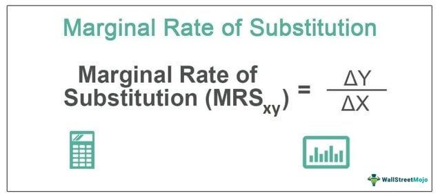

## Table of Contents

## What is the Marginal Rate of Substitution (MRS)?

The Marginal Rate of Substitution (MRS) is a concept in economics that shows how much of one good a person is willing to give up to get more of another good, while keeping the same level of satisfaction. Imagine you have apples and oranges. If you like both, you might be willing to give up some apples to get more oranges. The MRS tells you how many apples you are willing to trade for one more orange.

The MRS is important because it helps economists understand how people make choices. It is based on the idea that people make decisions to maximize their happiness or satisfaction. The MRS usually decreases as you get more of one good. This means that the more oranges you have, the fewer apples you are willing to give up for another orange. This concept is often shown on a graph called an indifference curve, where each point on the curve represents different combinations of goods that give the same level of satisfaction.

## How is the Marginal Rate of Substitution calculated?

The Marginal Rate of Substitution (MRS) is calculated by looking at how much of one good you are willing to give up to get more of another good, while keeping your level of happiness the same. Imagine you have cookies and milk. If you want to get more milk, you might be willing to give up some cookies. The MRS is the number of cookies you are willing to trade for one more glass of milk. To find this, you need to know how much your happiness changes when you get more milk and less cookies.

To calculate the MRS, you use a formula that involves the change in the amount of one good and the change in the amount of the other good. The formula is MRS = - (change in good X) / (change in good Y). For example, if you are willing to give up 2 cookies to get 1 more glass of milk, the MRS would be -2 cookies per glass of milk. The negative sign shows that you are giving up cookies to get more milk. This calculation helps economists understand how people make choices between different goods.

## Why is the MRS important in consumer theory?

The Marginal Rate of Substitution (MRS) is important in consumer theory because it helps us understand how people make choices between different goods. Imagine you are choosing between apples and oranges. The MRS tells us how many apples you are willing to give up to get one more orange, while keeping the same level of happiness. This information is crucial because it shows how people balance their preferences and make trade-offs. By knowing the MRS, economists can predict how changes in prices or income might affect what people buy.

In consumer theory, the MRS is used to draw indifference curves, which are graphs that show all the combinations of goods that give the same level of satisfaction. These curves help economists see how people's preferences change as they get more of one good and less of another. For example, if you have a lot of apples, you might be willing to give up fewer apples to get one more orange than if you had fewer apples. This idea of diminishing MRS helps explain why people's choices change as they consume more of one good. Understanding MRS allows economists to build better models of consumer behavior and predict how people will react to different economic situations.

## Can you explain the concept of diminishing marginal rate of substitution?

The concept of diminishing marginal rate of substitution means that as you get more of one thing, you are willing to give up less of another thing to get even more of it. Imagine you are eating pizza and drinking soda. At first, you might be willing to give up a lot of soda to get one more slice of pizza because you really want that pizza. But as you eat more pizza, you start to want soda more, so you are not willing to give up as much soda for another slice of pizza.

This idea is important because it shows how our preferences change as we consume more of something. If you keep getting more pizza, each additional slice becomes less exciting, so you value it less. That's why the amount of soda you are willing to trade for pizza goes down. This concept helps economists understand how people make choices and how they balance different goods to stay happy.

## How does the MRS relate to the indifference curve?

The Marginal Rate of Substitution (MRS) is closely linked to the indifference curve because it shows how much of one good you are willing to give up to get more of another good while staying on the same indifference curve. Imagine you have cookies and milk. If you want to get more milk, you might be willing to give up some cookies. The MRS is the number of cookies you are willing to trade for one more glass of milk. This trade-off is shown on an indifference curve, which is a line on a graph where every point gives you the same level of happiness. The slope of the indifference curve at any point is the MRS, showing how your willingness to trade changes as you move along the curve.

As you move along the indifference curve, the MRS usually gets smaller. This is called the diminishing marginal rate of substitution. It means that the more milk you have, the fewer cookies you are willing to give up for another glass of milk. This change in MRS is what makes the indifference curve curved instead of a straight line. By understanding the MRS and how it changes, economists can see how people make choices between different goods and how their preferences change as they consume more of one thing and less of another.

## What role does the MRS play in utility maximization?

The Marginal Rate of Substitution (MRS) helps people find the best way to be happy with what they have. Imagine you have cookies and milk. If you want to be as happy as possible, you need to figure out how many cookies you should trade for more milk. The MRS tells you how many cookies you are willing to give up for one more glass of milk while staying just as happy. By using the MRS, you can keep trading until you can't get any happier. This is called utility maximization, where you have the perfect mix of cookies and milk to feel the best.

The MRS is important because it changes as you get more of one thing. At first, you might be willing to give up a lot of cookies for more milk. But as you drink more milk, you start to want cookies more, so you are not willing to give up as many cookies for another glass of milk. This idea of the MRS getting smaller is called diminishing marginal rate of substitution. It helps you find the right balance between cookies and milk to be as happy as you can be. By understanding how the MRS works, you can make better choices and get the most out of what you have.

## How does the MRS change along an indifference curve?

The Marginal Rate of Substitution (MRS) changes along an indifference curve because it shows how much of one thing you are willing to give up to get more of another thing while staying just as happy. Imagine you have cookies and milk. At first, you might be willing to give up a lot of cookies to get one more glass of milk because you really want that milk. But as you drink more milk, you start to want cookies more, so you are not willing to give up as many cookies for another glass of milk. This change in what you are willing to trade is what makes the MRS go down as you move along the indifference curve.

This idea of the MRS getting smaller is called the diminishing marginal rate of substitution. It means that the more you have of one thing, the less you are willing to give up of the other thing to get even more of it. On a graph, this makes the indifference curve bend. The slope of the curve at any point is the MRS, and as you move along the curve, the slope gets less steep. This helps you see how your preferences change and how you can find the best mix of things to be as happy as possible.

## What are the implications of a constant MRS?

If the Marginal Rate of Substitution (MRS) stays the same, it means you are always willing to trade the same amount of one thing for more of another thing. Imagine you have cookies and milk. If the MRS is constant, you might always be willing to give up 2 cookies for one more glass of milk, no matter how many cookies or glasses of milk you already have. This is different from what usually happens, where the more milk you drink, the fewer cookies you want to give up for another glass. A constant MRS makes the indifference curve a straight line on a graph, instead of a curve.

A constant MRS has big effects on how we think about choices and happiness. If the MRS doesn't change, it means your happiness stays the same no matter how you mix the things you have. This is not how people usually feel, because we often want a balance between different things. Economists use the idea of a changing MRS to understand how people make choices and find the best mix of things to be happy. If the MRS is always the same, it's harder to explain why people change their minds about what they want as they get more of one thing and less of another.

## How does MRS differ from the Marginal Rate of Transformation (MRT)?

The Marginal Rate of Substitution (MRS) and the Marginal Rate of Transformation (MRT) are two important ideas in economics, but they look at different things. MRS is about what you are willing to give up to get more of something else, while keeping the same level of happiness. Imagine you have cookies and milk. The MRS tells you how many cookies you are willing to trade for one more glass of milk. It's all about your personal choices and how you feel about different things.

On the other hand, the Marginal Rate of Transformation (MRT) is about how much of one thing a company or economy can make if they stop making something else. It's not about your personal choices but about what is possible to produce. If a factory makes cookies and milk, the MRT tells you how many more glasses of milk they can make if they stop making a certain number of cookies. MRS and MRT help us understand different parts of how choices are made and how things are made.

## Can the MRS be applied to real-world economic decisions?

Yes, the Marginal Rate of Substitution (MRS) can be applied to real-world economic decisions. Imagine you are shopping and deciding between buying more apples or more oranges. The MRS helps you figure out how many apples you are willing to give up to get one more orange, while staying just as happy. This can guide your choices at the store, helping you decide how to spend your money to get the best mix of things you want. For example, if apples are on sale, you might be willing to buy more apples and fewer oranges, because the price change affects how happy you feel about each fruit.

Businesses also use the idea of MRS when they make products. They need to know what people are willing to trade to keep their customers happy. For example, a car company might decide to offer different features in their cars, like better gas mileage or more space. They use MRS to understand how much people value these features and how much they are willing to give up other things to get them. This helps the company design cars that people want to buy, making sure they get the right mix of features to keep their customers happy.

## What are the limitations of using MRS in economic analysis?

Using the Marginal Rate of Substitution (MRS) in economic analysis has some limits. One big problem is that it assumes people always know exactly how much they want of different things and how happy each thing makes them. But in real life, people often don't know this for sure. They might change their minds or not be sure about what they want. Also, MRS works best when you can easily trade one thing for another, but sometimes things are not so easy to trade. For example, you can't easily trade time for money, so MRS might not help much in those cases.

Another limit is that MRS doesn't always work well when things are not perfect substitutes. If you can't easily switch between apples and oranges because they are too different, MRS might not be very useful. Also, MRS assumes that people's happiness stays the same when they trade things, but in real life, people's feelings can change a lot. For example, if you are really hungry, you might value food more than usual, so the MRS might not be a good guide for your choices. These limits mean that while MRS can help us understand some choices, it doesn't work perfectly for all situations.

## How do economists measure and interpret changes in MRS over time?

Economists measure changes in the Marginal Rate of Substitution (MRS) over time by looking at how people's choices change. They might do surveys or studies to see how much people are willing to trade one thing for another at different times. For example, if people start buying more apples and fewer oranges, economists can figure out how the MRS has changed. They can also use data from markets to see how prices and what people buy change over time, which helps them understand how the MRS is shifting.

Interpreting these changes in MRS can tell economists a lot about how people's preferences and the economy are changing. If the MRS for apples and oranges goes down over time, it might mean that people are getting used to having more apples and don't want to give up as many oranges for them anymore. This could happen because of changes in tastes, new products coming out, or even changes in prices. By understanding these shifts, economists can predict how people will react to new products or changes in the economy, helping them make better models and policies.

## What is the Understanding of Marginal Rate of Substitution (MRS)?

The Marginal Rate of Substitution (MRS) is a pivotal concept in the field of economics, underscoring the decision-making process of consumers when choosing between different goods. It quantifies the amount of one good a consumer is willing to forego to obtain an additional unit of another good, all while maintaining a constant level of satisfaction, or utility. This concept is fundamental for comprehending how consumers prioritize their needs and make choices that maximize their wellbeing.

MRS can be mathematically expressed as the negative of the slope of the indifference curve, a graphical representation of different combinations of two goods that provide the same level of utility to the consumer. The formula for MRS is given by:

$$
MRS = -\frac{dY}{dX} = \frac{MUx}{MUy}
$$

where $MUx$ and $MUy$ are the marginal utilities of goods X and Y, respectively, and $\frac{dY}{dX}$ is the rate at which the consumer is willing to substitute good Y for good X. The negative sign indicates the trade-off between the two goods.

Indifference curves are convex to the origin, embodying the principle of diminishing marginal rate of substitution. This principle posits that as a consumer continues to substitute one good for another, the willingness to continue substituting diminishes. For instance, if a person has a large quantity of apples and very few oranges, they are likely to give up several apples for just one more orange. However, as they acquire more oranges, the number of apples they are willing to trade for additional oranges decreases.

Understanding MRS enables economists and businesses to analyze consumer behavior and preferences. It provides insights into how consumers might respond to changes in prices or income, allowing businesses to tailor their offerings to meet consumer demands better. Recognizing these consumption choices and satisfaction levels can lead to more effective marketing strategies and product development, ultimately enhancing consumer satisfaction and firm profitability.

## What is the MRS Formula and how is it calculated?

The Marginal Rate of Substitution (MRS) is a key concept in consumer choice theory, which quantifies the rate at which a consumer is willing to exchange units of one good for another, maintaining the same level of overall satisfaction or utility. Mathematically, the formula for MRS is expressed as the ratio of the marginal utility of good X (MUx) to the marginal utility of good Y (MUy):

$$
\text{MRS} = \frac{\text{MUx}}{\text{MUy}}
$$

This ratio reflects the trade-offs consumers make when choosing between two goods. Marginal utility measures the additional satisfaction gained from consuming an extra unit of a particular good. Therefore, MRS indicates how much of good Y a consumer is willing to forgo to obtain an additional unit of good X without changing their overall utility level.

Understanding the calculation of MRS is crucial for analyzing consumer behavior, especially in deciphering how consumers adjust their consumption patterns in response to changes in prices or the quality of goods. When the price of a good changes, the marginal utility per dollar spent, i.e., the utility gained from each unit of currency expended, also changes, influencing the consumer's decisions about how much of each good to consume. 

For example, if the quality of good X improves, leading to an increase in its marginal utility, the consumer's willingness to substitute good Y for additional units of good X might increase, consequently increasing the MRS. This relationship can be visualized using indifference curves, where the MRS at any point on the curve is indicated by the slope of the tangent line.

Moreover, real-world applications often illustrate MRS through scenarios like a consumer choosing between different quantities of coffee and tea. Suppose the initial MRS is such that a consumer is willing to give up 2 cups of tea for 1 additional cup of coffee (MRS = 2/1). If the price of coffee decreases, making it relatively cheaper, the consumer might be more inclined to substitute coffee for tea, altering the MRS in their decision-making process.

In summary, the MRS formula provides insights into consumer preferences and the decisions they make when faced with changes in economic variables, such as price and quality, highlighting the trade-offs inherent in consumption choices.

## References & Further Reading

[1]: Varian, H. R. (1992). ["Microeconomic Analysis"](https://archive.org/details/microeconomicana0000vari_g1b1). W.W. Norton & Company.

[2]: Katz, J. O., & McCormick, D. L. (2000). ["The Encyclopedia of Trading Strategies"](https://archive.org/details/encyclopediaoftr0000katz). McGraw-Hill.

[3]: Mas-Colell, A., Whinston, M. D., & Green, J. R. (1995). ["Microeconomic Theory"](https://archive.org/details/microeconomic-theory-mas-colell-whinston-green-1995). Oxford University Press.

[4]: Friedman, M. (1953). ["Essays in Positive Economics"](https://en.wikipedia.org/wiki/Essays_in_Positive_Economics). University of Chicago Press.

[5]: Hull, J. C. (2017). ["Options, Futures, and Other Derivatives"](https://www.semanticscholar.org/paper/Options%2C-Futures%2C-and-Other-Derivatives-Hull/89bdee500c8623864fc9eb7a471546aa713acc44). Pearson.