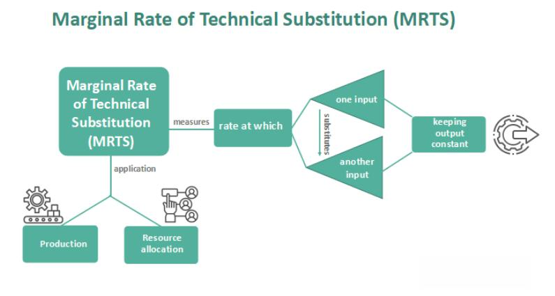

## Table of Contents

## What is the Marginal Rate of Technical Substitution (MRTS)?

The Marginal Rate of Technical Substitution (MRTS) is a concept in economics that shows how one input can be swapped for another while keeping the same level of output. Imagine you are making cookies and you use flour and sugar. MRTS tells you how much sugar you can reduce if you add a bit more flour, without changing the number of cookies you make.

In a factory setting, if you want to produce the same amount of goods, MRTS helps you decide how to adjust the amounts of labor and machinery. For example, if you have too many workers and not enough machines, you might use MRTS to figure out how many workers you can replace with one more machine, keeping production steady. This helps businesses use their resources more efficiently.

## How is MRTS calculated?

MRTS is calculated by looking at how much you can change one input while keeping the output the same. Imagine you're making pizzas and you use cheese and sauce. If you want to use less cheese, you need to figure out how much more sauce you need to keep the pizzas tasting the same. The formula for MRTS is the ratio of the marginal product of one input to the marginal product of the other input. So, if you're looking at cheese and sauce, it's the marginal product of sauce divided by the marginal product of cheese.

The marginal product is how much more output you get from using a little bit more of an input. For example, if adding one more ounce of cheese makes 2 more pizzas, the marginal product of cheese is 2 pizzas per ounce. If adding one more ounce of sauce makes 1 more pizza, the marginal product of sauce is 1 pizza per ounce. So, the MRTS of cheese for sauce would be 1 (the marginal product of sauce) divided by 2 (the marginal product of cheese), which equals 0.5. This means you can replace one ounce of cheese with half an ounce of sauce and still make the same number of pizzas.

## Why is MRTS important in production theory?

MRTS is important in production theory because it helps businesses figure out the best way to use their resources. Imagine you're making sandwiches and you use bread and ham. MRTS tells you how much ham you can swap for bread while still making the same number of sandwiches. This is useful because it helps you decide if it's better to buy more bread or more ham, depending on their prices. If bread is cheaper, you might use more bread and less ham, saving money while keeping your sandwich production the same.

Understanding MRTS also helps businesses stay efficient. If a factory uses machines and workers to make toys, MRTS can show how many workers can be replaced by one more machine without changing the number of toys made. This is important for planning and making sure the factory runs smoothly. By knowing the MRTS, a business can adjust its use of inputs to keep costs low and production high, which is key to staying competitive in the market.

## Can you explain the concept of isoquants in relation to MRTS?

Isoquants are curves that show all the different combinations of inputs that can produce the same amount of output. Imagine you're making lemonade and you use lemons and sugar. An isoquant would show all the ways you can mix lemons and sugar to make the same amount of lemonade. For example, you might use a lot of lemons and a little sugar, or a lot of sugar and a few lemons, but as long as you're on the same isoquant, you'll make the same amount of lemonade.

The Marginal Rate of Technical Substitution (MRTS) is related to isoquants because it shows the rate at which you can swap one input for another while staying on the same isoquant. If you're on an isoquant and you want to use less sugar, MRTS tells you how many more lemons you need to add to keep making the same amount of lemonade. The slope of the isoquant at any point is the MRTS at that point. So, if you're making lemonade, the slope of the isoquant tells you how much you can change your mix of lemons and sugar without changing how much lemonade you make.

## How does MRTS relate to the production function?

MRTS is closely tied to the production function, which is a way to show how much output you can make with different amounts of inputs. Think of a production function like a recipe for making cookies. It tells you how many cookies you can bake with different amounts of flour and sugar. MRTS comes into play when you want to change the recipe a bit but still make the same number of cookies. If you want to use less sugar, MRTS tells you how much more flour you need to add to keep the cookies tasting the same.

In a factory, the production function might show how many cars you can make with different amounts of workers and machines. MRTS helps you figure out how to adjust these inputs without changing how many cars you make. For example, if you want to use fewer workers, MRTS tells you how many more machines you need to keep the car production the same. This is important because it helps businesses use their resources in the best way possible, keeping costs down and production steady.

## What does a constant MRTS indicate about the production process?

A constant MRTS means that the rate at which you can swap one input for another stays the same no matter how much you have of each input. Imagine you're making smoothies and you use bananas and strawberries. If the MRTS is constant, it means you can always replace one banana with the same number of strawberries, no matter how many bananas and strawberries you already have. This makes planning easier because the trade-off between inputs doesn't change.

In a factory, a constant MRTS suggests that the production process is very predictable. If you're making toys and you use plastic and paint, a constant MRTS means you can always replace a certain amount of plastic with the same amount of paint, keeping the number of toys the same. This kind of production process is easier to manage because you know exactly how changes in inputs will affect your output.

## How does MRTS change as you move along an isoquant?

As you move along an isoquant, the MRTS usually changes. Imagine you're making pizza and you use cheese and sauce. At first, if you have a lot of cheese and a little sauce, adding a bit more sauce might let you use a lot less cheese. But as you keep adding more sauce and using less cheese, it gets harder to keep making the same number of pizzas. So, the MRTS, which is how much cheese you can swap for sauce, gets smaller. This means you need more and more sauce to replace the same amount of cheese.

This change in MRTS happens because the inputs are not perfect substitutes. In the pizza example, too much sauce can make the pizza soggy, so you can't just keep adding sauce to replace cheese. The shape of the isoquant shows this change. If the isoquant curves a lot, it means the MRTS is changing a lot as you move along it. If it's straighter, the MRTS might stay more constant. Understanding how MRTS changes helps businesses plan how to use their inputs to keep production steady and efficient.

## What factors can affect the MRTS in a production process?

The MRTS in a production process can change because of the way different inputs work together. For example, if you're making cookies and you use flour and sugar, how much you can swap one for the other depends on the recipe. If you start with a lot of flour and a little sugar, adding more sugar might let you use less flour. But as you keep adding sugar, you can't keep reducing flour as easily because the cookies might not hold together. So, the MRTS changes because the inputs aren't perfect substitutes.

Another factor that affects MRTS is the technology used in production. If a factory uses new machines that work better with fewer workers, the MRTS between machines and workers will change. For example, if a new machine can do the work of two workers, the MRTS will be higher because you can replace more workers with one machine. This means the factory can adjust its use of machines and workers to keep production the same but use resources more efficiently.

## How does the concept of diminishing MRTS impact production decisions?

The idea of diminishing MRTS means that as you keep swapping one input for another, it gets harder to keep making the same amount of stuff. Imagine you're making sandwiches with bread and ham. At first, if you have a lot of bread and a little ham, you can use less bread by adding more ham. But as you keep adding ham, you can't keep reducing bread as easily because the sandwiches might fall apart. This makes it harder to keep the number of sandwiches the same. So, businesses have to think carefully about how they use their inputs. They might start by using more of the cheaper input, but as the MRTS gets smaller, they need to find a balance to keep costs down and production steady.

This concept of diminishing MRTS helps businesses make better choices about how to use their resources. If a factory makes toys and uses plastic and paint, they might start by using more plastic and less paint. But as they keep adding plastic, they can't keep reducing paint as easily because the toys might not look good. So, the factory needs to figure out the best mix of plastic and paint to keep making the same number of toys without wasting resources. Understanding how MRTS changes helps businesses plan and stay efficient, which is important for staying competitive in the market.

## Can you compare MRTS to the Marginal Rate of Substitution (MRS) in consumer theory?

MRTS and MRS are both about swapping things, but they work in different areas. MRTS is used in production and shows how businesses can swap one input, like workers, for another, like machines, while keeping the same level of output. For example, if a factory makes toys, MRTS tells them how many workers they can replace with one more machine and still make the same number of toys. It's all about keeping production steady while using resources in the best way possible.

MRS, on the other hand, is used in consumer theory and shows how people can swap one good for another while keeping the same level of happiness. Imagine you like apples and bananas. MRS tells you how many apples you can give up to get one more banana and still feel just as happy. It's all about keeping your satisfaction the same while choosing between different things you like. Both MRTS and MRS help with making choices, but MRTS is about making things efficiently, and MRS is about enjoying things happily.

## How can firms use MRTS to optimize their input combinations?

Firms can use MRTS to figure out the best way to mix their inputs, like workers and machines, to make things as cheaply as possible while keeping the same level of production. Imagine a factory that makes cars. They might start with a lot of workers and a few machines. By looking at the MRTS, they can see how many workers they can replace with one more machine and still make the same number of cars. If machines are cheaper than workers, they might decide to use more machines and fewer workers to save money. This helps the factory use its resources in the best way possible.

As the factory keeps changing its mix of workers and machines, the MRTS will change too. At first, adding one more machine might let them replace a lot of workers. But as they keep adding machines, it gets harder to keep making the same number of cars because machines can't do everything workers can. So, the factory needs to find the right balance. By understanding how MRTS changes, they can keep adjusting their inputs until they find the mix that keeps costs low and production high. This way, they can stay competitive and make the most of what they have.

## What are some advanced mathematical models used to analyze MRTS in complex production scenarios?

In more complex production scenarios, firms might use advanced mathematical models like the Cobb-Douglas production function to analyze MRTS. The Cobb-Douglas function is a way to show how different amounts of inputs, like labor and capital, can make different amounts of output. It's like a recipe that tells you how much you can make with different mixes of ingredients. By using this function, firms can figure out the MRTS at different points, which helps them see how much they can swap one input for another while keeping production the same. This model is useful because it can handle a lot of different situations and still give clear answers about how to use resources efficiently.

Another model that firms might use is the Translog production function. This model is more flexible than the Cobb-Douglas function and can handle even more complex relationships between inputs. It's like a more detailed recipe that can account for all sorts of changes in how inputs work together. With the Translog function, firms can calculate the MRTS at any point and see how it changes as they use more or less of different inputs. This helps them make better decisions about how to adjust their mix of inputs to keep costs down and production steady, even in really complicated production processes.

## What is the Understanding of Marginal Rate of Technical Substitution (MRTS)?

The Marginal Rate of Technical Substitution (MRTS) serves as a cornerstone in production economics, effectively demonstrating the rate at which businesses can substitute various inputs while maintaining a constant level of output. MRTS is predominantly concerned with optimizing the combination of labor and capital, ultimately pursuing production efficiency and cost effectiveness.

MRTS is calculated by determining the rate at which one input can replace another, without altering the total output. Mathematically, it is expressed by the negative of the slope of an isoquant: 

$$
\text{MRTS}_{LK} = -\frac{dK}{dL} \bigg|_{Q=Q_0} = \frac{MP_L}{MP_K}
$$

Where $\text{MRTS}_{LK}$ denotes the marginal rate of technical substitution of labor (L) for capital (K), $dK/dL$ is the derivative of capital with respect to labor along the isoquant, and $MP_L$ and $MP_K$ represent the marginal products of labor and capital, respectively. This equation underscores that the MRTS between two inputs equals the ratio of their marginal products.

Incorporating MRTS into production decision-making is vital for businesses that aim to achieve optimal resource allocation. Isoquants, which map out various input combinations that yield the same output level, play a crucial role here. By analyzing isoquants, a firm can identify the most efficient input mix to produce the desired output. Isoquants that are closer to the origin represent lower levels of production, while those farther away signify higher outputs. The shape and spacing of isoquants provide insights into the substitutability of inputs and the returns to scale.

A thorough grasp of MRTS not only enables firms to evaluate the trade-off between labor and capital but also guides them in minimizing costs without sacrificing output levels. This strategic approach is crucial in competitive markets where efficiency can be synonymous with enhanced profitability and market adaptability. Understanding and applying MRTS can lead to significant improvements in production methodologies, ensuring resource optimization and cost-effective operations.

## What is the role of technical substitution in production economics?

Technical substitution in production economics relates to the practice of replacing one input with another to achieve cost reductions and enhance efficiency in production processes. This approach is crucial as firms strive to optimize resource utilization and maintain competitiveness in their operations.

**Factors Influencing Technical Substitution**

Technological advancement plays a pivotal role in facilitating technical substitution. As technology progresses, new methods and machinery become available, offering more efficient ways to produce goods and services. For instance, automation technology can reduce the reliance on manual labor, potentially lowering production costs and increasing output. The characteristics of inputs also significantly affect the degree of substitution. Inputs that are more flexible and easily replaceable tend to have higher substitution potential. For example, electricity can often substitute for manual labor or fossil fuels in certain production processes, depending on cost and availability.

**Diminishing MRTS and Input Balancing**

The principle of diminishing Marginal Rate of Technical Substitution (MRTS) is key for firms to balance inputs such as labor and capital. MRTS describes the rate at which a firm can substitute one input for another while keeping the output constant. Formally, if we consider two inputs, $L$ (labor) and $K$ (capital), MRTS is expressed as:

$$

MRTS_{LK} = -\frac{dK}{dL} = \frac{MP_L}{MP_K} 
$$

where $MP_L$ and $MP_K$ are the marginal products of labor and capital, respectively. As more of one input is used, while reducing the other, the additional output gained from the substitute input tends to decrease, illustrating diminishing MRTS. This concept aids firms in determining the most effective combination of labor and capital to minimize costs without sacrificing production levels.

**Strategic Decision-Making with MRTS**

Businesses employ MRTS as a strategic tool to make informed decisions about resource allocation. By understanding the trade-offs between different inputs, firms can identify which substitutions lead to cost reductions and improved efficiencies. For example, if a firm determines that the MRTS between labor and capital is decreasing sharply, it might indicate that further substitution of labor with capital becomes less beneficial, prompting a reevaluation of resource deployment strategies.

In practical terms, businesses can use mathematical modeling and data analysis to assess potential substitutions. Tools such as scenario analysis and optimization algorithms help identify optimal input combinations that achieve desired production outcomes at minimum cost. Python, with packages like NumPy and SciPy, can be employed to simulate various scenarios and calculate MRTS for effective decision-making. Here’s a simple Python example calculating MRTS:

```python
def calculate_MRTS(MP_L, MP_K):
    return MP_L / MP_K

# Example marginal products
MP_L = 50  # Marginal Product of Labor
MP_K = 100 # Marginal Product of Capital

marginal_rate_ts = calculate_MRTS(MP_L, MP_K)
print("MRTS between labor and capital:", marginal_rate_ts)
```

By continuously assessing MRTS and exploring technical substitution options, businesses can maintain flexibility and responsiveness in their production processes, ensuring sustained competitive advantage.

## How can Algorithmic Trading leverage Economic Principles?

Algorithmic trading relies extensively on mathematical models and economic principles to execute trades at optimal times based on predefined criteria. This sophistication allows traders to harness data for making informed decisions with minimal human intervention, enhancing efficiency and precision. In particular, the integration of the Marginal Rate of Technical Substitution (MRTS) in trading algorithms is instrumental in responding adeptly to market changes. 

### Economic Principles in Algorithmic Trading

Algorithmic trading systems leverage economic theories, such as MRTS, to assess the relative efficiencies of various asset allocations. In economics, MRTS is defined as the rate at which one input (e.g., labor) can be substituted for another (e.g., capital) while maintaining the same level of output. By applying similar logic, trading algorithms are designed to assess and adjust the allocation of financial assets in a portfolio, maximizing returns and minimizing risks. 

For example, an algorithm can model the trade-off between different financial instruments, akin to substituting inputs, to maintain a desired level of portfolio performance:

$$
\text{MRTS} = -\frac{\Delta x_1}{\Delta x_2}
$$

In this context, $\Delta x_1$ and $\Delta x_2$ would represent the changes in asset classes, reflecting shifts in asset allocation strategies.

### Benefits of Automation 

Automation in trading not only increases operational efficiency but also substantially reduces the possibility of human error. By executing trades at high speeds based on real-time market data, [algorithmic trading](/wiki/algorithmic-trading) systems can consistently outperform manual trading methods. Enhanced computational power and sophisticated algorithms enable these systems to process vast amounts of data, translating to optimized deployment of financial resources.

### Technological Advancements and Integration

The importance of algorithmic trading has surged, driven largely by advances in technology and its seamless integration of economic concepts. The use of [machine learning](/wiki/machine-learning) and [artificial intelligence](/wiki/ai-artificial-intelligence) in these systems facilitates the development of models that can predict market trends based on historical data and current market conditions. Such advancements have not only expanded the capabilities of algorithmic trading but also made it indispensable in modern financial markets. 

In conclusion, algorithmic trading represents a critical intersection between economic theory and technological innovation, utilizing principles like MRTS to optimize trading strategies and respond to dynamic market conditions effectively.

## What are the synergies between MRTS and Algorithmic Trading?

The integration of Marginal Rate of Technical Substitution (MRTS) principles into algorithmic trading seeks to enhance decision-making processes by effectively predicting and responding to market dynamics. MRTS, which is central to production economics, provides a framework for understanding trade-offs between different inputs in maintaining an optimal output level. In the context of trading, this can translate into the strategic substitution of variables used in trading algorithms to optimize performance.

Algorithmic trading involves the use of mathematical models to execute trades based on predefined criteria and market conditions. By incorporating MRTS principles, these algorithms can be designed to adjust dynamically to changes in market inputs, analogous to how a producer would adjust labor and capital to maintain production efficiency. For instance, consider a trading algorithm that uses multiple input factors, such as market [volatility](/wiki/volatility-trading-strategies), interest rates, and historical price data. The algorithm can be engineered to substitute one input [factor](/wiki/factor-investing) with another based on real-time data, maintaining an optimal trading strategy akin to the balance maintained in the MRTS framework.

Understanding trade-offs and input efficiencies is crucial in constructing predictive models that accurately forecast market behavior. This involves calculating the MRTS, typically expressed as:

$$
MRTS = \frac{\Delta K}{\Delta L} = -\frac{MP_L}{MP_K}
$$

where $\Delta K$ and $\Delta L$ are changes in input quantities, and $MP_L$ and $MP_K$ are the marginal products of labor and capital, respectively. In trading, this formula can be adapted to evaluate the rate at which one market input can successfully replace another without affecting trading performance. For example, if interest rates become unfavorable, the algorithm might increase reliance on volatility metrics to achieve similar predictive accuracy.

Python, a popular language in algorithmic trading, can be utilized to implement these concepts. Below is a simple outline of how one might begin coding an algorithm that adjusts input weights based on MRTS principles:

```python
# Example of a basic structure implementing MRTS principles in algorithmic trading
import numpy as np

class TradingAlgorithm:
    def __init__(self, vol_weight=0.5, rate_weight=0.5):
        self.vol_weight = vol_weight
        self.rate_weight = rate_weight

    def calculate_marginal_product(self, vol, rates):
        mp_vol = np.var(vol)
        mp_rates = np.var(rates)
        return mp_vol, mp_rates

    def adjust_weights(self, vol, rates):
        mp_vol, mp_rates = self.calculate_marginal_product(vol, rates)

        # Assumes a simple linear adjustment based on MRTS
        mrt = -mp_vol / mp_rates
        self.vol_weight = max(0, self.vol_weight + mrt)
        self.rate_weight = max(0, self.rate_weight - mrt)

        # Normalize weights to ensure they sum to 1
        total_weight = self.vol_weight + self.rate_weight
        self.vol_weight /= total_weight
        self.rate_weight /= total_weight

    def trade_decision(self, vol, rates):
        self.adjust_weights(vol, rates)
        # Implement further logic for making trade decisions
        pass

# Example usage
algorithm = TradingAlgorithm()
volatility_data = [0.2, 0.3, 0.5]  # Example data
interest_rate_data = [0.01, 0.02, 0.015]  # Example data

algorithm.trade_decision(volatility_data, interest_rate_data)
print(algorithm.vol_weight, algorithm.rate_weight)
```

Incorporating MRTS into trading algorithms not only enhances their adaptability but also embeds a level of economic intuition that can potentially forecast trading outcomes more accurately. Adopting such a hybrid approach, merging economic theories with technology, offers a powerful strategy for navigating the complexities of modern financial markets.

## What are some real-world applications and case studies?

The integration of the Marginal Rate of Technical Substitution (MRTS) in real-world applications is evident across various sectors, where it informs production practices and enhances trading strategies. Understanding its practical utilization provides critical insights into optimizing processes and executing precise economic decisions.

**Case Study 1: Optimizing Production in Manufacturing Industries**

Manufacturing industries often face the challenge of maximizing output while minimizing costs. By applying MRTS, companies can strategically substitute labor for capital or vice versa, according to prevailing economic conditions and resource availability. For example, consider a factory producing widgets. If the cost of labor increases, the firm might substitute expensive labor with automated machinery, provided the MRTS between labor (L) and capital (K) is favorable. The goal is to maintain the same level of output (Q), defined by the isoquant:

$$
Q = f(L, K)
$$

In practice, this can be calculated by setting:

$$
MRTS_{LK} = -\frac{\Delta K}{\Delta L} = \frac{MP_L}{MP_K}
$$

where $MP_L$ and $MP_K$ represent the marginal products of labor and capital, respectively. This equation aids firms in deciding how to adjust input combinations efficiently.

**Case Study 2: Algorithmic Trading in Financial Markets**

Algorithmic trading leverages economic principles such as MRTS to refine trading algorithms that automatically execute buy or sell orders. For instance, consider a trading algorithm that balances different market signals (inputs). Some signals might be based on economic indicators, while others are derived from technical analysis. By evaluating the MRTS between these inputs, traders can optimize the signal mix to enhance performance, especially under changing market conditions.

**Successes and Failures in Technical Substitution Across Industries**

1. **Success in the Automotive Sector:**

   The automotive industry has successfully implemented technical substitution by shifting towards automation to combat rising labor costs. The MRTS concept has guided these strategies, enabling firms to maintain output levels while enhancing production efficiency. The integration of robotic technology in assembly lines is a classic example, allowing manufacturers to substitute labor with capital effectively.

2. **Challenges in the Textile Industry:**

   Conversely, the textile industry has encountered challenges in technical substitution due to the high variability in output quality based on input changes. Here, the MRTS approach has sometimes led to lower-than-expected efficiency gains when substituting traditional labor with automated systems, underlining the importance of understanding input quality alongside quantity.

**Combining Economic Theory with Algorithmic Approaches**

The convergence of economic theory and algorithmic approaches offers substantial advantages. For instance, trading algorithms informed by MRTS enable precise calibration of market factor inputs to enhance decision-making and risk management. A Python snippet demonstrating how MRTS could influence trading decisions might resemble:

```python
def calculate_mrts(mp_labor, mp_capital):
    return mp_labor / mp_capital

mp_labor = 0.8
mp_capital = 0.6
mrts = calculate_mrts(mp_labor, mp_capital)
if mrts > 1:
    print("Favor capital substitution")
else:
    print("Favor labor substitution")
```

This simple function provides a framework for dynamically adjusting trading strategies based on the calculated MRTS, ensuring that algorithms can adapt to the changing economic landscape.

In conclusion, the effective application of MRTS and the insights drawn from exploring case studies highlight the necessity for businesses to strategically integrate economic theory with modern technological methods, thereby fostering innovation and enhancing efficiency across industries.

## References & Further Reading

[1]: Varian, H. R. (1992). ["Microeconomic Analysis."](https://archive.org/details/microeconomicana0000vari_g1b1) W. W. Norton & Company.

[2]: Pindyck, R. S., & Rubinfeld, D. L. (2012). ["Microeconomics."](https://archive.org/details/microeconomics0007pind) Prentice Hall.

[3]: Goldberg, D. E., Deb, K. (1991). ["A Comparative Analysis of Selection Schemes Used in Genetic Algorithms."](https://www.sciencedirect.com/science/article/pii/B9780080506845500082) In Foundations of Genetic Algorithms.

[4]: Jarrow, R. A., & Chatterjea, A. (2013). ["An Introduction to Derivative Securities, Financial Markets, and Risk Management."](https://www.scribd.com/document/686888944/Robert-Jarrow-Arkadev-Chatterjea-An-Introduction-to-Derivative-Securities-Financial-Markets-And-Risk-Management-2nd-Edition-World-Scientific-US) W. W. Norton & Company.

[5]: Hull, J. C. (2017). ["Options, Futures, and Other Derivatives."](https://www.semanticscholar.org/paper/Options%2C-Futures%2C-and-Other-Derivatives-Hull/89bdee500c8623864fc9eb7a471546aa713acc44) Prentice Hall.

[6]: MacKenzie, D. (2006). ["An Engine, Not a Camera: How Financial Models Shape Markets."](https://academic.oup.com/mit-press-scholarship-online/book/20588) MIT Press.

[7]: Lintner, J. (1965). ["The Valuation of Risk Assets and the Selection of Risky Investments in Stock Portfolios and Capital Budgets."](https://www.jstor.org/stable/1924119) The Review of Economics and Statistics.