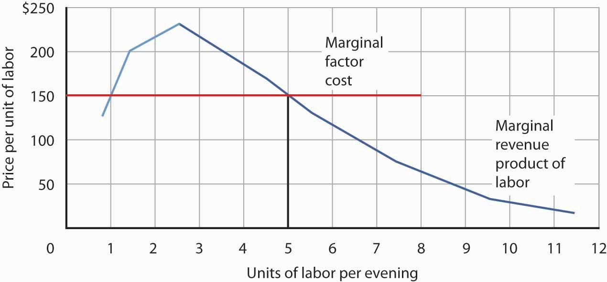

## Table of Contents

## What is marginal revenue product (MRP)?

Marginal revenue product (MRP) is the extra revenue a business earns when it adds one more unit of a resource, like a worker or a machine. It helps businesses figure out if it's worth hiring more workers or buying more machines. To find MRP, you multiply the extra output from the new resource by the price of the product. If a new worker makes 10 more widgets and each widget sells for $2, the MRP of that worker is $20.

Understanding MRP is important for businesses because it helps them make smart decisions about how to grow. If the MRP of hiring another worker is higher than the cost of hiring them, it makes sense to hire more. But if the cost is higher than the MRP, it might be better to not hire more. This way, businesses can use their resources in the best way possible to make more money.

## How is marginal revenue product calculated?

Marginal revenue product (MRP) is figured out by multiplying two things: the extra output that comes from adding one more unit of a resource, and the price of the product being sold. For example, if hiring one more worker allows a company to make 5 more gadgets and each gadget sells for $10, then the MRP of that worker is $50. This calculation helps businesses see if it's a good idea to add more resources, like workers or machines.

Using MRP is important because it tells businesses if the extra money they make from adding a resource is worth the cost. If the MRP is higher than the cost of the resource, it makes sense to add it. But if the cost is more than the MRP, it might not be a good idea. This helps companies make smart choices about how to use their money and grow their business.

## Why is MRP important for businesses?

MRP is important for businesses because it helps them decide if it's a good idea to add more workers or machines. By figuring out the MRP, a business can see if the extra money they make from adding a resource is more than what it costs. If the MRP is higher than the cost, it makes sense to add the resource. But if the cost is more than the MRP, it might not be worth it. This helps businesses use their money wisely and grow in the best way possible.

Understanding MRP also helps businesses plan for the future. If they know that adding more resources will bring in more money, they can make plans to hire more workers or buy more machines. This can help them stay ahead of their competition and keep making more money. By using MRP, businesses can make smart choices that help them succeed and grow over time.

## What factors influence the marginal revenue product of labor?

The marginal revenue product of labor is influenced by how much more a worker can produce and the price of what they make. If a worker can make a lot more stuff, their MRP goes up. Also, if the price of the product goes up, the MRP goes up too. For example, if a new worker can make 10 more widgets and each widget sells for $2, their MRP is $20. But if the price of widgets goes up to $3, the MRP becomes $30.

Other things can affect MRP too, like how well the worker is trained or how good the tools and machines are. If workers have better training or use better equipment, they can make more, which makes their MRP higher. Also, the demand for the product matters. If more people want to buy the product, the price might go up, which would increase the MRP. So, MRP depends on a mix of how much a worker can do, the price of the product, and other things like training and demand.

## How does MRP relate to the demand for labor?

MRP is really important when it comes to how much workers a business wants to hire. It's like a guide that tells businesses if it's a good idea to hire more people. If hiring a new worker will bring in more money than it costs to hire them, then the business will want to hire more workers. This is because the MRP shows how much extra money the business can make from each new worker. So, the demand for labor goes up when the MRP is high.

On the other hand, if the MRP is low, businesses might not want to hire more workers. If the extra money they make from a new worker is less than what it costs to hire them, it doesn't make sense to add more people. This means the demand for labor goes down when the MRP is low. So, MRP helps businesses decide how many workers to hire based on how much money they can make from them.

## Can you explain the concept of diminishing marginal returns in relation to MRP?

Diminishing marginal returns is a concept that says as you add more of something, like workers, the extra benefit you get from each new worker starts to get smaller. In terms of MRP, this means that as you hire more workers, each new worker might not bring in as much extra money as the ones before them. For example, if you have a small factory and you hire one more worker, they might make a lot more products. But if you keep hiring more and more workers, they might start getting in each other's way, and the extra products each new worker makes will be less and less.

This is important for businesses to understand because it affects their decisions about hiring. If the MRP starts to go down because of diminishing marginal returns, it might not be worth hiring more workers. The cost of hiring someone new might be more than the extra money they bring in. So, businesses need to find the right number of workers where the MRP is still high enough to make hiring them a good idea.

## What are the limitations of using MRP in decision-making?

Using MRP to make decisions can be helpful, but it has some limits. One big problem is that MRP assumes that the price of the product stays the same no matter how much you make. But in real life, if you make a lot more of something, you might have to lower the price to sell it all. This means the MRP could be less than what you thought, and hiring more workers might not be as good of an idea as you thought.

Another limit is that MRP doesn't think about things like how happy workers are or how well they work together. If you hire too many people, they might get in each other's way and not work as well. Also, MRP doesn't take into account other costs like training new workers or buying more machines. So, while MRP can give you a good idea of how much money you might make, it doesn't tell the whole story about all the costs and benefits of hiring more people.

## How can MRP be used to predict future hiring needs?

MRP can help businesses guess how many more workers they might need in the future. By looking at the MRP of their current workers, a business can see if hiring more people will bring in more money than it costs. If the MRP is high, it means that adding more workers could be a good idea. So, if a business sees that their MRP is going up, they might plan to hire more people to keep growing and making more money.

But MRP isn't perfect for predicting future hiring needs. It doesn't think about things like changes in the price of the product or how well new workers will work together with the old ones. Also, MRP doesn't look at other costs like training new workers or buying more machines. So, while MRP can give a good guess about hiring more people, businesses should also think about these other things to make the best plan for the future.

## What role does technology play in affecting MRP?

Technology can make the MRP go up by helping workers do more work. If a business uses new machines or computer programs, workers can make more stuff faster. This means that each worker can bring in more money for the business. For example, if a factory gets a new robot that helps workers make twice as many toys, the MRP of those workers goes up because they can make more toys to sell.

But technology can also change MRP in other ways. Sometimes, new technology can make workers less important. If a machine can do the job of many workers, the business might not need to hire as many people. This can make the MRP of workers go down because the business can make the same amount of stuff with fewer workers. So, technology can help MRP go up by making workers more productive, but it can also make MRP go down if it means the business needs fewer workers.

## How do market structures impact the calculation and application of MRP?

Market structures can change how businesses figure out and use MRP. In a perfect competition market, where lots of businesses sell the same thing and no one can change the price, MRP is easy to calculate. The price of the product stays the same no matter how much you make, so you just need to know how much more a worker can produce. But in other markets, like a monopoly where one business controls the market, things are different. The business can change the price, so if they make more stuff, they might have to lower the price to sell it all. This makes MRP harder to figure out because the price isn't always the same.

In markets like monopolistic competition or oligopoly, where a few big businesses compete, MRP can be tricky too. Businesses might have to think about what their competitors are doing and how it affects the price of their product. If a business makes more stuff and the price goes down because of competition, the MRP might not be as high as they thought. So, businesses in these markets need to be careful when using MRP to make decisions about hiring more workers or buying more machines. They have to think about how the market works and how it might change the price of their product.

## What advanced statistical methods can be used to forecast MRP more accurately?

To forecast MRP more accurately, businesses can use advanced statistical methods like regression analysis. This method helps businesses see how different things, like the number of workers or the price of the product, affect MRP. By looking at past data, regression analysis can make a model that predicts how MRP might change in the future. For example, if a business sees that hiring more workers usually makes MRP go up, the model can help them guess how much MRP will increase if they hire more people next year.

Another useful method is time series analysis, which looks at how MRP changes over time. This method can help businesses spot patterns and trends in MRP. For instance, if MRP goes up every summer because more people buy the product, time series analysis can help predict this increase. By understanding these patterns, businesses can make better plans for hiring or investing in new technology. Both regression analysis and time series analysis help businesses make smarter decisions about their future by giving them a clearer picture of what might happen with MRP.

## How can firms integrate MRP predictions into their strategic planning?

Firms can use MRP predictions to make smart choices about growing their business. If the predictions show that hiring more workers will bring in more money than it costs, the firm might plan to hire more people. This can help them make more products and earn more money. But if the MRP predictions show that hiring more workers won't make much extra money, the firm might decide not to hire more people. Instead, they might look for other ways to grow, like using new technology or finding new markets for their products.

Using MRP predictions also helps firms plan for the future. By knowing how MRP might change, firms can set goals and make budgets that match what they expect to happen. For example, if they predict that MRP will go up because of a new product, they can plan to spend more on hiring and training new workers. This way, they can be ready to take advantage of the new opportunities and keep their business growing in a smart way.

## What is Understanding Marginal Revenue Product (MRP)?

Marginal Revenue Product (MRP) is a fundamental concept in economics and finance. It measures the additional revenue generated from employing an extra unit of input, like labor or capital. Formally, the MRP is calculated by multiplying the Marginal Physical Product (MPP) of an input by the Marginal Revenue (MR) derived from that input. This can be mathematically expressed as:

$$

\text{MRP} = \text{MPP} \times \text{MR} 
$$

Where:
- MPP is the additional quantity of output produced by using an additional unit of input, assuming all other inputs remain constant.
- MR is the additional revenue from selling one more unit of output.

Understanding MRP is essential for businesses as it facilitates informed decisions about resource allocation and employment. By evaluating the MRP, businesses can assess whether adding more inputs will lead to an increase in profits. If the MRP of an input exceeds its cost, it is economically beneficial for a firm to employ more of that input.

Historically, MRP is deeply rooted in economic theories that address profit maximization. The development of MRP helps companies identify the optimal levels of input where the costs of additional inputs equal the revenue they generate, known as the profit-maximizing point. This concept translates directly into operational strategies, helping organizations allocate their resources efficiently and effectively.

In practice, businesses utilize MRP calculations to determine staffing needs, investment in machinery, and other strategic decisions to enhance operational efficiency and profitability. This approach allows firms to avoid the pitfalls of overproduction and underutilization of resources, ensuring they remain competitive and financially sustainable.

## What is the relationship between Economic Productivity and MRP?

Economic productivity is intimately connected to the efficient utilization of resources, a balance effectively evaluated using the concept of Marginal Revenue Product (MRP). MRP aids in estimating the incremental output and revenue generated from employing an additional unit of input, whether it's labor or capital. By calculating MRP, firms can make informed strategic decisions to optimize their resource allocation and enhance production efficiency. 

Mathematically, MRP is defined as:

$$
\text{MRP} = \text{MPP} \times \text{MR}
$$

where:
- MRP is the Marginal Revenue Product,
- MPP (Marginal Physical Product) is the additional output produced by an additional unit of input,
- MR (Marginal Revenue) is the additional revenue from selling the extra output.

For instance, consider a technological change such as the introduction of advanced machinery in agriculture. This innovation could increase the MPP by allowing more land to be cultivated with the same amount of labor. If the machinery increases the output by 10 units per hour and each additional unit sold adds $5 to revenue, the MRP of the machinery would be $50 per hour. By calculating this value, agricultural firms can decide whether the investment in new machinery will enhance productivity and justify the costs.

Case studies illustrate how MRP is used to enhance productivity. For example, in agriculture, the adoption of mechanized equipment allows for a significant boost in yield compared to traditional farming methods. The machinery's initial high cost can be justified by its ability to significantly increase the farm's throughput, as evidenced by the MRP. This approach ensures firms remain competitive by adopting technology that enables efficient resource use, tapping into economies of scale that lower per-unit costs and increase profitability.

Similarly, businesses across various sectors employ MRP analysis to streamline operations. By understanding the specific contribution of each input, firms can adjust their workforce or machinery investments to align production capacity with expected demand. This practice not only aids in maintaining competitiveness but also in boosting profit margins by minimizing wastage and maximizing the revenue generated from every additional input employed.

In conclusion, the practical application of MRP in guiding economic productivity decisions is a testament to its value in modern business strategies. Through calculating and analyzing the MRP, firms can achieve optimal resource utilization, ensuring they remain competitive and prosperous in a rapidly evolving economic landscape.

## What is the Marginal Revenue Product in Algorithmic Trading?

Algorithmic trading, a staple in modern financial markets, aims to execute orders using automated pre-programmed trading instructions accounting for variables such as time, price, and [volume](/wiki/volume-trading-strategy). At the core of these automated systems is the necessity for accurate market predictions, essential for achieving efficient and profitable trades. The Marginal Revenue Product (MRP) is a crucial component in building these predictive models. 

MRP provides a measure of the additional revenue generated by deploying an extra unit of input, such as capital, within an investment strategy. In the context of [algorithmic trading](/wiki/algorithmic-trading), this concept aids in determining whether allocating more resources to a particular trading action would yield proportional revenue increases. By integrating MRP insights, financial markets can forecast potential profit outcomes associated with the deployment of additional capital.

The implementation of MRP in algorithmic models involves careful mathematical and computational considerations. The mathematical formulation of MRP as the product of the marginal physical product (MPP) and the marginal revenue (MR) is critical here:

$$
MRP = MPP \times MR
$$

Where:
- $MPP$ is the additional output resulting from employing one more unit of input,
- $MR$ is the additional revenue from selling one more unit of output.

In algorithmic trading, combining MRP calculations with other economic indicators helps optimize trading strategies, aligning resource deployments with predicted economic shifts. This optimization might involve tuning trading algorithms to react dynamically to real-time market data, where MRP-based forecasts guide decision-making.

Python, known for its vast libraries and tools for financial analysis, serves as a powerful language to implement these MRP-driven strategies in trading algorithms. Consider the following Python snippet, which illustrates how MRP might be used in a hypothetical trading model:

```python
def calculate_mrp(additional_units, mpp, mr):
    return additional_units * mpp * mr

# Example parameters
additional_units = 1  # Additional unit of capital
mpp = 0.05            # Hypothetical marginal physical product
mr = 100              # Hypothetical marginal revenue per unit

mrp = calculate_mrp(additional_units, mpp, mr)
print(f"The Marginal Revenue Product is: {mrp}")
```

In practice, successful application of MRP in automated trading strategies enhances both execution speed and precision, vital for maintaining competitive edge and market responsiveness. Furthermore, integrating MRP insights within algorithmic frameworks can substantially elevate profitability by ensuring that investments are directed towards the most productive areas. By continually adapting these models in response to evolving market conditions, traders can harness MRP to maintain a proactive stance in the financial landscape.

## References & Further Reading

[1]: ["Principles of Economics"](https://open.umn.edu/opentextbooks/textbooks/32) by N. Gregory Mankiw

[2]: ["Financial Markets and Corporate Strategy"](https://books.google.com/books/about/EBOOK_Financial_Markets_and_Corporate_St.html?id=qsovEAAAQBAJ) by David Hillier, Mark Grinblatt, and Sheridan Titman

[3]: Goldstein, M. A., & Kavajecz, K. A. (2000). ["Eighths, Sixteenths, and Market Depth: Changes in Tick Size and Liquidity Provision on the NYSE."](https://papers.ssrn.com/sol3/papers.cfm?abstract_id=97748) The Review of Financial Studies, 13(3), 747-778.

[4]: ["Econometrics"](https://www.investopedia.com/terms/e/econometrics.asp) by Fumio Hayashi

[5]: Harris, L. (2003). ["Trading and Exchanges: Market Microstructure for Practitioners."](https://academic.oup.com/book/52292) Oxford University Press.