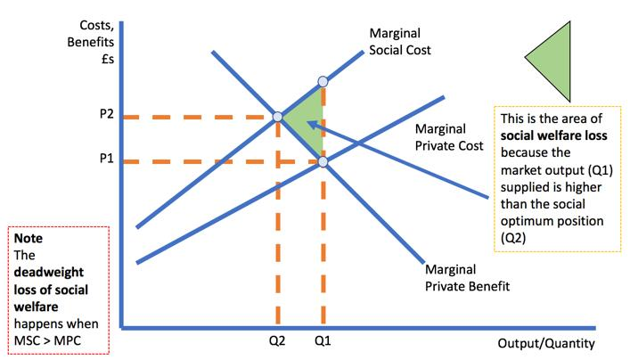

## Table of Contents

## What is marginal social cost?

Marginal social cost is the total cost to society of producing one more unit of a good or service. This includes not just the private costs that a company pays, like wages and materials, but also any costs that affect the community, like pollution or traffic congestion. When a factory makes more products, it might cause more pollution, which harms the environment and people's health. These extra costs to society are called external costs, and they are added to the private costs to find the marginal social cost.

Understanding marginal social cost is important for making good decisions about how much to produce. If a company only thinks about its own costs, it might make too much of a product because it doesn't consider the harm it causes to others. But if it also thinks about the costs to society, it can decide to produce less, which can be better for everyone. Governments can use this information to create policies, like taxes on pollution, to make sure companies take these social costs into account when they decide how much to produce.

## How does marginal social cost differ from private cost?

Marginal social cost is the total cost to society when one more unit of a good or service is produced. This includes the private costs, like the money a company spends on workers and materials, but it also adds in the costs that affect the community, like pollution or traffic jams. These extra costs to society are called external costs. So, marginal social cost is bigger than private cost because it includes these external costs that the company doesn't have to pay for directly.

Private cost, on the other hand, is just the cost that the company itself has to pay to produce one more unit of a good or service. This includes things like wages, raw materials, and the cost of running machines. When a company decides how much to produce, it usually looks at its private costs. But if it only considers these costs and ignores the external costs, it might produce too much of the product, which can harm the environment and the community.

## Can you provide an example of marginal social cost in everyday life?

Imagine a factory that makes toys. When the factory decides to make one more toy, it has to pay for things like plastic and the workers' salaries. These are the private costs that the factory has to pay. But making more toys also means the factory uses more electricity and creates more smoke, which can make the air dirty and harm people's health. This dirty air is a cost to the community, not just the factory. So, the marginal social cost of making one more toy includes both the factory's private costs and the cost of the dirty air to the community.

For example, if the factory's private cost to make one more toy is $5, but the cost of the pollution to the community is another $3, then the marginal social cost of making that toy is $8. If the factory only thinks about its private cost of $5, it might decide to make a lot more toys because it seems cheap. But if it also thinks about the $3 cost to the community, it might decide to make fewer toys to keep the air cleaner. This shows why it's important for companies to consider the marginal social cost, not just their private costs, when deciding how much to produce.

## What factors contribute to the marginal social cost of a product or service?

The marginal social cost of a product or service includes all the costs that come from making one more unit. This includes the private costs, like the money a company spends on things like workers and materials. But it also includes costs that affect the community, which are called external costs. For example, if a factory makes more cars, it might use more energy and create more pollution. This pollution can make the air dirty and harm people's health, which is a cost to the community.

Other factors that can add to the marginal social cost are things like traffic congestion and noise. If a new factory is built, it might bring more trucks to the area, which can make traffic worse and cause more noise. This can make it harder for people to get around and can disturb their peace and quiet. All these extra costs to the community need to be added to the private costs to find the true marginal social cost of making one more unit of a product or service.

## How is marginal social cost calculated?

To calculate the marginal social cost, you need to add up two main parts: the private cost and the external cost. The private cost is what the company pays to make one more unit of a product or service. This includes things like the cost of materials, wages for workers, and the cost of running machines. The external cost is the cost to the community that the company doesn't have to pay directly. This can include things like pollution, traffic congestion, and noise. So, to find the marginal social cost, you add the private cost to the external cost.

For example, if a factory makes one more toy, the private cost might be $5 for the plastic and the workers' salaries. But making that toy also creates pollution, which costs the community $3 in health problems and dirty air. So, the marginal social cost of making that toy is $5 (private cost) plus $3 (external cost), which equals $8. By adding these costs together, you get a better idea of the true cost of making one more unit of a product or service, which helps in making better decisions about how much to produce.

## What is the relationship between marginal social cost and market efficiency?

Marginal social cost is important for understanding how well markets work. When companies decide how much to produce, they usually look at their private costs, like wages and materials. But if they ignore the costs to the community, like pollution, they might make too much of a product. This can lead to a situation where the market is not efficient because the true cost of production is higher than what the company pays.

To make markets more efficient, it's important for companies to consider the marginal social cost, not just their private costs. If they do this, they will produce less of products that harm the community. This can lead to a better balance between what is produced and the costs to society. Governments can help by creating policies, like taxes on pollution, to make sure companies take these social costs into account when they decide how much to produce.

## How does marginal social cost influence government policy and regulation?

Marginal social cost helps governments make rules and policies to make sure companies think about the harm they cause to the community. When a company makes something, it might create pollution or traffic problems. These are costs that the company doesn't pay for, but the community has to deal with. By understanding the marginal social cost, which includes both the company's costs and the costs to the community, governments can create policies that make companies pay for these extra costs. For example, they might put a tax on pollution to make companies think twice before polluting more.

These policies help make the market work better. If companies only think about their own costs, they might make too much of something that harms the community. But if they have to pay for the harm they cause, they will make less of it. This can lead to a better balance between what is made and the costs to society. By using marginal social cost to guide their policies, governments can help create a fairer and more efficient market where companies think about the whole cost of what they produce, not just their own costs.

## What role does marginal social cost play in environmental economics?

In environmental economics, marginal social cost is really important because it helps us understand the true cost of making things that can harm the environment. When a company makes something, it has to pay for things like workers and materials. But it might also create pollution, which is bad for the air, water, and people's health. This pollution is a cost to the community, and it's called an external cost. By adding this external cost to the company's private cost, we get the marginal social cost. This helps us see the full impact of making more of something on the environment.

Understanding marginal social cost helps us make better choices about how much to produce. If a company only thinks about its own costs, it might make too much of a product that harms the environment. But if it also thinks about the cost to the community, it might decide to make less of that product to keep the environment cleaner. Governments can use this information to create rules, like taxes on pollution, to make sure companies think about these costs. This can lead to a better balance between what is produced and the health of the environment, making our world a better place to live.

## How do externalities affect marginal social cost?

Externalities are costs or benefits that affect people who are not directly involved in making or using a product. When a company makes something, it might create pollution, which is bad for the air and can make people sick. This pollution is an externality because the company doesn't have to pay for it, but it still costs the community. When we add this cost to the company's private costs, like the money it spends on workers and materials, we get the marginal social cost. This shows the true cost of making one more unit of a product, including the harm it causes to the environment and people's health.

Because externalities are not paid for by the company, they can make the marginal social cost higher than the private cost. If a company only thinks about its own costs, it might make too much of a product that harms the environment. But if it also thinks about the cost to the community, it might decide to make less of that product to keep the environment cleaner. Understanding and including externalities in the marginal social cost helps us make better decisions about how much to produce. It also helps governments create rules, like taxes on pollution, to make sure companies think about these costs and produce in a way that is better for everyone.

## Can you explain the concept of marginal social cost in the context of public goods?

When we talk about public goods, like parks or street lights, the idea of marginal social cost becomes important. Public goods are things that everyone can use, and one person using them doesn't stop others from using them too. When the government decides to make more of a public good, like building another park, it has to think about the costs. The private cost is what the government pays to build the park, like the money for materials and workers. But there are also costs to the community, like the noise and traffic that come from building the park. These are called external costs. Adding these together gives us the marginal social cost, which is the total cost to society of making one more unit of a public good.

Understanding the marginal social cost helps the government make better choices about how many public goods to provide. If the government only thinks about its own costs, it might build too many parks because it doesn't consider the noise and traffic problems. But if it also thinks about these external costs, it might decide to build fewer parks to keep the community happier. By considering the marginal social cost, the government can find a good balance between providing public goods that people need and keeping the costs to the community low.

## What are the challenges in accurately measuring marginal social cost?

Measuring marginal social cost can be tricky because it includes both the costs that a company pays and the costs that affect the community. The company's costs, like wages and materials, are easy to figure out because they are written down in the company's books. But the costs to the community, like pollution or traffic, are harder to measure. These costs are called externalities, and they can be different for different people. For example, the cost of pollution might be high for someone with asthma but lower for someone who is healthy. It's hard to put a number on these costs because they can change a lot depending on who you ask.

Another challenge is that the effects of externalities might not show up right away. Pollution from a factory might make the air dirty today, but the health problems it causes might not show up until years later. This makes it hard to know exactly how much the pollution costs the community now. Also, the costs can be spread out over a big area, so it's hard to figure out who is affected and by how much. Governments and economists have to use guesses and models to try to measure these costs, but it's never perfect. This means that the numbers they come up with for marginal social cost are always a bit uncertain.

## How do different economic theories interpret the concept of marginal social cost?

Different economic theories have different ways of looking at marginal social cost. In neoclassical economics, marginal social cost is seen as the total cost to society of making one more unit of a product. This includes the company's private costs, like wages and materials, plus any costs to the community, like pollution. Neoclassical economists think it's important for companies to consider these social costs to make the market work better. They believe that if companies pay for the harm they cause, they will make less of products that hurt the environment or the community.

In contrast, some other economic theories, like ecological economics, focus more on the long-term effects of production on the environment. They argue that traditional measures of marginal social cost might not capture the full impact of things like climate change or loss of biodiversity. Ecological economists want to include these long-term costs in the calculation of marginal social cost to make sure that future generations are not harmed by today's production decisions. They believe that a more complete understanding of marginal social cost can help create policies that protect the environment and promote sustainability.

## What is Understanding Marginal Social Cost?

Marginal Social Cost (MSC) represents the total cost borne by society from the production of an additional unit of a good or service. This approach integrates both private costs incurred by the producers and external costs that directly or indirectly affect the environment and society. Through this lens, MSC provides a comprehensive perspective on the economic and social impact of production activities.

### The MSC Formula

The Marginal Social Cost is expressed as:

$$
\text{MSC} = \text{MPC} + \text{MEC}
$$

where:

- **MPC (Marginal Private Cost):** This encompasses the costs directly borne by an entity during the production process. These include expenses related to materials, labor, utilities, and capital depreciation. MPC reflects the immediate economic outlay the producer faces to manufacture an additional unit of output.

- **MEC (Marginal External Cost):** This covers the costs imposed on third parties as a result of production, often referred to as negative externalities. Examples of MEC include air and water pollution, noise, and other forms of environmental degradation that can affect public health and property values. These costs are not reflected in the market price of the good but have societal implications.

### Significance of MSC

Understanding MSC is crucial because it highlights the differences between private production costs and the broader societal impact. When MEC is significant, the MSC can considerably exceed the MPC, signaling that the production activity in question might be more harmful socially than economically efficient. For example, a factory could produce goods at a low MPC but generate pollution with high MEC, resulting in a higher MSC than initially apparent.

This analysis is central to crafting policies that internalize externalities—where costs borne by the public are accounted for within the decision-making process of private entities. By correctly assessing MSC, policymakers can implement taxes, regulations, or incentives that align private incentives with social welfare, ensuring that producers account for all costs associated with their activities.

### Application of MSC

The application of MSC is widespread in environmental regulation, taxation, and even in new emerging markets such as [algorithmic trading](/wiki/algorithmic-trading). By understanding the full cost structure, stakeholders can ensure that economic growth does not come at an unsustainable societal expense.

## What is the impact of pollution?

Consider a manufacturing plant that produces consumer goods while simultaneously emitting pollutants into the environment. These emissions constitute an external cost, which the plant's internal accounting of private costs may not reflect. Private costs typically include expenses related to labor, materials, and operations necessary for production. However, they often fail to account for the broader environmental and social impacts.

The concept of Marginal Social Cost (MSC) comes into play to encompass these overlooked externalities. It extends beyond Marginal Private Cost (MPC), integrating Marginal External Cost (MEC) arising from negative externalities like pollution. The MSC is thus represented as:

$$
MSC = MPC + MEC
$$

In the case of pollution, MEC includes the health costs borne by the community, the degradation of natural resources, and the broader effects on ecosystem services. These costs can be quantified in terms of medical expenses, loss of biodiversity, and declines in air and water quality, among others.

When the total MSC, including MEC, surpasses the MPC, it indicates a situation where societal welfare declines. This discrepancy underscores a misalignment between individual producer incentives and collective societal well-being. Thus, the plant's economic activity is negatively impacting society by exceeding private computations of production costs. Economic theories suggest that these external costs can lead to market inefficiencies, justifying the need for regulatory interventions like taxes or cap-and-trade systems aimed at internalizing the externalities.

To illustrate this in practice, imagine a simple Python model estimating MSC:

```python
# Hypothetical values for MPC and MEC
mpc = 100  # Marginal Private Cost
mec = 50   # Marginal External Cost from pollution

# Calculating Marginal Social Cost
msc = mpc + mec

print(f"The Marginal Social Cost is: {msc}")
```

This model demonstrates the numeric difference that external costs, like pollution, can introduce to production costs. By understanding MSC, regulators and firms can make more informed decisions that better align industrial activities with societal welfare, highlighting the need for strategies to mitigate such negative externalities.

## References & Further Reading

[1]: Kirilenko, Andrei A., et al. ["The Flash Crash: The Impact of High-Frequency Trading on an Electronic Market."](https://www.cftc.gov/sites/default/files/idc/groups/public/@economicanalysis/documents/file/oce_flashcrash0314.pdf) *(Available through institutional access)* 

[2]: McCauley, Joseph L. ["Dynamics of Markets: The New Financial Economics"](https://www.amazon.com/Dynamics-Markets-New-Financial-Economics/dp/0521429625). Cambridge University Press.

[3]: Farmer, J. Doyne, et al. "[The Ecology of High-Frequency Trading: Price Dynamics, Volume, and the Flash Crash of May 6, 2010."](https://www.pnas.org/doi/pdf/10.1073/pnas.2015574118) Journal of Economic Behavior & Organization.

[4]: Haldane, Andrew G. "The Race to Zero." [Bank of England Speech.](https://www.bankofengland.co.uk/speech/2011/the-race-to-zero-speech-by-andy-haldane) 

[5]: Easley, David, et al. "[The Microstructure of the 'Flash Crash': Flow Toxicity, Liquidity Crashes, and the Probability of Informed Trading."](https://papers.ssrn.com/sol3/papers.cfm?abstract_id=1695041) Journal of Financial and Quantitative Analysis.