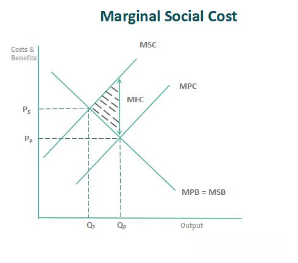

In today's complex financial ecosystem, understanding the broader impact of economic activities is crucial. Marginal Social Cost (MSC) is a vital concept that serves as a bridge between economic theories and societal implications. MSC helps identify the total cost to society when an additional unit of a good or service is produced, encompassing not just the private production costs but also the external impacts borne by the community. As financial markets evolve with technological innovations, especially in algorithmic trading, recognizing these broader costs is becoming increasingly essential.

Algorithmic trading, known for its efficiency and speed, has transformed modern financial markets. However, the focus has often been on immediate economic benefits, potentially overshadowing the societal costs. For instance, while high-frequency trading can increase liquidity and price efficiency, it also introduces risks such as increased volatility and systemic threats, which are examples of external costs. The MSC framework offers a lens through which these hidden societal costs can be quantified and addressed.



By applying the MSC formula, which combines Marginal Private Cost (MPC) and Marginal External Cost (MEC), stakeholders can gauge the broader economic impact of financial activities. This approach is not only significant in economic theory but also provides a practical tool for aligning growth strategies with societal well-being. As algorithmic trading becomes more prevalent, appreciating the MSC becomes imperative to foster a more socially responsible and sustainable economic environment.

## Table of Contents

## Understanding Marginal Social Cost

Marginal Social Cost (MSC) represents the total cost borne by society from the production of an additional unit of a good or service. This approach integrates both private costs incurred by the producers and external costs that directly or indirectly affect the environment and society. Through this lens, MSC provides a comprehensive perspective on the economic and social impact of production activities.

### The MSC Formula

The Marginal Social Cost is expressed as:

$$
\text{MSC} = \text{MPC} + \text{MEC}
$$

where:

- **MPC (Marginal Private Cost):** This encompasses the costs directly borne by an entity during the production process. These include expenses related to materials, labor, utilities, and capital depreciation. MPC reflects the immediate economic outlay the producer faces to manufacture an additional unit of output.

- **MEC (Marginal External Cost):** This covers the costs imposed on third parties as a result of production, often referred to as negative externalities. Examples of MEC include air and water pollution, noise, and other forms of environmental degradation that can affect public health and property values. These costs are not reflected in the market price of the good but have societal implications.

### Significance of MSC

Understanding MSC is crucial because it highlights the differences between private production costs and the broader societal impact. When MEC is significant, the MSC can considerably exceed the MPC, signaling that the production activity in question might be more harmful socially than economically efficient. For example, a factory could produce goods at a low MPC but generate pollution with high MEC, resulting in a higher MSC than initially apparent.

This analysis is central to crafting policies that internalize externalities—where costs borne by the public are accounted for within the decision-making process of private entities. By correctly assessing MSC, policymakers can implement taxes, regulations, or incentives that align private incentives with social welfare, ensuring that producers account for all costs associated with their activities.

### Application of MSC

The application of MSC is widespread in environmental regulation, taxation, and even in new emerging markets such as [algorithmic trading](/wiki/algorithmic-trading). By understanding the full cost structure, stakeholders can ensure that economic growth does not come at an unsustainable societal expense.

## Example: The Impact of Pollution

Consider a manufacturing plant that produces consumer goods while simultaneously emitting pollutants into the environment. These emissions constitute an external cost, which the plant's internal accounting of private costs may not reflect. Private costs typically include expenses related to labor, materials, and operations necessary for production. However, they often fail to account for the broader environmental and social impacts.

The concept of Marginal Social Cost (MSC) comes into play to encompass these overlooked externalities. It extends beyond Marginal Private Cost (MPC), integrating Marginal External Cost (MEC) arising from negative externalities like pollution. The MSC is thus represented as:

$$
MSC = MPC + MEC
$$

In the case of pollution, MEC includes the health costs borne by the community, the degradation of natural resources, and the broader effects on ecosystem services. These costs can be quantified in terms of medical expenses, loss of biodiversity, and declines in air and water quality, among others.

When the total MSC, including MEC, surpasses the MPC, it indicates a situation where societal welfare declines. This discrepancy underscores a misalignment between individual producer incentives and collective societal well-being. Thus, the plant's economic activity is negatively impacting society by exceeding private computations of production costs. Economic theories suggest that these external costs can lead to market inefficiencies, justifying the need for regulatory interventions like taxes or cap-and-trade systems aimed at internalizing the externalities.

To illustrate this in practice, imagine a simple Python model estimating MSC:

```python
# Hypothetical values for MPC and MEC
mpc = 100  # Marginal Private Cost
mec = 50   # Marginal External Cost from pollution

# Calculating Marginal Social Cost
msc = mpc + mec

print(f"The Marginal Social Cost is: {msc}")
```

This model demonstrates the numeric difference that external costs, like pollution, can introduce to production costs. By understanding MSC, regulators and firms can make more informed decisions that better align industrial activities with societal welfare, highlighting the need for strategies to mitigate such negative externalities.

## Algorithmic Trading and MSC

In algorithmic trading, the concept of Marginal Social Cost (MSC) serves as an analytical tool to evaluate the broader societal impacts of automated trading activities. Algorithmic trading, characterized by high-speed transactions executed through algorithms without direct human intervention, is designed to optimize the trading process, often focusing on market efficiency and capitalizing on price discrepancies. However, this approach can contribute to external costs that extend beyond the immediate benefits to traders and financial institutions, impacting overall market dynamics and societal welfare.

The externalities associated with algorithmic trading are multifaceted. One primary concern is market stability. Automated strategies can lead to increased [volatility](/wiki/volatility-trading-strategies), especially when algorithms interact in unforeseen ways, potentially resulting in phenomena such as flash crashes. An infamous example was the Flash Crash of 2010, where an aggressive sell algorithm contributed to a rapid market decline followed by an equally swift recovery, highlighting the potential for systemic risks inherent in high-frequency trading ([HFT](/wiki/high-frequency-trading-strategies)) [1].

Furthermore, algorithmic trading can exacerbate information asymmetry. Sophisticated trading algorithms often gain access to market information and execute trades at speeds beyond human capability, leading to situations where retail investors and smaller market participants may find themselves at a disadvantage. This informational disparity can erode trust in market fairness and result in societal costs that are not immediately reflected in market prices, thereby increasing the MSC.

Assessing the MSC in algorithmic trading involves evaluating these complex interactions between automated strategies and market structures. Economists and policymakers use theoretical models and empirical studies to identify and measure the impact of these externalities. By considering both the private benefits to traders and the social costs incurred by the broader financial ecosystem, stakeholders can better understand the full implications of algorithmic trading practices.

Efforts to quantify MSC more accurately are crucial for implementing regulatory measures that mitigate negative impacts. For instance, introducing circuit breakers or transaction taxes can help curb excessive volatility and address some of the systemic risks posed by high-frequency trading. By incorporating MSC into regulatory frameworks, policymakers aim to safeguard market integrity while promoting practices that align trading activities with societal interests.

In summary, the application of MSC to algorithmic trading offers valuable insights into the unintended consequences of automated trading. By acknowledging and addressing the external costs associated with algorithmic strategies, the financial sector can work towards a more balanced and socially responsible trading environment.

[1] Kirilenko, Andrei A., et al. "The Flash Crash: The Impact of High-Frequency Trading on an Electronic Market." *(Available through institutional access)*.

## Quantifying MSC in Practice

Quantifying Marginal Social Cost (MSC) is inherently challenging due to its dual composition of both tangible and intangible components. The tangible aspect, the Marginal Private Cost (MPC), is usually measurable through direct production expenditures, such as labor, materials, and overhead costs. The intangible component, the Marginal External Cost (MEC), encompasses adverse externalities that are not accounted for in the market pricing mechanism, such as pollution, and often remains abstract.

To approximate the MSC, economists and policymakers employ economic models and simulations. These models incorporate variables representing both MPC and MEC. One common approach is the use of integrated assessment models (IAMs), which combine economic analysis with environmental and social assessments. These models attempt to simulate real-world scenarios, capturing the potential external impacts of various economic activities.

Consider a basic Python simulation model that estimates MSC for an industrial activity producing environmental externalities. The model may incorporate functions to calculate both MPC and MEC:

```python
def calculate_mpc(units, cost_per_unit):
    return units * cost_per_unit

def calculate_mec(units, pollution_cost_per_unit):
    return units * pollution_cost_per_unit

def estimate_msc(units, cost_per_unit, pollution_cost_per_unit):
    mpc = calculate_mpc(units, cost_per_unit)
    mec = calculate_mec(units, pollution_cost_per_unit)
    return mpc + mec

# Example scenario
units_produced = 1000
cost_per_unit = 50
pollution_cost_per_unit = 20

msc = estimate_msc(units_produced, cost_per_unit, pollution_cost_per_unit)
print(f"The estimated Marginal Social Cost is {msc}")
```

In this simplified model, `calculate_mpc` computes the Marginal Private Cost, while `calculate_mec` estimates the cost of pollution per unit produced. By summing these, `estimate_msc` provides an approximation of the MSC. 

Sophisticated models utilize more complex algorithms and integrate a broader range of factors, often necessitating the use of extensive data sets and [machine learning](/wiki/machine-learning) techniques to forecast the broader impacts. These models are pivotal for developing policies aimed at limiting negative societal impacts, steering regulations that promote transparency and sustainable practices.

Ultimately, while precise measurement of MSC may be elusive due to the inherent complexity of quantifying externalities, continued advancements in modeling and simulation offer valuable insights. These tools help align economic activities with societal objectives, fostering a balance between economic growth and environmental stewardship.

## Conclusion

Understanding and applying Marginal Social Cost (MSC) is crucial in modern economics and financial markets, as it serves as a guide for creating more socially responsible and sustainable practices. In essence, MSC provides a comprehensive framework that incorporates both private and external costs, enabling a more holistic assessment of the true cost of economic activities. This broader perspective is vital for recognizing and addressing the often-overlooked societal impacts that arise from various economic actions.

The significance of MSC becomes particularly evident in sectors such as algorithmic trading, where traditional cost assessments might neglect externalities that can affect market stability and social welfare. By factoring in these externalities, MSC can inform decision-making processes that prioritize societal well-being alongside economic growth.

Incorporating MSC into economic analysis allows businesses and policymakers to align growth strategies with societal interests. For example, in algorithmic trading, by assessing the MSC of trading strategies, financial institutions can mitigate risks such as increased market volatility or systemic risks that might not be captured by traditional cost models. This approach not only promotes sustainable financial practices but also fosters greater transparency and accountability in innovative domains.

The challenge lies in quantifying MSC accurately, given the subjective nature of some external costs. However, through advanced economic modeling and simulations, stakeholders can approximate these costs and develop regulations and policies aimed at reducing negative societal impacts. By integrating MSC into economic frameworks, there is potential to strike a balance between economic development and social responsibility, ultimately contributing to more equitable and sustainable growth.

## References & Further Reading

[1]: Kirilenko, Andrei A., et al. ["The Flash Crash: The Impact of High-Frequency Trading on an Electronic Market."](https://www.cftc.gov/sites/default/files/idc/groups/public/@economicanalysis/documents/file/oce_flashcrash0314.pdf) *(Available through institutional access)* 

[2]: McCauley, Joseph L. ["Dynamics of Markets: The New Financial Economics"](https://www.amazon.com/Dynamics-Markets-New-Financial-Economics/dp/0521429625). Cambridge University Press.

[3]: Farmer, J. Doyne, et al. "[The Ecology of High-Frequency Trading: Price Dynamics, Volume, and the Flash Crash of May 6, 2010."](https://www.pnas.org/doi/pdf/10.1073/pnas.2015574118) Journal of Economic Behavior & Organization.

[4]: Haldane, Andrew G. "The Race to Zero." [Bank of England Speech.](https://www.bankofengland.co.uk/speech/2011/the-race-to-zero-speech-by-andy-haldane) 

[5]: Easley, David, et al. "[The Microstructure of the 'Flash Crash': Flow Toxicity, Liquidity Crashes, and the Probability of Informed Trading."](https://papers.ssrn.com/sol3/papers.cfm?abstract_id=1695041) Journal of Financial and Quantitative Analysis.