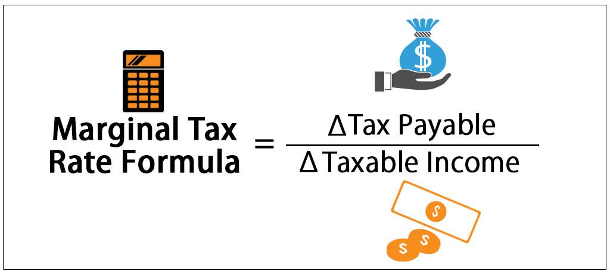

Understanding the complexities of tax calculations can be daunting for many individuals, particularly when faced with varying tax principles that influence personal and financial decisions. This article aims to shed light on some of these foundational concepts by focusing on marginal tax rates and their broader implications. Marginal tax rates, which determine the tax levied on an additional dollar of income, play a crucial role in progressive taxation systems. These systems are designed to ensure that individuals with higher earnings contribute a proportionately larger share of their income in taxes.

Moreover, as the financial landscape evolves with technology, tax principles like marginal tax rates intersect significantly with algorithmic trading. Algorithmic trading relies heavily on automated processes to execute trades, often leading to frequent and complex transactions. Understanding how tax obligations arise from these activities is crucial for traders aiming to optimize their strategies and improve net returns.



By exploring these topics, this article will provide insight into how taxes can influence personal financial decisions and trading performance. This knowledge is not only vital for individuals but also for professionals seeking to enhance their financial literacy and strategic approaches within the trading sector. Through these discussions, readers will gain a clearer understanding of the critical impact taxes have on diverse financial activities and decisions.

## Table of Contents

## What is Marginal Tax Rate?

The marginal tax rate is a pivotal concept in understanding taxation, representing the rate at which an individual's last dollar of income is taxed. Essentially, it pertains to the additional tax that a taxpayer incurs for earning one more unit of currency, providing a clear picture of tax liability's impact on incremental income.

In progressive taxation systems, which are employed by many economies globally, the tax rate escalates as one moves through higher income brackets. This structure is designed to achieve a more equitable distribution of income by imposing a heavier tax burden on those with greater financial resources. Under this system, income is divided into distinct brackets, with each bracket subject to a specific tax rate, which increases progressively. Therefore, the marginal tax rate applies solely to the additional income earned that pushes the taxpayer into a higher bracket, rather than to the entire income.

To illustrate, consider the following example: if a taxation system has brackets set at 10%, 20%, and 30%, and an individual's income falls into the third bracket, the income up to the first bracket's threshold is taxed at 10%, the portion exceeding the first threshold but under the second is taxed at 20%, and only the income exceeding the second threshold is taxed at 30%. Thus, the marginal tax rate is pertinent to the last earnings tier.

This system's design is integral in ensuring that individuals with higher income levels contribute a proportionally larger share of their income in taxes, embodying the principle of tax progressivity. This principle often forms the basis for debates on tax policy and equity, helping to shape the conversation around fair contributions to public resources.

## Calculation of Marginal Tax Rate

To calculate your marginal tax rate, begin by determining your taxable income, which is the portion of your total income that is subject to taxation after accounting for deductions and exemptions. Taxable income is crucial because it serves as the basis for progressing through different tax brackets, each associated with a specific tax rate.

In a progressive taxation system, income is divided into ranges or brackets, and each bracket has a distinct tax rate. As income moves from one bracket to the next, the incremental income within each bracket is taxed at the corresponding rate for that bracket. Therefore, the marginal tax rate refers to the tax rate applied to the last dollar of income earned.

### Example: Calculating Marginal Tax Rate

Consider a simplified tax bracket structure as follows:

1. $0 - $10,000: 10%
2. $10,001 - $20,000: 15%
3. $20,001 - $40,000: 20%
4. $40,001 and above: 25%

Suppose an individual has a taxable income of $35,000. To calculate their marginal tax rate, follow these steps:

1. **Calculate Tax for Each Bracket:**
   - The first $10,000 is taxed at 10%, resulting in $1,000 in taxes.
   - The next $10,000 (from $10,001 to $20,000) is taxed at 15%, resulting in $1,500 in taxes.
   - The remaining $15,000 (from $20,001 to $35,000) is taxed at 20%, resulting in $3,000 in taxes.

2. **Total Tax Calculation:**
   - Total tax = $1,000 + $1,500 + $3,000 = $5,500

3. **Determine the Marginal Tax Rate:**
   - Since the taxable income falls within the $20,001 to $40,000 bracket, the marginal tax rate is 20%.

In this example, the individual's marginal tax rate is 20%, which indicates that any additional dollar earned beyond the current taxable income of $35,000 would be taxed at this rate.

### Python Code Example

To automate this process, you can use the following Python code snippet to calculate marginal tax rates based on predefined tax brackets:

```python
def calculate_marginal_tax(income):
    brackets = [
        (10000, 0.10),
        (20000, 0.15),
        (40000, 0.20),
        (float('inf'), 0.25),
    ]

    tax = 0
    prev_bracket_limit = 0

    for limit, rate in brackets:
        if income > limit:
            tax += (limit - prev_bracket_limit) * rate
            prev_bracket_limit = limit
        else:
            tax += (income - prev_bracket_limit) * rate
            break

    marginal_rate = next(rate for limit, rate in brackets if income <= limit)

    return tax, marginal_rate

income = 35000
total_tax, marginal_rate = calculate_marginal_tax(income)
```

By following this structured approach, individuals can effectively determine their marginal tax rate, which plays a pivotal role in financial planning and decision-making. Understanding marginal tax rates enables taxpayers to anticipate how changes in income can affect their overall tax liability, allowing for more strategic financial management.

## Marginal vs. Flat Tax: Key Differences

In taxation, marginal and flat tax systems represent two distinct approaches with significant differences in how income is taxed. A marginal tax system applies varying rates to different portions or brackets of an individual's income, which means as income increases, it moves into higher tax brackets subjected to higher tax rates. This system is designed to be progressive, aiming to ensure that those with higher incomes contribute a larger percentage of their income in taxes.

Conversely, a flat tax system imposes a single constant rate on all taxable income, regardless of earnings. This uniform rate translates to simplicity, as it eliminates the need for multiple brackets. However, flat taxes often exclude deductions and exemptions, potentially increasing the financial burden on lower-income individuals. The simplicity of flat taxes makes them easier to administer, yet they might not provide the progressive redistribution effects intended in a marginal system.

To illustrate, consider the following scenario: 

In a marginal tax system, suppose there are two tax brackets:
- 10% tax on income up to $10,000
- 20% tax on income above $10,000

If an individual earns $15,000, their tax liability would be:
$$

\text{Tax} = (10,000 \times 0.10) + (5,000 \times 0.20) = 1,000 + 1,000 = 2,000 
$$

In a flat tax system with a 15% tax rate, the same individual would pay:
$$

\text{Tax} = 15,000 \times 0.15 = 2,250 
$$

This example demonstrates that while the flat tax rate is constant, the absence of tiered brackets can result in a higher effective tax rate for lower-income earners compared to a marginal system.

The economic implications of these systems are significant. Marginal tax systems can potentially minimize inequality through progressive taxation but are often more complex, requiring comprehensive record-keeping and calculations. Flat tax systems, on the other hand, offer simplicity and predictability, potentially boosting economic growth due to reduced administrative and compliance costs. However, their regressive nature may reduce government revenue and increase income inequality unless mitigated by other redistributive policies.

In conclusion, the choice between marginal and flat tax systems hinges on the balance between equity and efficiency. Policymakers must consider these differences carefully, as they directly impact taxpayer behavior, government revenue, and the overall economy.

## Examples of Marginal Tax Rate Calculations

In order to better understand how marginal tax rates are applied, let's work through a hypothetical scenario involving an individual with a taxable income of $85,000. Assume a simplified progressive tax system with the following brackets for illustration:

- 10% on income up to $9,875
- 12% on income from $9,876 to $40,125
- 22% on income from $40,126 to $85,525

To determine the tax liability, it is essential to allocate the income across the pertinent tax brackets and then apply the respective rates. Here is a step-by-step breakdown of the calculation:

1. **First Bracket (10%):**  
   - Income Taxed: $9,875 (full bracket)  
   - Tax: $9,875 * 10% = $987.50

2. **Second Bracket (12%):**  
   - Income Taxed: $40,125 - $9,875 = $30,250  
   - Tax: $30,250 * 12% = $3,630.00

3. **Third Bracket (22%):**  
   - Income Taxed: $85,000 - $40,125 = $44,875  
   - Tax: $44,875 * 22% = $9,872.50

Finally, the total tax liability is the sum of the taxes from each bracket:

$$
\text{Total Tax Liability} = 987.50 + 3,630.00 + 9,872.50 = 14,490.00
$$

In this example, the marginal tax rate is 22%, as it is the rate applied to the last dollar of income. However, the effective tax rate, which is the total tax liability divided by the total income, provides an overall picture of the tax burden:

$$
\text{Effective Tax Rate} = \frac{14,490.00}{85,000} \approx 17.05\%
$$

This illustrates how marginal tax rates ensure higher earners pay more in taxes, while the effective tax rate provides a holistic view of the individual's tax obligations. Understanding this distinction is paramount in planning for tax efficiency and financial decision-making.

## Tax Calculation in Algorithmic Trading

Algorithmic trading, characterized by high-frequency transactions, necessitates a comprehensive understanding of tax implications to ensure net profitability. These trades often span multiple jurisdictions and involve numerous financial instruments, each subject to distinct tax treatment. Understanding and optimizing the tax consequences of trading strategies is indispensable for traders aiming to maximize their after-tax returns.

Firstly, the frequency of trades executed by algorithmic systems can trigger specific tax events, such as short-term capital gains, typically taxed at a higher rate compared to long-term capital gains. In many jurisdictions, short-term capital gains are taxed as ordinary income. For traders engaged in [algorithmic trading](/wiki/algorithmic-trading), it is essential to consider the holding period of securities to effectively manage tax liabilities. Holding securities for more than a year may qualify traders for lower tax rates on long-term capital gains, which can result in significant tax savings.

Moreover, algorithmic trading can trigger wash sale rules, which disallow the deduction of losses from the sale of a security if a substantially identical security is purchased within 30 days before or after the sale. This necessitates careful tracking and reporting of trades to prevent loss of potential deductions. Automated systems can be programmed to account for wash sale rules, ensuring compliance and optimizing tax outcomes.

To better manage these tax considerations, traders can employ automated tax management systems integrated with their trading algorithms. These systems, often built upon advanced software platforms, perform real-time data analysis to track cost basis, calculate gains and losses, and apply relevant tax rules. Below is a simple Python snippet that illustrates how an automated system might track and calculate realized gains and losses:

```python
class TradingTaxCalculator:
    def __init__(self):
        self.trades = []
        self.realized_gains = 0.0

    def add_trade(self, date, symbol, quantity, price, trade_type):
        self.trades.append({'date': date, 'symbol': symbol, 'quantity': quantity, 'price': price, 'type': trade_type})
        self.calculate_gains_losses()

    def calculate_gains_losses(self):
        # Simplified example; assumes FIFO and ignores commission costs
        for trade in self.trades:
            if trade['type'] == 'sell':
                purchase_price = next(t['price'] for t in self.trades if t['symbol'] == trade['symbol'] and t['type'] == 'buy')
                gain_or_loss = (trade['price'] - purchase_price) * trade['quantity']
                self.realized_gains += gain_or_loss
                # Remove the matched buy trade
                self.trades = [t for t in self.trades if not (t['symbol'] == trade['symbol'] and t['type'] == 'buy')]

    def get_realized_gains(self):
        return self.realized_gains

# Example usage
calculator = TradingTaxCalculator()
calculator.add_trade('2023-01-10', 'AAPL', 10, 150, 'buy')
calculator.add_trade('2023-01-12', 'AAPL', 10, 155, 'sell')
print(f"Realized Gains: {calculator.get_realized_gains()}")

```

Lastly, taxation in algorithmic trading is not only limited to the direct calculation of gains and losses but also encompasses the strategic use of tax-advantaged accounts, depreciation, and amortization considerations where applicable. Traders should work closely with tax professionals and regularly update their knowledge of tax laws to remain compliant and optimize their tax positions strategically.

In conclusion, effectively managing tax obligations in algorithmic trading is an integral component of sustaining profitable operations. By leveraging automated systems for tax management and understanding the tax implications of their trades, traders can significantly enhance their financial outcomes.

## Conclusion

Marginal tax rates are pivotal in shaping both personal financial decisions and trading strategies. Understanding how these rates function allows individuals to make more informed choices about their investments and personal finances. With progressive tax systems, individuals must comprehend their taxable income and how it fits within their country's tax brackets to optimize their tax liabilities.

In the domain of trading, particularly algorithmic trading, understanding tax implications is crucial. Algorithmic trading involves numerous transactions, and each can affect tax obligations. Proper tax planning and awareness can lead to enhanced investment returns by minimizing tax liabilities and optimizing after-tax returns. Automation tools in trading, when used with an understanding of tax principles, can further streamline this process, ensuring compliance and efficiency.

By integrating tax knowledge into financial planning and trading strategies, individuals can better navigate potential financial complexities and maximize their economic outcomes. Grasping the nuances of marginal tax rates empowers individuals and traders alike to make decisions that align with their long-term financial goals, ultimately improving their potential for financial success.

## References & Further Reading

[1]: ["Federal Income Tax Rates and Brackets"](https://www.irs.gov/filing/federal-income-tax-rates-and-brackets) - Internal Revenue Service (IRS)

[2]: ["Taxation and Investment in United States 2021"](https://home.treasury.gov/policy-issues/tax-policy) - Deloitte

[3]: ["Advances in Financial Machine Learning"](https://www.amazon.com/Advances-Financial-Machine-Learning-Marcos/dp/1119482089) by Marcos Lopez de Prado

[4]: ["Quantitative Trading: How to Build Your Own Algorithmic Trading Business"](https://www.amazon.com/Quantitative-Trading-Build-Algorithmic-Business/dp/1119800064) by Ernest P. Chan

[5]: ["Python for Finance: Mastering Data-Driven Finance"](https://www.amazon.com/Python-Finance-Mastering-Data-Driven/dp/1492024333) by Yves Hilpisch