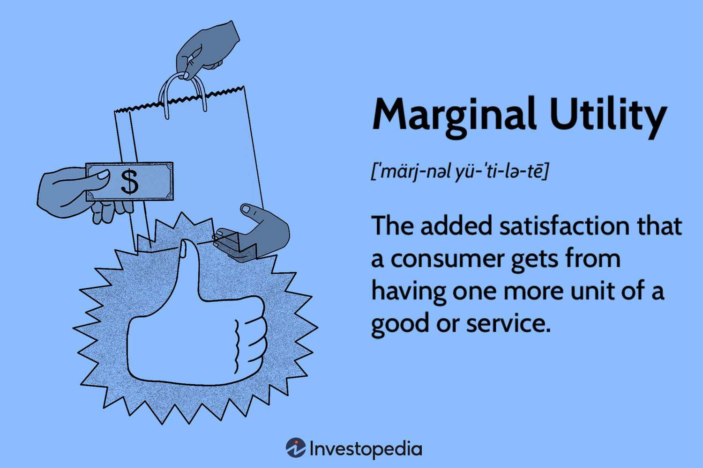

## Table of Contents

## What is marginal utility?

Marginal utility is a concept in economics that describes how much satisfaction or happiness a person gets from consuming one more unit of a good or service. Imagine you're eating slices of pizza. The first slice might make you very happy because you were hungry. But as you eat more slices, each additional slice might not make you as happy as the one before it. That's because the satisfaction you get from each extra slice, or the marginal utility, decreases.

This idea is important because it helps explain how people make decisions about what and how much to buy. If the marginal utility of an item is high, people might be willing to pay more for it. But if the marginal utility is low, they might not want to spend as much. Economists use this concept to understand consumer behavior and how markets work. For example, businesses might lower prices if they think the marginal utility of their product is decreasing for consumers.

## How does marginal utility relate to consumer choice?

Marginal utility helps explain how people make choices about what to buy. When people decide to buy something, they think about how much happiness or satisfaction the next unit of that thing will give them. If the next slice of pizza will make them really happy, they might choose to buy it. But if they already had a lot of pizza and the next slice won't make them much happier, they might decide to spend their money on something else instead.

This idea is important for understanding how people use their money. People try to get the most happiness they can from what they buy. So, they will keep buying more of something as long as the happiness they get from the next unit is worth the cost. When the happiness from the next unit isn't worth the cost anymore, they will stop buying it and look for something else that will give them more satisfaction for their money.

## What is the law of diminishing marginal utility?

The law of diminishing marginal utility says that as you keep getting more of something, each extra bit of it gives you less and less happiness or satisfaction. Imagine you're eating chocolate. The first piece might taste amazing and make you really happy. But if you keep eating more and more chocolate, each new piece won't make you as happy as the one before it. Eventually, you might even start to feel sick from eating too much, and the last piece won't make you happy at all.

This idea is important because it helps explain why people don't just keep buying the same thing over and over. If the happiness you get from something keeps getting smaller, you'll start looking for something else that will make you happier for the same amount of money. This is how people make choices about what to buy and helps explain why we have a variety of things in the market.

## Can you provide examples of marginal utility in everyday life?

Imagine you're at a buffet. The first plate of food you get is really exciting because you're hungry and everything looks good. You enjoy every bite. But as you go back for more, each plate doesn't taste as good as the one before. By the time you're on your fourth or fifth plate, you might not even want to eat anymore because you're full. That's marginal utility at work. The happiness you get from each extra plate of food goes down the more you eat.

Another example is buying clothes. When you see a new shirt you really like, you might feel a big rush of happiness when you buy it. But if you keep buying more and more shirts, each new one doesn't make you as happy as the first one did. After a while, you might not even wear all the shirts you bought because the joy of having a new shirt has worn off. This shows how the satisfaction from each additional shirt decreases, which is what marginal utility is all about.

## How is marginal utility calculated?

Marginal utility is calculated by looking at how much more happiness or satisfaction you get from having one more unit of something. Imagine you're eating cookies. If the first cookie makes you happy, and the second cookie makes you a little less happy, the marginal utility of the second cookie is the difference in happiness between the first and the second cookie. Economists often use numbers to show this. If the first cookie gives you 10 units of happiness and the second cookie gives you 8 units, the marginal utility of the second cookie is 8 - 10 = -2 units of happiness.

To make it easier to understand, economists sometimes use a formula. The formula for marginal utility is: MU = ΔTU / ΔQ, where MU is marginal utility, ΔTU is the change in total utility (or happiness), and ΔQ is the change in the quantity of the good. So, if you go from eating one cookie to two cookies, and your total happiness goes from 10 to 8, the marginal utility of the second cookie is (8 - 10) / (2 - 1) = -2. This shows that the second cookie actually made you less happy than the first one.

## What are the different types of marginal utility?

There are mainly two types of marginal utility: positive marginal utility and negative marginal utility. Positive marginal utility happens when you get more happiness from having one more of something. For example, if you're really thirsty and you drink a glass of water, that first glass makes you feel a lot better. The happiness you get from that first glass is positive marginal utility. If you drink a second glass and still feel better, that's also positive marginal utility, but it might not be as much as the first glass.

Negative marginal utility is when having one more of something makes you less happy. Let's say you keep drinking water after you're no longer thirsty. That extra glass might make you feel uncomfortable or even sick. The happiness you get from that extra glass is negative because it makes you feel worse. This is important because it helps explain why people stop consuming something once they've had enough. They switch to something else that will make them happier.

## How does marginal utility impact pricing strategies?

Marginal utility affects how businesses decide on the prices of their products. If a company knows that people get a lot of happiness from their product, they might charge more for it. For example, if the first cup of coffee in the morning makes people feel really good, the company might set a higher price for that first cup. But if people start to get less happiness from each extra cup, the company might lower the price of the second or third cup to encourage people to buy more.

On the other hand, if a company sees that the happiness people get from their product goes down quickly, they might use different pricing strategies. They could offer discounts or bundle products together to make the total happiness people get from buying more seem worth it. For example, a store might sell candy bars cheaper if you buy them in a pack of five, knowing that the happiness from each extra candy bar goes down, but the total happiness from the whole pack might still be good enough for people to buy it.

## What is the historical development of the concept of marginal utility?

The idea of marginal utility started to become important in the late 1800s. Before that, people thought about the value of things mostly in terms of how much work it took to make them. But then, economists like William Stanley Jevons, Carl Menger, and Léon Walras came up with a new way of thinking. They said that the value of something comes from how much happiness it gives to people. This was a big change because it focused on what people felt, not just what it cost to make something.

These economists were trying to explain why people make the choices they do. They noticed that people often choose things based on how much more happiness they get from having one more of something. This idea, called marginal utility, helped explain why prices go up and down and why people buy different things. Over time, this way of thinking became very important in economics and helped shape how we understand markets and consumer behavior today.

## Who were the key economists involved in the development of marginal utility theory?

The idea of marginal utility was developed by three key economists in the late 1800s: William Stanley Jevons, Carl Menger, and Léon Walras. These economists came up with the idea that the value of something comes from the happiness it gives to people, not just how much it costs to make. This was a big change in how people thought about economics. Jevons, from England, wrote about how people make choices based on how much more happiness they get from one more thing. Menger, from Austria, talked about how people value things differently depending on their needs. Walras, from France, worked on how these ideas could explain how prices are set in markets.

These three economists are often called the founders of the marginalist revolution. They changed the way economists think about value and how people make choices. Before them, economists focused a lot on the cost of making things. But Jevons, Menger, and Walras showed that it's also important to look at how much people enjoy the things they buy. This new way of thinking helped explain why prices go up and down and why people buy different things. Their work is still important today and helps us understand how markets work and how people make decisions about what to buy.

## How does marginal utility theory apply to modern economic models?

Marginal utility theory is still very important in modern economics. It helps economists understand how people make choices about what to buy. The idea is that people keep buying things as long as the next one makes them happier. If the happiness they get from the next thing is not worth the money, they stop buying it. This helps explain why prices change and why people buy different things. For example, if a company knows that people get a lot of happiness from their product, they might charge more for it. But if the happiness people get from each extra product goes down, the company might lower the price to sell more.

Economists use marginal utility theory in different models to predict how people will behave. For example, in demand curves, which show how many people want to buy something at different prices, marginal utility helps explain why the demand goes down as the price goes up. If the price is too high, the happiness people get from the next unit is not worth the cost. Marginal utility also helps with other models, like how people save and spend money. If people think the next dollar saved will give them more happiness than spending it, they might save it instead. This way of thinking helps economists make better guesses about how people will act in different situations.

## What are the criticisms and limitations of marginal utility theory?

Some people say that marginal utility theory doesn't work well because it's hard to measure happiness. Happiness is different for everyone, so it's tough to say exactly how much more happiness someone gets from one more thing. Also, people's feelings change a lot, so what makes them happy today might not make them happy tomorrow. This makes it hard to use numbers to show how much happiness someone gets from something. Economists have tried to come up with ways to measure happiness, but it's still not perfect.

Another problem with marginal utility theory is that it doesn't think about how money affects happiness. If someone is rich, the happiness they get from one more thing might be different than if someone is poor. The theory also doesn't look at how other people can change someone's happiness. For example, if everyone else has a new phone, you might want one too, even if it doesn't make you much happier. These things show that marginal utility theory can't explain everything about why people buy things.

## How does marginal utility interact with other economic concepts like elasticity and indifference curves?

Marginal utility works together with other economic ideas like elasticity and indifference curves to help us understand how people make choices. Elasticity is about how much the amount of something people want to buy changes when the price changes. If the happiness people get from one more thing goes down a lot, they might not want to buy as much if the price goes up. This means the demand for that thing is elastic. But if the happiness from one more thing doesn't change much, people might still buy it even if the price goes up. This means the demand is inelastic. So, marginal utility helps explain why some things have elastic demand and others have inelastic demand.

Indifference curves show all the different ways someone can be just as happy with different things. If you like apples and oranges, an indifference curve shows all the combinations of apples and oranges that make you equally happy. Marginal utility comes into play because it helps decide how much of each thing you want. If the happiness you get from one more apple is bigger than the happiness from one more orange, you might choose more apples. But if the happiness from one more orange is bigger, you might choose more oranges. So, marginal utility helps shape the indifference curves by showing how much happiness you get from each extra thing.

## What is an Overview of Marginal Utility?

Marginal utility is a fundamental concept in economics that describes the additional satisfaction or benefit derived from consuming one more unit of a good or service. It is a critical component in the analysis of consumer behavior and decision-making processes. As consumers continue to consume more units of a particular good or service, the utility gained from each additional unit typically decreases. This phenomenon is encapsulated by the Law of Diminishing Marginal Utility, which states that as a person consumes more units of a good, the additional satisfaction from each successive unit tends to decline. This diminishing nature of marginal utility helps explain the downward-sloping demand curve in economic theory, as the desire to consume additional quantities decreases when the perceived utility is reduced.

Mathematically, marginal utility can be expressed as:

$$
MU = \frac{\Delta TU}{\Delta Q}
$$

where $MU$ is the marginal utility, $\Delta TU$ represents the change in total utility, and $\Delta Q$ is the change in quantity consumed. This relationship emphasizes how each incremental unit contributes progressively less to overall satisfaction, informing both individual and aggregate consumption patterns in the economy.

The insights offered by marginal utility are integral to understanding consumer choice theory, an area that explores how individuals allocate their limited resources among various goods and services to maximize their overall happiness or satisfaction. By analyzing marginal utility, economists can identify the point where consumers no longer derive significant benefit from additional consumption, guiding optimal decision-making and resource allocation.

In practical applications, this concept aids businesses and policymakers in predicting how changes in price or availability of goods can influence consumer demand, adapting strategies to meet market needs effectively. The understanding of marginal utility also underpins pricing strategies, ensuring that price points align with perceived consumer preferences and maximize total revenue.

## What is the relationship between Economic Theory and Marginal Utilities?

Marginal utilities are pivotal in economic theory, serving as a key influencer of pricing strategies and consumer decision-making processes. The concept hinges on the idea that consumers derive varying levels of satisfaction from each additional unit of a good or service consumed. This variable satisfaction guides consumer behavior and informs economic analysis.

Marginal utilities significantly impact demand curves, which graphically represent the relationship between the price of a good and the quantity demanded. According to the Law of Diminishing Marginal Utility, as a consumer increases consumption of a product, the additional satisfaction (marginal utility) gained from consuming an extra unit decreases. This principle underlies the downward-sloping nature of demand curves, where lower prices are required to encourage consumption of additional units.

In terms of resource allocation, marginal utility plays a crucial role in determining how resources are distributed efficiently. Economists discuss optimal resource allocation using the equimarginal principle, which asserts that consumers maximize utility by equalizing the marginal utility per unit of currency spent across different goods and services. In mathematical terms:

$$
\frac{MU_x}{P_x} = \frac{MU_y}{P_y} = \cdots = \frac{MU_n}{P_n}
$$

Here, $MU_x$ represents the marginal utility of good $x$, and $P_x$ is its price. This equation holds for all goods and services $n$ in a consumer's choice set, indicating equilibrium where utility is maximized.

Marginal utility also offers insights into market equilibrium and taxation policies. In market equilibrium, supply matches demand, and marginal utilities contribute to defining equilibrium conditions where consumer and producer surplus is optimized. Furthermore, understanding marginal utilities helps economists advocate for taxation strategies that minimize welfare losses or deadweight losses by aligning taxes with consumers' marginal utilities, ensuring efficient resource usage without significant distortion of consumer behavior.

Overall, marginal utilities are essential for interpreting various dynamics in market operations, providing a quantitative basis for economic theory that aids in predicting and influencing consumer behavior and resource allocation.

## How is Marginal Utility Applied in Algorithmic Trading?

In [algorithmic trading](/wiki/algorithmic-trading), the application of marginal utility can significantly enhance trading strategies by refining decision-making processes concerning potential returns and risks. Marginal utility, which assesses the additional satisfaction or value derived from consuming an additional unit of a good, can similarly be applied to each trading decision to evaluate its incremental effect on a trader's portfolio. This understanding enables traders to optimize their utility functions to improve trade execution and outcomes within dynamic market conditions.

Algorithmic systems leverage utility functions to develop sophisticated trading models that incorporate preferences and risk tolerances. By doing so, algorithms can make more informed decisions that align with the desired risk-return profile of investors. These systems assess market dynamics, utilizing marginal utility to measure potential market reactions and adjust strategies accordingly. This integration allows for real-time adjustments, promoting efficient resource allocation and optimizing returns while maintaining risk at acceptable levels.

For example, a common utility function used in finance is the quadratic utility function, expressed as:

$$
U(W) = W - \frac{1}{2}A \cdot \sigma^2
$$

where $U(W)$ represents the utility derived from wealth $W$, $A$ denotes the risk aversion parameter, and $\sigma^2$ is the variance of the portfolio returns, reflecting risk. Algorithmic trading models can use such equations to evaluate the trade-offs between obtaining higher returns and maintaining a controlled level of risk.

Moreover, these concepts can be implemented in algorithms to develop predictive models that adapt to changing market trends. By incorporating [machine learning](/wiki/machine-learning) techniques, trading algorithms can continuously learn and refine their utility assessments based on historical and real-time data, leading to more accurate predictions and robust trading strategies.

In Python, a basic pseudocode snippet for integrating utility functions into a trading algorithm might look like this:

```python
def calculate_utility(wealth, risk_aversion, variance):
    return wealth - 0.5 * risk_aversion * variance

def optimize_trading_strategy(trades, prices, risk_aversion):
    for trade in trades:
        expected_return = calculate_expected_return(trade, prices)
        variance = calculate_variance(trade, prices)
        utility = calculate_utility(expected_return, risk_aversion, variance)
        if utility > threshold:
            execute_trade(trade)
```

This code exemplifies how utility calculations can be incorporated into the decision-making process, guiding whether a trade should be executed based on its expected utility.

By leveraging marginal utility in algorithmic trading, traders can create highly adaptive and efficient models. This strategic integration allows for responsive adjustments in trading tactics, ensuring that trading environments remain optimized for profitability while adhering to an investor’s risk preferences. As financial markets continue to evolve, the dynamic application of utility theory within algorithmic frameworks is likely to play an increasingly crucial role, driving innovation and efficiency in trading strategies.

## What are the practical implications of utility theory in trading?

Algorithmic trading, as a sophisticated methodology for financial market operations, profoundly benefits from the incorporation of utility theory. Utility theory serves as a foundation for decision-making models that traders employ to manage risk, allocate resources efficiently, and identify profitable trading opportunities. The ability to quantify satisfaction and preferences through utility functions enables algorithmic systems to balance potential returns against the costs and risks inherent in trading activities.

One way utility theory manifests in algorithmic trading is through the concept of expected utility. Expected utility theory suggests that the decision-making process involves evaluating the expected outcomes of different strategies and selecting the one that maximizes utility. This approach becomes particularly crucial when traders are faced with uncertain market conditions. The mathematical representation of expected utility $U$ can be formulated as:

$$
U = \sum_{i=1}^{n} p_i \times u(x_i)
$$

where $p_i$ represents the probability of outcome $i$ occurring, and $u(x_i)$ denotes the utility derived from outcome $x_i$.

Algorithmic models implement this theory by leveraging historical data and predictive analytics to estimate $p_i$ and $u(x_i)$. For instance, if a trading algorithm is designed to buy or sell stocks, it can use statistical models to predict future stock prices, estimate the probability of various price changes, and determine the expected utility of buying or selling at current prices.

The practical application of utility theory in trading algorithms also emphasizes optimizing resource allocation to maximize overall financial health. Algorithms can utilize utility functions to assess different asset allocations, balancing potential upside and downside risks. This optimization aligns with investor-specific risk tolerances, where risk-averse investors might prioritize portfolio stability over higher returns, while risk-seeking investors might do the opposite.

Moreover, utility analysis aids in achieving an equilibrium between satisfaction derived and costs incurred. Investors often evaluate their strategies not just on expected returns but also on the risk-adjusted returns — often measured through metrics like the Sharpe Ratio or the Sortino Ratio. These metrics incorporate a utility-based approach by adjusting potential returns for the [volatility](/wiki/volatility-trading-strategies) or downside risk, thereby ensuring that the investment strategies are in accordance with individual risk preferences.

In conclusion, utility theory offers a robust framework for improving investment strategies within algorithmic trading. By integrating utility analysis, algorithms achieve better resource allocation, risk management, and a deeper alignment with investors' objectives regarding risk and return. As financial technology progresses, these frameworks will likely grow in complexity and capability, enabling more sophisticated decision-making processes that cater to the nuanced demands of modern financial markets.

## References & Further Reading

[1]: Marshall, Alfred. ["Principles of Economics"](https://archive.org/details/principlesecono00marsgoog). (1890). Macmillan and Co. - A foundational text in economics that introduces concepts of utility, among others.

[2]: Jehle, Geoffrey A. and Reny, Philip J. ["Advanced Microeconomic Theory"](https://archive.org/details/geoffrey-a.-jehle-philip-j.-reny-advanced-microeconomic-theory-3rd-edition-2011-prentice-hall). (2011). Pearson Education Limited - Covers various aspects of utility theory and its applications in consumer choice analysis.

[3]: Varian, Hal R. ["Intermediate Microeconomics: A Modern Approach"](https://archive.org/details/intermediatemicr0000vari_z9edo2). (2014). W.W. Norton & Company - An influential book that discusses marginal utility and consumer behavior in depth.

[4]: Lopez de Prado, Marcos. ["Advances in Financial Machine Learning"](https://www.amazon.com/Advances-Financial-Machine-Learning-Marcos/dp/1119482089). (2018). Wiley; 1st edition - Provides insights into algorithmic trading and integrates machine learning concepts with financial strategies.

[5]: Jansen, Stefan. ["Machine Learning for Algorithmic Trading"](https://github.com/stefan-jansen/machine-learning-for-trading). (2020). Packt Publishing - Explains how machine learning can be used to enhance trading strategies, aligning with utility optimization.